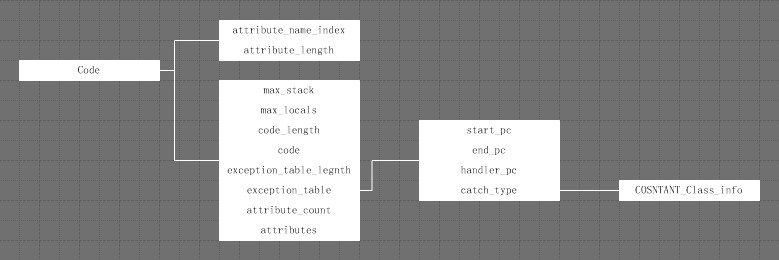
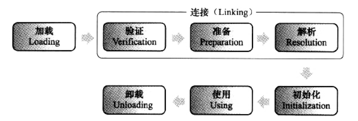
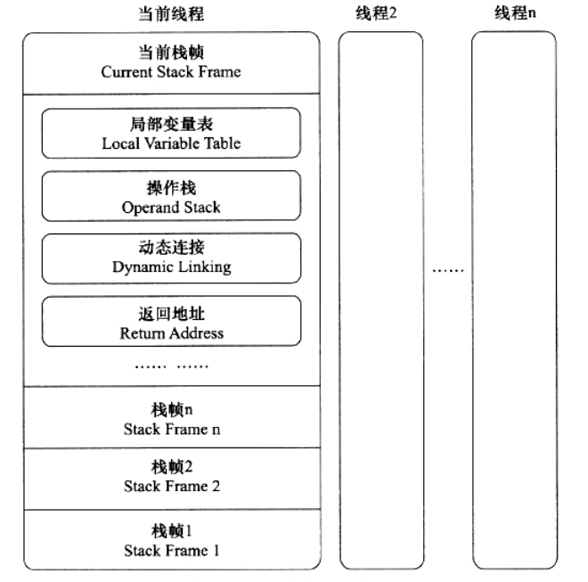

## 2.10 JVM执行系统

### 2.10.1 类文件结构
JVM是不和Java语言强绑定的，它只与Class文件这种特定的二进制文件格式有关，Class文件中包含了JVM指令集合符号表以及其他辅助信息。

Class文件是一组以8位字节为单位的二进制流，其中有两种数据类型：无符号数和表。无符号数一般用来描述数字、索引引用、数量值或者UTF－8编码的字符串；表是有多个无符号数或者其他表作为数据项构成的复合数据结构类型，用于描述有层次关系的复合结构的数据，一般都以“info”结尾。具体结构如下表所示：

类型            |名称               |数量
---------------|-------------------|-------
u4             |magic               |1
u2             |minor_version       |1
u2             |major_version       |1
u2             |constant_pool_count |1
cp_info        |constant_pool       |constant_pool_count-1
u2             |access_flags        |1
u2             |this_class          |1
u2             |super_class         |1
u2             |interfaces_count    |1
u2             |interfaces          |interfaces_count
u2             |fields_count        |1
field_info     |fields              |fields_count
u2             |methods_count       |1
method_info    |methods             |methods_count
u2             |attributes_count    |1
attribute_info |attributes          |attributes_count

#### 常量池
常量池可以理解为Class文件之中的资源仓库，它是Class文件结构中与其他项目关联最多的数据类型。其中主要存放两类数据：字面量（literal）和符号引用：字面量可以认为是常量，如文本字符串、声明为final的常量值。而符号引用则属于编译原理方面的概念，包括以下三类常量：类和接口的全限定名、字段的名称和描述和方法的名称和描述符。
Java代码进行编译时，并不像C和C+＋那样有“连接”这一步骤，而是在虚拟机加载Class文件的时候进行动态连接。也就是说，Class文件中不会保存各个字段和方法的最终内存布局信息，因此这些字段、方法的符号引用不经过运行期转换的话无法得到真正的内存入口地址，也就无法被虚拟机使用。当虚拟机运行时，需要从常量池获得对应的符号引用，再在类加载时或运行时解析到具体的内存地址之中。

#### 类索引、父类索引与接口索引集合
类索引（this_class）和父类索引（super_class）都是一个u2类型的数据，而接口索引集合（interfaces）是一组u2类型的数据的集合，Class文件由这三项数据确定这个类的继承关系。类索引用于确定这个类的全限定名，父类索引用于确定这个类的父类的全限定名，由于Java不允许多重继承，所以父类索引只有一个。接口集合索引用来描述这个类实现了哪些接口。
类索引和父类索引用两个u2类型的索引值表示，它们各自指向一个类描述符常量CONSTANT_Class_info，通过该常量中的索引值可以找到定义在CONSTANT_Utf8_info常量中的全限定名字符串。

#### 字段表集合
字段表（field_info）用于描述接口或者类中声明的变量，Java字段中可以包括的信息有：字段的访问标志、实例变量还是类变量（static）、可变性（final）、并发可见性（volatile）、序列化（transient）、数据类型和名称等。下表列出了字段表的格式：

类型            |名称               |数量
---------------|-------------------|-------
u2             |access_flags        |1
u2             |name_index          |1
u2             |descriptor_index    |1
u2             |attributes_count    |1
attribute_info |attributes          |attributes_count

字段修饰符放在access_flags项目中，name_index和descriptor_index分别代表着字段的简单名称以及字段和方法的描述符，都是对常量池的引用。这里简单解释一下描述符这个概念：描述符是用来描述字段的数据类型、方法的参数列表（包括数量、类型以及顺序）和返回值，其具体规则这里不再详述。

需要注意的是：字段表集合不会列出从超类或者父接口中继承而来的字段，但是有可能列出原本代码中不存在的字段，如内部类为了保持对外部类的访问性，会自动添加志向外部类实例的字段。

#### 方法表集合
方法表（method_info）和字段表很相似：方法定义可以通过access_flags、name_index、descriptor_index表示，而方法代码则存放属性表（attribute_info）中的“Code”属性中。如下图所示：



与字段表集合一样，如果父类方法没有在子类中被重写（Override），方法表集合中不会出现来自父类的方法信息。但是有可能出现由编译器添加的方法，如类构造方法“<clinit>”和实例构造方法“<init>”。

#### 属性表集合
在Class文件、字段表和方法表中都可以携带自己的属性表集合。下表列出了几个常见的属性：

属性名称                                 |使用位置                  |含义
----------------------------------------|------------------------|-------
Code                                    |方法表                 |Java代码编译成的字节码指令
ConstantValue                           |字段表                 |final关键字定义的常量值
Exceptions                              |方法表                 |方法抛出的异常
InnerClass                              |类文件                 |内部类列表
LocalVariableTable                      |Code属性               |方法的局部变量描述
Signature                               |类、方法表和属性表       |用于支持泛型情况下的方法签名
Synthetic                               |类、方法表和属性表       |标识方法或者字段为编译器自动生成的
RuntimeVisibleAnnotations               |类、字段表和方法表       |为动态注解提供支持，指明哪些注解是运行时（反射调用）可见的
RuntimeInvisibleAnnotations             |类、字段表和方法表       |与RuntimeVisibleAnnotations相反，指明哪些注解是运行时不可见的

对于每个属性，其属性表结构如下表所示：

类型            |名称                     |数量
---------------|-------------------------|-------
u2             |attribute_name_index     |1
u4             |attribute_length         |1
u1             |info                     |attribute_length

它的名称（attribute_name_index）从常量池中引用一个CONSTANT_Utf8_info类型的常量，而属性值的结构则是自定义的。

### 2.10.2 字节码指令简介
JVM中的指令操作码和跟随其后的零个或者多个操作数而构成，由于JVM采用面向操作数栈而非寄存器的架构，所以大多数的指令都不包括操作数，只有一个操作码。如果不考虑异常的话，JVM中的解释器可以使用下面这个伪码作为最基本的执行模型来理解：
```Java
    do {
        自动计算PC寄存器的值+1;
        根据PC寄存器的指示位置从字节码流取出操作码;
        if(字节码存在操作数) {
            从字节码流中取出操作数;
        }
        执行操作码所定义的操作;
    } while (字节码流长度 > 0)
```

JVM中的字节码指令大致可以分为以下几类：加载和存储指令、运算指令、类型转换指令、对象创建和访问指令、操作数栈管理指令、控制转移指令、方法调用和返回指令、异常处理指令和同步指令，关于这些指令的细节，这里不再详述。

需要注意的是：JVM指令集中，大部分的指令都包含了其操作所对应的数据类型信息。

### 2.10.3 类加载机制
虚拟机把描述类的数据从Class文件中加载到内存，并对数据进行校验、转换解析和初始化，最终形成可以被虚拟机直接使用的Java类型，这就是虚拟机的类加载机制。与C/C++不同的是，Java中类型的加载、连接和初始化过程都是在运行期完成的，这种策略虽然会让类加载时稍微增加一些性能开销，但是给Java带来了高度的灵活性，Java可以动态扩展，就是依赖于运行期动态加载和连接这个特点实现的。

类从被加载到内存中开始，到卸载出内存为止，它的生命周期包括加载、连接、初始化、使用和卸载，其中连接阶段又可以分为：验证、准备和解析。如下图所示：



#### 类加载的时机
JVM规范并没有规定什么时候开始进行类加载过程，但是JVM规定了什么时候进行类的初始化（加载、连接自然要在此之前进行）：
1. 使用new创建对象实例时，读取或设置一个类的静态字段时（final常量除外），以及调用一个类的静态方法时
2. 对类进行反射调用时
3. 当初始化一个类时，如果发现其父类还未初始化，则先初始化其父类
4. 虚拟机启动时，需要执行的主类（包含main()方法的那个类）
5. 如果MethodHandle实例最后的解析结果REF_getStatic、REF_putStatic和REF_invokeStatic的方法句柄，并且这个方法句柄所对应的类没有完成初始化时，则先进行初始化。

#### 类加载的过程
##### 加载
加载阶段，虚拟机需要完成以下3件事情：通过一个类的全限定名来获取定义该类的二进制字节流；将这个字节流代表的静态存储结构转化为方法区的运行时数据结构；在内存中生成一个代表这个类的Class对象，作为方法区中这个类的各种数据的访问入口。

相对于类加载过程的其他阶段，一个非数组类的加载阶段（准确的说，是加载阶段获取类的二进制字节流的过程）是非常自由的，开发人员可以通过定义自己的类加载器去控制字节流的获取方式。

数组类（一个数组类型由维度和元素类型唯一确定）不是由类加载器加载的，而是由JVM直接创建的，但是数组类的元素类型是类加载器加载的。

##### 验证
Java语言本身是安全的语言（相比于C/C++），编译器本身会进行种种检查，但是Class文件不一定由Java代码编译而来，所以JVM需要验证Class文件字节流是否符合规范。一般会进行4个阶段的检验动作：文件格式验证、元数据验证、字节码验证和符号引用验证，具体如何进行验证，这里不再详述。

##### 准备
准备阶段是为类变量（static但是非final变量）分配内存并为其设置初始值，这些变量所使用的内存一般都分配在方法区。需要注意的是这里的设置初始值是为变量设置数据类型的零值，而不是类构造方法<clinit>。

##### 解析
解析阶段是JVM将常量池内的符号引用替换为直接引用的过程：符号引用以一组符号来描述所引用的目标，符号一般是字面量，符号引用的字面量形式明确定义在JVM规范的Class文件格式中。其与JVM内存布局无关，引用的目标也不一定加载到内存中。直接引用可以是指向目标的指针、相对偏移量或间接定位到目标的句柄。一般与JVM内存布局相关，引用的目标一定在内存中。在Class文件中符号引用一般以CONSTANT_Class_info、CONSTANT_Fieldref_info和CONSTANT_Methodref_info等类型的常量出现。

解析动作主要是针对类或接口、字段、类方法、接口方法、方法类型、方法句柄和调用点限定符7类符号引用进行，分别对应于常量池中的CONSTANT_Class_info、CONSTANT_Fieldref_info、CONSTANT_Methodref_info、CONSTANT_InterfaceMethodref_info、CONSTANT_MethodType_info、CONSTANT_MethodHandle_info和CONSTANT_InvokeDynamic_info等7种常量类型。下面简单讲解一下前4种引用的解析过程，后面3种与Java7新增的动态预言支持有关。
1. 类或接口的解析：假设当前代码所处的类是D，如果要把一个从未解析过的符号引用N解析为一个类或者接口C的直接引用，那么解析过程如下所示：如果C不是数组类型，则JVM会将代表N的全限定名传递给D的类加载器去加载类C，这个加载过程可能触发其他相关类的加载过程。如果C是一个数组类型，则递归加载数组的元素类型，然后由虚拟机生成一个代表此数组维度和元素的类型的对象。C加载完成后，需要确认D是否具备对C的访问权限。
2. 字段解析：要解析一个未被解析过的字段符号引用，首先对字段表内class_index项中索引的CONSTANT_Class_info符号引用进行解析，即首先解析字段所属的类或接口，然后递归搜索其父类和父接口查找目标字段（简单名称和字段描述符都与目标相匹配的字段），如果查找成功，需要进行访问权限检查。
3. 类方法解析：类方法解析和字段解析相似：首先解析该方法所属的类或接口的符号引用，然后递归搜索其父类查找目标方法（简单名称和字段描述符都与目标想匹配的方法）。如果查找成功，需要进行访问权限检查
4. 接口方法解析：与类方法解析一样，首先解析该方法所属的类或接口的符号引用，然后递归搜索其父接口类查找目标方法（由于接口方法默认public，所以不需要权限检查）。

##### 初始化
在准备阶段，类变量已经赋过一次零值，而初始化阶段，则是根据程序去初始化类变量和其他资源，即执行类构造方法<clinit>()的过程。而<clinit>()方法是由编译器自动收集类中的所有类变量的赋值动作和静态语句块中的语句（static{}）合并而成。

需要注意的是：<clinit>()方法和类的实例构造函数<init>()不同，它不需要显式地调用父类构造方法，JVM保证调用子类的<clinit>()方法之前，父类的<clinit>()方法已经执行完毕。因此第一个被执行的<clinit>()方法必然是Object类。

#### 类加载器
JVM将类加载阶段的“通过一个类的全限定名来获取描述该类的二进制字节流”这个动作放到了JVM外部去实现，给Java语言带来了很大的灵活性。除了负责类的加载动作，每一个类加载器，都拥有一个独立的类名称空间，即判断两个类是否“相等”，只有在这两个类是同一个类加载器加载的前提下才有意义。

双亲委派模型的工作过程是：如果一个类加载器收到了类加载的请求，它会将该请求委派给父类加载器去完成，直至顶层的启动类加载器，只有父加载器无法完成这个加载请求时（它的搜索范围没有这个类），子加载器才会尝试自己去加载。双亲委派模型保证了JavaApi具有同一个类名称空间。

由于双亲委派模型，启动一个类的加载过程的类加载器和最终定义这个类的类加载器可能并不是一个。前者称为初始类加载器，而后者称为定义类加载器。两者的关联在于：一个Java类的定义类加载器是该类所导入的其它Java类的初始类加载器。比如类A通过import导入了类B，那么由类A的定义类加载器负责启动类B的加载过程。

需要注意的是，并不是所有的应用程序都使用双亲委派模型，如OSGi。

### 2.10.4 字节码执行引擎

#### 运行时栈帧结构
栈帧是用于支持虚拟机进行方法调用和执行的数据结构，它是虚拟机运行时数据区中的虚拟机栈的栈元素。每一个方法从开始调用到执行完成的过程，就对应着虚拟机中一个栈帧从入栈到出栈的过程。

栈帧存储了方法的局部变量表、操作数栈、动态连接和方法返回地址等信息：其中局部变量表和操作数栈的大小编译期就确定了，并写入到方法表的Code属性中。

一个线程的方法调用链可能会很长，很多方法同时处于执行状态。对于执行引擎而言，在活动线程中，只有位于栈顶的栈帧才是有效的，称为当前栈帧，与这个栈帧相关联的方法称为当前方法。执行引擎运行的所有字节码指令都只针对当前栈帧进行操作。典型的栈帧结构如下图所示：



局部变量表是一组变量值存储空间，用于存放方法参数和方法内部定义的局部变量，其大小在编译期就确定了。需要注意的是如果是实例方法，则会有一个隐含的参数this引用，指向该方法所属对象实例。

同局部变量表一样，操作数栈的大小也是编译期就确定的。当一个方法刚开始执行时，这个方法的操作数栈是空的，在方法的执行中，会有各种字节码指令往操作数栈写入和读取内容，也就是出栈/入栈操作。

Java虚拟机的解释执行引擎称为“基于栈的执行引擎”，其中所指的“栈”就是操作数栈。

#### 解析调用和分派调用
方法调用不同于方法执行，方法调用阶段的任务是确定被调用方法的版本（调用哪一个方法）。前面说过，Java是动态连接的，即方法调用在Class文件中存储的只是符号引用，而非直接引用（方法实际运行时内存布局中的入口地址），在类加载的解析阶段，会将其中的一部分符号引用转化为直接引用，这种解析的前提是：方法的调用版本必须是编译期可以确定的。Java中符合“编译期可知，运行期不可变”这个要求的方法，主要包括静态方法（包括类构造方法）和私有方法。这种调用方法称为解析调用，它是一个静态的过程，在编译期间完全确定。而与之对应的是分派调用，分派调用则可能是静态的，也可能是动态的。静态分派，即方法重载，这是编译期行为。动态分派，即方法覆写（Override），这是运行期行为，动态分派是根据调用对象的实际类型而非表面类型。

需要注意的是：静态分派有一个默认转型的行为，最好不要使用。一般进行重载时，要根据参数个数进行重载，不要根据参数类型进行重载。
