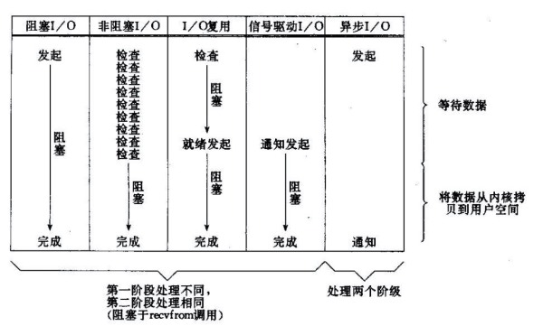
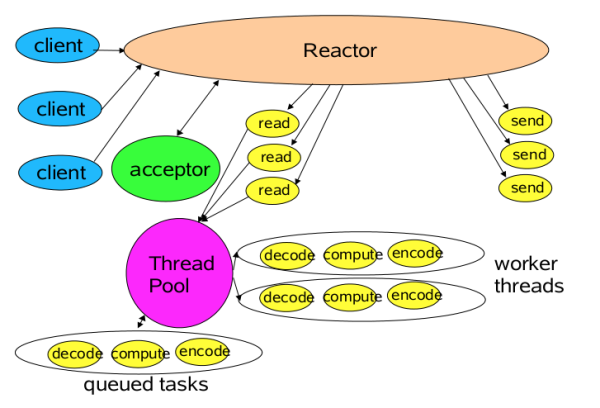

## 2.11 NIO详解

### 2.11.1 IO简介
所有的系统I/O都分为两个阶段：等待就绪和操作。举例来说，读函数，分为等待系统可读和读数据；同理，写函数分为等待网卡可写和写数据。需要说明的是等待就绪的阻塞是不使用CPU的，而真正的读写操作是使用CPU的，这个过程非常快，属于memory copy。首先我们看一下常见I/O模型：



以socket.read()为例子：
* 在BIO中，如果TCP RecvBuffer没有数据，read函数会一直阻塞，直到收到数据，返回读到的数据。
* 在NIO中，如果TCP RecvBuffer没有数据，就直接返回0，不会阻塞；否则就把数据从网卡读到内存，并且返回给用户。
* 而AIO则更进一步：不但等待就绪是非阻塞的，就连数据从网卡到内存的过程也是异步的。

换句话说，BIO里用户最关心“我要读”，NIO里用户最关心"我可以读了"，在AIO模型里用户更需要关注的是“读完了”。NIO一个重要的特点是：socket主要的读、写、注册和接收函数，在等待就绪阶段都是非阻塞的，真正的I/O读写是同步阻塞的。

### 2.11.2 NIO简介
NIO主要是三部分：Channel，Buffer和Selector。工作原理：有一个专门的线程处理所有的IO事件并负责分发，事件到的时候触发，而非同步的去监视的事件。

#### Channel
通道作为NIO中的核心概念，通道表示的是对支持I/O操作的实体的一个连接。一旦通道被打开之后就可以执行读取和写入操作，而不需要像流那样由输入流或输出流来分别进行处理。与流相比，通道的操作使用的是Buffer而不是数组，使用更加方便灵活。通道的引入提升了I/O操作的灵活性和性能，主要体现在文件操作和网络操作上。
##### FileChannel
对文件操作方面，文件通道FileChannel提供了与其它通道之间高效传输数据的能力，比传统的基于流和字节数组作为缓冲区的做法，要来得简单和快速。比如下面的把一个网页的内容保存到本地文件的实现。
```Java
FileOutputStream output = new FileOutputStream("baidu.txt");
FileChannel channel = output.getChannel();
URL url = new URL("http://www.baidu.com");
InputStream input = url.openStream();
ReadableByteChannel readChannel = Channels.newChannel(input);
channel.transferFrom(readChannel, 0, Integer.MAX_VALUE);
```
文件通道的另外一个功能是对文件的部分片段进行加锁，当在一个文件上的某个片段加上了排它锁之后，其它进程必须等待这个锁释放之后，才能访问该文件的这个片段。文件通道上的锁是由JVM所持有的，因此适合于与其它应用程序协同时使用。比如当多个应用程序共享某个配置文件的时候，如果Java程序需要更新此文件，则可以首先获取该文件上的一个排它锁，接着进行更新操作，再释放锁即可。这样可以保证文件更新过程中不会受到其它程序的影响。
另外一个在性能方面有很大提升的功能是内存映射文件的支持。通过FileChannel的map方法可以创建出一个MappedByteBuffer对象，对这个缓冲区的操作都会直接反映到文件内容上。这点尤其适合对大文件进行读写操作。

##### SocketChannel
在套接字通道方面的改进是提供了对非阻塞I/O和多路复用I/O的支持。传统的流式I/O操作是阻塞式的，在进行I/O操作的时候，线程会处于阻塞状态等待操作完成。

NIO中引入了非阻塞I/O的支持，不过只限于套接字I/O操作。所有继承自SelectableChannel的通道类都可以通过configureBlocking方法来设置是否采用非阻塞模式。在非阻塞模式下，程序可以在适当的时候查询是否有数据可供读取，一般是通过定期的轮询来实现的。

#### Buffer
NIO中引入的Buffer类及其子类，可以很方便的用来创建各种基本数据类型的缓冲区。相对于数组而言，Buffer类及其子类提供了更加丰富的方法来对其中的数据进行操作，Channel就是使用Buffer类进行数据传递。在Buffer上进行的元素添加和删除操作，都围绕3个属性position、limit和capacity展开，分别表示Buffer当前的读写位置、可用的读写范围和容量限制，容量限制是在创建的时候指定的。Buffer提供的get/put方法都有相对和绝对两种形式，相对读写时的位置是相对于position的值，而绝对读写则需要指定起始的序号。在使用Buffer的常见错误就是在读写操作时没有考虑到这3个元素的值，因为大多数时候都是使用的是相对读写操作，而position的值可能早就发生了变化。一些应该注意的地方包括：将数据读入缓冲区之前，需要调用clear方法；将缓冲区中的数据输出之前，需要调用flip方法。
```Java
ByteBuffer buffer = ByteBuffer.allocate(32);
CharBuffer charBuffer = buffer.asCharBuffer();
String content = charBuffer.put("Hello").put("World").flip().toString();
System.out.println(content);
```
上面的代码展示了Buffer子类的使用，首先可以在已有的ByteBuffer上面创建出其它数据类型的缓冲区视图，其次Buffer子类的很多方法是可以级联的，最后是要注意flip方法的使用。

### 2.11.3 使用NIO

#### 结合事件模型使用NIO同步非阻塞特性
BIO模型中一般是采用每连接一个线程的模型，是因为BIO中读写操作是阻塞的，读写一个连接的时候没法处理其他连接。而NIO中，读写函数是非阻塞的，如果一个连接不能读写（socket.read()返回0或者socket.write()返回0），我们可以把其记录下来（在Selector上注册标记位），然后切换到其它就绪的连接（channel）继续进行读写。

下面具体看下如何利用事件模型单线程处理所有I/O请求：

NIO的主要事件有几个：读就绪、写就绪、有新连接到来。我们首先需要注册当这几个事件到来的时候所对应的处理器，然后在合适的时机告诉事件选择器：我对这个事件感兴趣。对于write，就是写不出去的时候（发送缓冲区已满）对写事件感兴趣；对于read，就是完成连接和系统没有办法承载新读入的数据的时候；对于accept，一般是服务器刚启动的时候；而对于connect，一般是connect失败需要重连或者直接异步调用connect的时候。然后用一个死循环选择就绪的事件，即执行系统调用（Linux上select、epoll，而Windows是iocp），阻塞的等待新事件的到来。新事件到来的时候，会在selector上注册标记位，标示可读、可写或者有连接到来。

此时我们的程序大概的模样是：
```Java
interface ChannelHandler {
    void channelReadable(Channel channel);
    void channelWritable(Channel channel);
}
class Channel {
    Socket socket;
    Event event; //读，写或者连接
}

//IO线程主循环:
class IoThread extends Thread {
    Selector selector;
    Map<Channel，ChannelHandler> handlers; //所有channel的对应事件处理器

    ChannelHandler getChannelHandler(Channel channel) {
        return handlers.get(channel);
    }

    void registerChannelHandler(Channel channel) {
        ...
    }

    void
    @Override
    public void run() {
        Channel channel;
        while (channel = selector.select()) { //选择就绪的事件和对应的连接
            if (channel.event == accept) {
                registerChannelHandler(channel);//如果是新连接，则注册一个新的读写处理器
            } else if (channel.event == write) {
                getChannelHandler(channel).channelWritable(channel);//如果可以写，则执行写事件
            } else if (channel.event == read) {
                getChannelHandler(channel).channelReadable(channel);//如果可以读，则执行读事件
            }
        }
    }
}
```
这个程序很简短，也是最简单的Reactor模式：注册所有感兴趣的事件处理器，单线程轮询选择就绪事件，执行事件处理器。

#### 优化线程模型
由上面的示例我们大概可以明白出NIO的工作原理：NIO由原来的阻塞读写（占用线程）变成了单线程轮询事件，找到可以读写的描述符进行读写。除了事件的轮询是阻塞的（没有可干的事情必须要阻塞），剩余的I/O操作都是纯CPU操作，就可以不用开启多线程。

单线程处理I/O的效率确实非常高，没有线程切换，只是拼命的读、写、选择事件。但现在的服务器，一般都是多核处理器，如果能够利用多核心进行I/O，无疑对效率会有更大的提高。仔细分析一下我们需要的线程，其实主要包括以下几种：
1. 事件分发器，单线程选择就绪的事件；
2. I/O处理器，包括connect、read、write等，这种纯CPU操作，一般开启CPU核心个线程就可以；
3. 业务线程，在处理完I/O后，业务一般还会有自己的业务逻辑，如果有阻塞I/O就需要开启单独的线程：如DB操作、RPC等。

需要注意的是：一般一个IoThread可以管理多个channel，而一个channel只能属于一个IoThread。

另外连接的处理和读写的处理通常选择分开，这样对于连接的注册和读写就可以分发，有更好的并发性能。



### 2.11.3 Reactor与Proactor
一般情况下，I/O复用机制需要事件分发器（event dispatcher）。事件分发器的作用，是那些读写事件源分发给各读写事件的处理者，首先需要在事件分发器那里注册感兴趣的事件，并提供相应的事件处理器（event handler)，事件分发器在适当的时候，会将请求的事件分发给这些handler来处理。

涉及到事件分发器的两种模式称为：Reactor和Proactor。
* Reactor是基于同步I/O的，在Reactor模式中，事件分发器等待某个事件的发生（比如socket可读写），事件分发器就把这个事件传给事先注册的事件处理器，由后者来做实际的读写操作。
* Proactor是基于异步I/O的，在Proactor模式中，事件处理者（或者代由事件分发器发起）直接发起一个异步读写操作（相当于请求），而实际的读写操作是由操作系统来完成的。发起读写操作时，需要提供的参数包括用于存放读到数据的缓存区、读的数据大小或用于存放外发数据的缓存区，以及这个请求完后的回调函数等信息。事件分发器接收到这个请求后，它默默等待这个请求的完成，然后将完成事件转发给相应的事件处理器。

举个例子，将有助于理解Reactor与Proactor二者的差异，以读操作为例（写操作类似）：

在Reactor中实现读
* 注册读就绪事件和相应的事件处理器；
* 事件分发器等待事件；
* 事件到来，激活分发器，分发器调用相应的事件处理器；
* 事件处理器完成实际的读操作，处理读到的数据，注册新的事件，然后返还控制权。

在Proactor中实现读：
* 事件处理器发起异步读操作（注意：操作系统必须支持异步IO）；
* 事件分发器等待操作完成事件；
* 在事件分发器等待过程中，操作系统执行实际的读操作（内核中进行），并将数据存入用户定义的缓冲区中，最后通知事件分发器读操作完成；
* 事件分发器通知事件处理器读操作完成，事件处理器处理用户缓冲区中的数据，然后启动一个新的异步操作，并将控制权返回事件分发器。

可以看出，两个模式的相同点，都是对某个I/O事件的事件通知（即告诉某个模块，这个I/O操作可以进行或已经完成)。在结构上，两者也有相同点：事件分发器负责提交IO操作、查询设备是否可操作，然后当条件满足时，就回调handler；不同点在于，Proactor模式中回调handler时，表示I/O操作已经完成；而Reactor模式中回调handler时，表示I/O设备可以进行某个操作。

#### 模拟异步
接下来，我们将Reactor原来位于事件处理器内的Read/Write操作移至分发器，即将Reactor多路同步I/O模拟为异步I/O。以读操作为例子：
1. 注册读就绪事件和相应的事件处理器，并为分发器提供数据缓冲区地址，需要读取数据量等信息；
2. 分发器等待事件（如在select()上等待）；
3. 事件到来，激活分发器，分发器执行一个非阻塞读操作（它有完成这个操作所需的全部信息），最后调用相应的事件处理器；
4. 事件处理器处理用户缓冲区的数据，注册新的事件（当然同样要给出数据缓冲区地址，需要读取的数据量等信息），最后将控制权返还分发器。

如我们所见，通过对多路I/O模式功能结构的改造，可将Reactor转化为Proactor模式。比较一下两者之间的区别：

标准/典型的Reactor：
1. 等待事件到来（Reactor负责）；
2. 将读就绪事件分发给用户定义的处理器（Reactor负责）；
3. 读数据（用户处理器负责）；
4. 处理数据（用户处理器负责）。

改进实现的模拟Proactor：
1. 等待事件到来（Proactor负责）；
2. 得到读就绪事件，执行读数据（现在由Proactor负责）；
3. 将读完成事件分发给用户处理器（Proactor负责）；
4. 处理数据（用户处理器负责）。

示例代码如下：
```Java
interface ChannelHandler {
    void channelReadComplate(Channel channel，byte[] data);
    void channelWritable(Channel channel);
}
class Channel{
    Socket socket;
    Event event; //读，写或者连接
}

//IO线程主循环：
class IoThread extends Thread{
    Selector selector;
    Map<Channel，ChannelHandler> handlers;//所有channel的对应事件处理器

    ChannelHandler getChannelHandler(Channel channel) {
        return handlers.get(channel);
    }

    void registerChannelHandler(Channel channel) {
        ...
    }

    @Override
    public void run(){
        Channel channel;
        while (channel = selector.select()) {//选择就绪的事件和对应的连接
            if (channel.event == accept){
                registerChannelHandler(channel);//如果是新连接，则注册一个新的读写处理器
                Selector.interested(read);
            } else if (channel.event == write) {
                getChannelHandler(channel).channelWritable(channel);//如果可以写，则执行写事件
            } else if(channel.event == read){
                byte[] data = channel.read();
                if(channel.read() == 0){ //没有读到数据，表示本次数据读完了
                    getChannelHandler(channel).channelReadComplate(channel，data);//处理读完成事件
                }
                if(过载保护){
                    Selector.interested(read);
                }
            }
        }
    }
}
```

### 2.11.4 杂谈
#### wakeup
Selector.wakeup的主要作用是解除阻塞在Selector.select()/select(long)上的线程，立即返回。两次成功的select之间多次调用wakeup等价于一次调用。如果当前没有阻塞在select上，则本次wakeup调用将作用于下一次select——“记忆”作用。

为什么要唤醒？注册了新的channel或者事件；channel关闭，取消注册；优先级更高的事件触发（如定时器事件），希望及时处理。

其原理：Linux上是创建一个管道，Windows上则是一个loopback的tcp连接（win32的管道无法加入select的fdSet），然后将管道或者TCP连接加入select的fdSet。调用wakeup时，则往管道或者连接写入一个字节，阻塞的select因为有I/O事件就绪，立即返回。

#### Buffer的选择
通常情况下，操作系统的一次写操作分为两步：将数据从用户空间拷贝到系统空间，从系统空间往网卡写。同理，读操作也分为两步：将数据从网卡拷贝到系统空间，将数据从系统空间拷贝到用户空间。

对于NIO来说，缓存的使用可以使用DirectByteBuffer和HeapByteBuffer。如果使用了DirectByteBuffer，一般来说可以减少一次系统空间到用户空间的拷贝。但Buffer创建和销毁的成本更高，更不宜维护，通常会用内存池来提高性能。

如果数据量比较小的中小应用情况下，可以考虑使用heapBuffer；反之可以用directBuffer。

#### 总结
最后总结一下到底NIO给我们带来了些什么：
* 事件驱动模型
* 避免多线程
* 单线程处理多任务
* 非阻塞I/O：I/O读写不再阻塞，而是返回0
* 基于block的传输，通常比基于流的传输更高效
* 更高级的IO函数，zero-copy
