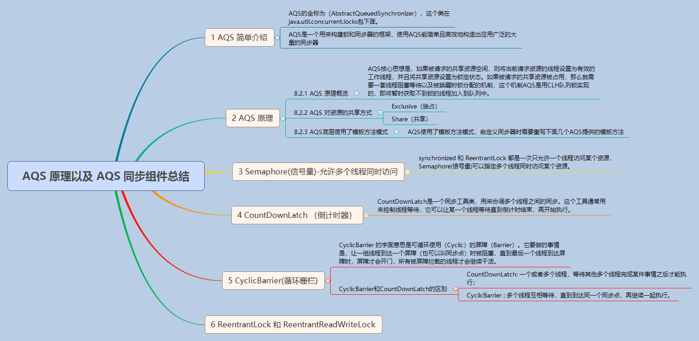

## 2.14 Java锁详解

锁的目的就是避免多个线程对同一个共享的数据并发修改引发的数据错误。锁的实现要处理的以下4个问题：
* “哪个线程拿到了锁”这个信息保存在哪里：在 synchronized 是当前 class 或者当前 instance 的 markword，在Lock里是该Lock的实例
* 抢锁规则：Mutex，只能一个线程抢到；Semaphore，能抢有限多个数量；可重入锁，自己可以反复抢；读写锁，读可以反复抢到但是写独占
* 抢不到时怎么办：抢不到继续尝试抢；抢不到暂时睡着，等一段时间再试/等通知再试；或者二者的结合，先玩命抢几次，还没抢到就睡着
* 如果锁被释放了还有其他等待锁的怎么办（不管，让等的线程通过超时机制自己抢；按照一定规则通知某一个等待的线程；通知所有线程唤醒他们，让他们一起抢）

接下来我们会简单分析一下synchronized或者Lock的实现来看一下这几条规则。

### synchronized
我们知道synchronized关键字基于Java对象头中含有的Monitor对象实现的。在JVM中，对象在内存中的布局分为三块区域：对象头、实例数据和对齐填充。

Java对象头主要由 Mark Word 和 Class Metadata Address 两部分组成（如果是数组，还会包括数组长度）。其中 Mark Word 存储着对象的HashCode、分代年龄、锁信息等，这里的锁会指向一个monitor对象。在Jvm中，monitor是由ObjectMonitor实现的，其主要数据结构如下所示（这里示例的是HotSpot Jvm实现的）：
```
ObjectMonitor() {
    _header       = NULL;
    _count        = 0; //记录个数，可重入
    _waiters      = 0,
    _recursions   = 0;
    _object       = NULL;
    _owner        = NULL; //持有锁的当前线程
    _WaitSet      = NULL; //处于wait状态的线程，会被加入到_WaitSet
    _WaitSetLock  = 0 ;
    _Responsible  = NULL ;
    _succ         = NULL ;
    _cxq          = NULL ;
    FreeNext      = NULL ;
    _EntryList    = NULL ; //处于等待锁block状态的线程，会被加入到该列表
    _SpinFreq     = 0 ;
    _SpinClock    = 0 ;
    OwnerIsThread = 0 ;
}
```
ObjectMonitor 使用 _owner 变量保存持有当前ObjectMonitor对象的线程，使用_WaitSet 和 _EntryList 用来保存等待锁的线程。

当多个线程同时访问一段同步代码时，首先会进入 _EntryList 集合，当线程获取到对象的monitor 后会把monitor中的owner变量设置为当前线程同时monitor中的计数器count加1，若线程调用该对象的 wait() 方法，将释放当前持有的monitor，owner变量恢复为null，count自减1，同时该线程进入 _WaitSet 集合中等待其他线程调用notify唤醒。若当前线程执行完毕也将释放monitor以便其他线程进入获取monitor。

### AbstractQueuedSynchronizer
AQS是一个用来构建锁和同步器的框架，使用AQS能简单且高效地构造出应用广泛的大量的同步器，比如ReentrantLock、Semaphore、SynchronousQueue和FutureTask等等都是基于AQS实现的。

####  AQS原理
AQS核心思想是，如果被请求的共享资源空闲，则将当前请求资源的线程设置为有效的工作线程，并且将共享资源设置为锁定状态。如果被请求的共享资源被占用，那么就需要一套线程阻塞等待以及被唤醒时锁分配的机制。下面我们简述一下AQS的实现原理：

AQS使用一个Thread变量来表示当前获取锁的线程，具体代码如下所示：
```Java
public abstract class AbstractOwnableSynchronizer implements java.io.Serializable {
    //Owner线程
    private transient Thread exclusiveOwnerThread;

    protected final void setExclusiveOwnerThread(Thread thread) {
        exclusiveOwnerThread = thread;
    }

    protected final Thread getExclusiveOwnerThread() {
        return exclusiveOwnerThread;
    }
}
```

AQS使用一个volatile int成员变量来表示同步状态，通过内置的FIFO队列来完成获取资源线程的排队工作。AQS使用CAS对该同步状态进行原子操作实现对其值的修改。具体代码如下所示：
```java
private volatile int state;

protected final int getState() {  
    return state;
}

protected final void setState(int newState) {
    state = newState;
}

protected final boolean compareAndSetState(int expect, int update) {
    return unsafe.compareAndSwapInt(this, stateOffset, expect, update);
}
```

CLH队列是一个使用双向链表构建的队列，AQS是将每条请求共享资源的线程封装成一个CLH锁队列的一个Node来实现锁的分配。如下图所示：


#### 基于AQS构建自己的同步工具
AQS使用了模板方法模式，自定义同步器时需要重写下面几个AQS提供的模板方法：
```Java
boolean isHeldExclusively() //该线程是否正在独占资源，只有用到condition才需要去实现它。
boolean tryAcquire(int) //独占方式尝试获取资源
boolean tryRelease(int) //独占方式尝试释放资源
int tryAcquireShared(int) //共享方式尝试获取资源。负数表示失败；0表示成功，但没有剩余可用资源；正数表示成功，且有剩余资源。
boolean tryReleaseShared(int) //共享方式尝试释放资源
```
以ReentrantLock为例，state初始化为0，表示未锁定状态。A线程lock()时，会调用tryAcquire()独占该锁并将state+1。此后，其他线程再tryAcquire()时就会失败，直到A线程unlock()到state=0（即释放锁）为止，其它线程才有机会获取该锁。当然，释放锁之前，A线程自己是可以重复获取此锁的（state会累加），这就是可重入的概念。但要注意，获取多少次就要释放多么次，这样才能保证state回到零态。

再以CountDownLatch以例，任务分为N个子线程去执行，state也初始化为N（注意N要与线程个数一致）。这N个子线程是并行执行的，每个子线程执行完后countDown()一次，state会以CAS方式减1。等到所有子线程都执行完后(即state=0)，会unpark()主线程，然后主调用线程就会从await()函数返回，继续后余动作。

一般来说同步器要么是独占方法，要么是共享方式，即只需要实现`tryAcquire-tryRelease`或者`tryAcquireShared-tryReleaseShared`中的一对即可。但AQS也支持自定义同步器同时实现独占和共享两种方式，如`ReentrantReadWriteLock`。

最后我们再来看一下aqs相关的知识点：



### ReentrantLock
接下来我们想看一下ReentrantLock，它有公平锁和非公平锁两种实现方式，这里我们以公平锁为例简单分析一下其lock和unlock的逻辑：

#### lock
首先我们看一下lock逻辑：
```Java
public void lock() {
    sync.lock();
}

static final class FairSync extends Sync {
    final void lock() {
        //尝试获取锁
        acquire(1);
    }

    protected final boolean tryAcquire(int acquires) {
        final Thread current = Thread.currentThread();
        int c = getState();
        if (c == 0) {
            //前面没有节点则尝试以cas方式修改state，则说明获取锁成功
            if (!hasQueuedPredecessors() && compareAndSetState(0, acquires)) {
                setExclusiveOwnerThread(current);
                return true;
            }
        } else if (current == getExclusiveOwnerThread()) {
            //已经获取到锁，则重入
            int nextc = c + acquires;
            if (nextc < 0)
                throw new Error("Maximum lock count exceeded");
            setState(nextc);
            return true;
        }
        return false;
    }
}
```
这里acquire方法实现在AbstractQueuedSynchronizer类中，如下所示：
```Java
//AbstractQueuedSynchronizer.Java
public final void acquire(int arg) {
    //没有成功获取锁，则将当前Thread加入到队列中，并阻塞当前线程
    if (!tryAcquire(arg) && acquireQueued(addWaiter(Node.EXCLUSIVE), arg))
        selfInterrupt();
}
//创建一个waiter
private Node addWaiter(Node mode) {
    Node node = new Node(Thread.currentThread(), mode);
    // Try the fast path of enq; backup to full enq on failure
    Node pred = tail;
    if (pred != null) {
        node.prev = pred;
        if (compareAndSetTail(pred, node)) {
            pred.next = node;
            return node;
        }
    }
    enq(node);
    return node;
}
//将代表当前Thread的node加入到队列中，并阻塞当前线程
final boolean acquireQueued(final Node node, int arg) {
    boolean failed = true;
    try {
        boolean interrupted = false;
        for (;;) {
            final Node p = node.predecessor();
            if (p == head && tryAcquire(arg)) {
                setHead(node);
                p.next = null; // help GC
                failed = false;
                return interrupted;
            }
            //这里调用park方法阻塞当前线程
            if (shouldParkAfterFailedAcquire(p, node) && parkAndCheckInterrupt())
                interrupted = true;
        }
    } finally {
        if (failed)
            cancelAcquire(node);
    }
}
```
接下来我们简单分析一下lock的流程：
* 首先调用tryAcquire方法尝试加锁，如果当前state=0，则说明锁空闲，此时如果自己是队列中第一个节点，则尝试以CAS方式修改state，修改成功则说明获取锁成功，则设置当前线程为Owner线程；
* 如果state不为0，则判断是不是当前线程重入，否则说明获取锁失败，则调用acquireQueued方法尝试进入队列并阻塞当前线程

#### unlock
接下来我们看一下unlock方法
```Java
public void unlock() {
    sync.release(1);
}
protected final boolean tryRelease(int releases) {
    int c = getState() - releases;
    //判断当前Thread是否是Owner线程
    if (Thread.currentThread() != getExclusiveOwnerThread())
        throw new IllegalMonitorStateException();

    boolean free = false;
    if (c == 0) {
        //当前Thread释放了锁
        free = true;
        setExclusiveOwnerThread(null);
    }
    setState(c);
    return free;
}
```
这里release方法实现在AbstractQueuedSynchronizer类中，如下所示：
```Java
//AbstractQueuedSynchronizer.Java
public final boolean release(int arg) {
    //当前Thread释放了锁，则唤醒队列中正在阻塞等待的线程
    if (tryRelease(arg)) {
        Node h = head;
        if (h != null && h.waitStatus != 0)
            unparkSuccessor(h);
        return true;
    }
    return false;
}
//这里调用unpark方法唤醒successor
private void unparkSuccessor(Node node) {
    int ws = node.waitStatus;
    if (ws < 0)
        compareAndSetWaitStatus(node, ws, 0);

    Node s = node.next;
    if (s == null || s.waitStatus > 0) {
        s = null;
        for (Node t = tail; t != null && t != node; t = t.prev)
            if (t.waitStatus <= 0)
                s = t;
    }
    if (s != null)
        LockSupport.unpark(s.thread);
}
```
接下来我们简单分析一下unlock的流程：
* 首先调用release方法将当前state-1，如果减到0说明当前线程释放了锁，则将Owner线程设置为null；
* 然后调用unpark方法唤醒队列中正在等待的线程。
