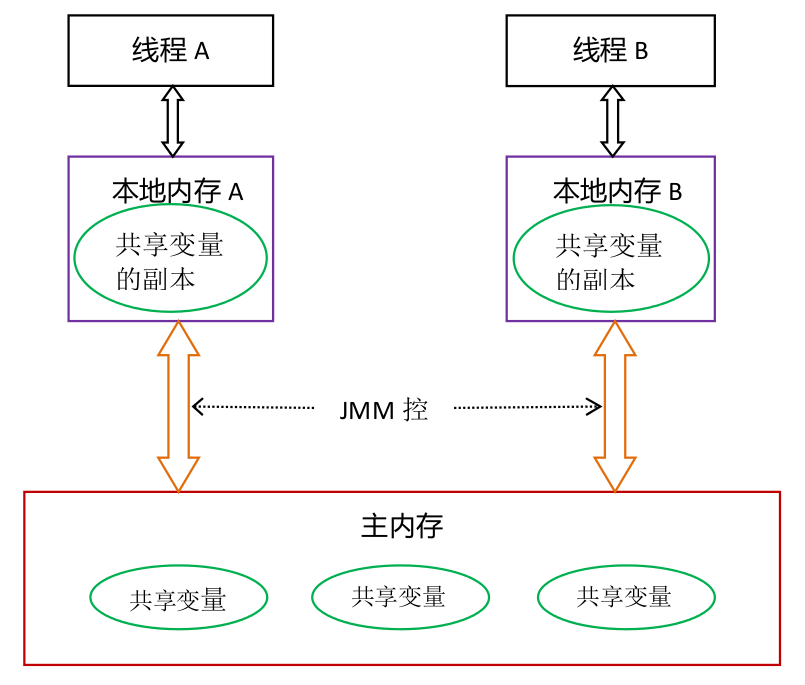
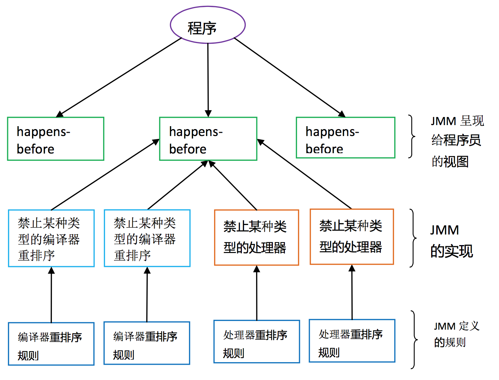

## 2.7 Java内存模型

### 2.7.1 并发编程模型
在并发编程中，需要处理两个关键问题：线程之间如何通信及线程之间如何同步。

通信是指线程之间以何种机制来交换信息，在命令式编程中，线程之间的通信机制有两种：共享内存和消息传递。
* 在共享内存的并发模型里，线程之间共享程序的公共状态，线程之间通过写-读内存中的公共状态来隐式进行通信。
* 在消息传递的并发模型里，线程之间没有公共状态，线程之间必须通过明确的发送消息来显式进行通信。

同步是指程序用于控制不同线程之间操作发生相对顺序的机制。
* 在共享内存的并发模型里，同步是显式进行的，程序员必须显式指定某个方法或某段代码需要在线程之间互斥执行。
* 在消息传递的并发模型里，由于消息的发送必须在消息的接收之前，因此同步是隐式进行的。

Java采用的共享内存模型，线程间通信是隐式的，线程间同步是显式的。

### 2.7.2 Java内存模型
在Java中，所有实例域、静态域和数组元素存储在堆内存中，堆内存在线程之间共享(本文使用“共享变量”这个术语代指实例域，静态域和数组元素)。局部变量、方法定义参数和异常处理器参数不会在线程之间共享，它们不会有内存可见性问题，也不受内存模型的影响。

Java线程之间的通信由Java内存模型(本文简称为JMM)控制，JMM决定一个线程对共享变量的写入何时对另一个线程可见。从抽象的角度来看，JMM定义了线程和主内存之间的抽象关系：线程之间的共享变量存储在主内存中，每个线程都有一个私有的本地内存，本地内存中存储了该线程以读/写共享变量的副本。本地内存是JMM的一个抽象概念，并不真实存在，它涵盖了缓存，写缓冲区，寄存器以及其他的硬件和编译器优化。Java内存模型的抽象示意图如下:

从上图来看，线程A与线程B之间如要通信的话，必须要经历下面2个步骤：首先线程A把本地内存A中更新过的共享变量刷新到主内存中去；然后线程B到主内存中去读取线程A之前已更新过的共享变量。

### 2.7.3 重排序和happens-before

#### 重排序
为了提高性能，编译器和处理器常常会对程序做重排序。重排序分三种类型:
1. 编译器优化的重排序：编译器在不改变单线程程序语义的前提下，可以重新安排语句的执行顺序。
2. 指令级并行的重排序：现代处理器采用指令级并行技术来将多条指令重叠执行。如果不存在数据依赖性，处理器可以改变语句对应机器指令的执行顺序。
3. 内存系统的重排序：由于处理器使用缓存和读/写缓冲区，这使得加载和存储操作看上去可能是在乱序执行。

前者属于编译器重排序，后两者属于处理器重排序。重排序可能会导致多线程程序出现内存可见性问题。JMM属于语言级的内存模型，它确保在不同的编译器和不同的处理器平台之上，通过禁止特定类型的编译器重排序和处理器重排序，为程序员提供一致的内存可见性保证。

#### happens-before
在JMM中，如果一个操作执行的结果需要对另一个操作可见，那么这两个操作之间就存在happens-before关系。这里提到的两个操作既可以是在一个线程之内，也可以是在不同线程之间。与编程密切相关的happens-before规则如下:
1. 程序顺序规则：一个线程中的每个操作，happens-before于该线程中的任意后续操作
2. 监视器锁规则：对一个监视器的解锁，happens-before于随后对这个监视器的加锁
3. volatile变量规则：对一个volatile域的写，happens-before于任意后续对这个volatile域的读
4. 传递性：如果A happens-before B，且B happens-before C，那么A happens-before C

注意，两个操作之间具有happens-before关系，并不意味着前一个操作必须要在后一个操作之前执行。happens-before仅仅要求前一个操作(执行的结果)对后一个操作可见，且前一个操作按顺序排在第二个操作之前。happens-before的定义很微妙。

happens-before与JMM的关系如下图所示:

如上图所示，一个happens-before规则对应于一个或多个编译器和处理器重排序规则。对于Java程序员来说，happens-before规则简单易懂，它避免Java程序员为了理解JMM提供的内存可见性保证而去学习复杂的重排序规则以及这些规则的具体实现。

### 2.7.4 volatile、synchronized和final

#### volatile
volatile变量有以下两个特性：
1. 可见性：对一个volatile变量的读，总是可以看到（任意线程）对该volatile变量最后的写入。
2. 原子性：对任意单个volatile变量的读／写具有原子性，但是类似于volatile++这样的复合操作不具有原子性。

对程序员来说，volatile对线程的内存可见性的影响比volatile自身的特性更为重要。接下来我们将会简介volatile读／写的happens-before关系：
1. volatile写的内存语义：当写一个volatile变量时，JMM会把该变量值刷新到主内存。
2. volatile读的内存语义：当读一个volatile变量时，JMM会把该线程对应的本地内存置为无效，从主内存中读取共享变量。

#### synchronized
synchronized的内存语义和volatile的基本相同：
1. 释放锁时，会将该锁保护的临界区代码中的共享变量刷新到主内存中。
2. 获取锁时，会将该线程对应的本地内存置为无效，该锁保护的临界区代码必须从主内存中读取共享变量。

synchronized的三种应用方式的锁对象：
* synchronized同步代码块，synchronized显示作用的锁对象，后面我们谈到对象内存分布，对象都有一个对象头，其中有一个锁成员，其关联了一个Monitor对象
* synchronized作用于实例方法，此时的锁对象是对象实例
* synchronized作用于静态方法，此时的锁对象是该Class对象，因为一个Class类只有一个Class对象，此时相当于该类的一个全局锁

#### final
与前面介绍的锁和volatile相比较，对final域的读和写更像是普通的变量访问。对于final域，编译器和处理器要遵守两个重排序规则：
1. 在构造函数内对一个final域的写入，与随后把这个被构造对象的引用赋值给一个引用变量，这两个操作之间不能重排序。
2. 初次读一个包含final域的对象的引用，与随后初次读这个final域，这两个操作之间不能重排序。

使用final时，不要在构造函数中逸出被构造对象的引用。

### 2.7.5 顺序一致性

#### 顺序一致性内存模型
顺序一致性内存模型是一个理想化模型，它为程序员提供了极强的内存可见性保证。顺序一致性内存模型有两大特性:
1. 一个线程中的所有操作必须按照程序的顺序来执行。
2. (不管程序是否同步)所有线程都只能看到一个单一的操作执行顺序。在顺序一致性内存模型中，每个操作都必须原子执行且立刻对所有线程可见。

#### JMM
上文提到顺序一致性内存模型是一个理想化模型。JMM并不遵循该模型，未同步程序在JMM中的执行顺序是无序的，而且所有线程看到的操作执行顺序也可能不一致。比如，在线程A把写过的数据缓存在本地内存中，在还没有刷新到主内存之前，这个写操作仅对当前线程可见；从其他线程的角度来观察，会认为这个写操作根本还没有被执行过。只有线程A把数据刷新到主内存之后，这个写操作才能对其他线程可见。

之所以如此，是平衡的结果，内存模型越强，编译器和处理器能做的优化就越少，性能就越差。而Java内存可见性保证：
1. 单线程，单线程不存在内存可见性问题
2. 正确同步的多线程，正确同步的多线程程序的执行具有顺序一致性
3. 未正确同步的多线程，最小安全性保障：线程执行时读取到的值，要么是之前某个线程写入的值，要么是默认值（0、null、false）

//TODO
6个原子操作：read，write，use，assign，lock，unlock
