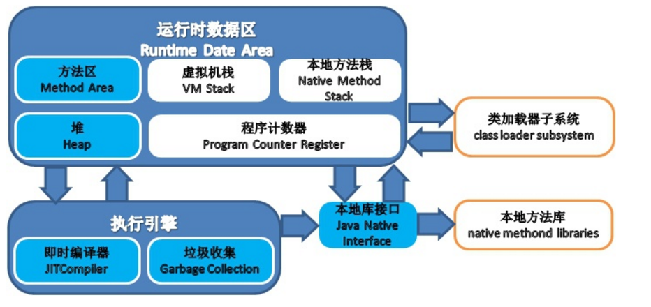
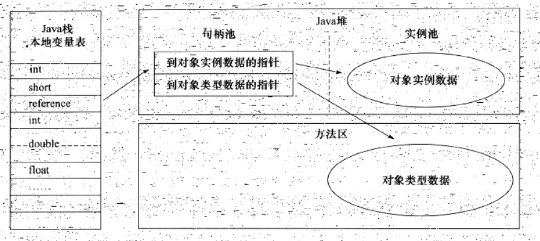
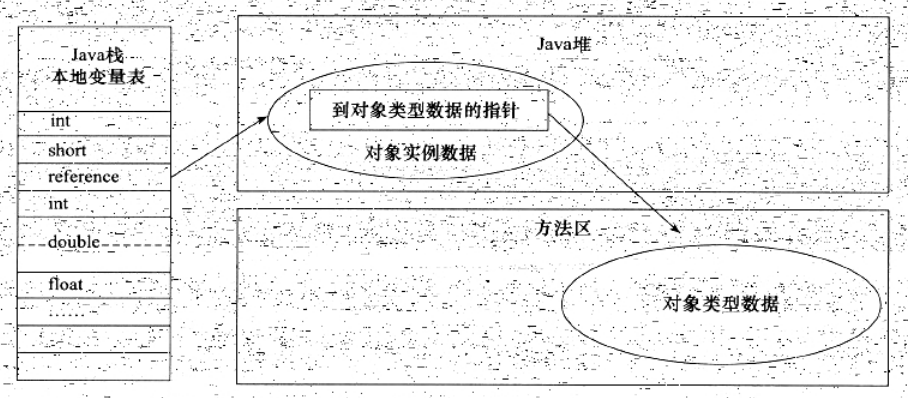

## 2.9 JVM内存管理

### 2.9.1 运行时数据区域
JVM所管理的内存可以分为一下几个运行时数据区域：

其中方法区和堆是线程共享区，而虚拟机栈、本地方法栈和程序计数器是线程独占区。

#### 程序计数器
程序计数器是线程独有的，可以看作是当前线程所执行的字节码的行号指示器。执行引擎就是通过改变这个计数器的值来选取下一条需要执行的字节码指令，分支、循环、跳转、异常处理和线程恢复等都需要以来这个计数器来完成。当线程执行Java方法时，这个计数器记录的就是正在执行的虚拟机字节码指令的地址，如果是native方法，则这个计数器值为空。

#### 虚拟机栈
一个线程对应一个虚拟机栈，其描述的是Java方法执行的内存模型：每个方法在执行的同时都会创建一个栈帧用于存储局部变量表、操作数栈、动态连接和方法出口等信息。每一个方法从调用直到执行完成的过程，就对应着一个栈帧在虚拟机栈中入栈到出栈的过程。

一般会把Java内存简单分为堆和栈，是因为与对象内存分配关系最密切的内存区域就是这两块，其中“栈”就是虚拟机栈，或者说是虚拟机栈中局部变量表，之后我们会详述“堆”，。

#### 本地方法栈
本地方法栈与虚拟机栈非常相似：区别在于虚拟机栈是虚拟机执行Java方法，而本地方法栈是虚拟机执行native方法。

#### Java堆
Java堆是被所有线程共享的一块内存区域，在虚拟机启动时创建。该区域的作用是存放对象实例，几乎所有的对象实例（数组也是对象）都在这里分配内存。Java堆是垃圾收集器管理的主要区域。

#### 方法区
方法区和Java堆一样，是被所有线程共享的一块内存区域，它用于存储已被虚拟机加载的类信息、常量、静态变量等数据。该区域也会进行垃圾回收，垃圾回收的目标主要是针对常量池的回收和对类型的卸载。

运行时常量池是方法区的一部分，Class文件中除了有字段、方法、接口等描述信息外，还有一项信息就是常量池，用于存放编译期生成的各种字面量和符号引用，这部分内容将在类加载后进入方法区的运行时常量池中存放。需要注意的是运行时常量池具有动态性，Java语言并不要求常量一定只有编译期才能产生，也就是并非Class文件常量池的内容才能进入方法区运行时常量池，运行期间也可以将新的常量放入池中，比如String类的intern方法。

### 2.9.2 Hotspot虚拟机对象探秘
本节以Hotspot虚拟机和Java堆为例，简单探讨Hotspot虚拟机在Java堆中对象分配、布局和访问的全过程。

#### 对象创建
语言层面上，创建对象（clone、反序列化）通常仅仅是一个new关键字而已，而在虚拟机中，对象（普通Java对象，不包括数组和Class对象等）创建是怎样一个过程呢？

当虚拟机遇到一条new指令时，首先将去检查这个指令的参数是否能在常量池中定位到一个类的符号引用，并且检查这个符号引用代表的类是否已被加载、解析和初始化过。如果没有，那必须先执行相应的类加载过程。

当类加载检查完成后，接下来虚拟机将为新生对象分配内存，对象所需内存空间的大小在类加载完成后就完全确定的。内存分配完毕后，虚拟机需要将分配到的内存空间都初始化为零值。接下来虚拟机要对对象进行必要的设置，例如这个对象是哪个类的实例，如何才能找到类的元数据信息，对象的GC分代年龄等信息，这些信息存放在对象的对象头之中。

完成上面工作后，从虚拟机的角度看，一个新的对象已经产生了，但从Java程序的角度看，对象创建才刚刚开始--<init>方法（构造方法）还没有执行，所有的字段都是零值。所以，一般执行new指令之后会接着执行<init>方法，把对象按照程序员的意愿进行初始化，这样一个真正可用的对象才算完全产生出来。

#### 对象内存布局
在Hotspot虚拟机中，对象在内存中存储的布局可以分为3块区域：对象头、实例数据和对齐填充。

Hotspot虚拟机的对象头包括两部分信息：第一部分用于存储对象自身的运行时数据，如哈希码、GC分代年龄、锁状态标志、线程持有的锁、偏向线程ID、偏向时间戳等；另外一部分是类型指针，即对象指向它的类元数据的指针，虚拟机通过这个指针来确定这个对象是哪个类的实例。并不是所有的虚拟机实现都必须在对象数据上保留类型指针，即查找对象的元数据信息并不一定要经过对象本身。另外，如果对象是一个数组，那么在对象头中还必须有一块用于记录数组长度的数据，因为虚拟机可以通过普通Java对象的元数据信息确定Java对象的大小，但是无法从数组的元数据中确定数组的大小。

接下来的实例数据部分是对象真正存储的有效信息，也就是在程序代码中所定义的各种类型的字段内容，无论是从父类继承下来的，还是在子类中定义的，都需要记录下来。这部分的存储顺序会受到虚拟机分配策略和字段在Java源码中定义顺序的影响。

#### 对象访问定位
建立对象是为了使用对象，Java程序需要通过栈上的reference数据来操作堆上的具体对象。由于reference类型在JVM规范中只规定了一个指向对象的引用，并没有定义这个引用应该通过何种方式去定位、访问堆中对象的具体位置，所以对象访问方式也是取决于虚拟机实现，目前主流的访问方式有使用句柄和直接指针两种。
1. 句柄访问：Java堆中将会划分出一块内存来作为句柄池，reference中存储的就是对象的句柄地址，而句柄中包含了对象实例数据和类型数据各自的地址信息，如下图所示：

2. 直接指针访问：Java堆对象的布局中就必须考虑如何设置访问类型数据的相关信息，而reference中存储的就是对象地址。

这两种访问方式各有优劣，使用句柄访问的好处是reference中存储的是稳定的句柄地址，在对象被移动（垃圾收集时移动对象是很普遍的行为）时只需要改变句柄中的实例数据指针，而reference本身不需要改变；而使用指针直接访问的好处是速度更快。Hotspot中采用的是直接指针访问。

### 2.9.3 垃圾收集器
上一节介绍了Java内存运行时区域的各个部分，其中程序计数器、虚拟机栈和本地方法栈是线程独有的，栈中的栈帧随着方法的进入和退出而入栈和出栈，每个栈帧分配多少内存也是类结构确定后就已知的，因此这几个区域的内存分配和回收具有确定性：方法退出或者线程结束，内存自然就回收了。但是Java堆和方法区则不一样，只有在程序处于运行期间才能知道会创建哪些对象，这部分内存的分配和回收都是动态的，垃圾收集器关注的就是这部分内存。

#### 对象生命周期
垃圾收集器在对Java堆进行垃圾回收之前，第一件事情就是确定Java堆上的对象哪些是“活的”，哪些是“死的”（没有被任何对象使用的对象），一般有以下两种方法来判断对象是否存活：引用计数法和可达性分析法：
1. 引用计数法：给对象添加一个引用计数器，每当有一个地方引用它时，计数器值加1；当引用失效时，计数器值减1；任何时刻当计数器为0的对象就是不可能被引用到的。该方法实现简单，判定效率也很高，但是它的主要问题是无法解决对象之间循环引用的问题，所以主流的JVM都不采用该方法。
2. 可达性分析：通过一系列的“GC Roots”的对象作为起始点，从这些节点开始向下搜索，搜索所走过的路径称为引用链，当一个对象到GC Roots没有任何引用链相连（使用图论的话来说，就是从GC Roots到这个对象不可达）时，则证明这个对象是不可用的。在Java中，可以作为GC Roots的对象一般包括以下几种：虚拟机栈（栈帧中的局部变量表）中引用的对象，方法区中类静态属性引用的对象，方法区中常量引用的对象，本地方法栈中JNI引用的对象。

##### 再谈引用
为了更好地进行垃圾回收，Java对引用的概念进行了扩展，将引用分为强引用，软引用（SoftReference），弱引用（WeakReference）、虚引用（PhantomReference）。这四种引用强度依次逐渐减弱：
1. 强引用
2. 软引用：用来描述一些还有用但并非必需的对象，在系统将要抛出OOM之前，将会把这些对象列进回收范围之中进行第二次回收，如果这次回收还没有足够的内存，才会抛出OOM
3. 弱引用：用来描述非必需对象，被弱引用关联的对象只能活到下一次垃圾收集发生之前
4. 虚引用：最弱的引用，虚引用不会影响到对象的生存时间，也无法通过虚引用来获取一个对象实例。为对象设置虚引用关联的唯一目的就是这个对象在被垃圾收集器回收时收到一个系统通知。

#### 垃圾收集算法
本节简单讨论几种垃圾收集算法的思想：
1. 标记-清除算法，该算法分为标记和清除两个阶段：首先标记出所有需要回收的对象，在标记完成后统一回收所有被标记的对象。该算法比较简单，它的主要问题有两个：一个是效率问题，标记和清除两个过程的效率都不高，另一个问题是空间问题，标记清楚之后会产生大量不连续的内存碎片。
2. 复制收集算法，该算法将可用内存分为大小相等的两块，每次只使用其中的一块，当这一块内存用完后，就将还存活的对象复制到另外一块，然后再把已使用过的内存空间清理掉。该方法实现简单，运行高效，不会存在内存碎片问题。但是它的主要问题是空间效率太低。现代JVM一般都采用该算法回收新生代，研究表明，新生代中98%的对象是“朝生暮死”。具体使用时并不需要按照1：1来划分内存空间，而是将内存分为一块较大的Eden空间和两块较小的Survivor空间，每次使用Eden和一块Survivor空间，当回收时将Eden和Survivor还存活的对象一次性地复制到另外一块Survivor空间上，最后清理掉Eden和刚才用过的Survivor空间。Hotspot默认Eden和Survivor的大小比例是8：1，当Survivor空间不足时，需要依赖其他内存（老年代）进行分配担保。
3. 标记-整理算法，复制收集算法在对象存活率较高时就要进行较多的复制操作，效率就会降低，而且需要更多空间进行分配担保。所以老年代一般不使用该算法，而是采用标记-整理算法：标记过程和标记-清除算法一样，但是后续步骤不是直接对可回收对象进行清理，而是让所有存活的对象都向一端移动，然后直接清理掉端边界以外的内存。
4. 分代收集算法，现代JVM一般都采用分代收集算法，根据对象存活周期的不同将内存划分为几块，一般分为新生代和老年代，新生代对象存活率低，使用复制收集算法，老年代对象存活率高，使用标记-清除或者标记-整理算法。

### 2.9.4 内存分配策略
Java的自动内存管理主要包括两个方面：给对象分配内存以及回收分配给对象的内存。上面我们已经详细谈论了JVM如何回收内存，接下来我们将讲解几条最普遍的内存分配规则：
1. 对象优先在Eden区域分配，大多数情况下，对象在新生代Eden区域中分配，当Eden区域中没有足够空间时，虚拟机将发起一次MinorGC。
2. 大对象直接进入老年代，大对象就是需要大量连续内存空间的Java对象，如很长的字符串和数组等。大对象对于虚拟机的内存分配是一个坏消息（更坏的是“朝生暮死”的大对象，程序中应尽量避免），经常出现大对象容易导致内存还有不少空间时就提前触发垃圾收集以获取足够的连续空间。
3. 长期存活的对象进入老年代，虚拟机采用分代收集的思想管理内存，那么内存分配时就必须能识别哪些对象应该放在新生代，哪些放在老年代。为了做到这点，虚拟机给每个对象定义一个对象年龄计数器，如果对象在Eden区域出生并经过第一次MinorGC后仍然存活，并被移动到Survivor区域，则对象年龄设为1,对象在Survivor区中每“熬过”一次MinorGC，年龄就增加1岁，当它的年龄增加到MaxTenuringThreshold（默认为15岁），就会被晋升到老年代。
4. 动态对象年龄判定，为了更好的适应不同程序的内存状况，虚拟机并不是一定要求对象年龄到达MaxTenuringThreshold时才能晋升到老年代，如果在Survivor区中相同年龄的对象大小总和大于Survivor空间的一半，年龄大于等于该年龄的对象就可以直接进入老年代。