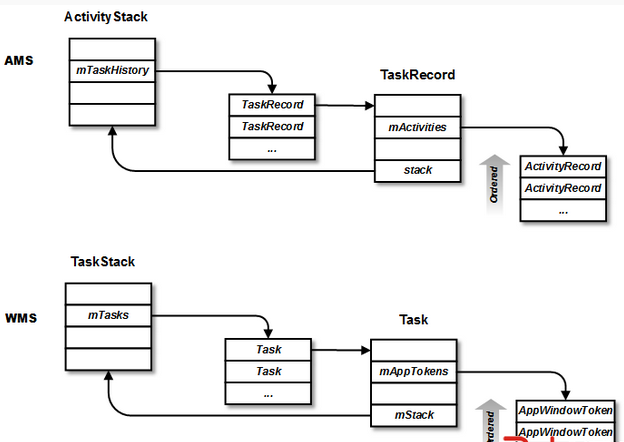

## 3.6 AMS详解

### 3.6.1 简介
AMS是Android中用于管理四大组件运行状态的系统服务，具体来说主要分为一下三个方面：
* 组件状态管理：Android中的四大组件生命周期的管理；
* 进程管理：Android中所有的应用进程管理；
* Activity管理：Activity不同于其他三个组件的地方是，Activity是按照Task方式组织的，AMS需要管理所有的Activity Task。

### 3.6.2 相关类和数据结构
本节我们简单看一下相关类和数据结构：
#### 应用进程
* ActivityThread，应用进程的真正入口。当应用进程启动后，会从其main方法开始执行，开启主线程的消息循环队列，并建立和AMS的双向通信链接，然后与AMS配合一起完成Activity的管理工作。
* Instrumentation，每一个应用程序只有一个Instrumentation对象，每个Activity内都有一个对该对象的引用。Instrumentation可以理解为应用进程的管家，当应用需要创建某个Activity时，都需要通过Instrumentation来进行具体的操作。

#### AMS
主要进程相关记录信息和四大组件相关记录信息：
* ProcessRecord，应用进程信息
* ServiceRecord，Service相关记录信息
* BroadcastRecord，Broadcast相关记录信息
* ContentProviderRecord，ContentProvider相关记录信息

而Activity的相关信息要复杂一些，其涉及到回退栈和Task管理
* ActivityStack，Activity在AMS的栈管理，用来记录已经启动的Activity的先后关系，状态信息等。
* TaskRecord，AMS抽象出来的一个“任务”的概念，是记录ActivityRecord的栈，一个“Task”包含若干个ActivityRecord。AMS用TaskRecord确保Activity启动和退出的顺序。
* ActivityRecord，每个Activity在AMS对应一个ActivityRecord，来记录Activity的状态以及其他信息。

这三者的关系如下图所是：

### 3.6.3 AMS启动流程
AMS是由SystemServer的ServerThread线程创建的，我们看一下AMS的启动流程
