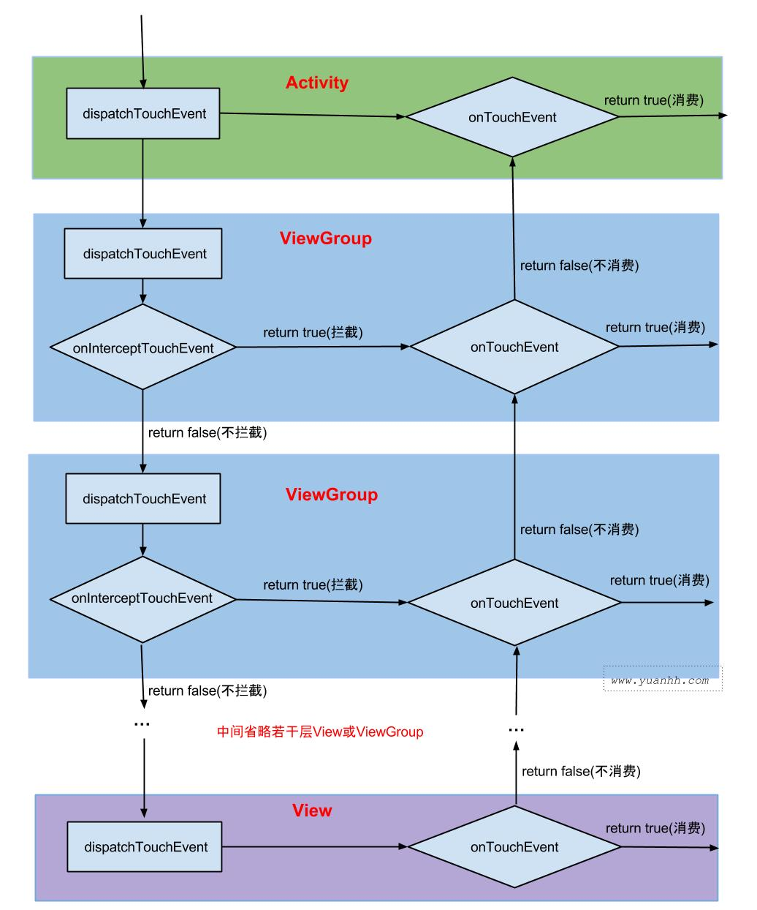

## 3.10 View事件分发

### 3.10.1 概述
View系统定义了从用户输入消息到消息处理的全过程：用户通过触摸屏或者键盘输入消息后，该消息经过处理后，首先被送到WMS，WMS根据所有窗口的状态（每一个窗口都是WMS创建的，所以WMS知道所有窗口的信息）判断用户正在与哪个窗口进行交互，然后把该消息发送给该窗口：如果是按键消息，则直接发送给当前窗口，如果是触摸消息，则WMS会根据消息的位置坐标发送给相应的窗口，最后目标窗口怎么处理消息则是应用的业务逻辑了。

### 3.10.2 View基本知识
View的位置参数：top、left、right、bottom，分别对应View的左上角和右下角相对于父容器的横纵坐标值（平移过程中是不会变化的）。此外Android3.0增加了x、y、translationX、translationY四个参数，其中x和y是View左上角的坐标，而translationX和translationY是View左上角相对于父容器的偏移量，默认值是0。其关系如下：x=left+translationX，y=top+translationY。如下图所示：


MotionEvent是指手指接触屏幕后所产生的一系列事件，主要有ACTION_UP、ACTION_DOWN、ACTION_MOVE等。正常情况下，一次手指触屏会触发一系列点击事件，主要有下面两种典型情况：
* 点击屏幕后离开，事件序列是ACTION_DOWN->ACTION_UP；
* 点击屏幕后滑动一会再离开，事件序列是ACTION_DOWN->ACTION_MOVE->ACTION_MOVE->...->ACTION_UP。

通过MotionEvent可以得到点击事件的x和y坐标，其中getX和getY是相对于当前View左上角的x和y坐标，getRawX和getRawY是相对于手机屏幕左上角的x和y坐标。

当多点触摸时，每一个触摸点Pointer会有一个id和index。对于多指操作，通过pointerindex来获取指定Pointer的触屏位置。比如，对于单点操作时获取x坐标通过getX()，而多点操作获取x坐标通过getX(pointerindex)

VelocityTracker用于追踪手指在滑动过程中的速度，包括水平和垂直方向上的速度。具体计算公式如下所示：
```
speed = (endPosition - startPosition) / time
```
从上面公式可知：速度是单位时间内移动的像素数（速度可能为负值，例如当手指从屏幕右边往左边滑动的时候），可以使用方法computeCurrentVelocity(xxx)指定单位时间是多少。例如通过computeCurrentVelocity(1000)来获取速度，手指在1s中滑动了100个像素，那么速度是100，即100(像素/1000ms)。VelocityTracker的使用方式：
```Java
//初始化
VelocityTracker mVelocityTracker = VelocityTracker.obtain();
//在onTouchEvent方法中
mVelocityTracker.addMovement(event);
//获取速度
mVelocityTracker.computeCurrentVelocity(1000);
float xVelocity = mVelocityTracker.getXVelocity();
//重置和回收
mVelocityTracker.clear(); //一般在MotionEvent.ACTION_UP的时候调用
mVelocityTracker.recycle(); //一般在onDetachedFromWindow中调用
```

GestureDetector用于辅助检测用户的单击、滑动、长按、双击等行为。GestureDetector的使用比较简单，主要也是辅助检测常见的触屏事件。如果只是监听滑动相关的事件在onTouchEvent中实现，如果要监听双击这种行为的话，那么就使用GestureDetector。

### 3.10.3 View的事件体系
#### View的事件分发机制
事件分发过程有三个重要方法：
* dispatchTouchEvent方法用来进行事件的分发。所有的事件都要通过该方法进行分发，返回结果受当前View的onTouchEvent和下级View的dispatchTouchEvent方法的影响，表示是否消耗当前事件。
* onInterceptTouchEvent方法在dispatchTouchEvent方法内部调用，用来判断是否拦截某个事件。如果拦截（返回true）则自己消耗该事件，即调用自己的onTouchEvent方法，否则传递给子view的dispatchTouchEvent方法，由子view处理该事件。需要注意的是，如果当前View拦截了ACTION_DOWN事件，那么这个事件序列只会由该View来处理，此方法不会再被调用。
* onTouchEvent方法在dispatchTouchEvent方法内部调用，用来处理点击事件，返回true则自己处理该事件，返回false则向上返回让其父容器处理（调用其自己的onTouchEvent方法）。如果不消耗，则在同一个事件序列中，当前View无法再次接收到事件（一个事件序列只能被同一个view处理）。

三个方法的关系可以用下面的伪代码表示：
```Java
public boolean dispatchTouchEvent(MotionEvent ev) {
    boolean consume = false;
    if (onInterceptTouchEvent(ev)) {
        consume = onTouchEvent(ev);
    } else {
        consume = child.dispatchTouchEvent(ev);
    }
    return consume;
}
```



#### ViewGroup的分发逻辑
事件分发从ViewGroup开始，我们直接看其dispatchTouchEvent方法：
```Java
//ViewGroup.Java
public boolean dispatchTouchEvent(MotionEvent ev) {
    ...

    boolean handled = false;
    if (onFilterTouchEventForSecurity(ev)) {
        final int action = ev.getAction();
        final int actionMasked = action & MotionEvent.ACTION_MASK;

        //DOWN事件则清理之前的状态和事件消费者
        if (actionMasked == MotionEvent.ACTION_DOWN) {
            cancelAndClearTouchTargets(ev);
            resetTouchState();
        }

        //是否Intercept该事件
        final boolean intercepted;
        if (actionMasked == MotionEvent.ACTION_DOWN || mFirstTouchTarget != null) {
            //判断子View是否允许Intercept
            final boolean disallowIntercept = (mGroupFlags & FLAG_DISALLOW_INTERCEPT) != 0;
            if (!disallowIntercept) {
                //ViewGroup中默认不拦截事件
                intercepted = onInterceptTouchEvent(ev);
                ev.setAction(action);
            } else {
                intercepted = false;
            }
        } else {
            //不是ACTION_DOWN事件或者mFirstTouchTarget为空，则直接拦截该事件
            intercepted = true;
        }
        ...

        //如果不拦截，则分发到相关子View
        if (!canceled && !intercepted) {
            ...
            //ACTION_DOWN事件，遍历子View，查找可以处理该事件的子View
            if (actionMasked == MotionEvent.ACTION_DOWN
                    || (split && actionMasked == MotionEvent.ACTION_POINTER_DOWN)
                    || actionMasked == MotionEvent.ACTION_HOVER_MOVE) {
                final int actionIndex = ev.getActionIndex();
                final int idBitsToAssign = split ? 1 << ev.getPointerId(actionIndex) : TouchTarget.ALL_POINTER_IDS;
                ...

                final int childrenCount = mChildrenCount;
                if (newTouchTarget == null && childrenCount != 0) {
                    final float x = ev.getX(actionIndex);
                    final float y = ev.getY(actionIndex);
                    //遍历子View，找到一个能接收该事件
                    final ArrayList<View> preorderedList = buildOrderedChildList();
                    final boolean customOrder = preorderedList == null && isChildrenDrawingOrderEnabled();
                    final View[] children = mChildren;
                    for (int i = childrenCount - 1; i >= 0; i--) {
                        final int childIndex = customOrder ? getChildDrawingOrder(childrenCount, i) : i;
                        final View child = (preorderedList == null)
                                ? children[childIndex] : preorderedList.get(childIndex);
                        ...
                        //判断当前子View是否可以接收该事件：该View是否visible以及事件坐标是否在该View内
                        if (!canViewReceivePointerEvents(child) || !isTransformedTouchPointInView(x, y, child, null)) {
                            ev.setTargetAccessibilityFocus(false);
                            continue;
                        }

                        //分发事件到当前子View
                        if (dispatchTransformedTouchEvent(ev, false, child, idBitsToAssign)) {
                            ...
                            //当前子View消耗该事件，则将当前子View添加到TouchTarget链表中
                            newTouchTarget = addTouchTarget(child, idBitsToAssign);
                            ...
                            break;
                        }
                        ...
                    }
                    if (preorderedList != null) preorderedList.clear();
                }
                ...
            }
        }

        //分发事件到TouchTarget链表中
        if (mFirstTouchTarget == null) {
            //没有TouchTarget能够处理该事件
            handled = dispatchTransformedTouchEvent(ev, canceled, null, TouchTarget.ALL_POINTER_IDS);
        } else {            
            //遍历TouchTarget链表，以处理后续ACTION_MOVE和ACTION_UP等事件
            TouchTarget predecessor = null;
            TouchTarget target = mFirstTouchTarget;
            while (target != null) {
                final TouchTarget next = target.next;
                if (alreadyDispatchedToNewTouchTarget && target == newTouchTarget) {
                    handled = true;
                } else {
                    final boolean cancelChild = resetCancelNextUpFlag(target.child) || intercepted;
                    if (dispatchTransformedTouchEvent(ev, cancelChild, target.child, target.pointerIdBits)) {
                        handled = true;
                    }
                    if (cancelChild) {
                        if (predecessor == null) {
                            mFirstTouchTarget = next;
                        } else {
                            predecessor.next = next;
                        }
                        target.recycle();
                        target = next;
                        continue;
                    }
                }
                predecessor = target;
                target = next;
            }
        }
        ...
    }
    ...

    return handled;
}
private boolean dispatchTransformedTouchEvent(MotionEvent event, boolean cancel, View child, int desiredPointerIdBits) {
    final boolean handled;
    ...

    if (child == null) {
        //没有子View处理该事件，则调用View.dispatchTouchEvent方法，我们上面分析过，其最终调用View.onTouchEvent处理该事件
        handled = super.dispatchTouchEvent(transformedEvent);
    } else {
        final float offsetX = mScrollX - child.mLeft;
        final float offsetY = mScrollY - child.mTop;
        transformedEvent.offsetLocation(offsetX, offsetY);
        if (! child.hasIdentityMatrix()) {
            transformedEvent.transform(child.getInverseMatrix());
        }
        //调用子View的dispatchTouchEvent方法处理该事件
        handled = child.dispatchTouchEvent(transformedEvent);
    }
    ...

    return handled;
}
```
我们简单看一下该方法：如果是ACTION_DOWN事件，意味着新一轮事件分发的开始：
* 首先清理之前的状态和事件消费者：将标志位FLAG_DISALLOW_INTERCEPT置0（子View可以通过requestDisallowInterceptTouchEvent方法设置该标志位），将事件处理者链表mFirstTouchTarget置为null。
* 然后检查该ViewGroup是否要Intercept该事件，首先看标志位FLAG_DISALLOW_INTERCEPT（上面说过ACTION_DOWN事件，该标志位会被置0），然后会进入onInterceptTouchEvent方法判断是否拦截该事件，该方法默认不拦截。
* 如果该ViewGroup不拦截该ACTION_DOWN事件，则会首先查找适合处理该ACTION_DOWN事件的子View，并将其加入到事件处理者链表TouchTarget（用于后续的ACTION_MOVE和ACTION_UP等事件的处理），然后调用dispatchTransformedTouchEvent方法处理该事件，此时该方法参数child不为null，即最后调用child.dispatchTouchEvent方法处理该事件，即View.dispatchTouchEvent方法，我们接下来会分析该方法。
* 如果该ViewGroup拦截该ACTION_DOWN事件，此时mFirstTouchTarget为null，则直接调用dispatchTransformedTouchEvent方法处理该事件，此时方法参数child为null，即调用super.dispatchTouchEvent方法（ViewGroup是继承自View的），即该ViewGroup自己处理了该事件。

接下来后续的ACTION_MOVE和ACTION_UP事件到来后，则if (actionMasked == MotionEvent.ACTION_DOWN || mFirstTouchTarget != null)，如果该ViewGroup拦截了之前的Down事件，则mFirstTouchTarget为null，则不会进入拦截逻辑判断，直接调用dispatchTransformedTouchEvent方法处理该事件，此时方法参数child为null，即该ViewGroup自己处理该事件。如果该ViewGroup之前没有拦截，则mFirstTouchTarget不为空，进入拦截逻辑判断，此时子View可以通过设置requestDisallowInterceptTouchEvent标志不允许父View拦截该事件。

总结一下，如下所是：
* 如果ViewGroup在ACTION_DOWN事件时就拦截，即onInterceptTouchEvent方法返回true，那么之后的事件不会再进入拦截逻辑判断，即后续所有事件都会直接交给该ViewGroup处理。
* 如果ACTION_DOWN事件不拦截，那么后续的事件到来时，都会进入拦截逻辑判断，调用onInterceptTouchEvent方法判断该ViewGroup是否会拦截，一旦拦截，则之前接收事件的子View会收到ACTION_CANCEL事件，子View可以调用requestDisallowInterceptTouchEvent方法不允许父View拦截该事件。
* 只有在ACTION_DOWN事件时，ViewGroup才会遍历查找适合处理该事件流的子View，即如果子View在ACTION_DOWN事件的时候选择不消耗该事件，那么后续的事件不会传递给该子View，即使该View调用requestDisallowInterceptTouchEvent也不行。

#### View的分发逻辑
接下来我们看一下View的事件分发体系，仍然从dispatchTouchEvent方法开始：
```Java
//View.Java
public boolean dispatchTouchEvent(MotionEvent event) {
    ...

    if (onFilterTouchEventForSecurity(event)) {
        ListenerInfo li = mListenerInfo;
        if (li != null && li.mOnTouchListener != null
                && (mViewFlags & ENABLED_MASK) == ENABLED
                && li.mOnTouchListener.onTouch(this, event)) {
            result = true;
        }

        if (!result && onTouchEvent(event)) {
            result = true;
        }
    }
    ...

    return result;
}
```
其逻辑比较简单，ListenerInfo中保存了OnTouchListener、OnClickListener、OnLongClickListener等。如果View是enabled，则先调用OnTouchListener处理该事件，如果它不消耗该事件，则调用onTouchEvent方法处理该事件。OnTouchListener一般由应用业务实现，这里我们接下来看一下onTouchEvent方法：
```Java
//View.Java
public boolean onTouchEvent(MotionEvent event) {
    final float x = event.getX();
    final float y = event.getY();
    final int viewFlags = mViewFlags;
    final int action = event.getAction();

    if ((viewFlags & ENABLED_MASK) == DISABLED) {
        if (action == MotionEvent.ACTION_UP && (mPrivateFlags & PFLAG_PRESSED) != 0) {
            setPressed(false);
        }

        return (((viewFlags & CLICKABLE) == CLICKABLE
                || (viewFlags & LONG_CLICKABLE) == LONG_CLICKABLE)
                || (viewFlags & CONTEXT_CLICKABLE) == CONTEXT_CLICKABLE);
    }

    if (mTouchDelegate != null) {
        if (mTouchDelegate.onTouchEvent(event)) {
            return true;
        }
    }

    if (((viewFlags & CLICKABLE) == CLICKABLE ||
            (viewFlags & LONG_CLICKABLE) == LONG_CLICKABLE) ||
            (viewFlags & CONTEXT_CLICKABLE) == CONTEXT_CLICKABLE) {
        switch (action) {
            case MotionEvent.ACTION_UP:
                boolean prepressed = (mPrivateFlags & PFLAG_PREPRESSED) != 0;
                if ((mPrivateFlags & PFLAG_PRESSED) != 0 || prepressed) {
                    ...

                    if (!mHasPerformedLongPress && !mIgnoreNextUpEvent) {
                        ...
                        if (!focusTaken) {
                            if (mPerformClick == null) {
                                mPerformClick = new PerformClick();
                            }
                            if (!post(mPerformClick)) {
                                performClick();
                            }
                        }
                    }
                    ...
                }
                mIgnoreNextUpEvent = false;
                break;

            case MotionEvent.ACTION_DOWN:
                ...
                break;

            case MotionEvent.ACTION_CANCEL:
                ...
                break;

            case MotionEvent.ACTION_MOVE:
                ...
                break;
        }

        return true;
    }

    return false;
}
public boolean performClick() {
    final boolean result;
    final ListenerInfo li = mListenerInfo;
    if (li != null && li.mOnClickListener != null) {
        playSoundEffect(SoundEffectConstants.CLICK);
        li.mOnClickListener.onClick(this);
        result = true;
    } else {
        result = false;
    }

    sendAccessibilityEvent(AccessibilityEvent.TYPE_VIEW_CLICKED);
    return result;
}
```
这里我们可以看到：
* 如果View是disabled，则直接返回，只要这个View是CLICKABLE、LONG_CLICKABLE或CONTEXT_CLICKABLE，就返回true，之后不会继续下去，即不用调用onTouch、onClick、OnLongClick方法。
* 在ACTION_UP事件中会调用performClick()方法，其会调用OnClickListener.onClick方法。
* 结合上面的dispatchTouchEvent方法可知：View事件的处理顺序是：OnTouchListener->onTouchEvent->OnClickListener。

总结一下，则View的事件分发体系有以下注意事项：
* 当一个点击事件发生之后，传递过程遵循如下顺序：Activity->Window->View。如果一个View的onTouchEvent方法返回false，那么它的父容器的onTouchEvent方法将会被调用，依此类推，如果所有的元素都不处理这个事件，那么这个事件将会最终传递给Activity处理(调用Activity的onTouchEvent方法)。
* 正常情况下，一个事件序列只能被一个View拦截并消耗，一旦某个View拦截了ACTION_DOWN事件，那么该事件序列的后续事件都会直接交给它处理，其onInterceptTouchEvent方法不会被调用了。如果其不消费ACTION_DOWN事件，那么该事件序列的后续事件不会再交给它来处理。
* View的onTouchEvent默认都会消耗事件(返回true)，除非它是不可点击的(clickable和longClickable都为false)。View的longClickable默认是false的，clickable则不一定，Button默认是true，而TextView默认是false。
* View中事件处理优先级：OnTouchListener->onTouchEvent->OnClickListener。
* 事件传递过程总是先传递给父元素，然后再由父元素分发给子View，通过requestDisallowInterceptTouchEvent方法可以在子元素中干预父元素的事件分发过程，但是ACTION_DOWN事件除外，即当面对ACTION_DOWN事件时，ViewGroup总是会调用自己的onInterceptTouchEvent方法来询问自己是否要拦截事件。

### 3.10.4 View的滑动冲突
常见的滑动冲突的场景：
1. 外部滑动方向和内部滑动方向不一致，例如ViewPager中包含ListView；
2. 外部滑动方向和内部滑动方向一致，例如ViewPager的单页中存在可以滑动的bannerView；
3. 上面两种情况的嵌套，例如ViewPager的单个页面中包含了bannerView和listView。

针对第一种冲突，一般可以根据滑动距离和水平方向形成的夹角；或者根据水平和竖直方向滑动的距离差；或者两个方向上的速度差等来决定谁可以处理当前事件。一般有以下两种解决方式。

#### 外部拦截法
父容器优先：父容器首先决定是否消耗该事件，然后才传递给子元素。该方法比较简单，也符合Android事件分发机制，只需要重写父容器的onInterceptTouchEvent方法，在内部做相应的拦截即可。伪码如下：
```Java
public boolean onInterceptTouchEvent(MotionEvent event) {
    boolean intercepted = false;
    int x = (int) event.getX();
    int y = (int) event.getY();

    switch (event.getAction()) {
        case MotionEvent.ACTION_DOWN: {
            //上文View事件分发的分析可知，ViewGroup不能拦截ACTION_DOWN事件，否则子View不能收到该事件
            intercepted = false;
            break;
        }
        case MotionEvent.ACTION_MOVE: {
            int deltaX = x - mLastXIntercept;
            int deltaY = y - mLastYIntercept;
            //父容器需要拦截当前点击事件的条件
            if (Math.abs(deltaX) > Math.abs(deltaY)) {
                intercepted = true;
            } else {
                intercepted = false;
            }
            break;
        }
        case MotionEvent.ACTION_UP: {
            //一般不拦截ACTION_UP事件
            intercepted = false;
            break;
        }
        default:
            break;
    }

    mLastXIntercept = x;
    mLastYIntercept = y;
    return intercepted;
}
```

#### 内部拦截法
父容器不拦截任何事件，所有的事件都传递给子元素，如果子元素需要此事件就直接消耗掉，否则就交给父容器来处理。这种方法和Android中的事件分发机制不一致，需要配合
requestDisallowInterceptTouchEvent方法才能正常工作。
```Java
public boolean dispatchTouchEvent(MotionEvent event) {
    int x = (int) event.getX();
    int y = (int) event.getY();

    switch (event.getAction()) {
        case MotionEvent.ACTION_DOWN: {
            getParent().requestDisallowInterceptTouchEvent(true);
            break;
        }
        case MotionEvent.ACTION_MOVE: {
            int deltaX = x - mLastX;
            int deltaY = y - mLastY;
            //当前View需要拦截当前点击事件的条件
            if (Math.abs(deltaX) > Math.abs(deltaY)) {
                getParent().requestDisallowInterceptTouchEvent(false);
            }
            break;
        }
        case MotionEvent.ACTION_UP: {
            break;
        }
        default:
            break;
    }

    mLastX = x;
    mLastY = y;
    return super.dispatchTouchEvent(event);
}
```
注：Android开发艺术探索一书对这两种拦截法写了两个例子，感兴趣阅读源码看下，[外部拦截法](https://github.com/singwhatiwanna/android-art-res/blob/master/Chapter_3/src/com/ryg/chapter_3/ui/HorizontalScrollViewEx.java)和[内部拦截法](https://github.com/singwhatiwanna/android-art-res/blob/master/Chapter_3/src/com/ryg/chapter_3/ui/ListViewEx.java)。

### 3.10.5 View的滑动
常见的实现View的滑动的方式有三种：
1. 通过View本身提供的scrollTo和scrollBy方法：操作简单，适合对View内容的滑动；
2. 通过动画给View施加平移效果来实现滑动：操作简单，适用于没有交互的View和实现复杂的动画效果；
3. 通过改变View的LayoutParams使得View重新布局从而实现滑动：操作稍微复杂，适用于有交互的View。

scrollTo和scrollBy方法只能改变View内容的位置而不能改变View在布局中的位置，scrollBy是基于当前位置的相对滑动，而scrollTo是基于所传参数的绝对滑动。通过View的getScrollX和getScrollY方法可以得到滑动的距离。

 使用动画来移动View主要是操作View的translationX和translationY属性，既可以使用传统的View动画，也可以使用属性动画。使用动画还存在一个交互问题：在android3.0以前的系统上，View动画和属性动画，新位置均无法触发点击事件，同时，老位置仍然可以触发单击事件。从3.0开始，属性动画的单击事件触发位置为移动后的位置，View动画仍然在原位置。

#### 弹性滑动
* Scroller的工作原理：Scroller本身并不能实现View的滑动，它需要配合View的computeScroll方法才能完成弹性滑动的效果，它不断地让View重绘，而每一次重绘距滑动起始时间会有一个时间间隔，通过这个时间间隔
Scroller就可以得出View的当前的滑动位置，知道了滑动位置就可以通过scrollTo方法来完成View的滑动。就这样，View的每一次重绘都会导致View进行小幅度的滑动，而多次的小幅度滑动就组成了弹性滑动。
* 使用延时策略来实现弹性滑动，它的核心思想是通过发送一系列延时消息从而达到一种渐进式的效果，具体来说可以使用Handler的sendEmptyMessageDelayed(xxx)或View的postDelayed方法，也可以使用线程的sleep方法。
