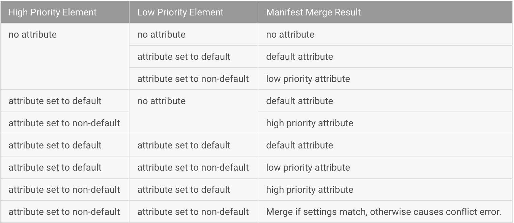

## 3.11 AndroidManifest合并原理

Android Studio工程通常包含多个AndroidManifest文件，最终构建成APK时，会合并成一个AndroidManifest文件。但是可能很多人应该都不知道是怎么合并的，本文将为大家揭开神秘面纱。

### 3.11.1 合并冲突规则（merge conflict rules）
合并冲突，是指多个Manifest文件中含有同一属性但值不同时，默认合并规则解决不了从而导致的冲突。当冲突发生时，高优先级的Manifest属性值会覆盖低优先级属性值。这个优先级规则由高到低依次是：
```
buildType下的Manifest设置->productFlavor下的Manifest设置->主工程src/main->dependency&library
```
默认合并冲突规则如下：



当然还存在例外情况：
* uses-feature android:required和uses-library android:required默认值都是true，根据OR规则合并
* 如果不指定uses-sdk，默认的minSdkVersion和targetSdkVersion值为1，当发生冲突时将使用高优先级的值。若不指定targetSdkVersion，其值等于targetSdkVersion
* 当library工程的minSdkVersion比主工程src/main中的minSdkVersion低时会产生冲突，此时需要添加overLibrary标记解决冲突
* 当library工程的targetSdkVersion比主工程src/main中的大时，合并过程会增加一些权限保证library工程能正常运行
* 每个Manifest文件只和其子Manifest文件的属性合并
* <intent-filter>的合并规则是叠加而不是覆盖

### 3.11.2 合并冲突标记和选择器（merge conflict marker&selector）
合并冲突标记，是android tools namespace中的一个属性，用来解决默认冲突规则解决不了的冲突。主要包含以下几个：
* merge：默认合并操作。
* replace：高优先级替换低优先级Manifest文件中的属性
* strict：属性相同而值不同时会报错，除非通过冲突规则解决了
* merge-only：仅合并低优先级的属性
* remove：移除指定的低优先级的属性
* remove-All：移除相同节点类型下所有低优先级的属性

一般节点层面默认使用merge，属性层面默认使用strict。下面看几个例子：
1. 使用replace标记解决android:icon和android:label属性冲突
```xml
<manifest xmlns:android="http://schemas.android.com/apk/res/android"
   package="com.android.tests.flavorlib.app"
   xmlns:tools="http://schemas.android.com/tools">

   <application
       android:icon="@drawable/icon"
       android:label="@string/app_name"
       tools:replace="icon, label">
       ...
   </application>
</manifest>
```
2. 以下代码块中，src manifest会覆盖library的<uses-sdk>。(默认情况下是不允许低优先级的minSdkVersion大于高优先级的，否则会报错。)
```xml
//src manifest
<manifest xmlns:android="http://schemas.android.com/apk/res/android"
   package="com.android.example.app"
   xmlns:tools="http://schemas.android.com/tools">
   ...
   <uses-sdk android:targetSdkVersion="22" android:minSdkVersion="2"
         tools:overrideLibrary="com.example.lib1, com.example.lib2"/>
   ...
</manifest>
//Library manifest
<manifest xmlns:android="http://schemas.android.com/apk/res/android"
    package="com.example.lib1">
    ...
    <uses-sdk android:minSdkVersion="4" />
    ...
</manifest>
```
3. 以下代码块表示，移除library1中的permissionOne权限，而其他模块下该权限不受影响。
```xml
<manifest xmlns:android="http://schemas.android.com/apk/res/android"
   package="com.android.example.app"
   xmlns:tools="http://schemas.android.com/tools">
   ...
   <permission
       android:name="permissionOne"
       tools:node="remove"
       tools:selector="com.example.lib1">
       ...
   </permission>
</manifest>
```

### 3.11.3 向AndroidManifest文件注入build变量值
注入build变量值通常需要使用manifestPlaceholders，applicationId属性除外。另外支持部分注入，如android:authority="com.acme.${localApplicationId}.foo"。仍然是看几个例子：
1. 注入applicationId
```xml
<activity android:name=".Main">
    <intent-filter>
        <action android:name="${applicationId}.foo"></action>
    </intent-filter>
</activity>
```
Gradle build file:
```groovy
android {
    compileSdkVersion 22
    buildToolsVersion "22.0.1"

    productFlavors {
        flavor1 {
            applicationId = "com.mycompany.myapplication.productFlavor1"
        }
    }
    ...
}
```

注入之后的manifest为:
```xml
<action android:name="com.mycompany.myapplication.productFlavor1.foo"/>
```
2. 注入其他属性
Gradle build file:
```
android {
    defaultConfig {
        manifestPlaceholders = [ activityLabel:"defaultName"]
    }
    productFlavors {
        free {
        }
        pro {
            manifestPlaceholders = [ activityLabel:"proName" ]
        }
    }
    ...
}
```
Placeholder in the manifest file:
```xml
<activity android:name=".MainActivity" android:label="${activityLabel}" />
```
