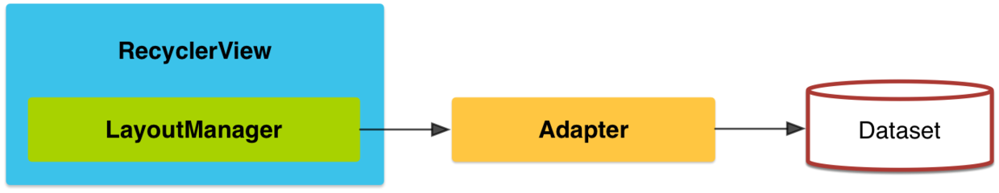

## 3.12 RecyclerView详解

RecyclerView作为ListView和GridView的替代，但是和ListView不一样的是，RecyclerView不再负责Item的摆放等显示方面的功能，所有和布局、绘制等方面的工作都拆分成不同的类进行管理。

### 3.12.1 RecyclerView与ListView
RecyclerView与ListView的不同点，主要在于以下几个特性：
* Adapter中的ViewHolder模式，ListView没有严格的ViewHolder设计模式。但是在RecyclerView中，Adapter必须按照ViewHolder模式实现至少一个ViewHolder。
* 定制Item视图，ListView只能实现垂直线性排列的列表视图。RecyclerView可以通过设置RecyclerView.LayoutManager来定制不同风格的视图，比如水平滚动列表或者不规则的瀑布流列表。
* Item动画，在ListView中没有提供任何方法或者接口，以实现Item的增删动画。RecyclerView可以通过设置RecyclerView.ItemAnimator来为Item增加动画效果。
* 设置数据源，在LisView中针对不同数据封装了各种类型的Adapter，比如用来处理数组的ArrayAdapter和用来展示Database结果的CursorAdapter。而RecyclerView中必须自定义实现RecyclerView.Adapter并为其提供数据集合。
* 设置Item分割线，在ListView中可以通过设置android:divider属性来为两个Item间设置分割线。而RecyclerView必须使用RecyclerView.ItemDecoration，这种实现方式更灵活，样式也更加丰富。
* 设置Item点击事件，在ListView中存在AdapterView.OnItemClickListener接口，用来绑定Item的点击事件。而RecyclerView并没有提供这样的接口，但是它提供了另外一个接口RcyclerView.OnItemTouchListener，用来响应Item的触摸事件。

### 3.12.2 基本结构
如果你想使用RecyclerView，需要做以下操作：
* RecyclerView.Adapter - 处理数据集合并负责绑定视图
* ViewHolder - 持有所有的用于绑定数据或者需要操作的View
* LayoutManager - 负责摆放视图等相关操作
* ItemDecoration - 负责绘制Item附近的分割线
* ItemAnimator - 为Item的一般操作添加动画效果，如，增删条目等

我们可以从下图更直观的了解到RecyclerView的基本结构：



RecyclerView不再负责Item视图的布局及显示，所以RecyclerView也没有为Item开放OnItemClick等点击事件。可以通过以下方式进行：因为在ViewHolder我们可以拿到每个Item的根布局，所以如果我们为根布局设置单独的OnClick监听并将其开放给Adapter，那么就可以在组装RecyclerView时就能够设置ItemClickListener，只不过这个Listener不是设置到RecyclerView上而是设置到Adapter。

多Item布局，getItemViewType方法，用法和ListView没有任何区别，这里要注意的是函数onCreateViewHolder(ViewGroup parent, int viewType)的第二个参数就是View的类型，可以根据这个类型判断去创建不同item的ViewHolder，从而完成多Item布局。

### 3.12.3 实现原理

#### Adapter
在RecylerView中，Adapter扮演着两个角色：一是根据不同viewType创建与之相应的的itemView，二是访问数据集合并将数据绑定到正确的View上。这就需要我们实现以下两个函数：
```
public VH onCreateViewHolder(ViewGroup parent, int viewType); //创建Item视图，并返回相应的ViewHolder
public void onBindViewHolder(VH holder, int position); //绑定数据到正确的Item视图上。
```
另外我们还需要重写另一个方法，像ListView-Adapter那样，同样地告诉RecyclerView-Adapter列表Items的总数：
```
public int getItemCount(); //返回该Adapter所持有的Itme数量
```

#### ViewHolder
ViewHolder描述RecylerView中某个位置的itemView和元数据信息，属于Adapter的一部分，其实现类通常用于保存findViewById的结果。 主要元素组成有：
```Java
public static abstract class ViewHolder {
    View itemView;//itemView
    int mPosition;//位置
    int mOldPosition;//上一次的位置
    long mItemId;//itemId
    int mItemViewType;//itemViewType
    int mPreLayoutPosition;
    int mFlags;//ViewHolder的状态标志
    int mIsRecyclableCount;
    Recycler mScrapContainer;//若非空，表明当前ViewHolder对应的itemView可以复用
}
```
关于ViewHolder，这里主要介绍mFlags：
FLAG_BOUND——ViewHolder已经绑定到某个位置，mPosition、mItemId、mItemViewType都有效
FLAG_UPDATE——ViewHolder绑定的View对应的数据过时需要重新绑定，mPosition、mItemId还是一致的
FLAG_INVALID——ViewHolder绑定的View对应的数据无效，需要完全重新绑定不同的数据
FLAG_REMOVED——ViewHolder对应的数据已经从数据集移除
FLAG_NOT_RECYCLABLE——ViewHolder不能复用
FLAG_RETURNED_FROM_SCRAP——这个状态的ViewHolder会加到scrap list被复用。
FLAG_CHANGED——ViewHolder内容发生变化，通常用于表明有ItemAnimator动画
FLAG_IGNORE——ViewHolder完全由LayoutManager管理，不能复用
FLAG_TMP_DETACHED——ViewHolder从父RecyclerView临时分离的标志，便于后续移除或添加回来
FLAG_ADAPTER_POSITION_UNKNOWN——ViewHolder不知道对应的Adapter的位置，直到绑定到一个新位置
FLAG_ADAPTER_FULLUPDATE——方法addChangePayload(null)调用时设置

#### LayoutManager
LayoutManager主要作用是，测量和摆放RecyclerView中itemView，以及当itemView对用户不可见时循环复用处理。

#### ItemDecoration
当我们想在某些item上加一些特殊的UI时，往往都是在itemView中先布局好，然后通过设置可见性来决定哪些位置显示不显示。RecyclerView将itemView和装饰UI分隔开来，装饰UI即ItemDecoration，主要用于绘制item间的分割线、高亮或者margin等。其源码如下：
```Java
public static abstract class ItemDecoration {
    //itemView绘制之前绘制，通常这部分UI会被itemView盖住
    public void onDraw(Canvas c, RecyclerView parent, State state) {
        onDraw(c, parent);
    }

    //itemView绘制之后绘制，这部分UI盖在itemView上面
    public void onDrawOver(Canvas c, RecyclerView parent, State state) {
        onDrawOver(c, parent);
    }

    //设置itemView上下左右的间距
    public void getItemOffsets(Rect outRect, View view, RecyclerView parent, State state) {
        getItemOffsets(outRect, ((LayoutParams) view.getLayoutParams()).getViewLayoutPosition(),
                parent);
    }
}
```
#### ItemAnimator
过去AdapterView的item项操作往往是没有动画的。现在RecyclerView的ItemAnimator使得item的动画实现变得简单而样式丰富，我们可以自定义item项不同操作（如添加，删除）的动画效果。

#### Recycler
Recycler用于管理已经废弃或与RecyclerView分离的（scrapped or detached）item view，便于重用。Scrapped view指依附于RecyclerView，但被标记为可移除或可复用的view。

LayoutManager获取Adapter某一项的View时会使用Recycler。当复用的View有效（clean）时，View能直接被复用，反之若View失效（dirty）时，需要重新绑定View。对于有效的View，如果不主动调用request layout，则不需要重新测量大小就能复用。在分析Recycler的复用原理之前，我们先了解下如下两个类：

##### RecycledViewPool
RecyclerViewPool用于多个RecyclerView之间共享View。只需要创建一个RecyclerViewPool实例，然后调用RecyclerView的setRecycledViewPool(RecycledViewPool)方法即可。RecyclerView默认会创建一个RecyclerViewPool实例。
```Java
    public static class RecycledViewPool {
    private SparseArray<ArrayList<ViewHolder>> mScrap =
            new SparseArray<ArrayList<ViewHolder>>();
    private SparseIntArray mMaxScrap = new SparseIntArray();
    private int mAttachCount = 0;

    private static final int DEFAULT_MAX_SCRAP = 5;

    public void clear() {
        mScrap.clear();
    }

    public void setMaxRecycledViews(int viewType, int max) {
        mMaxScrap.put(viewType, max);
        final ArrayList<ViewHolder> scrapHeap = mScrap.get(viewType);
        if (scrapHeap != null) {
            while (scrapHeap.size() > max) {
                scrapHeap.remove(scrapHeap.size() - 1);
            }
        }
    }

    public ViewHolder getRecycledView(int viewType) {
        final ArrayList<ViewHolder> scrapHeap = mScrap.get(viewType);
        if (scrapHeap != null && !scrapHeap.isEmpty()) {
            final int index = scrapHeap.size() - 1;
            final ViewHolder scrap = scrapHeap.get(index);
            scrapHeap.remove(index);
            return scrap;
        }
        return null;
    }

    int size() {
        int count = 0;
        for (int i = 0; i < mScrap.size(); i ++) {
            ArrayList<ViewHolder> viewHolders = mScrap.valueAt(i);
            if (viewHolders != null) {
                count += viewHolders.size();
            }
        }
        return count;
    }

    public void putRecycledView(ViewHolder scrap) {
        final int viewType = scrap.getItemViewType();
        final ArrayList scrapHeap = getScrapHeapForType(viewType);
        if (mMaxScrap.get(viewType) <= scrapHeap.size()) {
            return;
        }
        if (DEBUG && scrapHeap.contains(scrap)) {
            throw new IllegalArgumentException("this scrap item already exists");
        }
        scrap.resetInternal();
        scrapHeap.add(scrap);
    }

    void attach(Adapter adapter) {
        mAttachCount++;
    }

    void detach() {
        mAttachCount--;
    }
    /**
     * Detaches the old adapter and attaches the new one.
     * <p>
     * RecycledViewPool will clear its cache if it has only one adapter attached and the new
     * adapter uses a different ViewHolder than the oldAdapter.
     *
     * @param oldAdapter The previous adapter instance. Will be detached.
     * @param newAdapter The new adapter instance. Will be attached.
     * @param compatibleWithPrevious True if both oldAdapter and newAdapter are using the same
     *                               ViewHolder and view types.
     */
    void onAdapterChanged(Adapter oldAdapter, Adapter newAdapter,
            boolean compatibleWithPrevious) {
        if (oldAdapter != null) {
            detach();
        }
        if (!compatibleWithPrevious && mAttachCount == 0) {
            clear();
        }
        if (newAdapter != null) {
            attach(newAdapter);
        }
    }

    private ArrayList<ViewHolder> getScrapHeapForType(int viewType) {
        ArrayList<ViewHolder> scrap = mScrap.get(viewType);
        if (scrap == null) {
            scrap = new ArrayList<ViewHolder>();
            mScrap.put(viewType, scrap);
            if (mMaxScrap.indexOfKey(viewType) < 0) {
                mMaxScrap.put(viewType, DEFAULT_MAX_SCRAP);
            }
        }
        return scrap;
    }
}
```
通过源码我们可以看出mScrap是一个<viewType, List>的映射，`mMaxScrap`是一个<viewType, maxNum>的映射，这两个成员变量代表可复用View池的基本信息。调用`setMaxRecycledViews(int viewType, int max)`时，当用于复用的`mScrap`中viewType对应的ViewHolder个数超过maxNum时，会从列表末尾开始丢弃超过的部分。调用`getRecycledView(int viewType)`方法时从`mScrap`中移除并返回viewType对应的List的末尾项。

##### ViewCacheExtension
ViewCacheExtension是一个由开发者控制的可以作为View缓存的帮助类。调用Recycler.getViewForPosition(int)方法获取View时，Recycler先检查attached scrap和一级缓存，如果没有则检查ViewCacheExtension.getViewForPositionAndType(Recycler, int, int)，如果没有则检查RecyclerViewPool。注意：Recycler不会在这个类中做缓存View的操作，是否缓存View完全由开发者控制。
```Java
public abstract static class ViewCacheExtension {
    abstract public View getViewForPositionAndType(Recycler recycler, int position, int type);
}
```
现在大家熟悉了RecyclerViewPool和ViewCacheExtension的作用后，下面开始介绍Recycler。 如下是Recycler的几个关键成员变量和方法：
```
private ArrayList<ViewHolder> mAttachedScrap;
private ArrayList<ViewHolder> mChangedScrap; //与RecyclerView分离的ViewHolder列表。
private ArrayList<ViewHolder> mCachedViews; //ViewHolder缓存列表。
private ViewCacheExtension mViewCacheExtension; //开发者控制的ViewHolder缓存
private RecycledViewPool mRecyclerPool; //提供复用ViewHolder池。
public void bindViewToPosition(View view, int position); //将某个View绑定到Adapter的某个位置。
public View getViewForPosition(int position);
```
获取某个位置需要展示的View，先检查是否有可复用的View，没有则创建新View并返回。具体过程为：
1. 检查mChangedScrap，若匹配到则返回相应holder
2. 检查mAttachedScrap，若匹配到且holder有效则返回相应holder
3. 检查mViewCacheExtension，若匹配到则返回相应holder
4. 检查mRecyclerPool，若匹配到则返回相应holder
5. 否则执行Adapter.createViewHolder()，新建holder实例
6. 返回holder.itemView

注：以上每步匹配过程都可以匹配position或itemId（如果有stableId）。
