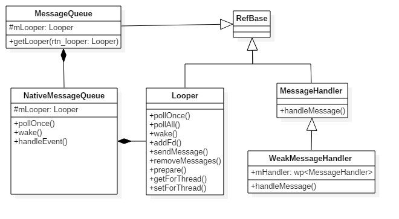

## 3.3 Android消息机制

### 3.3.1 概述
Android有大量的消息驱动方式来进行交互，比如Android的四大组件Activity、Service、Broadcast和ContentProvider的启动过程的交互，都离不开消息机制，Android某种意义上也可以说成是一个以消息驱动的系统。消息机制涉及MessageQueue/Message/Looper/Handler这4个类。

#### 消息模型
Android消息机制主要包含：
1. Message：消息分为硬件产生的消息(如按钮、触摸)和软件生成的消息。
2. MessageQueue：消息队列的主要功能向消息池投递消息(MessageQueue.enqueueMessage)和取走消息池的消息(MessageQueue.next)。
3. Looper：不断循环执行(Looper.loop)，按分发机制将消息分发给目标处理者。
4. Handler：消息辅助类，主要功能向消息池发送各种消息事件(Handler.sendMessage)和处理相应消息事件(Handler.handleMessage)。

其基本结构如下所示：


其中：Looper有一个MessageQueue消息队列，MessageQueue有一组待处理的Message，Message中有一个用于处理消息的Handler，Handler中有Looper和MessageQueue。

### 3.3.2 Looper
我们先看一个关于Handler/Looper的使用例子：
```Java
class LooperThread extends Thread {
    public Handler mHandler;
    public void run() {
        Looper.prepare();   //创建looper
        mHandler = new Handler() {
            public void handleMessage(Message msg) {
                ... //消息处理逻辑
            }
        };
        Looper.loop();  //开始looper循环
    }
}
```
接下来我们将围绕这个实例展开详细分析：

#### Looper.prepare()
Looper.prepare()在每个线程只允许执行一次，该方法会创建Looper对象，Looper的构造方法中会创建一个MessageQueue对象，再将Looper对象保存到当前线程TLS。对于无参的情况，默认调用prepare(true)，表示的是这个Looper允许退出，而对于false的情况则表示当前Looper不允许退出。
```Java
private static void prepare(boolean quitAllowed) {
    //每个线程只允许执行一次该方法，第二次执行时线程的TLS已有数据，则会抛出异常
    if (sThreadLocal.get() != null) {
        throw new RuntimeException("Only one Looper may be created per thread");
    }
    //创建Looper对象，并保存到当前线程的TLS区域
    sThreadLocal.set(new Looper(quitAllowed));
}
private Looper(boolean quitAllowed) {
    mQueue = new MessageQueue(quitAllowed);  //创建MessageQueue对象
    mThread = Thread.currentThread();  //记录当前线程
}
```
另外，与prepare()相近功能的，还有一个prepareMainLooper()方法，该方法主要在ActivityThread类中使用。这里的sThreadLocal是ThreadLocal类型，下面先说说ThreadLocal：


#### Looper.loop()
```Java
public static void loop() {
    final Looper me = myLooper();  //获取TLS存储的Looper对象
    if (me == null) {
        throw new RuntimeException("No Looper; Looper.prepare() wasn't called on this thread.");
    }
    final MessageQueue queue = me.mQueue;  //获取Looper对象中的消息队列

    Binder.clearCallingIdentity();
    //确保在权限检查时基于本地进程，而不是基于最初调用进程。
    final long ident = Binder.clearCallingIdentity();

    for (;;) { //进入loop的主循环方法
        Message msg = queue.next(); //可能会阻塞
        if (msg == null) { //没有消息，则退出循环
            return;
        }
        ...
        msg.target.dispatchMessage(msg); //用于分发Message
        ...
        final long newIdent = Binder.clearCallingIdentity(); //确保分发过程中identity不会损坏
        if (ident != newIdent) {
             //打印identity改变的log，在分发消息过程中是不希望身份被改变的。
        }
        msg.recycleUnchecked();  //将Message放入消息池
    }
}
```
loop()进入循环模式，这是消息处理的核心部分：不断重复下面的操作，直到没有消息时退出循环：
1. 读取MessageQueue的下一条Message；
2. 把Message分发给相应的target，而这个target就是发送这条消息的Handler对象；
3. 再把分发后的Message回收到消息池，以便重复利用。

#### quit()
Looper的quit和quitSafely方法的区别是：前者会直接退出Looper，后者设定一个退出标记，然后把消息队列中的已有消息处理完毕后才安全地退出。Looper退出之后，通过Handler发送的消息就会失败，这个时候Handler的send方法会返回false。quit()方法的实现最终调用的是MessageQueue.quit()方法：
```Java
void quit(boolean safe) {
    // 当mQuitAllowed为false，表示不运行退出，强行调用quit()会抛出异常
    if (!mQuitAllowed) {
        throw new IllegalStateException("Main thread not allowed to quit.");
    }
    synchronized (this) {
        if (mQuitting) { //防止多次执行退出操作
            return;
        }
        mQuitting = true;
        if (safe) {
            removeAllFutureMessagesLocked(); //移除尚未触发的所有消息
        } else {
            removeAllMessagesLocked(); //移除所有的消息
        }
        //mQuitting=false，那么认定为 mPtr != 0
        nativeWake(mPtr);
    }
}
```
消息退出的方式：当safe=true时，只移除尚未触发的所有消息，对于正在触发的消息并不移除；当safe=flase时，移除所有的消息。

在子线程中，如果手动为其创建了Looper，那么在所有的事情完成以后应该调用quit方法来终止消息循环，否则这个子线程就会一直处于等待的状态。

### 3.3.3 Handler
Handler类在构造方法中，可指定Looper、Callback回调方法以及消息的处理方式(同步或异步)，对于无参的handler，默认是当前线程的Looper。具体代码如下所示：
```Java
public Handler() {
    this(null, false);
}
public Handler(Callback callback, boolean async) {
    //匿名类、内部类或本地类都必须申明为static，否则会警告可能出现内存泄露
    if (FIND_POTENTIAL_LEAKS) {
        final Class<? extends Handler> klass = getClass();
        if ((klass.isAnonymousClass() || klass.isMemberClass() || klass.isLocalClass()) &&
                (klass.getModifiers() & Modifier.STATIC) == 0) {
            Log.w(TAG, "The following Handler class should be static or leaks might occur: " +
                klass.getCanonicalName());
        }
    }
    //必须先执行Looper.prepare()，才能获取Looper对象，否则为null.
    mLooper = Looper.myLooper();  //从当前线程的TLS中获取Looper对象
    if (mLooper == null) {
        throw new RuntimeException("");
    }
    mQueue = mLooper.mQueue; //消息队列，来自Looper对象
    mCallback = callback;  //回调方法
    mAsynchronous = async; //设置消息是否为异步处理方式
}
```

#### 消息分发机制
在Looper.loop()中，当发现有消息时，调用消息的目标handler，执行dispatchMessage()方法来分发消息。
```Java
public void dispatchMessage(Message msg) {
    if (msg.callback != null) {
        //当Message存在回调方法，回调msg.callback.run()方法；
        handleCallback(msg);
    } else {
        if (mCallback != null) {
            //当Handler存在Callback成员变量时，回调方法handleMessage()；
            if (mCallback.handleMessage(msg)) {
                return;
            }
        }
        //Handler自身的回调方法handleMessage()
        handleMessage(msg);
    }
}
```
分发消息流程：
1. 当Message的回调方法不为空时，则回调方法msg.callback.run()，其中callBack数据类型为Runnable，否则进入步骤2；
2. 当Handler的mCallback成员变量不为空时，则回调方法mCallback.handleMessage(msg)，否则进入步骤3；
3. 调用Handler自身的回调方法handleMessage()，该方法默认为空，Handler子类通过覆写该方法来完成具体的业务逻辑。

对于很多情况下，消息分发后的处理方法是第3种情况，即Handler.handleMessage()，一般覆写该方法从而实现自己的业务逻辑。

#### 消息发送
发送消息调用链：


从上图，可以发现所有的消息发送方式，最终都是调用MessageQueue.enqueueMessage()，将消息添加到消息队列中;

Handler是消息机制中非常重要的辅助类，更多的实现都是MessageQueue和Message中的方法，Handler的目的是为了更加方便的使用消息机制，比如将一个任务切换到某个指定的线程中去执行，Android中的UI操作只能在主线程中进行，ViewRootImpl的checkThread方法会验证当前线程是否可以进行UI操作。

### 3.3.4 MessageQueue
MessageQueue是消息机制的Java层和C++层的连接纽带，大部分核心方法都交给native层来处理，其中MessageQueue类中涉及的native方法如下：
```Java
private native static long nativeInit();
private native static void nativeDestroy(long ptr);
private native void nativePollOnce(long ptr, int timeoutMillis);
private native static void nativeWake(long ptr);
private native static boolean nativeIsPolling(long ptr);
private native static void nativeSetFileDescriptorEvents(long ptr, int fd, int events);
```
之后我们会简单介绍这些native方法。

#### 创建MessageQueue
```Java
MessageQueue(boolean quitAllowed) {
    mQuitAllowed = quitAllowed;
    //通过native方法初始化消息队列，其中mPtr是供native代码使用
    mPtr = nativeInit();
}
```

#### 提取消息：next()
```Java
Message next() {
    final long ptr = mPtr;
    if (ptr == 0) { //当消息循环已经退出，则直接返回
        return null;
    }
    int pendingIdleHandlerCount = -1; // 循环迭代的首次为-1
    int nextPollTimeoutMillis = 0;
    for (;;) {
        if (nextPollTimeoutMillis != 0) {
            Binder.flushPendingCommands();
        }
        //阻塞操作，当等待nextPollTimeoutMillis时长，或者消息队列被唤醒，都会返回
        nativePollOnce(ptr, nextPollTimeoutMillis);
        synchronized (this) {
            final long now = SystemClock.uptimeMillis();
            Message prevMsg = null;
            Message msg = mMessages;
            if (msg != null && msg.target == null) {
                //当消息Handler为空时，查询MessageQueue中的下一条异步消息msg，则退出循环。
                do {
                    prevMsg = msg;
                    msg = msg.next;
                } while (msg != null && !msg.isAsynchronous());
            }
            if (msg != null) {
                if (now < msg.when) {
                    //当异步消息触发时间大于当前时间，则设置下一次轮询的超时时长
                    nextPollTimeoutMillis = (int) Math.min(msg.when - now, Integer.MAX_VALUE);
                } else {
                    // 获取一条消息，并返回
                    mBlocked = false;
                    if (prevMsg != null) {
                        prevMsg.next = msg.next;
                    } else {
                        mMessages = msg.next;
                    }
                    msg.next = null;
                    //设置消息的使用状态，即flags |= FLAG_IN_USE
                    msg.markInUse();
                    return msg;   //成功地获取MessageQueue中的下一条即将要执行的消息
                }
            } else {
                //没有消息
                nextPollTimeoutMillis = -1;
            }
            //消息正在退出，返回null
            if (mQuitting) {
                dispose();
                return null;
            }
            //当消息队列为空，或者是消息队列的第一个消息时
            if (pendingIdleHandlerCount < 0 && (mMessages == null || now < mMessages.when)) {
                pendingIdleHandlerCount = mIdleHandlers.size();
            }
            if (pendingIdleHandlerCount <= 0) {
                //没有idle handlers 需要运行，则循环并等待。
                mBlocked = true;
                continue;
            }
            if (mPendingIdleHandlers == null) {
                mPendingIdleHandlers = new IdleHandler[Math.max(pendingIdleHandlerCount, 4)];
            }
            mPendingIdleHandlers = mIdleHandlers.toArray(mPendingIdleHandlers);
        }
        //只有第一次循环时，会运行idle handlers，执行完成后，重置pendingIdleHandlerCount为0.
        for (int i = 0; i < pendingIdleHandlerCount; i++) {
            final IdleHandler idler = mPendingIdleHandlers[i];
            mPendingIdleHandlers[i] = null; //去掉handler的引用
            boolean keep = false;
            try {
                keep = idler.queueIdle();  //idle时执行的方法
            } catch (Throwable t) {
                Log.wtf(TAG, "IdleHandler threw exception", t);
            }
            if (!keep) {
                synchronized (this) {
                    mIdleHandlers.remove(idler);
                }
            }
        }
        //重置idle handler个数为0，以保证不会再次重复运行
        pendingIdleHandlerCount = 0;
        //当调用一个空闲handler时，一个新message能够被分发，因此无需等待可以直接查询pending message.
        nextPollTimeoutMillis = 0;
    }
}
```
nativePollOnce是一个native方法，其是阻塞操作，当nativePollOnce()返回后，next()从mMessages中提取一个消息。其中nextPollTimeoutMillis代表下一个消息到来前，还需要等待的时长；当nextPollTimeoutMillis = -1时，表示消息队列中无消息，会一直等待下去。当处于空闲时，往往会执行IdleHandler中的方法。

#### 添加消息：enqueueMessage()
```Java
boolean enqueueMessage(Message msg, long when) {
    // 每一个Message必须有一个target
    if (msg.target == null) {
        throw new IllegalArgumentException("Message must have a target.");
    }
    if (msg.isInUse()) {
        throw new IllegalStateException(msg + " This message is already in use.");
    }
    synchronized (this) {
        if (mQuitting) {  //正在退出时，回收msg，加入到消息池
            msg.recycle();
            return false;
        }
        msg.markInUse();
        msg.when = when;
        Message p = mMessages;
        boolean needWake;
        if (p == null || when == 0 || when < p.when) {
            //p为null(代表MessageQueue没有消息） 或者msg的触发时间是队列中最早的， 则进入该该分支
            msg.next = p;
            mMessages = msg;
            needWake = mBlocked; //当阻塞时需要唤醒
        } else {
            //将消息按时间顺序插入到MessageQueue。一般地，不需要唤醒事件队列，除非
            //消息队头存在barrier，并且同时Message是队列中最早的异步消息。
            needWake = mBlocked && p.target == null && msg.isAsynchronous();
            Message prev;
            for (;;) {
                prev = p;
                p = p.next;
                if (p == null || when < p.when) {
                    break;
                }
                if (needWake && p.isAsynchronous()) {
                    needWake = false;
                }
            }
            msg.next = p;
            prev.next = msg;
        }
        //消息没有退出，我们认为此时mPtr != 0
        if (needWake) {
            nativeWake(mPtr);
        }
    }
    return true;
}
```
MessageQueue是按照Message触发时间的先后顺序排列的，队头的消息是将要最早触发的消息。当有消息需要加入消息队列时，会从队列头开始遍历，直到找到消息应该插入的合适位置，以保证所有消息的时间顺序。

#### 移除消息：removeMessages()
```Java
void removeMessages(Handler h, int what, Object object) {
    if (h == null) {
        return;
    }
    synchronized (this) {
        Message p = mMessages;
        //从消息队列的头部开始，移除所有符合条件的消息
        while (p != null && p.target == h && p.what == what
               && (object == null || p.obj == object)) {
            Message n = p.next;
            mMessages = n;
            p.recycleUnchecked();
            p = n;
        }
        //移除剩余的符合要求的消息
        while (p != null) {
            Message n = p.next;
            if (n != null) {
                if (n.target == h && n.what == what
                    && (object == null || n.obj == object)) {
                    Message nn = n.next;
                    n.recycleUnchecked();
                    p.next = nn;
                    continue;
                }
            }
            p = n;
        }
    }
}
```
这个移除消息的方法，采用了两个while循环，第一个循环是从队头开始，移除符合条件的消息，第二个循环是从头部移除完连续的满足条件的消息之后，再从队列后面继续查询是否有满足条件的消息需要被移除。

### 3.3.5 Java层总结
最后用一张图，来表示整个消息机制


Handler通过sendMessage()发送Message到MessageQueue队列；Looper通过loop()，不断提取出达到触发条件的Message，并将Message交给target（发送Message的Handler）来处理；经过dispatchMessage()后，交回给Handler的handleMessage()来进行相应地处理。

将Message加入MessageQueue时，往管道写入字符，可以唤醒loop线程；如果MessageQueue中没有Message，并处于Idle状态，则会执行IdleHandler接口中的方法，往往用于做一些清理性地工作。

消息分发的优先级：Message的回调方法：message.callback.run()，优先级最高；Handler的回调方法：Handler.mCallback.handleMessage(msg)，优先级其次；Handler的默认方法：Handler.handleMessage(msg)，优先级最低。

### 3.3.6 native消息机制
前面我们讲解了Java层的消息处理机制，其中MessageQueue类里面涉及到多个native方法，除了MessageQueue的native方法，native层本身也有一套完整的消息机制，用于处理native的消息。在整个消息机制中，而MessageQueue是连接Java层和Native层的纽带，换言之，Java层可以向MessageQueue消息队列中添加消息，Native层也可以向MessageQueue消息队列中添加消息。



#### MessageQueue
在MessageQueue中的native方法如下：
```Java
private native static long nativeInit();
private native static void nativeDestroy(long ptr);
private native void nativePollOnce(long ptr, int timeoutMillis);
private native static void nativeWake(long ptr);
private native static boolean nativeIsPolling(long ptr);
private native static void nativeSetFileDescriptorEvents(long ptr, int fd, int events);
```
关于这些方法不再进行详述，下面简单提及其实现原理：
nativeInit()方法，最终实现由epoll机制中的epoll_create()/epoll_ctl()完成；
nativeDestroy()方法，最终实现由RefBase::decStrong()完成；
nativePollOnce()方法，最终实现由Looper::pollOnce()完成；
nativeWake()方法，最终实现由Looper::wake()调用write方法，向管道写入字符；
nativeIsPolling()，nativeSetFileDescriptorEvents()这两个方法类似，此处就不一一列举。

#### 总结
MessageQueue通过mPtr变量保存NativeMessageQueue对象，从而使得MessageQueue成为Java层和Native层的枢纽，既能处理上层消息，也能处理native层消息；下面列举Java层与Native层的对应图


红色虚线关系：Java层和Native层的MessageQueue通过JNI建立关联，彼此之间能相互调用，搞明白这个互调关系，也就搞明白了Java如何调用C++代码，C++代码又是如何调用Java代码。
蓝色虚线关系：Handler/Looper/Message这三大类Java层与Native层并没有任何的真正关联，只是分别在Java层和Native层的handler消息模型中具有相似的功能。都是彼此独立的，各自实现相应的逻辑。
WeakMessageHandler继承于MessageHandler类，NativeMessageQueue继承于MessageQueue类

另外，消息处理流程是先处理Native Message，再处理Native Request，最后处理Java Message。理解了该流程，也就明白有时上层消息很少，但响应时间却较长的真正原因。
