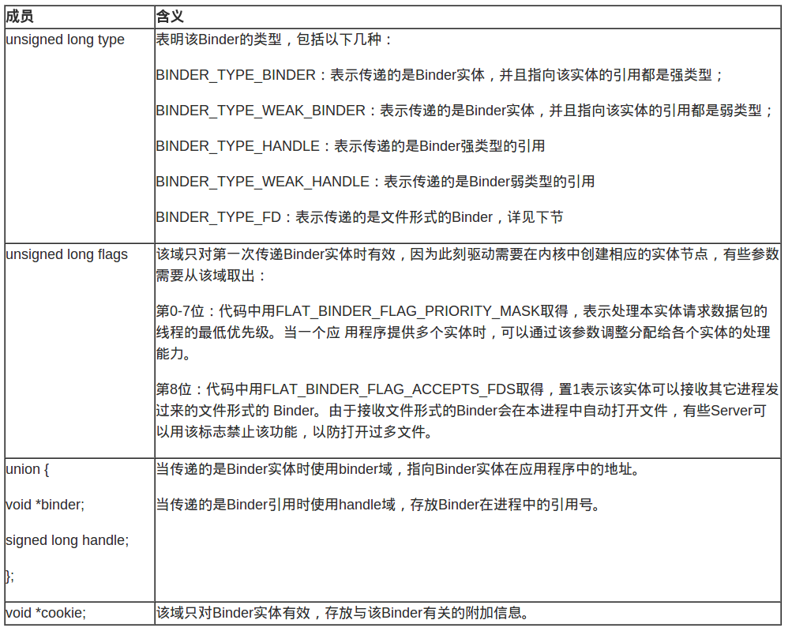
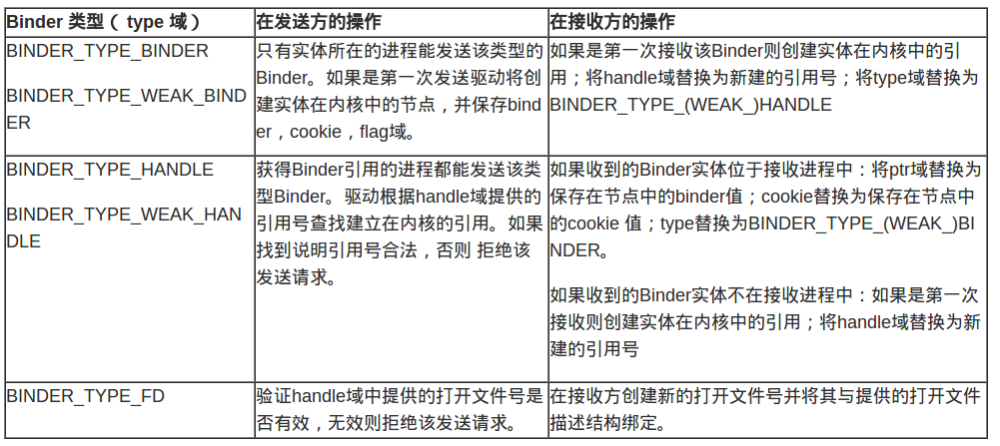
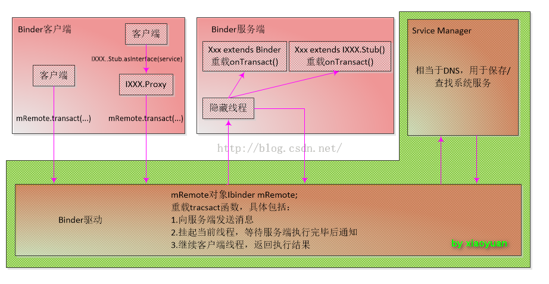

## 3.5 Android进程间通信

### 3.5.1 背景知识
#### 传统IPC
Linux传统的IPC机制分为如下几种：管道、消息队列、共享内存和Socket等。它们总结起来是如下三种方式：
1. 两个进程共享文件系统中某个文件上的某些信息，为了访问这些信息，每个进程都得穿越内核(read、write、lseek等)。当然进程共享的文件（一切皆是文件）可以是硬盘上的实际文件，也可以是虚拟文件，或者外围设备等，这些虚拟文件只是在文件系统中有个访问点。
2. 两个进程共享驻留于内核中的某些信息，管道是这种共享类型的一个例子，Binder也算是这种类型，进程可以通过访问/dev/binder(open、mmap、ioctl系统调用)从而实现互相通信。
3. 两个进程有一个双方都能访问的共享内存区，每个进程一旦设置好该共享内存区，就可以不涉及内核而访问其中的数据，这种方式是IPC形式中最快的，它依赖于mmap系统调用。

#### 数据类型和对象
对象定义的一致性：进程A中有一个对象ObjectA，进程B想通过RPC访问这个ObjectA，那么A和B中对该对象的格式必须是一致的，对Java而言，双方可以引用同一个Java文件中的类，这种对象定义的一致性是双方通信约定的一部分。

数据类型：进程间通信传递基本数据类型这个很容易理解，传递一个int到另外一个进程，对方就将其解释为一个int，但是如何传递一个对象？像Java中的序列化可以将一个对象转换成字节流通过网络传递到另外一个进程或者写进文件（序列化的这种机制依赖于Java字节码的平台无关性和类的动态加载机制）。

Binder通信中可以支持传递序列化过的Java字节流，但是它也只是将这串字节流当做普通数据类型来处理，它只负责传递，具体如何解释这些数据由双方来约定。事实上Binder通信将数据分为三种：基本数据类型，binder数据类型和文件描述符。

### 3.5.2 Android多进程模式
Android系统会为每个进程分配一个独立的虚拟机，不同的虚拟机在内存分配上有不同的地址空间。通过给四大组件指定android:process属性就可以开启多进程模式，默认进程的进程名是包名packageName，进程名以:开头的进程属于当前应用的私有进程，其他应用的组件不可以和它跑在同一个进程中，而进程名不以:开头的进程属于全局进程，其他应用通过ShareUID方法可以和它跑在同一个进程中。
```
android:process=":xyz" //进程名是 packageName:xyz
android:process="aaa.bbb.ccc" //进程名是 aaa.bbb.ccc
```
Android系统会为每个应用分配一个唯一的UID，具有相同UID的应用才能共享数据。当两个应用有相同的ShareUID和签名时，它们可以相互访问对方的私有数据，比如data目录、组件信息等，而且可以运行在同一个进程中。当它们运行在同一个进程中，还可以共享内存数据，此时它们看起来就像是一个应用的两个部分。

### 3.5.3 Binder通信模型
Binder框架定义了四个角色：Server，Client，ServiceManager（SMgr）以及Binder驱动。其中Server，Client，SMgr运行于用户空间，驱动运行于内核空间。这四个角色的关系和网络类似：Server是服务器，Client是客户端，SMgr是域名服务器（DNS），驱动是路由器。

#### Binder驱动
虽然名叫“驱动”，实际上和硬件设备没有任何关系，只是实现方式和设备驱动程序是一样的：它工作于内核态，提供open()，mmap()，poll()，ioctl()等标准文件操作（没有read()，write()接口）。驱动负责进程之间Binder通信提供支持：Binder在进程之间的传递，Binder引用计数管理，数据包在进程之间的传递和交互等。驱动和应用程序之间定义了一套接口协议，主要功能由ioctl()方法实现。Binder驱动的代码位于linux目录的drivers/misc/binder.c中。

#### ServiceManager与具名Binder
和DNS类似，SMgr的作用是将字符形式的Binder名字转化成Client中对该Binder的引用，使得Client能够通过Binder名字获得对Server中Binder实体的引用。注册了名字的Binder叫具名Binder，就像每个网站除了有IP地址外还有自己的域名。

Server创建了Binder实体，然后将这个Binder实体连同名字通过Binder驱动发送给SMgr，通知SMgr注册这个Binder。驱动为这个Binder创建位于实体以及该实体的引用，将名字及引用传递给SMgr。SMgr收到数据后，从中取出名字和引用填入一张索引表中。

细心的读者可能会发现其中的蹊跷：SMgr是一个进程，Server是另一个进程，Server向SMgr注册Binder必然会涉及进程间通信，当前实现的是进程间通信却又要用到进程间通信，很典型的鸡蛋问题。Binder的处理方式：SMgr提供的Binder比较特殊，它没有名字也不需要注册，当一个进程使用BINDER_SET_CONTEXT_MGR命令将自己注册成SMgr时Binder驱动会自动为它创建Binder实体，然后这个Binder的引用在所有Client中都是固定的（0号引用），即如果一个Server若要向SMgr注册自己Binder只需通过这个固定引用和SMgr通信。类比网络通信，约定0号引用就好比域名服务器的地址。

Server向SMgr注册了Binder实体及其名字后，Client就可以通过名字获得该Binder的引用了：Client向SMgr请求访问某个Binder，SMgr收到这个请求后，从请求数据包里获得Binder的名字，通过改名字在索引表里找到对应的引用，将该引用回复给Client。现在这个Binder对象有了两个引用：一个位于SMgr中，一个位于发起请求的Client中。如果接下来有更多的Client请求该Binder，系统中就会有更多的引用指向该Binder。

#### 匿名Binder
并不是所有Binder都需要注册给SMgr，Server端可以通过已经建立的Binder连接将其他Binder实体传给Client，此时这个Binder没有向SMgr注册，是个匿名Binder。Client将会收到这个匿名Binder的引用，通过这个引用向位于Server中的实体发送请求。

下图展示了参与Binder通信的所有角色，将在以后章节中一一提到。


### 3.5.4 Binder的含义
考察一次Binder通信的全过程会发现，Binder存在于系统以下几个部分中：
* 应用程序：分为Server进程和Client进程（SMgr本身也是Server端）。
* Binder驱动：管理位于Server端的Binder实体和Client端的引用。
* 传输数据：Binder是可以跨进程传递，需要在传输数据中予以表述。

在系统不同部分，Binder实现的功能不同，表现形式也不一样。接下来逐一探讨各个部分中Binder的含义。

#### Binder在应用程序中的含义
Binder本质上只是一种底层通信方式，和具体服务没有关系。为了提供具体服务，Server必须提供一套接口函数以便Client通过远程访问使用各种服务。Android中采用Proxy设计模式：将接口函数定义在一个抽象类中，Server和Client都继承该抽象类实现所有接口函数，所不同的是Server端是真正的功能实现，而Client端是对这些接口函数远程调用请求的代理。

##### Server端的Binder–Binder实体
首先定义一个抽象接口类，其中包含一系列接口函数（业务逻辑）等待Server和Client各自实现。并为这些接口函数一一编号，这样Server可以根据收到的编号知道需要调用哪个函数。其次就要引入Binder了，Server端定义一个Binder抽象类处理来自Client的请求数据包，其中有一个onTransact方法，该方法分析收到的数据包，调用相应的接口函数处理请求。

接下来采用继承方式以接口类和Binder抽象类为基类构建Binder在Server中的实体，实现基类里中的接口函数以及onTransact方法，其中接口函数是我们具体的业务逻辑，onTransact方法根据Client的请求数据（binder_transact_data）决定调用对应的接口函数，具体业务执行完毕，如果需要返回数据就再构建一个binder_transaction_data结构返回数据。onTransact方法又是什么时候调用呢？这就需要驱动参与了。驱动收到数据后，从中取出该数据的目标Binder引用（Client端只有目标Binder实体的引用），根据自己的记录找到该Binder实体，然后将具体请求交付给该Binder实体，即调用其onTransact方法。

##### Client端的Binder–Binder引用
Client端的Binder也继承抽象接口类并实现接口函数，但这不是真正的实现，而是将参数序列化，然后向Server端（Binder实体）发送请求并等待返回值。为此Client端要知道Binder实体的相关信息，即对Binder实体的引用，该引用或是由SMgr转发过来的对实名Binder的引用或是由另一个进程直接发送过来的对匿名Binder的引用。

Client端中，其序列化方式是：创建一个binder_transaction_data数据包，将其对应的函数编码填入code域，将调用该函数所需的参数填入data.buffer中，并指明数据包的目的地，即目标Binder实体的引用，填入数据包的target.handle中。注意这里和Server的区别：实际上target域是个union，包括ptr和handle两个成员，前者用于Server端，指向Binder实体对应的内存空间；后者用于Client端，存放Binder实体的引用。数据包准备好后，通过驱动接口发送出去，经过BC_TRANSACTION/BC_REPLY完成函数的远程调用并得到返回值。

#### Binder驱动
驱动是Binder通信的核心，其负责管理Binder实体和Binder引用，以及负责将数据传输到目的地。驱动将对穿越进程边界的Binder做如下操作：检查传输结构的type域：
* 如果是BINDER_TYPE_BINDER或BINDER_TYPE_WEAK_BINDER则创建Binder的实体；
* 如果是BINDER_TYPE_HANDLE或BINDER_TYPE_WEAK_HANDLE则创建Binder的引用；
* 如果是BINDER_TYPE_FD则为进程打开文件，无须创建任何数据结构。

#### 传输数据中的Binder
Binder本身是可以跨越进程的，这些传输中的Binder用结构flat_binder_object表示，如下图所示：



无论是Binder实体还是对Binder引用都从属于某个进程，其是不能透明地在进程之间传输的，必须经过驱动转译。例如当Server把Binder实体传递给Client时，在发送数据包中，flat_binder_object中的type是BINDER_TYPE_BINDER，binder指向Server进程地址空间的一个对象。驱动必须对数据包中的这个Binder做转译：将type改成BINDER_TYPE_HANDLE；为该Binder实体创建位于内核中的引用并将该引用号填入handle中。对于发送数据包中的Binder引用也要做同样转换。经过处理后接收进程从数据流中取得的Binder引用才是有效的，才可以将其填入数据包binder_transaction_data的target.handle域，向Binder实体发送请求。

下图总结了当flat_binder_object结构穿过驱动时驱动所做的操作：



##### 文件形式的Binder
除了通常意义上用来通信的Binder，还有一种特殊的Binder：文件Binder。这种Binder的基本思想是：将文件看成Binder实体，进程打开的文件号看成Binder的引用。一个进程可以将它打开文件的文件号传递给另一个进程，从而另一个进程也打开了同一个文件，就象Binder的引用在进程之间传递一样。

需要注意的是，这和两个进程分别打开同一个文件是有区别的：这种方式下两个进程共享同一个文件描述符，一个进程使用read或者write改变了文件指针，另一个进程的文件指针也会改变；而如果两个进程分别使用同一文件名打开文件则有各自的文件描述符结构，从而各自独立维护文件指针，互不干扰。

### 3.5.4 Binder杂谈
#### Binder内存管理
除了共享内存外，Linux中其他的IPC都需要两次copy：首先是发送方将数据从发送端地址空间copy到内核空间，然后OS将数据从内核空间copy到接收方地址空间，即用户空间->内核空间->用户空间。而Binder只需要一次copy，原因是Binder驱动负责管理数据接收缓存，Binder驱动实现了mmap()系统调用，用来创建数据接收的缓存空间。先看mmap()是如何使用的：
```c
fd = open("/dev/binder", O_RDWR);
mmap(NULL, MAP_SIZE, PROT_READ, MAP_PRIVATE, fd, 0);
```
这样接收方就有了一片大小为MAP_SIZE的接收缓存区。mmap()的返回值是内存映射在接收方地址空间的地址，不过这段空间是由驱动管理，用户不必也不能直接访问（映射类型为PROT_READ，只读映射），接收缓存区映射好后就可以接收和存放数据了。这样通信时数据就只需要一次copy了：相当于直接发送方地址空间copy到接收方地址空间，省去了内核中暂存这个步骤。

需要需要的是，Linux内核并没有从一个用户空间到另一个用户空间直接拷贝的函数，需要先用copy_from_user拷贝到内核空间，再用copy_to_user拷贝到另一个用户空间。为了实现用户空间到用户空间的拷贝，mmap()分配的内存除了映射进了接收方进程里，还映射进了内核空间。所以调用copy_from_user将数据拷贝进内核空间也相当于拷贝进了接收方的用户空间。

#### Binder线程管理
对于Server进程S，可能会有许多Client同时发起请求，为了提高效率往往使用线程池并发处理收到的请求。怎样使用线程池实现并发处理呢？这和具体的IPC机制有关，例如在BIO中，Server端的ServerSocket设置为侦听模式，有一个专门的侦听线程使用该ServerSocket侦听来自Client的连接请求，即阻塞在accept()上，一旦收到来自Client的连接请求就会创建新连接，并从线程池中启动一个工作线程并将这个连接交给该线程，这个连接上的后续业务就由该线程完成。

对于Binder来说，没有侦听模式也不会建立连接Socket，怎样管理线程池呢？一种简单的做法是，先创建一堆线程，这些线程会阻塞任务队列上，一旦有来自Client的数据驱动会从队列中唤醒一个线程来处理。这样做简单直观，但一开始就创建一堆线程有点浪费资源，于是Binder协议引入了专门命令帮助用户管理线程池，包括：
```
INDER_SET_MAX_THREADS //线程池的大小
BC_REGISTER_LOOP //创建主循环
BC_ENTER_LOOP //进入主循环
BC_EXIT_LOOP //退出主循环
BR_SPAWN_LOOPER //启动新线程
```

首先要管理线程池就要知道池子有多大，应用程序通过INDER_SET_MAX_THREADS告诉驱动最多可以创建几个线程。以后每个线程在创建，进入主循环，退出主循环时都要分别使用BC_REGISTER_LOOP，BC_ENTER_LOOP，BC_EXIT_LOOP告知驱动，以便驱动收集和记录当前线程池的状态。每当驱动接收到一个数据包（新任务到来），如果没有闲置线程了，而且当前线程总数小于线程池最大线程数，就会再启动一个。

#### 任务队列管理
一般线程池实现时有两个队列：任务队列和工作线程队列。使用者将任务发送到任务队列中，然后工作线程从任务队列中取出任务并执行。而Binder线程池中每个线程也有自己私有的任务队列，存放发送给该线程的任务。由于发送时没有特别标记，驱动怎么判断将数据包发送到全局任务队列还是某个线程私有的任务队列呢，这里有两条规则：
1. 一般Client发给Server的请求数据包都提交到Server进程的全局任务队列。
2. 对同步请求的返回数据包（由BC_REPLY发送的包）都发送到发起请求的线程的私有任务队列中。即进程P1的线程T1发给进程P2的线程T2的是同步请求，那么T2返回的数据包将送进T1的私有任务队列而不会提交到P1的全局任务队列。

数据包进入接收队列的规则也就决定了线程如何接收任务的规则，即一个线程只要不接收返回数据包则应该在全局等待队列中等待新任务，否则就应该在其私有任务队列中等待对端的返回数据包。还是上面的例子，T1在向T2发送同步请求后就必须等待在它私有任务队列中，而不是在P1的全局任务队列中排队，否则将得不到T2的返回的数据。

这些规则体现在应用程序上就是同步请求交互过程中的线程一致性：
1. Client端，等待返回包的线程必须是发送请求的线程，而不能由一个线程发送请求包，另一个线程等待接收包，否则Client端将会线程紊乱；
2. Server端，发送对应返回数据包的线程必须是收到请求数据包的线程，否则返回的数据包将无法送交发送请求的线程。

接下来探讨一下Binder驱动是如何递交同步请求和异步请求的。对于这两种请求，驱动并没有简单地将其直接投递到接收端的全局任务队列中，而是对异步请求做了限流，优先保证同步请求。具体做法是：对于某个Binder实体，只要有一个异步请求没有处理完毕，例如正在被某个线程处理或还在任意一个任务队列中排队，那么接下来发给该Binder的异步请求将不再投递到这个任务队列中，而是阻塞在驱动为该实体开辟的异步请求接收队列（Binder节点的async_todo域）中，但这期间同步请求仍然可以进入任务队列等待处理，一直到该异步请求处理完毕下一个异步请求才可以脱离异步请求队列进入任务队列中。这里用专门任务队列将过多的异步请求暂存起来，以免突发大量异步请求挤占Server端的处理能力或耗尽线程池里的线程，进而阻塞同步请求。

### 3.5.6 深入理解Java层的Binder
#### IBinder/IInterface/Binder/BinderProxy
我们使用AIDL接口的时候，经常会接触到这些类，那么这每个类代表的是什么呢？
* IBinder代表的是一种跨进程传输的能力，只要实现了这个接口，就能将这个对象进行跨进程传递。这是驱动底层支持的，在跨进程数据流经驱动的时候，驱动会识别IBinder类型的数据，从而完成不同进程间Binder本地对象以及Binder代理对象的转换。
* IInterface代表的是Server端提供的能力。
* Binder类，代表的其实就是Binder本地对象；BinderProxy类是Binder类的一个内部类，它代表远程进程的Binder对象的本地代理；这两个类都继承自IBinder，因而都具有跨进程传输的能力。



#### AIDL通信过程
现在我们通过一个AIDL的使用，分析一下整个通信过程中，各个角色到底做了什么，AIDL到底是如何完成通信的。
首先定义一个简单的aidl接口：
```Java
interface ICompute {
    int add(int a, int b);
}
```
编译后，可以得到对应的ICompute.java类，看看系统给我们生成的代码：
```Java
public interface ICompute extends android.os.IInterface {
    public static abstract class Stub extends android.os.Binder implements com.example.test.app.ICompute {
        private static final java.lang.String DESCRIPTOR = "com.example.test.app.ICompute";

        public Stub() {
            this.attachInterface(this, DESCRIPTOR);
        }

        public static com.example.test.app.ICompute asInterface(android.os.IBinder obj) {
            if ((obj == null)) {
                return null;
            }
            android.os.IInterface iin = obj.queryLocalInterface(DESCRIPTOR);
            if (((iin != null) && (iin instanceof com.example.test.app.ICompute))) {
                return ((com.example.test.app.ICompute) iin);
            }
            return new com.example.test.app.ICompute.Stub.Proxy(obj);
        }

        @Override
        public android.os.IBinder asBinder() {
            return this;
        }

        @Override
        public boolean onTransact(int code, android.os.Parcel data, android.os.Parcel reply, int flags) throws android.os.RemoteException {
            switch (code) {
                case INTERFACE_TRANSACTION: {
                    reply.writeString(DESCRIPTOR);
                    return true;
                }
                case TRANSACTION_add: {
                    data.enforceInterface(DESCRIPTOR);
                    int _arg0;
                    _arg0 = data.readInt();
                    int _arg1;
                    _arg1 = data.readInt();
                    int _result = this.add(_arg0, _arg1);
                    reply.writeNoException();
                    reply.writeInt(_result);
                    return true;
                }
            }
            return super.onTransact(code, data, reply, flags);
        }

        private static class Proxy implements com.example.test.app.ICompute {
            private android.os.IBinder mRemote;

            Proxy(android.os.IBinder remote) {
                mRemote = remote;
            }

            @Override
            public android.os.IBinder asBinder() {
                return mRemote;
            }

            public java.lang.String getInterfaceDescriptor() {
                return DESCRIPTOR;
            }

            @Override
            public int add(int a, int b) throws android.os.RemoteException {
                android.os.Parcel _data = android.os.Parcel.obtain();
                android.os.Parcel _reply = android.os.Parcel.obtain();
                int _result;
                try {
                    _data.writeInterfaceToken(DESCRIPTOR);
                    _data.writeInt(a);
                    _data.writeInt(b);
                    mRemote.transact(Stub.TRANSACTION_add, _data, _reply, 0);
                    _reply.readException();
                    _result = _reply.readInt();
                } finally {
                    _reply.recycle();
                    _data.recycle();
                }
                return _result;
            }
        }
        static final int TRANSACTION_add = (android.os.IBinder.FIRST_CALL_TRANSACTION + 0);
    }

    public int add(int a, int b) throws android.os.RemoteException;
}
```
下面我们简单分析一下这段代码：
首先，它声明了几个接口方法，同时还声明了几个整型的id用于标识这些方法，id用于标识在transact过程中客户端所请求的到底是哪个方法以及一个内部类Stub和代理类Proxy。
1. asInterface()：用于将服务端返回的Binder对象转换成客户端所需的AIDL接口类型的对象，这种转换过程是区分进程的，如果客户端和服务端是在同一个进程中，那么这个方法返回的是服务端的Stub对象本身，否则返回的是系统封装的Stub.Proxy对象，其决定了之后的请求是否跨进程。
2. asBinder()：返回当前Binder对象。
3. onTransact()：这个方法运行在服务端中的Binder线程池中，当客户端发起跨进程请求时，远程请求会通过系统底层封装后交由此方法来处理。
4. Stub类继承自Binder，意味着这个Stub其实自己是一个Binder本地对象，并且其实现了ICompute接口，ICompute本身是一个IInterface，因此它实现了Client需要的能力（这里是方法add)。
5. Proxy#[Method]：代理类中的接口方法，当客户端调用这些方法时，它首先封装参数，接着调用transact方法来发起RPC请求，同时当前线程挂起(即binder通信是同步阻塞的）；然后服务端的onTransact方法会被调用，直到RPC过程返回后，当前线程继续执行，获取执行结果。

### 3.5.6 注意事项
需要注意的是使用多进程会有以下几个问题：
* 静态成员和单例模式完全失效；
* 线程同步机制完全失效，无论锁对象还是锁全局对象都无法保证线程同步；
* SharedPreferences的可靠性下降，SharedPreferences不支持并发读写；
* Application会多次创建，当一个组件跑在一个新的进程的时候，系统要在创建新的进程的同时分配独立的虚拟机，应用会重新启动一次，也就会创建新的Application。同一个应用的不同组件，如果它们运行在不同进程中，那么和它们分别属于两个应用没有本质区别。

#### linkToDeath和unlinkToDeath
这里我们看两个App开发时的重要方法：linkToDeath和unlinkToDeath。如果Binder服务端异常终止了，则会导致客户端的远程调用失败，所以Binder提供了两个配对的方法linkToDeath和unlinkToDeath，通过linkToDeath方法可以给Binder设置一个死亡代理，当Binder死亡的时候客户端就会收到通知，然后就可以重新发起连接请求从而恢复连接了。代码如下所示：
```Java
private IBinder.DeathRecipient mDeathRecipient = new IBinder.DeathRecipient() {
    @Override
    public void binderDied() {
        if (mRemoteBookManager == null) {
            return;
        }
        mRemoteBookManager.asBinder().unlinkToDeath(mDeathRecipient, 0);
        mRemoteBookManager = null;
        // TODO:这里重新绑定远程Service
    }
};
mRemoteBookManager.asBinder().linkToDeath(mDeathRecipient, 0);
```

#### Binder连接池
当项目规模很大的时候，不应该创建多个Service，而是将所有的AIDL放在同一个Service中去管理。整个工作机制是：每个业务模块创建自己的AIDL接口并实现此接口，这个时候不同业务模块之间是不能有耦合的，所有实现细节我们要单独开来，然后向服务端提供自己的唯一标识和其对应的Binder对象；对于服务端来说，只需要一个Service，服务端提供一个queryBinder接口，这个接口能够根据业务模块的特征来返回相应的Binder对象给它们，不同的业务模块拿到所需的Binder对象后就可以进行远程方法调用了。Binder连接池的主要作用就是将每个业务模块的Binder请求统一转发到远程Service去执行，从而避免了重复创建Service的过程。
