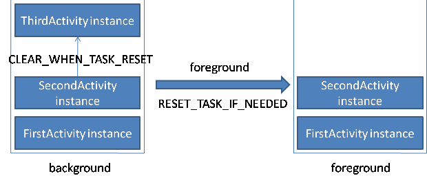
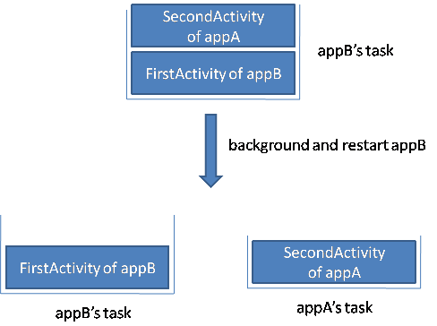

## 3.2 Activity详解

### 3.2.1 生命周期分析
#### 典型情况下生命周期分析
1. 一般情况下，当当前Activity从不可见重新变为可见状态时，onRestart()方法就会被调用。
2. 当用户打开新的Activity或者切换到桌面的时候，回调如下：onPause()->onStop()，但是如果新Activity采用了透明主题，那么onStop()方法不会被回调。当用户再次回到原来的Activity时，回调如下：onRestart()->onStart()->onResume()。
3. onResume()和onPause()方法对应，它们是从Activity是否位于前台这个角度来回调的；onStart()和onStop()对应，它们是从Activity是否可见这个角度来回调的。
4. 从Activity A进入到Activity B，回调顺序是onPause(A)->onCreate(B)->onStart(B)->onResume(B)->onStop(A)，所以不能在onPause方法中做重量级的操作。

#### 异常情况下生命周期分析
1. onSaveInstanceState方法只会出现在Activity被异常终止的情况下，它的调用时机是在onStop之前，它和onPause方法没有既定的时序关系，可能在它之前，也可能在它之后。当Activity被重新创建的时候，onRestoreInstanceState会被回调，它的调用时机是onStart之后。系统只会在Activity即将被销毁并且有机会重新显示的情况下才会去调用onSaveInstanceState方法。当Activity在异常情况下需要重新创建时，系统会默认为我们保存当前Activity的视图结构，并且在Activity重启后为我们恢复这些数据，比如文本框中用户输入的数据、listview滚动的位置等，这些view相关的状态系统都会默认为我们恢复。
2. android:configChanges="xxx"属性，常用的主要有下面三个选项：
local：设备的本地位置发生了变化，一般指切换了系统语言；
keyboardHidden：键盘的可访问性发生了变化，比如用户调出了键盘；
orientation：屏幕方向发生了变化，比如旋转了手机屏幕。
配置了android:configChanges="xxx"属性之后，Activity就不会在对应变化发生时重新创建，而是调用Activity的onConfigurationChanged方法。

### 3.2.2 Activity的启动模式

#### Task
Task是一个从用户角度出发的概念，它是一些activity的组合，它们组合起来是为了让用户完成某一件工作（或者说操作）。task内的activity们以栈的形式组织起来，即backStack。栈内的activity可以来自不同的app，因此可以是运行在不同的进程。

安卓系统是实时多task系统，用户可以随意在多个task之间切换。当一个task的栈内所有activity都pop之后，task也就销毁了。有时系统为了回收内存，会销毁activity，但是不会销毁task。

Activity在manifest中有LaunchMode选项，intent可以指定IntentFlag，前者供被启动者使用，后者供启动者使用，同时使用时后者会覆盖前者。

#### affinity
每个Activity都有一个affinity属性，这个属性指出了该Activity希望进入的Task。默认情况下，一个应用内的所有Activity都具有相同的affinity，都是从Application继承而来，而Application的affinity属性默认是应用的包名。而Task也有自己的affinity属性，等于其内的根Activity的taskAffinity值。在系统自带的Browser中，package为com.android.browser，但是<application>却自定义一个taskAffinity属性：
```xml
<application
    android:name="Browser"
    android:taskAffinity="android.task.browser"
    .../>
```
affinity主要应用在以下场合：
* 启动一个Activity过程中Intent使用了FLAG_ACTIVITY_NEW_TASK（包括附带NEW_TASK属性的情况），会根据目标Activity的affinity查找或创建一个对应的task。
* 根据affinity重新为Activity选择宿主task（与allowTaskReparenting属性配合工作）。

#### launchMode
Activity有以下四种启动模式：
1. standard：默认模式，允许多实例。
2. singleTop：相比于standard，有新的启动请求时，当目标activity处于当前栈顶时，会调用onNewIntent()而不创建新实例，其他情况都和standard一致。
3. singleTask：设置了”singleTask”启动模式的Activity，它在启动的时候，会先在系统中查找具有相同affinity的task，如果不存在这样的task，则会创建一个新task（所以singleTask具有NEW_TASK效果），并在其中启动该Activity；如果存在这样的task，它就会在这个task中启动，如果该task中已存在该Activity实例，则会把该Activity实例弹到栈顶，并调用它的onNewIntent()方法（它之上的Activity会被出栈，所以该模式具有CLEAR_TOP效果）；如果该Activity实例不存在，那么就创建Activity实例并把它压入栈中。
4. singleInstance：和singleTask相比，不同点在于singleInstance模式下，activity所在的task只会有这一个activity。

#### 注意事项
* 当任务栈中没有任何Activity的时候，系统就会回收这个任务栈。
* 从非Activity类型的Context(如Application、Service等)中以standard模式启动新的Activity是不行的，因为这类context并没有任务栈，所以需要为待启动Activity指定FLAG_ACTIVITY_NEW_TASK标志位。
* 调用者activity带有singleInstance或者目标activity带有singleInstance或者singleTask，会附带有FLAG_ACTIVITY_NEW_TASK属性。
* 参数TaskAffinity用来指定Activity所需要的任务栈，意为任务相关性。默认情况下，Activity所需的任务栈的名字为应用的包名。TaskAffinity属性主要和singleTask启动模式或者allowTaskReparenting属性配对使用，在其他情况下没有意义。当TaskAffinity和singleTask启动模式配对使用的时候，它是具有该模式的Activity的目前任务栈的名字，待启动的Activity会运行在名字和TaskAffinity相同的任务栈中；当TaskAffinity和allowTaskReparenting结合的时候，当一个应用A启动了应用B的某个Activity C后，如果Activity C的allowTaskReparenting属性设置为true的话，那么当应用B被启动后，系统会发现Activity C所需的任务栈存在了，就将Activity C从A的任务栈中转移到B的任务栈中。
* 设置启动模式既可以使用xml属性android:launchMode，也可以使用代码intent.addFlags()。区别在于限定范围不同，前者无法直接为Activity设置FLAG_ACTIVITY_CLEAR_TOP标识，而后者无法为Activity指定singleInstance模式。

#### Intent Flags
在android.content.Intent中定义了若干个flags，其中最重要的有以下几个：
1. FLAG_ACTIVITY_NEW_TASK：当Intent对象包含这个标记时，首先系统依据目标Activity的taskAffinity属性进行匹配，如果找到一个task的taskAffinity与之相同，就将目标Activity压入此task中，否则创建一个新的task，并将该task的taskAffinity设置为目标Activity的taskActivity，将目标Activity放置于此task。注意，如果同一个应用中Activity的taskAffinity都使用默认值或都设置相同值时，应用内的Activity之间的跳转使用这个标记是没有意义的，因为当前应用task就是目标Activity的宿主。
2. FLAG_ACTIVITY_CLEAR_TOP：当Intent对象包含这个标记时，如果在栈中发现存在目标Activity实例，则清空这个实例之上的其他Activity，使其处于栈顶。而目标Activity是关闭重建（onCreate）还是使用已存在的实例（onNewIntent），具体分析如下所示：standard启动模式下，如果Intent没有使用FLAG_ACTIVITY_SINGLE_TOP标记，那么它将关闭后重建（onCreate），如果使用了这个FLAG_ACTIVITY_SINGLE_TOP标记，则会使用已存在的实例（onNewIntent）；对于其他启动模式，无需再使用FLAG_ACTIVITY_SINGLE_TOP，它都将使用已存在的实例，Intent会被传递到这个实例的onNewIntent中。
3. FLAG_ACTIVITY_SINGLE_TOP：当Intent对象包含这个标记时，目标task中存在目标Activity实例并且位于栈的顶端时，不再创建一个新的，直接利用这个实例。(见2中的分析)
4. FLAG_ACTIVITY_CLEAR_WHEN_TASK_RESET：当Intent对象包含这个标记时，则目标Activity以及该Activity其上的所有Activity都会在task重置时被清除出task。当一个后台的task重新回到前台时，系统会为这个动作附带一个FLAG_ACTIVITY_RESET_TASK_IF_NEEDED标记，意味着必要时重置task，这时FLAG_ACTIVITY_CLEAR_WHEN_TASK_RESET就会生效。经过测试发现，对于一个处于后台的应用，如果在桌面点击应用，这个动作中含有FLAG_ACTIVITY_RESET_TASK_IF_NEEDED标记，而从任务栏中点击该应用，这个动作不含FLAG_ACTIVITY_RESET_TASK_IF_NEEDED标记，所以前者会清除，后者不会。关于这个标记，可以下图示之：



这个标记对于应用存在分割点的情况会非常有用。比如我们在应用主界面要选择一个图片，然后我们启动了图片浏览界面，但是把这个应用从后台恢复到前台时，为了避免让用户感到困惑，我们希望用户仍然看到主界面，而不是图片浏览界面，这个时候我们就要在转到图片浏览界面时的Intent中加入此标记。
5. FLAG_ACTIVITY_RESET_TASK_IF_NEEDED：当Intent对象包含这个标记时，这个标记在以下情况下会生效：1.启动Activity时创建新的task来放置Activity实例；2.已存在的task被放置于前台。系统会根据affinity对指定的task进行重置操作，task会压入某些Activity实例或移除某些Activity实例。我们结合上面的FLAG_ACTIVITY_CLEAR_WHEN_TASK_RESET可以加深理解。

#### Manifest中task相关属性
在AndroidManifest中定义了几个常见的task相关属性，它们分别代表了task内部不同的行为特征，我们就来逐个介绍一下：
1. android:allowTaskReparenting，这个属性用来标记一个Activity实例在当前应用退居后台后，是否能从启动它的那个task移动到有共同affinity的task，true表示可以移动，false表示它必须呆在当前应用的task中，默认值为false。如果<activity>没有设定此属性，则<application>上的此属性会对此Activity起作用。例如在一个应用中要查看一个web页面，会启动系统浏览器Activity，这个浏览器Activity实例和当前应用处于同一个task，当该应用退居后台之后再次从桌面中启动该应用，将不会再看到这个浏览器Activity实例，因为此时这个浏览器Activity实例已经重新宿主到Browser应用的task内，而如果此时启动Browser应用，就会发现，第一个界面就是我们刚才打开的web页面，证明了这个浏览器Activity实例确实是宿主到了Browser应用的task内。需要注意的是，如果该应用退居后台之后，没有再次启动，而是直接启动浏览器，将不会出现以上现象。重新宿主的动作发生在该应用再次启动的过程中。
android:allowReparenting的效果图如下：



2. android:alwaysRetainTaskState，这个属性用来标记应用的task是否保持原来的状态，“true”表示总是保持，“false”表示不能够保持，默认为“false”。此属性只对task的根Activity起作用，其他的Activity都会被忽略。默认情况下，如果一个应用在后台呆的太久，用户从桌面重新进入该应用时，系统就会对该应用的task进行清理，除了根Activity，其他Activity都会被清除出栈，但是如果在根Activity中设置了此属性之后，用户再次启动应用时，仍然可以看到上一次操作的界面。
这个属性对于一些应用非常有用，例如Browser可能打开很多的tab，用户不想丢失这些状态，使用这个属性就极为恰当。
3. android:clearTaskOnLaunch，这个属性用来标记是否从task清除根Activity之外的所有的Activity，“true”表示清除，“false”表示不清除，默认为“false”。同样，这个属性也只对根Activity起作用，其他的Activity都会被忽略。如果设置了这个属性为“true”，每次用户重新启动这个应用时，都只会看到根Activity，task中的其他Activity都会被清除出栈。如果我们的应用中引用到了其他应用的Activity，这些Activity设置了allowTaskReparenting属性为“true”，则它们会被重新宿主到有共同affinity的task中。
4. android:finishOnTaskLaunch，这个属性和android:allowReparenting属性相似，不同之处在于allowReparenting属性是重新宿主到有共同affinity的task中，而finishOnTaskLaunch属性是销毁实例。如果这个属性和android:allowReparenting都设定为“true”，则这个属性胜出。

### 3.2.3 IntentFilter的匹配规则
IntentFilter中的过滤信息有action、category、data，为了匹配过滤列表，需要同时匹配过滤列表中的action、category、data信息，否则匹配失败。一个过滤列表中的action、category、data可以有多个，所有的
action、category、data分别构成不同类别，同一类别的信息共同约束当前类别的匹配过程。只有一个Intent同时匹配action类别、category类别和data类别才算完全匹配，只有完全匹配才能成功启动目标Activity。此外，一个Activity中可以有多个intent-filter，一个Intent只要能匹配任何一组intenf-filter即可成功启动对应的Activity。
```xml
<intent-filter>
    <action android:name="com.ryg.charpter_1.c" />
    <action android:name="com.ryg.charpter_1.d" />

    <category android:name="com.ryg.category.c" />
    <category android:name="com.ryg.category.d" />
    <category android:name="android.intent.category.DEFAULT" />

    <data android:mimeType="text/plain" />
</intent-filter>
```
1. action匹配规则：只要Intent中的action能够和过滤规则中的任何一个action相同即可匹配成功，action匹配区分大小写。
2. category匹配规则：Intent中如果有category那么所有的category都必须和过滤规则中的其中一个category相同，如果没有category的话那么就是默认的category，即android.intent.category.DEFAULT，所以为了
Activity能够接收隐式调用，配置多个category的时候必须加上默认的category。
3. data匹配规则：
data的结构很复杂，主要由mimeType和URI组成，语法大致如下：
```xml
<data android:scheme="string"
android:host="string"
android:port="string"
android:path="string"
android:pathPattern="string"
android:pathPrefix="string"
android:mimeType="string" />
```

data匹配规则：Intent中必须含有data数据，并且data数据能够完全匹配过滤规则中的某一个data。
URI有默认的scheme！
如果过滤规则中的mimeType指定为image/* 或者text/* 等这种类型的话，那么即使过滤规则中没有指定URI，URI有默认的scheme是content和file，如果过滤规则中指定了scheme的话那就不是默认的scheme了。
```xml
<intent-filter>
    <data android:mimeType="image/*"/>
    ...
</intent-filter>
//URI默认值被覆盖
<intent-filter>
    <data android:mimeType="image/*" android:scheme="http" .../>
    ...
</intent-filter>
```

如果要为Intent指定完整的data，必须要调用setDataAndType方法。不能先调用setData然后调用setType，因为这两个方法会彼此清除对方的值。intent.setDataAndType(Uri.parse("file://abc"), "image/png");
data的下面两种写法作用是一样的：
```xml
<intent-filter>
    <data android:scheme="file" android:host="www.github.com"/>
</intent-filter>

<intent-filter>
    <data android:scheme="file"/>
    <data android:host="www.github.com"/>
</intent-filter>
```
如何判断是否有Activity能够匹配我们的隐式Intent？
1. PackageManager的resolveActivity方法或者Intent的resolveActivity方法：如果找不到就会返回null
2. PackageManager的queryIntentActivities方法：它返回所有成功匹配的Activity信息
针对Service和BroadcastReceiver等组件，PackageManager同样提供了类似的方法去获取成功匹配的组件信息，例如queryIntentServices、queryBroadcastReceivers等方法

有一类action和category比较重要，它们在一起用来标明这是一个入口Activity，并且会出现在系统的应用列表中。
```xml
<intent-filter>
    <action android:name="android.intent.action.MAIN" />
    <category android:name="android.intent.category.LAUNCHER" />
</intent-filter>
```
