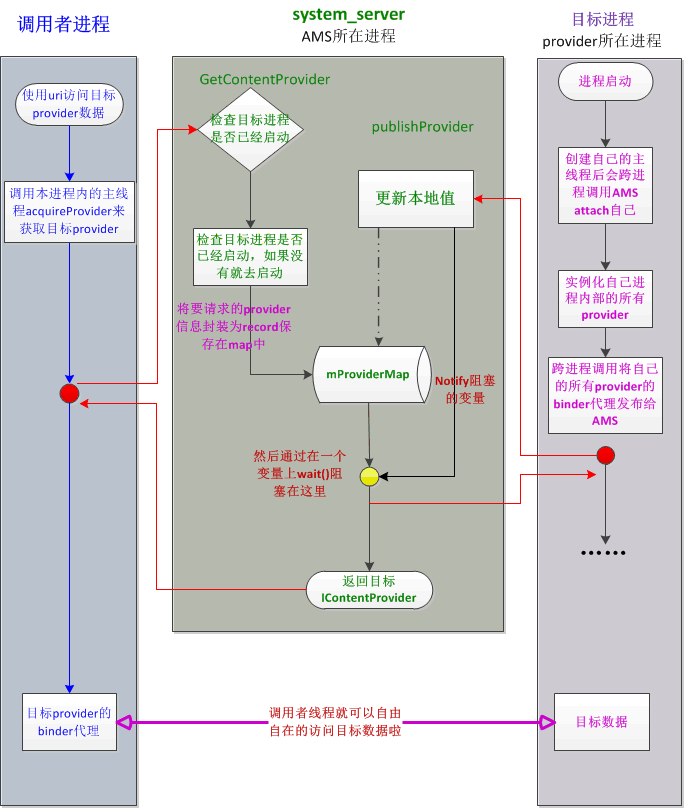

## 3.6 ContentProvider详解

### 3.6.1 简介
contentProvider用于提供数据的统一访问格式，封装底层的具体实现，使用者只需要使用ContentProvider提供的数据操作接口，首先获取相应的ContentResolver，然后使用该ContentResolver完成对数据的增删改查，接下来我们以查询为例简单说明一下其具体流程：
```Java
ContentResolver resolver = getContentResolver();
Uri uri = Uri.parse("content://auth/path");
Cursor cursor = resolver.query(uri, null, null, null, null);
...
cursor.close();
```

### 3.6.2 调用方进程
首先我们从发起方进程开始，直接看query方法：
```Java
//ContentResolver.java
public final @Nullable Cursor query(@RequiresPermission.Read @NonNull Uri uri,
        @Nullable String[] projection, @Nullable String selection,
        @Nullable String[] selectionArgs, @Nullable String sortOrder) {
    return query(uri, projection, selection, selectionArgs, sortOrder, null);
}
public final @Nullable Cursor query(final @RequiresPermission.Read @NonNull Uri uri,
        @Nullable String[] projection, @Nullable String selection,
        @Nullable String[] selectionArgs, @Nullable String sortOrder,
        @Nullable CancellationSignal cancellationSignal) {
    ...
    //获取对应的unstable provider
    IContentProvider unstableProvider = acquireUnstableProvider(uri);
    if (unstableProvider == null) {
        return null;
    }
    IContentProvider stableProvider = null;
    Cursor qCursor = null;
    try {
        ...

        try {
            //执行查询操作
            qCursor = unstableProvider.query(mPackageName, uri, projection,
                    selection, selectionArgs, sortOrder, remoteCancellationSignal);
        } catch (DeadObjectException e) {
            //ContentProvider进程已经死亡的情况
            unstableProviderDied(unstableProvider);
            //获取stable provider
            stableProvider = acquireProvider(uri);
            if (stableProvider == null) {
                return null;
            }
            //重新执行查询操作
            qCursor = stableProvider.query(mPackageName, uri, projection,
                    selection, selectionArgs, sortOrder, remoteCancellationSignal);
        }
        if (qCursor == null) {
            return null;
        }
        // Force query execution.  Might fail and throw a runtime exception here.
        qCursor.getCount();
        long durationMillis = SystemClock.uptimeMillis() - startTime;
        maybeLogQueryToEventLog(durationMillis, uri, projection, selection, sortOrder);
        // Wrap the cursor object into CursorWrapperInner object.
        final IContentProvider provider = (stableProvider != null) ? stableProvider : acquireProvider(uri);
        final CursorWrapperInner wrapper = new CursorWrapperInner(qCursor, provider);
        stableProvider = null;
        qCursor = null;
        return wrapper;
    } catch (RemoteException e) {
        return null;
    } finally {
        if (qCursor != null) {
            qCursor.close();
        }
        ...
    }
}
```
简单说明一下该方法：首先获取unstable的ContentProvider，然后执行query操作。如果此时抛出DeadObjectException，则说明ContentProvider进程已经死亡，则尝试获取stable的CContentProvider，再次执行query操作。这里简单说明一下unstable和stable的区别：unstable对象可能是不可用的，它是发起方进程缓存的之前引用过的ContentProvider，这样当再次查询时，优先从本地缓存中获取，但是此时该ContentProvider进程不一定还活着，如果该进程被杀了，则使用缓存中的ContentProvider引用会抛出DeadObjectException。此时则需要重新获取stable的ContentProvider，再执行query操作。我们看一下acquireUnstableProvider方法：
```Java
//ContextImpl.java
private static final class ApplicationContentResolver extends ContentResolver {
    ...
    protected IContentProvider acquireUnstableProvider(Context c, String auth) {
        //这里的mMainThread是ActivityThread对象
        return mMainThread.acquireProvider(c,
                ContentProvider.getAuthorityWithoutUserId(auth),
                resolveUserIdFromAuthority(auth), false);
    }
}
//ActivityThread.java
public final IContentProvider acquireProvider(Context c, String auth, int userId, boolean stable) {

    final IContentProvider provider = acquireExistingProvider(c, auth, userId, stable);
    if (provider != null) {
        //获取到已经存在的ContentProvider对象，直接返回
        return provider;
    }

    IActivityManager.ContentProviderHolder holder = null;
    try {
        //向AMS发起获取ContentProvider请求
        holder = ActivityManagerNative.getDefault().getContentProvider(getApplicationThread(), auth, userId, stable);
    } catch (RemoteException ex) {
    }
    if (holder == null) {
        //无法获取auth所对应的provider，直接返回
        return null;
    }

    //安装该ContentProvider
    holder = installProvider(c, holder, holder.info, true, holder.noReleaseNeeded, stable);
    return holder.provider;
}
```
该方法中，首先尝试获取当期已经缓存的ContentProvider，成功获取则直接返回；否则向AMS发起获取请求获取ContentProvider，然后再调用installProvider方法，增加对该ContentProvider的引用计数。接下来我们就要到AMS进程中看一下如何获取目标ContentProvider。

### 3.6.3 AMS进程
我们直接看AMS的getContentProvider方法：
```Java
//AvtivityManagerService.java
private ContentProviderHolder getContentProviderImpl(IApplicationThread caller,
        String name, IBinder token, boolean stable, int userId) {
    ContentProviderRecord cpr;
    ContentProviderConnection conn = null;
    ProviderInfo cpi = null;

    synchronized(this) {
        long startTime = SystemClock.uptimeMillis();

        ProcessRecord r = null;
        if (caller != null) {
            r = getRecordForAppLocked(caller);
            ...
        }

        boolean checkCrossUser = true;

        //检查目标ContentProvider是否已经发布
        cpr = mProviderMap.getProviderByName(name, userId);
        ...

        boolean providerRunning = cpr != null && cpr.proc != null && !cpr.proc.killed;
        if (providerRunning) {
            cpi = cpr.info;
            String msg;
            if ((msg = checkContentProviderPermissionLocked(cpi, r, userId, checkCrossUser)) != null) {
                throw new SecurityException(msg);
            }
            //目标ContentProvider已经发布，且允许在发起方进程中运行
            if (r != null && cpr.canRunHere(r)) {
                ContentProviderHolder holder = cpr.newHolder(null);
                // don't give caller the provider object, it needs to make its own.
                holder.provider = null;
                return holder;
            }

            // In this case the provider instance already exists, so we can return it right away.
            conn = incProviderCountLocked(r, cpr, token, stable);
            if (conn != null && (conn.stableCount+conn.unstableCount) == 1) {
                if (cpr.proc != null && r.setAdj <= ProcessList.PERCEPTIBLE_APP_ADJ) {
                    updateLruProcessLocked(cpr.proc, false, null);
                }
            }

            boolean success = updateOomAdjLocked(cpr.proc);
            ...
            //ContentProvider进程被杀
            if (!success) {
                ...
                boolean lastRef = decProviderCountLocked(conn, cpr, token, stable);
                appDiedLocked(cpr.proc);
                if (!lastRef) {
                    return null;
                }
                providerRunning = false;
                conn = null;
            } else {
                cpr.proc.verifiedAdj = cpr.proc.setAdj;
            }
        }

        if (!providerRunning) {
            try {
                //通过PKMS来解决目标ContentProvider
                cpi = AppGlobals.getPackageManager().resolveContentProvider(name,
                        STOCK_PM_FLAGS | PackageManager.GET_URI_PERMISSION_PATTERNS, userId);
            }
            ...

            ComponentName comp = new ComponentName(cpi.packageName, cpi.name);
            cpr = mProviderMap.getProviderByClass(comp, userId);
            final boolean firstClass = cpr == null;
            if (firstClass) {
                ...
                if (mPermissionReviewRequired || Build.PERMISSIONS_REVIEW_REQUIRED) {
                    if (!requestTargetProviderPermissionsReviewIfNeededLocked(cpi, r, userId)) {
                        return null;
                    }
                }

                try {
                    //从PKMS中获取目标ContentProvider对应的Application信息
                    ApplicationInfo ai = AppGlobals.getPackageManager().
                            getApplicationInfo(cpi.applicationInfo.packageName, STOCK_PM_FLAGS, userId);
                    ...
                    ai = getAppInfoForUser(ai, userId);
                    //创建对应的ContentProviderRecord对象
                    cpr = new ContentProviderRecord(this, cpi, ai, comp, singleton);
                } catch (RemoteException ex) {
                    // pm is in same process, this will never happen.
                }
            }

            //判断目标ContentProvider是否可以运行在调用方进程中
            if (r != null && cpr.canRunHere(r)) {
                return cpr.newHolder(null);
            }

            //从mLaunchingProviders列表中查询是否存在目标ContentProvider：例如被其他进程正在启动
            final int N = mLaunchingProviders.size();
            int i;
            for (i = 0; i < N; i++) {
                if (mLaunchingProviders.get(i) == cpr) {
                    break;
                }
            }

            // If the provider is not already being launched, then get it started.
            if (i >= N) {
                try {
                    ...

                    ProcessRecord proc = getProcessRecordLocked(cpi.processName, cpr.appInfo.uid, false);
                    //该ContentProvider对应的Process仍然处于活跃状态
                    if (proc != null && proc.thread != null && !proc.killed) {
                        //查看该进程是否已经发布该ContentProvider
                        if (!proc.pubProviders.containsKey(cpi.name)) {
                            proc.pubProviders.put(cpi.name, cpr);
                            try {
                                //向ContentProvider进程发起请求，调用其对应的installProvider方法，创建并发布该ContentProvider
                                proc.thread.scheduleInstallProvider(cpi);
                            } catch (RemoteException e) {
                            }
                        }
                    } else {
                        //启动该ContentProvider对应的Process
                        proc = startProcessLocked(cpi.processName,
                                cpr.appInfo, false, 0, "content provider",
                                new ComponentName(cpi.applicationInfo.packageName, cpi.name), false, false, false);
                        ...
                    }
                    cpr.launchingApp = proc;
                    //将该ContentProvider加入到mLaunchingProviders队列中
                    mLaunchingProviders.add(cpr);
                }
            }

            //将该ContentProvider加入到mProviderMap中统一管理
            if (firstClass) {
                mProviderMap.putProviderByClass(comp, cpr);
            }

            mProviderMap.putProviderByName(name, cpr);
            conn = incProviderCountLocked(r, cpr, token, stable);
            if (conn != null) {
                conn.waiting = true;
            }
        }
    }

    //等待目标ContentProvider的发布
    synchronized (cpr) {
        while (cpr.provider == null) {
            if (cpr.launchingApp == null) {
                return null;
            }
            try {
                if (conn != null) {
                    conn.waiting = true;
                }
                cpr.wait();
            } catch (InterruptedException ex) {
            } finally {
                if (conn != null) {
                    conn.waiting = false;
                }
            }
        }
    }
    return cpr != null ? cpr.newHolder(conn) : null;
}
```
该方法比较长，这里我们简单分析一下：
* 首先通过mProviderMap成员查询目标ContentProvider是否存在：存在说明已经启动，则直接发布即可；否则进入下一步；
* 通过PKMS去查询目标ContentProvider的相关信息，然后检查目标ContentProvider进程是否已经启动，如果已经启动则检查目标进程是否已经发布该ContentProvider，如果没有则向其发起installProvider请求来启动并发布该ContentProvider；否则进入下一步；
* 请求启动目标ContentProvider进程，并在mLaunchingProviders中加入该ContentProvider，该进程启动完毕后，会调用attachApplication方法和AMS建立双向通信连接，并在handleBindApplication方法中会调用installContentProviders方法启动并发布目标ContentProvider；
* 之后AMS就等待目标ContentProvider的发布，此时会阻塞在cpr.wait方法上，直到目标ContentProvider的发布（注意和bindService的区别，bindService是通过异步回调完成发布的过程的）。

我们看一下canRunHere方法：
```Java
//ContentProviderRecord.java
public boolean canRunHere(ProcessRecord app) {
    return (info.multiprocess || info.processName.equals(app.processName))
            && uid == app.info.uid;
}
```
从这里我们可知，该ContentProvider是否能运行在调用者所在进程需要满足以下来两个条件：该ContentProvider在AndroidManifest中配置multiprocess=true或调用者进程与ContentProvider在同一个进程；ContentProvider进程跟调用者所在进程是同一个uid。

接下来我们看一下目标进程中如何启动和发布ContentProvider。

### 3.6.4 目标ContentProvider进程
上面说过，目标进程启动后，会首先调用attachApplication方法和AMS建立双向通信连接，AMS会回调执行handleBindApplication方法，其中会调用installContentProviders方法启动并发布ContentProvider。我们之前已经分析过进程启动流程，这里就直接看installContentProviders方法：
```Java
//ActivityThread.java
private void installContentProviders(Context context, List<ProviderInfo> providers) {
    final ArrayList<IActivityManager.ContentProviderHolder> results =
        new ArrayList<IActivityManager.ContentProviderHolder>();

    for (ProviderInfo cpi : providers) {
        //install本App中所有的ContentProvider
        IActivityManager.ContentProviderHolder cph = installProvider(context, null, cpi,
                false /*noisy*/, true /*noReleaseNeeded*/, true /*stable*/);
        if (cph != null) {
            cph.noReleaseNeeded = true;
            results.add(cph);
        }
    }

    try {
        //向AMS发布本App中所有ContentProvider
        ActivityManagerNative.getDefault().publishContentProviders(getApplicationThread(), results);
    } catch (RemoteException ex) {
        throw ex.rethrowFromSystemServer();
    }
}
private IActivityManager.ContentProviderHolder installProvider(Context context,
        IActivityManager.ContentProviderHolder holder, ProviderInfo info,
        boolean noisy, boolean noReleaseNeeded, boolean stable) {
    ContentProvider localProvider = null;
    IContentProvider provider;
    //此时holder是null
    if (holder == null || holder.provider == null) {
        Context c = null;
        ApplicationInfo ai = info.applicationInfo;
        if (context.getPackageName().equals(ai.packageName)) {
            c = context;
        } else if (mInitialApplication != null &&
                mInitialApplication.getPackageName().equals(ai.packageName)) {
            c = mInitialApplication;
        } else {
            try {
                c = context.createPackageContext(ai.packageName, Context.CONTEXT_INCLUDE_CODE);
            } catch (PackageManager.NameNotFoundException e) {
                // Ignore
            }
        }
        if (c == null) {
            return null;
        }
        try {
            //反射创建ContentProvider
            final java.lang.ClassLoader cl = c.getClassLoader();
            localProvider = (ContentProvider)cl.loadClass(info.name).newInstance();
            provider = localProvider.getIContentProvider();
            if (provider == null) {
                return null;
            }
            // XXX Need to create the correct context for this provider.
            localProvider.attachInfo(c, info);
        } catch (java.lang.Exception e) {
            return null;
        }
    } else {
        ...
    }

    IActivityManager.ContentProviderHolder retHolder;

    synchronized (mProviderMap) {
        IBinder jBinder = provider.asBinder();
        //此时localProvider不为null，加入到本地缓存中
        if (localProvider != null) {
            ComponentName cname = new ComponentName(info.packageName, info.name);
            ProviderClientRecord pr = mLocalProvidersByName.get(cname);
            if (pr != null) {
                provider = pr.mProvider;
            } else {
                holder = new IActivityManager.ContentProviderHolder(info);
                holder.provider = provider;
                holder.noReleaseNeeded = true;
                pr = installProviderAuthoritiesLocked(provider, localProvider, holder);
                mLocalProviders.put(jBinder, pr);
                mLocalProvidersByName.put(cname, pr);
            }
            retHolder = pr.mHolder;
        } else {
            ...
        }
    }

    return retHolder;
}
```

### 3.6.5 发布ContentProvider到AMS进程
然后，我们看一下AMS的publishContentProviders方法，看一下具体的发布过程：
```Java
//ActivityManagerService.java
public final void publishContentProviders(IApplicationThread caller, List<ContentProviderHolder> providers) {
    if (providers == null) {
        return;
    }

    enforceNotIsolatedCaller("publishContentProviders");
    synchronized (this) {
        final ProcessRecord r = getRecordForAppLocked(caller);
        ...

        final int N = providers.size();
        for (int i = 0; i < N; i++) {
            ContentProviderHolder src = providers.get(i);
            if (src == null || src.info == null || src.provider == null) {
                continue;
            }
            //从ProcessRecord中的pubProviders取出对应的ContentProviderRecord
            ContentProviderRecord dst = r.pubProviders.get(src.info.name);
            if (dst != null) {
                //将ContentProviderRecord加入到mProviderMap中
                ComponentName comp = new ComponentName(dst.info.packageName, dst.info.name);
                mProviderMap.putProviderByClass(comp, dst);
                String names[] = dst.info.authority.split(";");
                for (int j = 0; j < names.length; j++) {
                    mProviderMap.putProviderByName(names[j], dst);
                }

                int launchingCount = mLaunchingProviders.size();
                int j;
                boolean wasInLaunchingProviders = false;
                for (j = 0; j < launchingCount; j++) {
                    //从mLaunchingProviders中删除对应的ContentProvider
                    if (mLaunchingProviders.get(j) == dst) {
                        mLaunchingProviders.remove(j);
                        wasInLaunchingProviders = true;
                        j--;
                        launchingCount--;
                    }
                }
                if (wasInLaunchingProviders) {
                    mHandler.removeMessages(CONTENT_PROVIDER_PUBLISH_TIMEOUT_MSG, r);
                }
                //调用notifyAll，发布完成，之前cpr.wait返回
                synchronized (dst) {
                    dst.provider = src.provider;
                    dst.proc = r;
                    dst.notifyAll();
                }
                updateOomAdjLocked(r);
                maybeUpdateProviderUsageStatsLocked(r, src.info.packageName, src.info.authority);
            }
        }

        Binder.restoreCallingIdentity(origId);
    }
}
```
调用完dst.notifyAll方法后，AMS的getContentProviderImpl方法就返回了，此时调用方就成功获取到目标ContentProvider的引用，接下来我们看一下ActivityThread的installProvider方法（此时是处于调用方进程中）：

### 3.6.6 回到调用方进程
上面说过调用方进程获得目标ContentProvider的引用后，会执行installProvider方法，将ContentProvider缓存下来，并增加对应的引用计数：
```Java
//ActivityThread.java
private IActivityManager.ContentProviderHolder installProvider(Context context,
        IActivityManager.ContentProviderHolder holder, ProviderInfo info,
        boolean noisy, boolean noReleaseNeeded, boolean stable) {
    ContentProvider localProvider = null;
    IContentProvider provider;
    if (holder == null || holder.provider == null) {
        ...
        //对应于创建ContentProvider的情况，接下来我们会在ContentProvider进程分析这种情况
    } else {
        provider = holder.provider;
    }

    IActivityManager.ContentProviderHolder retHolder;

    synchronized (mProviderMap) {
        IBinder jBinder = provider.asBinder();
        if (localProvider != null) {
            ...
        } else {
            ProviderRefCount prc = mProviderRefCountMap.get(jBinder);
            if (prc != null) {
                // We need to transfer our new reference to the existing
                // ref count, releasing the old one...  but only if
                // release is needed (that is, it is not running in the
                // system process).

                if (!noReleaseNeeded) {

                    incProviderRefLocked(prc, stable);
                    try {
                        ActivityManagerNative.getDefault().removeContentProvider(holder.connection, stable);
                    } catch (RemoteException e) {
                    }
                }
            } else {
                ProviderClientRecord client = installProviderAuthoritiesLocked(provider, localProvider, holder);
                if (noReleaseNeeded) {
                    prc = new ProviderRefCount(holder, client, 1000, 1000);
                } else {
                    prc = stable
                            ? new ProviderRefCount(holder, client, 1, 0)
                            : new ProviderRefCount(holder, client, 0, 1);
                }
                mProviderRefCountMap.put(jBinder, prc);
            }
            retHolder = prc.holder;
        }
    }

    return retHolder;
}
```

### 3.6.7 总结
最后我们再简单总结一下其流程：
1. 调用方进程通过Binder调用AMS的getContentProviderImpl方法请求获取对应的ContentProvider；
2. AMS接受到调用请求后，如果目标ContentProvider进程尚未启动，则调用startProcessLocked方法请求启动该进程，然后AMS进入wait()状态，等待目标ContentProvider的发布；
3. 目标ContentProvider进程启动后，会执行attachApplication和AMS建立双向通信连接，然后执行bindApplication方法，该方法中会执行installContentProviders方法，这个过程会启动该应用所有的ContentProvider，并调用publishContentProviders将其发布到AMS中；
4. AMS接受到发布请求，会调用notifyAll方法，唤醒前面处于wait状态的binder线程，并将目标ContentProvider返回给发起方应用。


