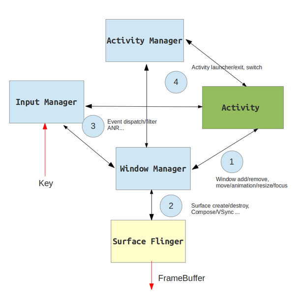
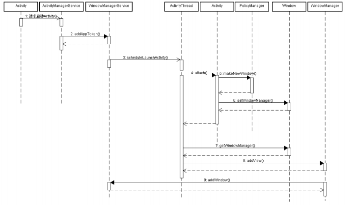
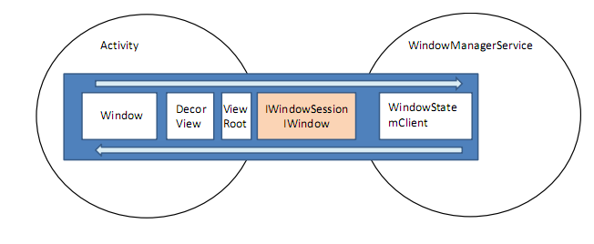
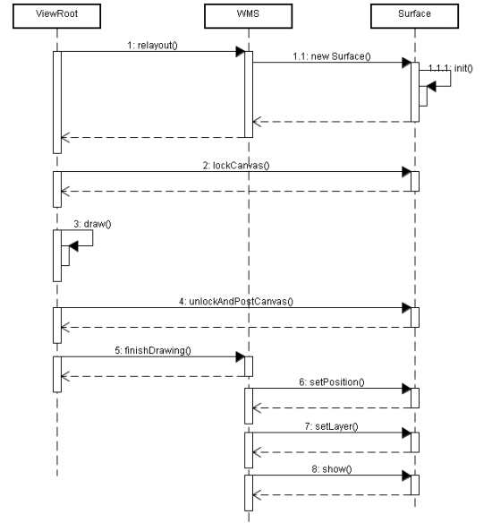
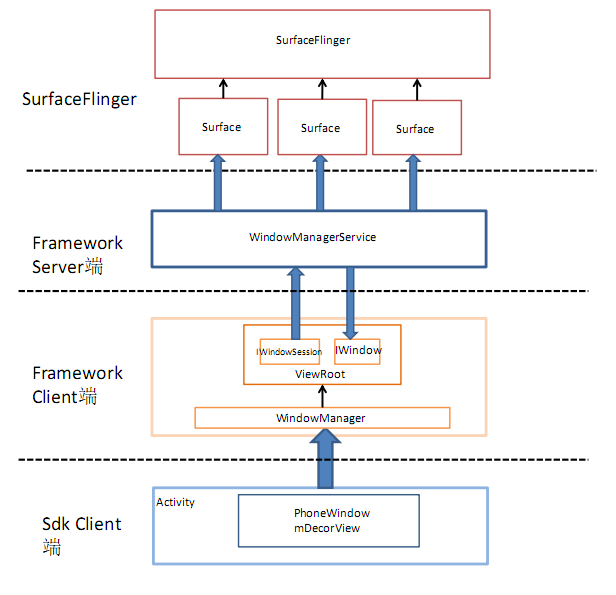
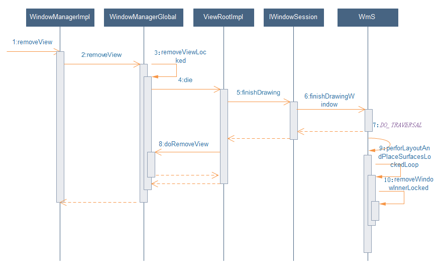

## 3.7 Android窗口

### 3.7.1 概述
Android系统中，窗口管理系统是基于C/S模式的，客户端（App）请求创建窗口和使用窗口，服务端（WMS）管理所有窗口，包括创建、删除窗口，以及将某个窗口设置为焦点窗口（当前正在和用户交互的窗口）。

#### Android Gui系统
我们先简单来介绍一下Android的GUI系统，它包含以下部分内容：
1. 应用框架系统 — AMS
2. 窗口和图形系统 — WMS
3. 显示渲染系统 — SurfaceFlinger
4. 用户输入系统 — InputManager

它们之间的关系，如下图所示：



简单来讲，AMS负责Activity的启动，以及生命周期的管理。一个Activity对应一个应用窗口，WMS负责管理这个窗口（创建、删除等）以及事件分发。View系统管理每个窗口中的具体布局，最终这个View系统中最顶端的根View（即DecorView）会被作为窗口，添加到WMS中。WMS管理着所有这些添加的窗口，负责管理这些窗口的层次，显示位置等内容。每个窗口都有一块自己的Surface，SurfaceFlinger负责把这些Surface显示到屏幕上。

#### 窗口的概念
看AndroidSDK文档的描述：Window是一个抽象基类，用于控制顶层窗口的外观和行为，如绘制背景、标题栏和按键处理等。View是一个基本的UI单元，占据屏幕的一块矩形区域，用于绘制显示UI，接收处理事件等。

而窗口的概念，从不同的角度来看，其含义是不一样的，有时候是指Window，有时候是指View。我们知道，WMS管理所有的窗口，这里的窗口其实是一个View（DecorView），而不是Window。WMS负责管理这些View的Z-order，显示区域，以及把消息派发到对应的View。

### 3.7.2 窗口的类型
Framework中定义了三种类型的窗口：应用窗口，子窗口，系统窗口。

#### 应用窗口
Activity对应的窗口就是应用窗口，其默认的窗口类型是TYPE_BASE_APPLICATION。而Dialog的窗口类型是TYPE_APPLICATION，而很多Dialog的子类，修改了窗口类型，如ContextMenu，本质是用Dialog来实现的，但是在添加窗口前，修改了type类型，赋值为TYPE_APPLICATION_ATTACHED_DIALOG。从这个我们可以看到，WMS并没有把应用窗口与子窗口区分得那么清楚。

与应用窗口相关的窗口表示类是PhoneWindow，PhoneWindow继承自Window，其本身只是一个窗口封装类，其核心是成员mDecorView，mDecorView是一个顶层的View，窗口的添加就是通过调用WindowManager.addView()把该View添加到WMS。

#### 子窗口
子窗口是指该窗口必须要有一个父窗口，父窗口可以是一个应用类型窗口，也可以是其他类型的窗口。例如前面手Q界面中，点击右上角的按钮显示一个PopupWindow，它就是一个子窗口，其类型一般TYPE_APPLICATION_PANEL。既然称为子窗口，其与父窗口的关系是比较容易理解的：B是A的子窗口，A不可见时，B也会不可见的。

#### 系统窗口
一般来讲，系统窗口应该由系统来创建的，例如发生异常，ANR时的提示框，状态栏，屏保等。但是，Framework还是定义了一些可以被应用所创建的系统窗口，如TYPE_TOAST，TYPE_INPUT_METHOD和TYPE_WALLPAPER等等。系统窗口的添加也是直接调用WindowManager.addView()将目标View添加到WMS。

### 3.7.3 相关数据结构
接下来我们看一下相关数据结构：

#### 应用进程
* Window：提供了各种窗口操作的方法，具体实现是PhoneWindow，内部封装着DocerView。
* WindowManager：WMS的客户端，负责将应用进程的请求发送到WMS，主要负责向WMS添加删除窗口等。
* DocerView：整个View结构中的最顶层View，包含标题view和内容view。我们在setContentView时设置的的就是内容view。
* ViewRoot：内部封装着DecorView和LayoutParams，本质是一个Handler，负责与WMS之间的交互，向DecorView分发消息事件，如key、motion事件；作为DecorView的container，向DecorView分发measure、layout和draw事件。

#### WMS
* WindowState：代表一个窗口，WMS用它来描述一个Activity对应的窗口状态。

#### 对应关系
一个Activity对应一个应用窗口，每一个窗口对应一个ViewRoot对象。

Activity和Window中的一些对象具有一定的对应关系：

AMS                  |WMS              
---------------------|-------------
ActivityRecord       |AppWindowToken
TaskRecord           |Task
ActivityStack        |TaskStask

### 3.7.4 应用窗口的创建、显示和销毁

#### 应用窗口的创建
在AMS详解一节中，我们说过AMS在接收到Activity启动请求时，首先生成一个token作为该Activity的唯一标识，然后在WMS中添加一个AppWindowToken，其封装了Activity的token。我们看一下该方法：
```Java
public void addAppToken(int addPos, IApplicationToken token, int taskId, int stackId,
        int requestedOrientation, boolean fullscreen, boolean showForAllUsers, int userId,
        int configChanges, boolean voiceInteraction, boolean launchTaskBehind) {
    long inputDispatchingTimeoutNanos;
    inputDispatchingTimeoutNanos = token.getKeyDispatchingTimeout() * 1000000L;

    synchronized(mWindowMap) {
        AppWindowToken atoken = findAppWindowToken(token.asBinder());
        ...
        //创建AppWindowToken对象
        atoken = new AppWindowToken(this, token, voiceInteraction);
        atoken.inputDispatchingTimeoutNanos = inputDispatchingTimeoutNanos;
        atoken.appFullscreen = fullscreen;
        atoken.showForAllUsers = showForAllUsers;
        atoken.requestedOrientation = requestedOrientation;
        atoken.layoutConfigChanges = (configChanges &
                (ActivityInfo.CONFIG_SCREEN_SIZE | ActivityInfo.CONFIG_ORIENTATION)) != 0;
        atoken.mLaunchTaskBehind = launchTaskBehind;

        //获取或创建相应的Task
        Task task = mTaskIdToTask.get(taskId);
        if (task == null) {
            task = createTaskLocked(taskId, stackId, userId, atoken);
        }
        task.addAppToken(addPos, atoken);
        //将该Token添加到mTokenMap
        mTokenMap.put(token.asBinder(), atoken);

        atoken.hidden = true;
        atoken.hiddenRequested = true;
    }
}
```
接着AMS启动应用客户端进程并把token传递到该进程，在客户端进程里完成Activity的初始化。然后我们看一下Activity的attach()方法
```Java
//Activity.java
final void attach(Context context, ActivityThread aThread,
        Instrumentation instr, IBinder token, int ident,
        Application application, Intent intent, ActivityInfo info,
        CharSequence title, Activity parent, String id,
        NonConfigurationInstances lastNonConfigurationInstances,
        Configuration config, String referrer, IVoiceInteractor voiceInteractor,
        Window window) {
    attachBaseContext(context);

    mFragments.attachHost(null /*parent*/);

    mWindow = new PhoneWindow(this, window);
    mWindow.setWindowControllerCallback(this);
    mWindow.setCallback(this);
    mWindow.setOnWindowDismissedCallback(this);
    mWindow.getLayoutInflater().setPrivateFactory(this);
    if (info.softInputMode != WindowManager.LayoutParams.SOFT_INPUT_STATE_UNSPECIFIED) {
        mWindow.setSoftInputMode(info.softInputMode);
    }
    if (info.uiOptions != 0) {
        mWindow.setUiOptions(info.uiOptions);
    }
    ...

    mWindow.setWindowManager(
            (WindowManager)context.getSystemService(Context.WINDOW_SERVICE),
            mToken, mComponent.flattenToString(),
            (info.flags & ActivityInfo.FLAG_HARDWARE_ACCELERATED) != 0);
    if (mParent != null) {
        mWindow.setContainer(mParent.getWindow());
    }
    mWindowManager = mWindow.getWindowManager();
    ...
}
```
该方法主要是初始化一些变量，这里我们只看一些和Window相关的，如Window和WindowManager。然后在Activity的setContentView方法中，最后调用PhoneWindow的setContentView方法，我们简单看一下该方法：
```Java
//PhoneWindow.Java
public void setContentView(int layoutResID) {
    if (mContentParent == null) {
        installDecor();
    } else {
        mContentParent.removeAllViews();
    }
    mLayoutInflater.inflate(layoutResID, mContentParent);
    final Callback cb = getCallback();
    if (cb != null && !isDestroyed()) {
        cb.onContentChanged();
    }
}
private void installDecor() {
    if (mDecor == null) {
        mDecor = generateDecor();
        mDecor.setDescendantFocusability(ViewGroup.FOCUS_AFTER_DESCENDANTS);
        mDecor.setIsRootNamespace(true);
    }
    if (mContentParent == null) {
        mContentParent = generateLayout(mDecor);
        mTitleView = (TextView)findViewById(com.android.internal.R.id.title);
        if (mTitleView != null) {
            if ((getLocalFeatures() & (1 << FEATURE_NO_TITLE)) != 0) {
                View titleContainer = findViewById(com.android.internal.R.id.title_container);
                if (titleContainer != null) {
                    titleContainer.setVisibility(View.GONE);
                } else {
                    mTitleView.setVisibility(View.GONE);
                }
                if (mContentParent instanceof FrameLayout) {
                    ((FrameLayout)mContentParent).setForeground(null);
                }
            } else {
                mTitleView.setText(mTitle);
            }
        } else {
            mActionBar = (ActionBarView) findViewById(com.android.internal.R.id.action_bar);
            if (mActionBar != null) {
                if (mActionBar.getTitle() == null) {
                    mActionBar.setWindowTitle(mTitle);
                }
                final int localFeatures = getLocalFeatures();
                if ((localFeatures & (1 << FEATURE_PROGRESS)) != 0) {
                    mActionBar.initProgress();
                }
                if ((localFeatures & (1 << FEATURE_INDETERMINATE_PROGRESS)) != 0) {
                    mActionBar.initIndeterminateProgress();
                }
                // Post the panel invalidate for later; avoid application onCreateOptionsMenu
                // being called in the middle of onCreate or similar.
                mDecor.post(new Runnable() {
                    public void run() {
                        if (!isDestroyed()) {
                            invalidatePanelMenu(FEATURE_ACTION_BAR);
                        }
                    }
                });
            }
        }
    }
}

```
该方法主要是初始化DecorView和LayoutParam。然后AMS通知相关Activity进行resume操作，即调用ActivityThread的handleResumeActivity方法，我们看一下该方法：
```Java
//ActivityThread.java
final void handleResumeActivity(IBinder token, boolean clearHide, boolean isForward, boolean reallyResume) {
    ActivityClientRecord r = performResumeActivity(token, clearHide);

    if (r != null) {
        final Activity a = r.activity;
        boolean willBeVisible = !a.mStartedActivity;
        ...
        if (r.window == null && !a.mFinished && willBeVisible) {
            r.window = r.activity.getWindow();
            View decor = r.window.getDecorView();
            decor.setVisibility(View.INVISIBLE);
            ViewManager wm = a.getWindowManager();
            WindowManager.LayoutParams l = r.window.getAttributes();
            a.mDecor = decor;
            l.type = WindowManager.LayoutParams.TYPE_BASE_APPLICATION;
            l.softInputMode |= forwardBit;
            if (a.mVisibleFromClient) {
                a.mWindowAdded = true;
                wm.addView(decor, l);
            }

        }
        ...
        if (!r.activity.mFinished && willBeVisible
                && r.activity.mDecor != null && !r.hideForNow) {
            ...
            mNumVisibleActivities++;
            if (r.activity.mVisibleFromClient) {
                r.activity.makeVisible();
            }
        }
        ...
    } else {
        ...
    }
}
//Activity.java
void makeVisible() {
    if (!mWindowAdded) {
        ViewManager wm = getWindowManager();
        wm.addView(mDecor, getWindow().getAttributes());
        mWindowAdded = true;
    }
    mDecor.setVisibility(View.VISIBLE);
}
```
该方法调用目标Activity的makeVisible方法向WMS添加自己对应的窗口，我们看一下WindowManagerGlobal.addView方法：
```Java
public void addView(View view, ViewGroup.LayoutParams params, Display display, Window parentWindow) {
    ...
    final WindowManager.LayoutParams wparams = (WindowManager.LayoutParams) params;

    //创建ViewRoot对象，其中封装了DecorView和LayoutParam
    ViewRootImpl root = new ViewRootImpl(view.getContext(), display);
    view.setLayoutParams(wparams);
    mViews.add(view);
    mRoots.add(root);
    mParams.add(wparams);

    root.setView(view, wparams, panelParentView);
    ...
}
```
该方法首先初始化一个ViewRoot对象，并建立和WMS的双向通信通道，然后调用其setView方法向WMS添加该窗口，我们直接看WMS.addWindow方法
```Java
//WindowManagerService.java
public int addWindow(Session session, IWindow client, int seq,
           WindowManager.LayoutParams attrs, int viewVisibility, int displayId,
           Rect outContentInsets, Rect outStableInsets, Rect outOutsets,
           InputChannel outInputChannel) {
    ...

    //获取当前Activity对应的Token
    WindowToken token = mTokenMap.get(attrs.token);
    ...

    //创建WindowState
    WindowState win = new WindowState(this, session, client, token,
                attachedWindow, appOp[0], seq, attrs, viewVisibility, displayContent);
    ...
    //调整WindowManager的LayoutParams参数
    mPolicy.adjustWindowParamsLw(win.mAttrs);
    res = mPolicy.prepareAddWindowLw(win, attrs);
    addWindowToListInOrderLocked(win, true);
    // 设置input
    mInputManager.registerInputChannel(win.mInputChannel, win.mInputWindowHandle);

    win.attach();
    mWindowMap.put(client.asBinder(), win);
    ...
}
```
该方法首先获取目标Activity对应的Token，然后创建一个对应于该Activity的数据结构WindowState。

下面我们再总结一下应用进程向WMS添加窗口的过程，该过程可以分为两个阶段：

第一阶段运行在system_server进程中：将Window相应Task移至顶部，并创建AppWindowToken对象，添加到mTokenMap中。

第二阶段运行在目标进程中：
1. 执行performLaunchActivity过程，创建LoadedApk、目标Activity和对应的Application；
2. 创建完目标Activity，执行attach操作，初始化成员变量mWindow、mWindowManager和mToken；
3. 然后回调执行Activity的onCreate方法，其中会调用setContentView方法，该方法会创建DecorView和LayoutParams；
4. 执行performResumeActivity过程，回调onResume()方法，执行addView过程，创建ViewRootImpl对象；
5. ViewRoot首先建立和WMS的双向通信通道，然后执行setView()添加视图到WMS，WMS创建对应的WindowState对象，updateFocusedWindowLocked来更新聚焦窗口情况。

具体流程参见下图所示：





#### 窗口显示
从Client端调用WindowManager的addView()方法到WMS完成WindowState的初始化，在这个过程中，主要是完成了窗口数据结构的创建以及Client端的窗口和Server端的窗口建立起连接关系：WMS能够对Client端的窗口进行操作，同时WMS也能够接收Client端窗口的请求，对WindowState进行相应的调整。

一个Window想要显示在屏幕上，必须申请一个显示缓存（Surface），这个显示缓存的管理和维护是在底层图形模块实现的。WindowState申请到Surface对象之后，会将此Surface对象的相关数据拷贝到Client端的ViewRoot中，ViewRoot中也维护了一个Surface对象，这两个对象是指向同一块显示缓存。ViewRoot有了这块显示缓存的引用之后，即可以通过lockCanvas来获取绘画画布，绘制完毕之后通过unlockAndPostCanvas来将绘制内容刷新到显示缓存中。也就是说，Client端窗口和Server端窗口共用一个Surface，Client负责绘制Surface的内容，Server负责控制Surface在屏幕上的大小位置等。

ViewRoot通过IWindowSession的relayout方法来向WMS发送请求命令，包括窗口的显示和隐藏，窗口的布局信息如位置大小，同时还会接收WMS的处理结果。WMS会根据屏幕大小和Client请求的布局参数来决定窗口最终的布局信息，同时也会根据Client请求的显示隐藏命令来返回一个有效的或者无效的Surface对象。通常一个窗口的显示过程为：
1. Client请求显示窗口，并且传递布局参数；
2. WMS根据布局参数，申请一个Surface对象并返回给Client；
3. Client对Surface进行绘画操作，完成后告诉WMS；
4. WMS将Surface显示在屏幕上，并且进行层级等相应调整；



一个横跨Activity、View、Window、WMS以及Surface的整体概念如下如所示：



#### 窗口的移除
窗口的移除是通过调用WindowManager.removeView()来完成的，具体流程如下：



ViewRootImpl在收到要删除窗口的命令后，会执行以下操作：
1. 判断是否可以立即删除窗口，否则会等下次UI操作时执行；
2. 确认需要删除窗口时，会执行doDie方法，通过dispatchDetachedFromWindow通知View树，窗口要被删除了；
3. dispatchDetachedFromWindow执行以下操作：通过dispatchDetachedFromWindow，通知View树，窗口已经移除了；把窗口对应的HardRender、Surface给释放了；通过mWindowSession，通知WMS，窗口要移除了，WMS会把跟这个窗口相关的WindowState，以及WindowToken给移除，同时更新其它窗口的显示；通知Choreographer，这个窗口不需要显示了，跟这个窗口相关的一些UI刷新操作，可以取消了。
4. 当根View收到dispatchDetachedFromWindow调用后，会遍历View树中的每一个View，把这个通知传递下来。

### 3.7.4 总结
这里我们总结一下，Android中窗口的相关内容：
1. 在Window System中，分为两部分的内容，一部分是运行在SystemServer进程中的WMS及相关类，另一部分是运行在应用进程的WindowManager，ViewRoot等相关类。WMS用WindowState来描述一个窗口，而应用进程用DecorView、ViewRoot以及WindowManager.LayoutParams等来描述一个窗口的相关内容。
2. 对于WMS来讲，窗口对应一个View对象，而不是Window对象。通过WindowManager.addView()方法添加一个窗口，通过removeView方法移除一个窗口，通过updateViewLayout()方法更新一个窗口的属性。
3. Android把窗口分为三种类型：应用窗口，子窗口以及系统窗口。不同类型的窗口，在执行添加窗口操作时，对于WindowManager.LayoutParams中的参数token具有不同的要求。应用窗口，LayoutParams中的token，必须是某个有效的Activity的mToken。而子窗口，LayoutParams中的token，必须是父窗口的ViewRootImpl中的W对象。
4. 在调用WindowManager.addView()之前，如果没有给token赋值，则会走默认的token赋值逻辑：如果mParentWindow不为空，则会调用其adjustLayoutParamsForSubWindow方法，在该方法中，如果当前要添加的窗口是应用窗口，则会把当前PhoneWindow的mToken赋值给token。如果是子窗口，则会把当前PhoneWindow对应的DecorView的mAttachInfo中的mWindowToken赋值给token。而View中的mAttachIno来自ViewRootImpl的mAttachInfo。因此这个token本质就是父窗口的ViewRootImpl中的W类对象。
