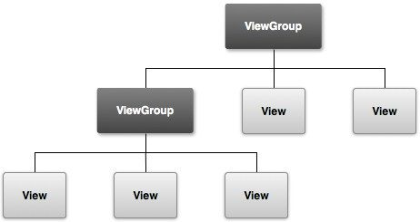
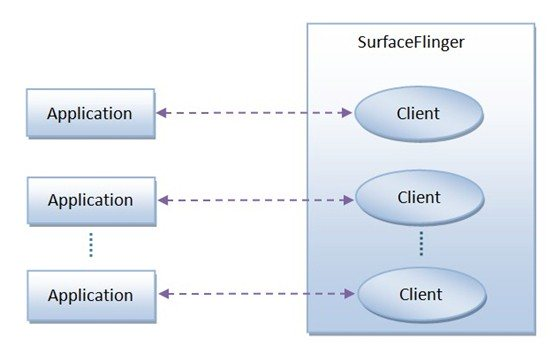
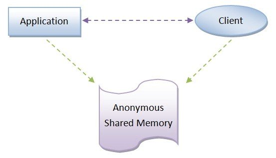
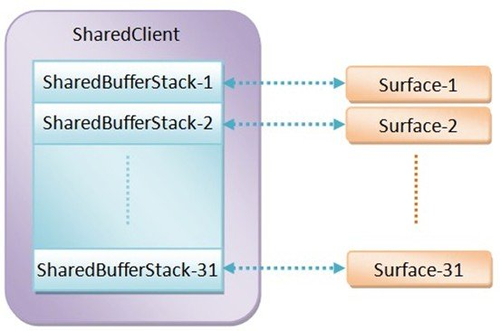
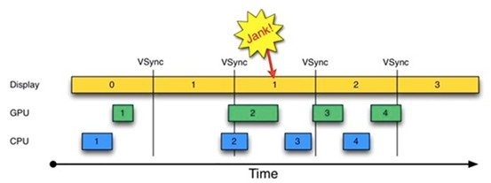
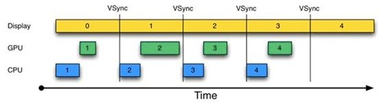
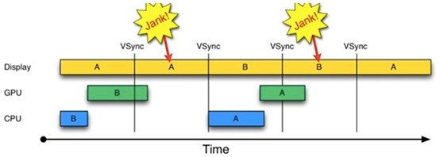
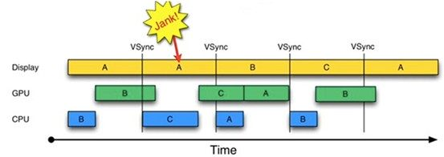

## 3.8 Android显示原理
Android应用程序的显示过程包含了两个部分（应用侧绘制、系统侧渲染）、两个机制（进程间通讯机制、显示刷新机制）。

Android的Gui系统是CS模型的窗口系统，即后台运行一个绘制服务（SurfaceFlinger），当客户端程序需要绘制屏幕时，首先请求服务端创建一个窗口，然后在该窗口绘制内容。对于每个客户端而言，它们都感觉自己独占了屏幕；对于服务端而言，它会给每个客户窗口分配一个不同的层值，并根据用户交互情况动态改变窗口的层值。

简单概括Android应用程序显示的过程：Android应用程序调用SurfaceFlinger服务把经过测量、布局和绘制后的Surface渲染到显示屏幕上。

#### 绘制相关类
* SurfaceFlinger：Android系统服务，负责管理Android系统的帧缓冲区，即显示屏幕。
* Surface：该类用于描述一个绘制平面，其内部包含了该平面的大小，在屏幕上的位置以及一段屏幕缓冲区内存。
* Canvas：该类是一个功能类，包含各种绘制函数，比如drawColor()、drawText()等。构造Canvas对象时，必须为其指定一段内存地址，绘制结果就是给这段内存填充不同的像素值。这段内存有两种类型，普通内存和屏幕缓冲区内存，后者绘制结果会呈现在屏幕上。

### 3.8.1 应用侧
一个Android应用程序窗口里面包含了很多UI元素，这些UI元素是以树形结构来组织的，即它们存在着父子关系，其中，子UI元素位于父UI元素里面，如下图：

Android应用程序窗口的UI渲染过程可以分为measure、layout和draw三个阶段：
* measure：递归（深度优先）确定所有视图的大小（高、宽）；
* layout：递归（深度优先）确定所有视图的位置（左上角坐标）；
* draw：在画布canvas上绘制应用程序窗口所有的视图。

这里简单说一下draw。Android目前有两种绘制模型：基于软件的绘制模型和硬件加速的绘制模型。

#### 基于软件的绘制模型
在基于软件的绘制模型下，CPU主导绘图，视图按照两个步骤绘制：首先让View层次结构失效；然后绘制View层次结构

当应用程序需要更新它的部分UI时，都会调用内容发生改变的View对象的invalidate()方法。invalidation请求会在View对象层次结构中传递，以便计算出需要重绘的屏幕区域（脏区）。然后，Android系统会在View层次结构中绘制所有的跟脏区相交的区域。不幸的是，这种方法有两个缺点：绘制了不需要重绘的视图（与脏区域相交的区域）。

注意：在View对象的属性发生变化时，如背景色或TextView对象中的文本等，Android系统会自动的调用该View对象的invalidate()方法。

#### 基于硬件的绘制模型
在基于硬件加速的绘制模式下，GPU主导绘图，绘制按照三个步骤绘制：让View层次结构失效；记录、更新显示列表；绘制显示列表

这种模式下，Android系统依然会使用invalidate()方法和draw()方法来请求屏幕更新和展现View对象。但Android系统并不是立即执行绘制命令，而是首先把这些View的绘制函数作为绘制指令记录一个显示列表中，然后再读取显示列表中的绘制指令调用OpenGL相关函数完成实际绘制。另一个优化是，Android系统只需要针对由invalidate()方法调用所标记的View对象的脏区进行记录和更新显示列表。没有失效的View对象则能重放先前显示列表记录的绘制指令来进行简单的重绘工作。使用显示列表的目的是，把视图的各种绘制函数翻译成绘制指令保存起来，对于没有发生改变的视图把原先保存的操作指令重新读取出来重放一次就可以了，提高了视图的显示速度。而对于需要重绘的View，则更新显示列表，以便下次重用，然后再调用OpenGL完成绘制。

硬件加速提高了Android系统显示和刷新的速度，它的缺点是：内存消耗和电量消耗。

### 3.8.2 系统侧
SurfaceFlinger服务负责管理Android系统的帧缓冲区，Android设备的屏幕就被当做是一个帧缓冲区，而SurfaceFlinger服务绘制界面就是通过向帧缓冲区输出内容来完成界面绘制的。SurfaceFlinger服务接收到Android应用程序窗口请求，然后创建了一个绘图表面，接着为该绘图表面创建图形缓冲区，接下来应用程序就会往这些准备好的图形缓冲区填充自己的UI数据，当填充完成之后，它就可以向SurfaceFlinger服务发送请求，请求将UI数据渲染到硬件帧缓冲区中去，最后的结果就是我们在屏幕上看到了应用程序窗口的UI。

### 3.8.3 进程间通讯机制
Android应用程序为了能够将自己的UI绘制在系统的帧缓冲区上，它们就必须要与SurfaceFlinger服务进行通信，如图所示：

通过上图我们可以看到，SurfaceFlinger服务和Android应用程序是一对一服务的，它们之间有一个连接，而这个连接是Binder对象来完成的。当应用程序与SurfaceFlinger服务建立连接的时候，Client对象被SurfaceFlinger服务创建的 ，当它们连接成功之后，Android应用程序就可以获得一个对应的Client对象的Binder接口，Android应用程序就可以用其来绘制自己的窗口界面了。 要想让SurfaceBinder来绘制自己的UI，Android应用程序需要将UI数据传递给SurfaceFlinger，包括绘制的区域以及位置信息等等。一个应用程序会有多个窗口，而每一个窗口都有自己的UI数据。Android系统提供了一种匿名共享内存机制，它以驱动程序的形式实现在内核空间中。它有两个特点，一是作为内存管理系统的辅助，来管理不再使用的内存块，二是它可以用来实现进程间的内存共享(详细的内容不再概述）。每一个应用程序与SurfaceFlinger服务会通过一块匿名共享内存来方便传递UI数据，如下图所示:

但是单纯的匿名共享内存在传递多个窗口数据时缺乏有效的管理，所以匿名共享内存就被抽象为一个更高层的数据结构SharedClient，如下图所示：

在每个SharedClient中，最多有31个SharedBufferStack，每个SharedBufferStack都对应一个Surface，即一个窗口。SharedBufferStack就是共享缓冲区堆栈，由Android应用程序和SurfaceFlinger程序共享，每一个SharedBufferStack就是一个缓冲区，只不过这个缓冲区需要按照一定规则进行访问。一个SharedClient对应一个Android应用程序，而一个Android应用程序可能包含有多个窗口，即Surface。从这里也可以看出，一个Android应用程序至多可以包含31个窗口。
每个SharedBufferStack中又包含了N个缓冲区（<4.1 N=2; >=4.1 N=3）,即显示刷新机制中即将提到的双缓冲和三重缓冲技术。

### 3.8.4 显示刷新机制
一般我们在绘制UI的时候，都会采用一种称为“双缓冲”的技术。双缓冲意味着要使用两个缓冲区（SharedBufferStack中），其中一个称为Front Buffer，另外一个称为Back Buffer。UI总是先在Back Buffer中绘制，然后再和Front Buffer交换，渲染到显示设备中。理想情况下，这样一个刷新会在16ms内完成（60FPS），下图就是描述的这样一个刷新过程（Display处理前Front Buffer，CPU、GPU处理Back Buffer）

但现实情况并非这么理想。
1. 时间从0开始，进入第一个16ms：Display显示第0帧，CPU处理完第一帧后，GPU紧接其后处理继续第一帧。三者互不干扰，一切正常。
2. 时间进入第二个16ms：因为早在上一个16ms时间内，第1帧已经由CPU，GPU处理完毕。故Display可以直接显示第1帧。显示没有问题。但在本16ms期间，CPU和GPU却并未及时去绘制第2帧数据（注意前面的空白区），而是在本周期
快结束时，CPU/GPU才去处理第2帧数据。
3. 时间进入第3个16ms，此时Display应该显示第2帧数据，但由于CPU和GPU还没有处理完第2帧数据，故Display只能继续显示第一帧的数据，结果使得第1帧多画了一次（对应时间段上标注了一个Jank）。
通过上述分析可知，此处发生Jank的关键问题在于，在第1个16ms段内，CPU/GPU没有及时处理第2帧数据。原因很简单，CPU可能是在忙别的事情，不知道该到处理UI绘制的时间了。可CPU一旦想起来要去处理第2帧数据，时间又错过了！
为解决这个问题，Android 4.1中引入了VSYNC，这类似于时钟中断。结果如下图所示：

由上图可知，每收到VSYNC中断，CPU就开始处理各帧数据。整个过程非常完美。不过，仔细琢磨后却会发现一个新问题：上图中，CPU和GPU处理数据的速度似乎都能在16ms内完成，而且还有时间空余，也就是说，CPU/GPU的FPS（帧率，Frames Per Second）要高于Display的FPS。确实如此。由于CPU/GPU只在收到VSYNC时才开始数据处理，故它们的FPS被拉低到与Display的FPS相同。但这种处理并没有什么问题，因为Android设备的Display FPS一般是60，其对应的显示效果非常平滑。
如果CPU/GPU的FPS小于Display的FPS，会是什么情况呢？请看下图：

由上图可知：
1. 在第二个16ms时间段，Display本应显示B帧，但却因为GPU还在处理B帧，导致A帧被重复显示。
2. 同理，在第二个16ms时间段内，CPU无所事事，因为A Buffer被Display在使用。B Buffer被GPU在使用。注意，一旦过了VSYNC时间点，CPU就不能被触发以处理绘制工作了。
为什么CPU不能在第二个16ms处开始绘制工作呢？原因就是只有两个Buffer（Android 4.1之前）。如果有第三个Buffer的存在，CPU就能直接使用它，而不至于空闲。出于这一思路就引出了三重缓冲区（Android 4.1）。结果如下图所示：

由上图可知：第二个16ms时间段，CPU使用C Buffer绘图。虽然还是会多显示A帧一次，但后续显示就比较顺畅了。
是不是Buffer越多越好呢？回答是否定的。由上图可知，在第二个时间段内，CPU绘制的第C帧数据要到第四个16ms才能显示，这比双Buffer情况多了16ms延迟。所以，Buffer最好还是两个，三个足矣。
