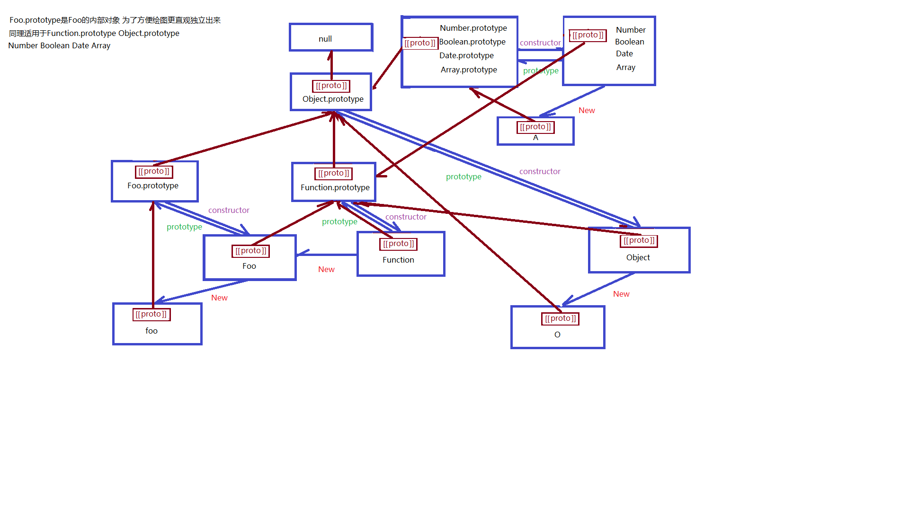
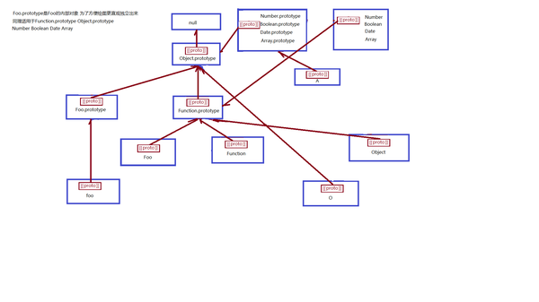

## 4.3 原型与原型链

### 4.3.1 对象创建
JavaScript是一门OO语言（也是一门函数式语言），但是它没有类和接口的概念。对象可以在代码执行过程中创建和增强，实际上是动态的、非严格定义的实体。创建对象的方式主要有以下几种：
1. constructor模式：可以创建自定义引用类型，可以像创建内置对象实例一样使用new操作符。但是，它的成员不能共享，包括函数。
2. prototype模式：使用构造函数的prototype属性来指定那些应该共享的属性和方法。
3. 一般组合使用constructor模式和prototype模式，使用constructor定义实例属性，使用prototype定义需要共享的属性和方法。代码如下所示：

```JavaScript
function Person(name, age, job) {
    this.name = name;
    this.age = age;
    this.job = job;
    this.friends = ['Jack', 'Bob'];
}

Person.prototype = {
    constructor: Person,
    sayName: function() {
        console.log(this.name);
    }
}
```
4. es6中加入了class关键字，普通成员是单独的，而函数是共享的。

### 4.3.2 继承
JavaScript主要通过原型链实现继承。具体使用有以下几种方式：
1. 原型链：原型链的构建是将超类的实例赋值给子类的构造函数的原型，这样子类就可以访问超类的所有属性和方法。但是它的问题是，子类实例共享所有继承的属性和方法。
2. 构造函数：子类构造函数内部调用超类构造函数，这样就可以做到每个实例都具有自己的属性。
3. 一般组合使用这两种模式：使用原型链继承共享的属性和方法，而通过借用构造函数继承实例属性。

```JavaScript
function Person(name, age) {
    this.name = name;
    this.age = age;
}
Person.prototype = {
    constructor: Person,
    sayName: function() {
        console.log(this.name);
    },
    sayAge: function() {
        console.log(this.age);
    }
}

function Student(name, age, grade) {
    Person.call(this, name, age);
    this.grade = grade;
}
Student.prototype = new Person();
Student.prototype.sayGrade = function() {
    console.log(this.grade);
}
```
#### 属性查找
这里有必要说明JavaScript的属性查找过程：当查找一个对象的属性时，JavaScript会向上遍历原型链，直到找到给定名称的属性为止（一旦找到，就返回第一个找到的属性和方法），或者到查找到达原型链的顶部，即Object.prototype，如果仍然没有找到指定的属性，就会返回undefined。

### 4.3.3 总结
1. JS中一切皆是对象，function和prototype也是对象，而function对象特殊在它拥有一个属性prototype。
2. 只要是对象，它就有一个隐式属性_proto_（可以认为它代表该对象的类型），指向其构造函数的prototype；同样prototype也是对象，它同样拥有这个隐式属性_proto_，同样指向其构造函数的prototype（回想一下原型链继承方式：SubType.prototype = new SuperType()）。而Object.prototype是null，因为Object就是顶层类，而一切引用类型都默认继承自Object类型。
3. function也是对象，它同样也拥有这个隐式属性_proto_，它同样也指向其构造函数的prototype，即Function.prototype。

具体如下图所示：



这个图有点复杂，其中褐色单向箭头链就是Javascript的原型链。如果只看原型链的话：


