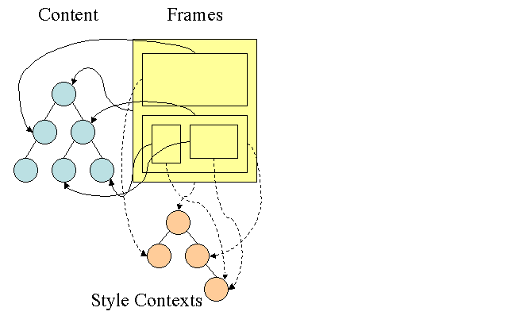

## 5.3 浏览器详解三呈现树

### 5.3.1 呈现树简介
在DOM树构建的同时，浏览器还会构建另一个树结构：呈现树，这是由可视化元素按照其显示顺序而组成的树，即文档的可视化表示。它的作用是让您按照正确的顺序绘制内容。WebKit将呈现树中的元素称为呈现器或呈现对象，呈现器知道如何进行布局并将自身及其子元素绘制出来。
WebKit中RenderObject类是所有呈现器的基类，其定义如下：
```c++
class RenderObject {
  virtual void layout();
  virtual void paint(PaintInfo);
  virtual void rect repaintRect();
  Node* node;  //the DOM node
  RenderStyle* style;  // the computed style
  RenderLayer* containgLayer; //the containing z-index layer
};
```
每一个呈现器都代表了一个矩形的区域，通常对应于相关节点的CSS框，它包含诸如宽度、高度和位置等几何信息。框的类型会受到与节点相关的“display”样式属性的影响（请参阅样式计算章节）。元素类型也是考虑因素之一，例如表单控件和表格都对应特殊的框架。

### 5.3.2 呈现树和DOM树的关系
呈现器是和DOM元素相对应的，但并非一一对应。非可视化的DOM元素不会插入呈现树中，例如“head”元素，如果元素的display属性值为“none”，那么也不会显示在呈现树中（但是visibility属性值为“hidden”的元素会显示在呈现树中）。而有一些DOM元素对应多个可视化对象，它们往往是具有复杂结构的元素，无法用单一的矩形来描述。例如，“select”元素有3个呈现器：一个用于显示区域，一个用于下拉列表框，还有一个用于按钮。如果由于宽度不够，文本无法在一行中显示而分为多行，那么新的行也会作为新的呈现器而添加。
有一些呈现对象对应于DOM节点，但在树中所在的位置与DOM节点不同。浮动定位和绝对定位的元素就是这样，它们处于正常的流程之外，放置在树中的其他地方，并映射到真正的框架，而放在原位的是占位框架。
下图所示，呈现树及其对应的DOM树，初始容器block为“viewport”，而在WebKit中则为“RenderView”对象。


#### 构建呈现树的流程
在WebKit中，解析样式和创建呈现器的过程称为“附加”，每个DOM节点都有一个“attach”方法。附加是同步进行的，将节点插入DOM树需要调用新的节点“attach”方法。处理html和body标记就会构建呈现树根节点，这个根节点呈现对象对应于CSS规范中所说的容器block，这是最顶层的block，包含了其他所有block，它的尺寸就是浏览器窗口显示区域的尺寸。呈现树的其余部分以DOM树节点插入的形式来构建。具体过程可以参阅[关于处理模型的CSS2规范](http://www.w3.org/TR/CSS21/intro.html#processing-model)。

### 5.3.3 样式计算
构建呈现树时，需要计算每一个呈现对象的可视化属性，这是通过计算每个元素的样式属性来完成的。样式包括来自各种来源的样式表、inline样式元素和HTML中的可视化属性（例如“bgcolor”属性），其中后者将经过转化以匹配CSS样式属性。而样式表的来源包括浏览器的默认样式表、由网页作者提供的样式表以及由浏览器用户提供的用户样式表。

样式计算存在以下难点：
1. 样式数据是一个超大的结构，存储了无数的样式属性，这可能造成内存问题。
2. 如果不进行优化，为每一个元素查找匹配的规则会造成性能问题。要为每一个元素遍历整个规则列表来寻找匹配规则，这是一项浩大的工程。选择器会具有很复杂的结构，这就会导致匹配过程非常负责
那么浏览器是如何处理这些问题的：

#### 共享样式数据
WebKit节点会引用样式对象（RenderStyle），这些对象在某些情况下可以由不同节点共享，这些节点是同级关系，并且：
1. 这些元素必须处于相同的鼠标状态（例如，不允许其中一个是“:hover”状态，而另一个不是）
2. 任何元素都没有ID
3. 标记名称应匹配
4. 类属性应匹配
5. 映射属性的集合必须是完全相同的
6. 链接状态必须匹配
7. 焦点状态必须匹配
8. 任何元素都不应受属性选择器的影响，这里所说的“影响”是指在选择器中的任何位置有任何使用了属性选择器的选择器匹配
9. 元素中不能有任何inline样式属性
9. 不能使用任何同级选择器。WebCore在遇到任何同级选择器时，只会引发一个全局开关，并停用整个文档的样式共享（如果存在）。这包括“＋”选择器以及“:first-child”和“:last-child”等选择器。

#### Firefox规则树
为了简化样式计算，Firefox还采用了另外两种树：规则树和样式上下文树。WebKit也有样式对象，但它们不是保存在类似样式上下文树这样的树结构中，只是由DOM节点指向此类对象的相关样式。



样式上下文包含端值，要计算出这些值，应按照正确顺序应用所有的匹配规则，并将其从逻辑值转化为具体的值。例如，如果逻辑值是屏幕大小的百分比，则需要换算成绝对的单位。规则树的点子真的很巧妙，它使得节点之间可以共享这些值，以避免重复计算，还可以节约空间。所有匹配的规则都存储在树中。路径中的底层节点拥有较高的优先级。规则树包含了所有已知规则匹配的路径。规则的存储是延迟进行的。规则树不会在开始的时候就为所有的节点进行计算，而是只有当某个节点样式需要进行计算时，才会向规则树添加计算的路径。这个想法相当于将规则树路径视为词典中的单词。

如果我们已经计算出如下的规则树：

假设我们需要为内容树中的另一个元素匹配规则，并且找到匹配路径是 B - E - I（按照此顺序）。由于我们在树中已经计算出了路径 A - B - E - I - L，因此就已经有了此路径，这就减少了现在所需的工作量。

让我们看看规则树如何帮助我们减少工作。
1. 结构划分
样式上下文可分割成多个结构。这些结构体包含了特定类别（如border或color）的样式信息。结构中的属性都是继承的或非继承的。继承属性如果未由元素定义，则继承自其父代。非继承属性（也称为“重置”属性）如果未进行定义，则使用默认值。规则树通过缓存整个结构（包含计算出的端值）为我们提供帮助。这一想法假定底层节点没有提供结构的定义，则可使用上层节点中的缓存结构。
2. 使用规则树计算样式上下文
在计算某个特定元素的样式上下文时，我们首先计算规则树中的对应路径，或者使用现有的路径。然后我们沿此路径应用规则，在新的样式上下文中填充结构。我们从路径中拥有最高优先级的底层节点（通常也是最特殊的选择器）开始，并向上遍历规则树，直到结构填充完毕。如果该规则节点对于此结构没有任何规范，那么我们可以实现更好的优化：寻找路径更上层的节点，找到后指定完整的规范并指向相关节点即可。这是最好的优化方法，因为整个结构都能共享。这可以减少端值的计算量并节约内存。如果我们找到了部分定义，就会向上遍历规则树，直到结构填充完毕。如果我们找不到结构的任何定义，那么假如该结构是“继承”类型，我们会在上下文树中指向父代的结构，这样也可以共享结构。如果是reset类型的结构，则会使用默认值。如果最特殊的节点确实添加了值，那么我们需要另外进行一些计算，以便将这些值转化成实际值。然后我们将结果缓存在树节点中，供子代使用。如果某个元素与其同级元素都指向同一个树节点，那么它们就可以共享整个样式上下文。
让我们来看一个例子，假设我们有如下 HTML 代码：
```html
<html>
  <body>
    <div class="err" id="div1">
      <p>
        this is a <span class="big"> big error </span>
        this is also a
        <span class="big"> very  big  error</span> error
      </p>
    </div>
    <div class="err" id="div2">another error</div>
  </body>
</html>
```
还有如下规则：
```css
div {margin:5px;color:black}
.err {color:red}
.big {margin-top:3px}
div span {margin-bottom:4px}
#div1 {color:blue}
#div2 {color:green}
```
为了简便起见，我们只需要填充两个结构：color结构和margin结构。color结构只包含一个成员（即“color”），而margin结构包含四条边。形成的规则树如下图所示（节点的标记方式为“节点名 : 指向的规则序号”）：


上下文树如下图所示（节点名 : 指向的规则节点）：


假设我们解析HTML时遇到了第二个div标记，我们需要为此节点创建样式上下文，并填充其样式结构。经过规则匹配，我们发现该<div>的匹配规则是第1、2和6条。这意味着规则树中已有一条路径可供我们的元素使用，我们只需要再为其添加一个节点以匹配第6条规则（规则树中的F节点）。我们将创建样式上下文并将其放入上下文树中。新的样式上下文将指向规则树中的F节点。现在我们需要填充样式结构。首先要填充的是margin结构。由于最后的规则节点F并没有添加到margin结构，我们需要上溯规则树，直至找到在先前节点插入中计算过的缓存结构，然后使用该结构。我们会在指定margin规则的最上层节点（即B节点）上找到该结构。我们已经有了color结构的定义，因此不能使用缓存的结构。由于color有一个属性，我们无需上溯规则树以填充其他属性。我们将计算端值（将字符串转化为RGB等）并在此节点上缓存经过计算的结构。

第二个span元素处理起来更加简单。我们将匹配规则，最终发现它和之前的span一样指向规则G。由于我们找到了指向同一节点的同级，就可以共享整个样式上下文了，只需指向之前span的上下文即可。
对于包含了继承自父代的规则的结构，缓存是在上下文树中进行的（事实上color属性是继承的，但是Firefox将其视为reset属性，并缓存到规则树上）。
例如，如果我们在某个段落中添加font规则：
```css
p {font-family:Verdana;font size:10px;font-weight:bold}
```
那么，该段落元素作为上下文树中的div的子代，就会共享与其父代相同的font结构（前提是该段落没有指定font规则）。
在WebKit中没有规则树，因此会对匹配的声明遍历4次。首先应用非重要高优先级的属性（由于作为其他属性的依据而应首先应用的属性，例如display），接着是高优先级重要规则，然后是普通优先级非重要规则，最后是普通优先级重要规则。这意味着多次出现的属性会根据正确的层叠顺序进行解析。最后出现的最终生效。
因此概括来说，共享样式对象（整个对象或者对象中的部分结构）可以解决问题1和问题3。Firefox规则树还有助于按照正确的顺序应用属性。

#### 对规则进行处理以简化匹配
样式规则有一些来源，如下所示：
1. 外部样式表或样式元素中的CSS规则
```css
p {color:blue}
```
2. inline样式属性及类似内容
```html
<p style="color:blue" />
```
3. HTML可视化属性（映射到相关的样式规则）
```html
<p bgcolor="blue" />
```
后两种很容易和元素进行匹配，因为元素拥有样式属性，而且HTML属性可以使用元素作为键值进行映射。但是第一个CSS规则匹配可能比较棘手。为了解决这一难题，可以对CSS规则进行一些处理，以便访问。样式表解析完毕后，系统会根据选择器将CSS规则添加到某个哈希表中。这些哈希表的选择器各不相同，包括ID、类名称、标记名称等，还有一种通用哈希表，适合不属于上述类别的规则。如果选择器是ID，规则就会添加到ID表中；如果选择器是类，规则就会添加到类表中，依此类推。这种处理可以大大简化规则匹配，我们无需查看每一条声明，只要从哈希表中提取元素的相关规则即可。我们以如下的样式规则为例：
```css
p.error {color:red}
#messageDiv {height:50px}
div {margin:5px}
```
第一条规则将插入类表，第二条将插入ID表，而第三条将插入标记表。
对于下面的HTML代码段：
```html
<p class="error">an error occurred </p>
<div id="messageDiv">this is a message</div>
```
我们首先会为p元素寻找匹配的规则。类表中有一个“error”键，在下面可以找到“p.error”的规则。div元素在ID表（键为ID）和标记表中有相关的规则。剩下的工作就是找出哪些根据键提取的规则是真正匹配的了。
例如，如果div的对应规则如下：
```css
table div {margin:5px}
```
这条规则仍然会从标记表中提取出来，因为键是最右边的选择器，但这条规则并不匹配我们的div元素，因为div没有table祖先。

#### 样式表层叠顺序应用规则
样式对象具有与每个可视化属性一一对应的属性（均为CSS属性但更为通用）。如果某个属性未由任何匹配规则所定义，那么部分属性就可由父代元素样式对象继承，其他属性具有默认值。如果定义不止一个，就需要通过层叠顺序来解决。
1. 样式表层叠顺序
某个样式属性的声明可能会出现在多个样式表中，也可能在同一个样式表中出现多次。这意味着应用规则的顺序极为重要。这称为“层叠”顺序。根据CSS2规范，层叠的顺序为（优先级从低到高）：浏览器声明->用户普通声明->作者普通声明->作者重要声明->用户重要声明。浏览器声明是重要程度最低的，而用户只有将该声明标记为“重要”才可以替换网页作者的声明。同样顺序的声明会根据特异性进行排序，然后再是其指定顺序。HTML可视化属性会转换成匹配的 CSS声明。它们被视为低优先级的网页作者规则。

2. 特异性
选择器的特异性由CSS2规范定义如下：
如果声明来自于“style”属性，而不是带有选择器的规则，则记为1，否则记为0 (= a)
记为选择器中ID属性的个数 (= b)
记为选择器中其他属性和伪类的个数 (= c)
记为选择器中元素名称和伪元素的个数 (= d)
将四个数字按 a-b-c-d 这样连接起来（位于大数进制的数字系统中），构成特异性。如下示例：
```css
 *             {}  /* a=0 b=0 c=0 d=0 -> specificity = 0,0,0,0 */
 li            {}  /* a=0 b=0 c=0 d=1 -> specificity = 0,0,0,1 */
 li:first-line {}  /* a=0 b=0 c=0 d=2 -> specificity = 0,0,0,2 */
 ul li         {}  /* a=0 b=0 c=0 d=2 -> specificity = 0,0,0,2 */
 ul ol+li      {}  /* a=0 b=0 c=0 d=3 -> specificity = 0,0,0,3 */
 h1 + *[rel=up]{}  /* a=0 b=0 c=1 d=1 -> specificity = 0,0,1,1 */
 ul ol li.red  {}  /* a=0 b=0 c=1 d=3 -> specificity = 0,0,1,3 */
 li.red.level  {}  /* a=0 b=0 c=2 d=1 -> specificity = 0,0,2,1 */
 #x34y         {}  /* a=0 b=1 c=0 d=0 -> specificity = 0,1,0,0 */
 style=""          /* a=1 b=0 c=0 d=0 -> specificity = 1,0,0,0 */
```
3. 规则排序
找到匹配的规则之后，应根据级联顺序将其排序。WebKit对于较小的列表会使用冒泡排序，而对较大的列表则使用归并排序。对于以下规则，WebKit通过替换“>”运算符来实现排序：
```c++
static bool operator >(CSSRuleData& r1, CSSRuleData& r2){
    int spec1 = r1.selector()->specificity();
    int spec2 = r2.selector()->specificity();
    return (spec1 == spec2) : r1.position() > r2.position() : spec1 > spec2;
}
```

### 5.3.4 渐进式处理
WebKit使用一个标记来表示是否所有的顶级样式表（包括@imports）均已加载完毕。如果在附加过程中尚未完全加载样式，则使用占位符，并在文档中进行标注，等样式表加载完毕后再重新计算。
