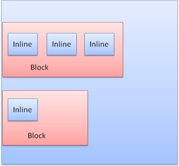
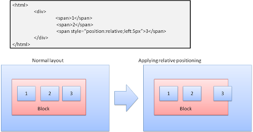

## 5.4 浏览器详解四布局、绘制和CSS可视化模型

### 5.4.1 布局
呈现器在创建完成并添加到呈现树时，并不包含位置和大小信息，计算这些值的过程称为布局。

HTML采用基于流的布局模型，这意味着大多数情况下只要一次遍历就能计算出几何信息。处于流中靠后位置元素通常不会影响靠前位置元素的几何特征，因此布局可以按从左至右、从上至下的顺序遍历文档。但是也有例外情况，比如HTML表格的计算就需要不止一次的遍历。
坐标系是相对于根框架而建立的，使用的是上坐标和左坐标。根呈现器的位置左边是（0,0），其尺寸为视口（也就是浏览器窗口的可见区域）。
布局是一个递归的过程，它从根呈现器（对应于HTML文档的<html>元素）开始，然后递归遍历部分或所有的框架层次结构，为每一个需要计算的呈现器计算几何信息。所有的呈现器都有一个“layout”或者“reflow”方法，每一个呈现器都会调用其需要进行布局的子代的layout方法。

#### Dirty位系统
为避免对所有细小更改都进行整体布局，浏览器采用了一种“dirty位”系统。如果某个呈现器发生了更改，或者将自身及其子代标注为“dirty”，则需要进行布局。有两种标记：“dirty”和“children are dirty”。“children are dirty”表示尽管呈现器自身没有变化，但它至少有一个子代需要布局。

#### 布局分类
布局由如下几种方式：
全局布局是指触发了整个呈现树范围的布局。全局布局一般是同步出发的。
增量布局是只对dirty呈现器进行布局（这样可能会需要进行额外布局的），当呈现器为dirty时，会异步触发增量布局。增量布局一般是异步执行的：Firefox将增量布局的“reflow命令”加入队列，而调度程序会触发这些命令的批量执行。WebKit有用于执行增量布局的计时器：对呈现树进行遍历，并对dirty呈现器进行布局。但是请求样式信息（例如“offsetHeight”）的脚本可同步触发增量布局。

#### 布局流程
1. 父呈现器确定自己的宽度。
2. 父呈现器依次处理子呈现器，并且：放置子呈现器（设置x,y坐标）;如果有必要，调用子呈现器的布局（子呈现器是dirty的，或者这是全局布局），这会计算子呈现器的高度。
3. 父呈现器根据子呈现器的累加高度以及边距和补白的高度来设置自身高度，此值也可供父呈现器的父呈现器使用。
4. 将其dirty位设置为false。

#### 宽度计算
呈现器宽度是根据容器块的宽度、呈现器样式中的“width”属性以及边距和边框计算得出的。例如以下div的宽度：
```html
<div style="width:30%"/>
```
WebKit中将进行如下计算（BenderBox类，calcWidth方法）：
1. 容器的宽度取容器的availableWidth和0中的较大值。availableWidth在本例中相当于contentWidth，计算公式：clientWidth() - paddingLeft() - paddingRight()，其中clientWidth和clientHeight表示一个对象的内部宽高（除去边框和滚动条）。
2. 元素的宽度是“width”样式属性。它会根据容器宽度的百分比计算得出一个绝对值。
3. 然后加上水平方向的边框和补白。
现在计算得出的是“preferred width”。然后需要计算最小宽度和最大宽度。如果首选宽度大于最大宽度，那么应使用最大宽度。如果首选宽度小于最小宽度（最小的不可破开单位），那么应使用最小宽度。
这些值会缓存起来，以用于需要布局而宽度不变的情况。

#### 换行
如果呈现器在布局过程中需要换行，会立即停止布局，并告知其父代需要换行。父代会创建额外的呈现器，并对其调用布局。

#### 优化
如果布局是由“大小调整”或呈现器的位置（而非大小）改变而触发的，那么可以从缓存中获取呈现器的大小，而无需重新计算。在某些情况下，只有一个子树进行了修改，因此无需从根节点开始布局。这适用于在本地进行更改而不影响周围元素的情况，例如在文本字段中插入文本（否则每次键盘输入都将触发从根节点开始的布局）。

### 5.4.2 绘制
在绘制阶段，系统会遍历呈现树，并调用呈现器的“paint”方法，将呈现器的内容显示在屏幕上。

#### 绘制分类
和布局一样，绘制也分为全局（绘制整个呈现树）和增量两种。在增量绘制中，部分呈现器发生了更改，但是不会影响整个树。更改后的呈现器将其在屏幕上对应的矩形区域设为无效，这导致OS将其视为一块“dirty 区域”，并生成“paint”事件，OS会很巧妙地将多个区域合并成一个。在Chrome中，情况要更复杂一些，因为Chrome的呈现器不在主进程上。Chrome会在某种程度上模拟OS的行为，展示层会侦听这些事件，并将消息委托给呈现根节点，然后遍历呈现树，直到找到相关的呈现器，该呈现器会重新绘制自己（通常也包括其子代）。

#### 绘制流程
CSS规范定义了绘制流程的顺序，绘制顺序其实就是元素进入堆栈样式上下文的顺序，这些堆栈会从后往前绘制。块呈现器的堆栈顺序：背景颜色->背景图片->边框->子代->轮廓

#### 优化
1. 动态变化 在发生变化时，浏览器会尽可能做出最小的响应。例如：元素的颜色改变后，只会对该元素进行重绘。元素的位置改变后，只会对该元素及其子元素（可能还有同级元素）进行布局和重绘。添加DOM节点后，会对该节点进行布局和重绘。一些重大变化（例如增大“html”元素的字体）会导致缓存无效，使得整个呈现树都会进行重新布局和绘制。
2. Firefox显示列表
Firefox遍历整个呈现树，为绘制的矩形建立一个显示列表。列表中按照正确的绘制顺序（先是呈现器的背景，然后是边框等等）包含了与矩形相关的呈现器。这样等到重新绘制的时候，只需遍历一次呈现树，而不用多次遍历（绘制所有背景，然后绘制所有图片，再绘制所有边框等等）。Firefox对此过程进行了优化，不添加隐藏的元素，例如被不透明元素完全遮挡住的元素。
3. WebKit矩形存储
在重新绘制之前，WebKit会将原来的矩形另存为一张位图，然后只绘制新旧矩形之间的差异部分。

### 5.4.3 CSS2可视化模型
#### 画布

根据CSS规范，“画布”这一术语是指“用来呈现格式化结构的空间”，也就是供浏览器绘制内容的区域。画布的空间尺寸大小是无限的，但是浏览器会根据视口的尺寸选择一个初始宽度。画布如果包含在其他画布内，就是透明的；否则会由浏览器指定一种颜色。

#### CSS框模型
CSS框模型描述的是针对文档树中的元素而生成，并根据可视化格式模型进行布局的矩形框。每个框都有一个内容区域（例如文本、图片等），还有可选的周围补白、边框和边距区域。如下图所示


每一个节点都会生成0...n个这样的框，所有元素都有一个“display”属性，决定了它们所对应生成的框类型：block，inline或者none，默认值是inline，但是浏览器样式表设置了其他默认值。例如，“div”元素的display 属性默认值是block。

#### 定位方案
定位方案有三种：
1. 普通：根据对象在文档中的位置进行定位，也就是说对象在呈现树中的位置和它在DOM树中的位置相似，并根据其框类型和尺寸进行布局。
2. 浮动：对象先按照普通流进行布局，然后尽可能地向左或向右移动。
3. 绝对：对象在呈现树中的位置和它在DOM树中的位置不同。
定位方案是由“position”属性和“float”属性设置的。如果值是static和relative，就是普通流；如果值是absolute和fixed，就是绝对定位。static定位无需定义位置，而是使用默认定位。对于其他方案，需要指定位置：top、bottom、left、right。

#### 框布局
框的布局方式是由以下因素决定的：框类型，框尺寸，定位方案，外部信息，例如图片大小和屏幕大小。
1. 框类型
block框：形成一个block，在浏览器窗口中拥有其自己的矩形区域。
inline框：没有自己的block，但是位于容器block内。
block采用的是一个接一个的垂直格式，而inline采用的是水平格式。如下图所示：



inline框放置在行中或“行框”中，这些行至少和最高的框一样高，还可以更高，当框根据“底线”对齐时，这意味着元素的底部需要根据其他框中非底部的位置对齐。如果容器的宽度不够，inline元素就会分为多行放置。在段落中经常发生这种情况。

2. 定位
相对定位：先按照普通方式定位，然后根据所需偏移量进行移动。



浮动：浮动框会移动到行的左边或右边，其他框会浮动在它的周围。例如下面这段HTML代码：
```html
<p>
  
  Lorem ipsum dolor sit amet, consectetuer...
</p>
```
显示效果如下：


绝对定位和固定定位：这种布局是准确定义的，与普通流无关。元素不参与普通流。尺寸是相对于容器而言的。在固定定位中，容器就是可视区域。需要注意的是，即使在文档滚动，固定框也不会移动。

#### 分层展示
这是由z-index属性指定的，它代表了框的第三个维度，也就是沿“z轴”方向的位置。这些框分散到多个堆栈（称为堆栈上下文）中，在每一个堆栈中，会首先绘制后面的元素，然后在顶部绘制前面的元素，以便更靠近用户。如果出现重叠，新绘制的元素就会覆盖之前的元素。堆栈是按照z-index属性进行排序的，具有“z-index”属性的框形成了本地堆栈，窗口具有外部堆栈。
