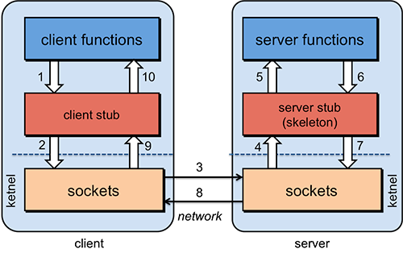

## 6.3 RPC详解
RPC和IPC本身是很接近的，可以对比RMI与Android Binder IPC，差别只在于数据传输方式：RPC基本是网络I/O，而IPC是本地I/O。

### 6.3.1 RPC基本知识
RPC就是从一台主机A上通过参数传递的方式调用另一台主机B上的一个方法（可以统称为服务）并得到返回的结果，其隐藏了底层的通讯细节（不需要直接处理Socket通讯或Http通讯）。RPC是一个请求响应模型：客户端发起请求，服务器返回响应（类似于Http的工作方式），其在使用形式上像调用本地方法一样去调用远程的方法。

由于不在一个内存空间，不能直接调用，需要通过网络来表达调用的语义和传达调用的数据。比如说，一个方法可能是这样定义的：Employee getEmployeeByName(String fullName)，完成一个RPC过程需要考虑以下几个问题：
1. 要解决通讯的问题，主要是通过在Client和Server之间建立TCP连接，远程过程调用的所有交换的数据都在这个连接里传输。连接可以是按需连接，调用结束后就断掉；也可以是长连接，多个远程过程调用共享同一个连接。
2. 要解决寻址的问题，即Client的上层应用需要告诉底层的RPC框架，如何连接到Server端（IP地址以及端口号），这样才能完成调用。比如基于Web服务协议栈的RPC，就要提供一个endpoint URI。如果是RMI调用的话，需要一个RMI Registry来注册服务的地址。
3. 当Client的应用发起远程过程调用时，方法和方法的参数需要通过底层的网络协议传递到Server，由于网络协议是基于二进制的，内存中的参数的值要序列化成二进制的形式，通过寻址和传输将序列化的二进制数据发送给Server。
4. Server收到请求后，需要对参数进行反序列化，恢复为内存中的表达方式，然后调用对应的方法，并将返回值发送回Client上的应用，这时还要经过序列化的方式发送，Client接到返回值后，再反序列化，恢复为内存中的表达方式。

RPC的协议有很多，比如最早的CORBA、Java RMI、Android Binder（它是一个RPC风格的IPC）、Web Service的RPC风格。

### 6.3.2 序列化与反序列化
序列化和反序列化是这类分布式系统的一个非常重要的环节，一般典型的序列化和反序列化过程往往需要如下组件：
1. IDL文件：参与通讯的各方需要对通讯的内容需要做相关的约定。为了建立一个与语言和平台无关的约定，这个约定需要采用与语言、平台无关的语言来进行描述。这种语言被称为接口描述语言（IDL），采用IDL撰写的协议约定称之为IDL文件。
2. IDLCompiler：IDL文件中约定的内容为了在各语言和平台可见，需要有一个编译器，将IDL文件转换成各语言对应的动态库。
3. Proxy/Stub Lib：负责序列化和反序列化的工作代码。Proxy是一段部署在分布式系统客户端的代码，一方面接收应用层的参数，并对其序列化后通过底层协议栈发送到服务端，另一方面接收服务端序列化后的结果数据，反序列化后交给客户端应用层；Stub部署在服务端，从传输层接收序列化参数，反序列化后交给服务端应用层，并将应用层的执行结果序列化后最终传送给客户端Proxy。
4. Client/Server：指的是应用层程序代码，他们面对的是IDL所生存的特定语言的class或struct。
5. 底层协议栈和网络：序列化之后的数据通过底层的网络进行传递。

几种当下比较流行的序列化协议，包括XML、JSON、Protobuf、Thrift和Avro。

#### XML-RPC：
使用XML将调用函数和参数封装，其典型代表是SOAP协议。SOAP主要用于WebService，一般使用HTTP作为传输层。SOAP协议的接口描述语言（IDL）是WSDL（Web Service Description Language）。

自我描述与递归：SOAP是一种采用XML进行序列化和反序列化的协议，它的IDL是WSDL. 而WSDL的描述文件是XSD，而XSD自身是一种XML文件。这里产生了一种有趣的在数学上称之为“递归”的问题，这种现象往往发生在一些具有自我属性（Self-description）的事物上。

#### JSON
起源于弱类型语言JavaScript，它的产生来自于一种称之为"Associative array"的概念，其本质就是采用"Attribute－value"的方式来描述对象。实际上在JavaScript和PHP等弱类型语言中，类的描述方式就是Associative array。采用JSON进行序列化不需要IDL，主要原因如下：IDL的目的是完成序列化和反序列化，在JSON中由于Associative array和一般语言里面的class很像，他们之间形成了一一对应关系，这就使得我们可以采用一套标准的代码进行相应的转化。对于自身支持Associative array的弱类型语言PHP和JavaScript，语言自身就具备操作JSON序列化后的数据的能力；对于Java这类强类型语言，可以采用反射的方式统一解决，例如Google提供的Gson。
