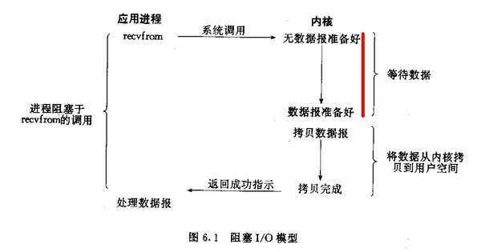
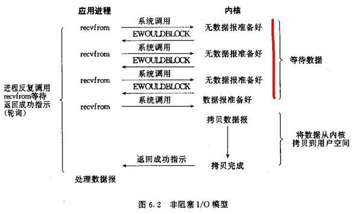
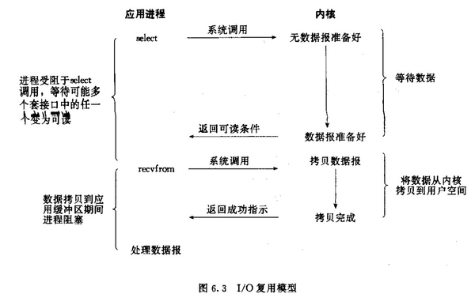
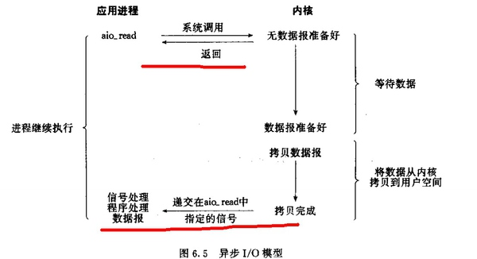
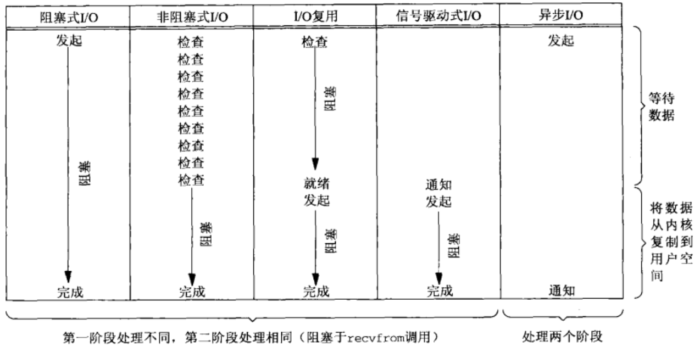

## 6.4 IO模型详解

### 6.4.1 IO模型
在《UNIX网络编程：卷一》第六章IO复用第二节中提及了5种IO模型：

#### 阻塞式IO；
阻塞式IO模型：默认情况下，所有套接字都是阻塞的。对于一个套接字上的输入操作一般分为两步：第一步是等待数据从网络中到达，当有分组到达时，它被复制到内核缓冲区；第二步是把数据从内核缓冲区复制到应用程序缓冲区。接下来我们阻塞套接字的recvfrom的的操作如何进程：



标红的这部分过程就是阻塞，直到阻塞结束，recvfrom才能返回。

#### 非阻塞式IO；
非阻塞式IO：进程把一个套接字设置成非阻塞是在告诉内核，当数据还没有准备好时，不要阻塞该进程，而是返回一个错误。看看非阻塞的套接字的recvfrom操作如何进行：



可以看出当数据没有准备好时，recvfrom总是立即返回。

#### IO复用（select、epoll）；
IO多路复用：虽然IO多路复用的函数也是阻塞的，但是和阻塞IO是不同的，IO多路复用是阻塞在select、epoll这样的系统调用之上，而没有阻塞在真正的IO系统调用recvfrom之上。如下图所示：



#### 信号驱动式IO（SIGIO）；
信号驱动式IO：用的很少，就不做讲解了。

#### 异步IO（POSIX的aio_系列函数）；
异步IO：这类函数的工作机制是告知内核启动某个操作，并让内核在整个操作（包括将数据从内核拷贝到用户空间）完成后通知我们。如图：



注意红线标记处说明在调用时就可以立马返回，等函数操作完成会通知我们。

#### 同步异步
前四种IO模型都是同步IO操作，他们的区别在于第一阶段，而他们的第二阶段是一样的：同步地将数据从内核复制到应用缓冲区。



POSIX把这两个术语定义如下：
* 同步IO操作：IO操作导致请求进程阻塞，直到IO操作完成。
* 异步IO操作：IO操作不导致请求进程阻塞。

根据上述定义，前4种IO模型--阻塞式IO模型、非阻塞式IO模型、IO复用模型和信号驱动式IO模型都是同步IO模型，因为其中真正的IO操作（recvfrom）将阻塞进程。只有异步IO模型和POSIX定义的异步IO相匹配。

#### 总结
接下来简单总结一下阻塞，非阻塞，同步，异步。

阻塞与非阻塞：阻塞调用是指调用结果返回之前，当前线程会被挂起，函数只有在得到结果之后才会返回。非阻塞和阻塞的概念相对应，指在不能立刻得到结果之前，该函数立刻返回。

同步与异步：所谓同步，就是在发出一个功能调用时，在没有得到结果之前，该调用就不返回。异步的概念和同步相对，当一个异步过程调用发出后，调用者立刻返回，实际处理这个调用的部件在完成后，通过状态、通知或者回调来通知调用者。例如Ajax请求（异步）：请求通过事件触发->服务器处理（这是浏览器仍然可以作其他事情）->处理完毕。

一个IO操作其实分成了两个步骤：发起IO请求（等待数据）和实际的IO操作（将数据从内核空间拷贝到用户空间）。阻塞IO和非阻塞IO的区别在于第一步，发起IO请求是否会被阻塞，如果阻塞直到完成那么就是传统的阻塞IO，如果不阻塞，那么就是非阻塞IO。同步IO和异步IO的区别就在于第二个步骤是否阻塞，如果实际的IO读写阻塞请求进程，那么就是同步IO，因此阻塞IO、非阻塞IO、IO复用、信号驱动IO都是同步IO，如果不阻塞，而是操作系统帮你做完IO操作再将结果返回给你，那么就是异步IO。

而Linux下由于AIO的一些问题，导致Linux下并没有真正的异步IO，实际上使用较多的是epoll，接下来我们会详细讲解epoll机制。

### 6.4.2 epoll详解
典型的IO操作一般包括以下两种：从IO流中read数据以及向IO流中写入数据。现在假定一个情形，我们需要从流中读数据，但是流中还没有数据（比如客户端要从socket读数据，但是服务器还没有把数据传回来），这时候该怎么办？根据上文可知，有五种IO模式可供选择，这里不考虑信号驱动式IO以及异步IO，那么还剩下三种IO模式：阻塞式IO，非阻塞式IO以及IO复用。

#### 缓冲区
为了了解阻塞是如何进行的，我们首先看一下缓冲区的概念，缓冲区的引入是为了减少频繁的IO操作（按照维基百科的解释，是“在数据传输时，在内存里开辟的一块临时保存数据的区域”，它可以解决数据传输的速率不匹配的问题）。一般我们在操作一个流时，更多的是操作缓冲区。假设有一个管道，进程A为管道的写入方，Ｂ为管道的读出方：
* 假设刚开始时没有数据，则内核缓冲区是空的，B作为读出方，则被阻塞。然后A先往管道写入，这时候内核缓冲区由空的状态变到非空状态，内核就会产生一个IO事件告诉Ｂ可以醒来读取数据了，这个事件暂时定义为“缓冲区非空”。
* 假设“缓冲区非空”事件通知B后，B没有及时读出数据；且内核不能把写入管道中的数据丢掉，则Ａ写入的数据会滞留在内核缓冲区中，如果内核缓冲区已满，B仍未读数据，这个时候会产生一个IO事件，告诉进程A，你不能继续写数据了，需要阻塞了，这个事件暂时定义为“缓冲区满”。
* 之后Ｂ开始读数据了，于是内核的缓冲区空了出来，这时候内核会告诉A，内核缓冲区有空位了，你可以从醒来继续写数据了，这个事件暂时定义为“缓冲区非满”。
* 假设“缓冲区非满”事件通知A后，A也没有继续写入数据，而Ｂ继续读出数据，直到内核缓冲区空了。这个时候内核就告诉B，你需要阻塞了，这个事件暂时定义为“缓冲区空”。

这四个情形涵盖了四个IO事件：缓冲区空，缓冲区非空，缓冲区满，缓冲区非满（这里都是指内核缓冲区，且这四个术语仅为解释其原理而造），这四个IO事件是进行阻塞同步的根本。

我们知道TCP中有一个滑动窗口协议，其实就是关于这个内核缓冲区的。

#### IO比较
##### 阻塞式IO
阻塞式IO简单，但是在阻塞IO模式下，一个线程只能处理一个流的IO事件。如果想要同时处理多个流，要么多进程，要么多线程，所以其一般用在客户端，不会用在服务端。

##### 非阻塞式IO
非阻塞忙轮询的IO方式，可以同时处理多个流了：
```C
while true {
     for i in stream[]; {
          if i has data
               read until unavailable
     }
}
```
我们只要不停的循环：把所有流从头到尾问一遍。这样就可以处理多个流了，但这样做的缺点是，如果所有的流都没有数据，那么只会白白浪费CPU。

##### IO复用
为了避免CPU空转，可以引进了一个代理，即select，其可以同时观察许多流的IO事件，在空闲的时候，会把当前线程阻塞掉，当有一个或多个流有IO事件时，就从阻塞态中醒来，于是我们的程序就会轮询一遍所有的流（于是我们可以把“忙”字去掉了）：
```C
while true {
     select(streams[])
     for i in streams[] {
          if i has data
               read until unavailable
     }
}
```
于是，如果没有IO事件产生，我们的程序就会阻塞在select处。但是依然有个问题，我们从select那里仅仅知道有IO事件发生，但却并不知道是哪几个流（可能有一个，多个，甚至全部），于是我们只能无差别轮询所有流，找出能读出数据，或者写入数据的流（IO事件不只有读写），对它们进行操作。

而epoll解决了这个问题，epoll可以理解为event poll，其会将哪个流发生了怎样的IO事件通知我们。在讨论epoll的实现细节之前，先把epoll的相关操作列出：
```c
epoll_create() //创建一个epoll对象
epoll_ctl() //往epoll对象中增加/删除某一个流的某一个事件
epoll_wait() //等待直到注册的事件发生
```
注：epoll只关心缓冲区非满和缓冲区非空事件，当对一个非阻塞流的读写发生缓冲区满或缓冲区空，write/read会返回-1，并设置errno=EAGAIN。

于是一个epoll模式的代码大概的样子是：
```C
while true {
     active_stream[] = epoll_wait(epollfd)
     for i in active_stream[] {
          read or write till unavailable
     }
}
```
