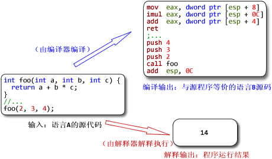
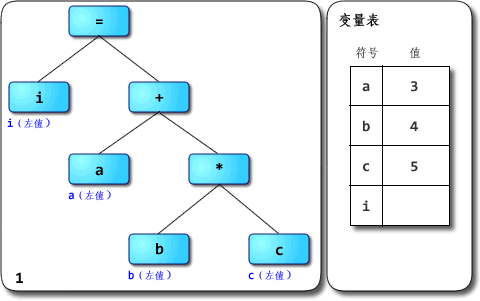

## 6.5 虚拟机随谈

### 6.5.1 解析器
Parser是编译器/解释器的重要组成部分；其主要作用是进行语法分析，提取出句子的结构。广义来说输入一般是程序的源码，输出一般是语法树（syntax tree，也叫parse tree等）或抽象语法树（abstract syntax tree，AST）。广义的解析器里一般会有扫描器（scanner，也叫tokenizer或者lexical analyzer，词法分析器），以及狭义的解析器（parser，也叫syntax analyzer，语法分析器）。扫描器的输入一般是文本，经过词法分析，输出是将文本切割为单词的流。狭义的解析器输入是单词的流，经过语法分析，输出是语法树或者精简过的AST。（在一些编译器/解释器中，解析也可能与后续的语义分析、代码生成或解释执行等步骤融合在一起，不一定真的会构造出完整的语法树。但概念上说解析器就是用来抽取句子结构用的，而语法树就是表示句子结构的方式）。举例：将i = a + b * c作为源代码输入到解析器里，则广义上的解析器的工作流程如下图：


其中词法分析由扫描器完成，语法分析由狭义的解析器完成（其实“解析器”这词还是按狭义用法比较准确，把扫描器和解析器合起来叫解析器总觉得怪怪的，但很多人这么用。不过近来“scannerless parsing”也挺流行的：不区分词法分析与语法分析，没有单独的扫描器，直接用解析器从源码生成语法树，这就没有狭义广义的问题了）。

### 6.5.2 解释器
解释器则是实现程序执行的一种实现方式，与编译器相对。它直接实现程序源码的语义，输入是程序源码，输出则是执行源码得到的计算结果。而编译器的输入与解释器相同，而输出是用别的语言实现了输入源码的语义的程序。通常编译器的输入语言比输出语言高级，但也有输入输出是同种语言的情况，此时编译器很可能主要用于优化代码。举例：把同样的源码分别输入到编译器与解释器中，得到的输出不同：



解释器就是个黑箱，输入是源码，输出就是输入程序的执行结果，对用户来说中间没有独立的“编译”步骤。而其内部是怎么实现的没关系，只要能实现语义就行。比如你可以写一个C语言的解释器，里面只是先用普通的C编译器把源码编译为in-memory image，然后直接调用那个image去得到运行结果。而实际上很多解释器内部确实是以“编译器+虚拟机”的方式来实现的，先通过编译器将源码转换为AST或者字节码，然后由虚拟机去完成实际的执行。所以“解释型语言”并不是不用编译，而只是不需要用户显式去使用编译器得到可执行代码而已。

现在让我们来看看由解析器生成的AST要是交给一个树遍历解释器，会如何被解释执行呢，以前面说过的i = a + b * c为例：



这是对AST的后序遍历：假设有一个eval(Node n)函数，用于解释AST上的每个节点；在解释一个节点时如果依赖于子树的操作，则对子节点递归调用eval(Node n)，从这些递归调用的返回值获取需要的值。即子节点都eval好了之后，父节点才能进行自己的eval，典型的后序遍历。CRuby 1.9之前的CRuby就都是采用这种方式来解释执行的。

#### 优先级、结合性与求值顺序
在此我们区分一下以下几个名词：优先级、结合性与求值顺序。通过AST来看就很容易理解：（假设源码是从左到右输入的）
1. 优先级，就是不同操作相邻出现时，AST节点与根的距离的关系。优先级高的操作会更远离根，优先级低的操作会更接近根。为什么？因为整棵AST是以后序遍历求值的，显然节点离根越远就越早被求值。
2. 结合性，就是当同类操作相邻出现时，操作的先后顺序同AST节点与根的距离的关系。如果是左结合，则先出现的操作对应的AST节点比后出现的操作的节点离根更远，即先出现的节点会是后出现节点的子节点。
3. 求值顺序，就是在遍历子节点时的顺序。对二元运算对应的节点来说，先遍历左子节点再遍历右子节点就是从左到右的求值顺序，反之则是从右到左的求值顺序。

这三个概念与运算的联系都很紧密，但实际描述的是不同的关系。前两者是解析器根据语法生成AST时就已经决定好的，后者则是解释执行或者生成代码而去遍历AST时决定的。在没有副作用的环境中，给定优先级与结合性，则无论求值顺序是怎样的都能得到同样的结果；而在有副作用的环境中，求值顺序会影响结果。

赋值运算虽然是右结合的，但仍然可以用从左到右的求值顺序；事实上Java、C#等许多语言都在规范里写明表达式的求值顺序是从左到右的。上面的例子中就先遍历的=的左侧，求得i的左值；再遍历=的右侧，得到表达式的值23；最后执行=自身，完成对i的赋值。
所以如果你要问：赋值在类似C的语言里明明是右结合的运算，为什么你先遍历左子树再遍历右子树？上面的说明应该能让你发现你把结合性与求值顺序混为一谈了。

看看Java从左到右求值顺序的例子：
```Java
public class EvalOrderDemo {
    public static void main(String[] args) {
        int[] arr = new int[1];
        int a = 1;
        int b = 2;
        arr[0] = a + b;
    }
}
```
由javac编译，得到arr[0] = a + b对应的字节码是：
```
// 左子树：数组下标
// a[0]
aload_1
iconst_0

// 右子树：加法
// a
iload_2
// b
iload_3
// +
iadd

// 根节点：赋值
iastore
```

#### 从树遍历解释器到字节码解释器
如果你看到树形结构与后序遍历，并且知道后缀记法的话，那也许你已经察觉了：要解释执行AST，可以先通过后序遍历AST生成对应的后缀记法的操作序列，然后再解释执行该操作序列。这样就把树形结构压扁，成为了线性结构。
树遍历解释器对AST的求值其实隐式依赖于调用栈：eval(Node n)的递归调用关系是靠调用栈来维护的。后缀表达式的求值则通常显式依赖于一个栈，在遇到操作数时将其压入栈中，遇到运算时将合适数量的值从栈顶弹出进行运算，再将结果压回到栈上。后缀记法也就与基于栈的架构联系了起来：后者可以很方便的执行前者。同理，零地址指令也与树形结构联系了起来：可以通过一个栈方便的把零地址指令序列再转换回到树的形式。

Java字节码与Java源码联系紧密，前者可以看成后者的后缀记法。那么让我们再来看看，同样是i = a + b * c这段源码对应的AST，生成Java字节码的例子：


一个Java编译器的输入是Java源代码，输出是含有Java字节码的.class文件。它里面主要包含扫描器与解析器，语义分析器（包括类型检查器/类型推导器等），代码生成器等几大部分。上图所展示的就是代码生成器的工作。对Java编译器来说，代码生成就到字节码的层次就结束了；而对native编译器来说，这里刚到生成中间表示的部分，接下去是优化与最终的代码生成。

### 6.5.3 虚拟机
那么虚拟机（VM）又是什么？一般认为输入是满足某种指令集架构（instruction set architecture，ISA）的指令序列，中间转换为目标ISA的指令序列并加以执行，输出为程序的执行结果的，就是VM。源与目标ISA可以是同一种，这是所谓same-ISA VM。

一般编译器的输出可能是AST，或者是字节码之类的指令序列。一般把执行后者的程序称为VM，而执行前者的称为解释器或者树遍历式解释器（tree-walking interpreter）。线性（相对于树形）的指令序列看起来更像是真正机器会执行的指令序列，但是把也可以把执行AST的称为VM。

同样，VM也需要采用某种方式去实现输入程序的语义，一般有一下几种选择：
* 编译方式：VM会把输入的指令先转换为某种能被底层系统直接执行的形式（一般就是native code），然后再执行，例如微软的.NET中的CLR。
* 解释方式：VM直接逐条执行输入的指令，例如CPython、CRuby 1.9，许多老的JavaScript引擎等。
* 混合方式：介于两者之间，例如HotSpot。

编译和解释方式的主要区别在于是否存下目标代码：编译方式会把输入的源程序以某种单位（例如基本块或者方法等）翻译生成为目标代码，并保存下来（内存中或者磁盘上都可以），后续执行可以复用；而解释方式则是把源程序中的指令逐条解释，不生成也不存下目标代码，后续执行没有多少可复用的信息。有些稍微先进一点的解释器可能会优化输入的源程序，把满足某些模式的指令序列合并为“超级指令”，这么做就是朝着编译的方向推进。

### 6.5.4 基于栈与基于寄存器的指令集架构
本节我们讨论两种指令集架构：基于栈的和基于寄存器的指令集架构。首先用C的语法来写这么一个语句：
```C
int a = b + c;
```
如果把它变成这种形式：add a, b, c。这种就是所谓“三地址指令”（3-address instruction），一般形式为：op dest, src1, src2。许多操作都是二元运算+赋值。三地址指令正好可以指定两个源和一个目标，能非常灵活的支持二元操作与赋值的组合。ARM处理器的主要指令集就是三地址形式的。

而C如果这样写的话：
```C
a += b;  
```
则变成：add a, b。这就是所谓“二地址指令”，一般形式为：op dest, src。它要支持二元操作，就只能把其中一个源同时也作为目标。上面的add a, b在执行过后，就会破坏a原有的值，而b的值保持不变。x86系列的处理器就是二地址形式的。

上面提到的三地址与二地址形式的指令集，一般就是通过“基于寄存器的架构”来实现的。例如典型的RISC架构会要求除load和store以外，其它用于运算的指令的源与目标都要是寄存器。

事实上指令集可以是“n地址”的，n属于自然数。那“n地址”的n如果是0的话呢？
看这样一段Java字节码：
```
iconst_1
iconst_2  
iadd  
istore_0  
```
注意那个iadd（整型加法）指令并没有任何参数。连源都无法指定了，零地址指令有什么用？

零地址意味着源与目标都是隐含参数，其实现依赖于栈这种数据结构。上面的iconst_1、iconst_2两条指令，分别向一个叫做操作数栈的地方压入整型常量1、2。iadd指令则从求值栈顶弹出2个值，将值相加，然后把结果压回到栈顶。istore_0指令从求值栈顶弹出一个值，并将值保存到局部变量区的第一个位置。因此零地址形式的指令集一般就是通过“基于栈的架构”来实现的。需要注意的是，这个栈是指操作数栈，而不是与系统调用栈。有些虚拟机把求值栈实现在系统调用栈上，但两者概念上不是一个东西。

由于指令的源与目标都是隐含的，零地址指令的“密度”可以非常高——可以用更少空间放下更多条指令。因此在空间紧缺的环境中，零地址指令是种可取的设计。但零地址指令要完成一件事情，一般会比二地址或者三地址指令许多更多条指令。上面Java字节码做的加法，如果用x86指令两条就能完成了：
```asm
mov  eax, 1  
add  eax, 2  
```
一般HLL VM的架构采用基于栈的架构，主要是因为基于栈的架构实现比较简单，可移植性比较好.

一个VM如果采用基于寄存器的架构（它接受的指令集大概就是二地址或者三地址形式的），为了高效执行，一般会把源架构中的寄存器映射到实际机器的寄存器上。但是VM里有些很重要的辅助数据会经常被访问，例如程序计数器，为了效率，这些数据也得放在实际机器的寄存器上。如果源架构中寄存器的数量跟实际机器的一样，或者前者更多，那源架构的寄存器就没办法都映射到实际机器的寄存器上。这样VM实现起来比较麻烦，效率也会降低。像Dalvik VM的解释器实现，就是把虚拟寄存器全部映射到栈帧（内存）里的，这跟把局部变量区与操作数栈都映射到内存里的JVM解释器实现相比实际区别不大。

但是现在的实际处理器，大多都是基于寄存器的架构，从侧面反映出它比基于栈的架构更优秀。一般认为基于寄存器的架构对VM来说也是更快的，原因是：虽然零地址指令更紧凑，但完成操作需要更多的load/store指令，也意味着更多的指令分派（instruction dispatch）次数与内存访问次数；访问内存是执行速度的一个重要瓶颈，二地址或三地址指令虽然每条指令占的空间较多，但总体来说可以用更少的指令完成操作，指令分派与内存访问次数都较少。

#### JVM与Dalvik VM
我们看一下基于栈和寄存器的VM的具体例子：JVM采用了基于栈的架构，其字节码主要是零地址形式的。而Dalvik VM采用了基于寄存器的架构，其字节码主要是二地址/三地址混合形式的。我们举个例子说明，如下所示：
```Java
public class Demo {  
    public static void foo() {  
        int a = 1;  
        int b = 2;  
        int c = (a + b) * 5;  
    }  
}  
```
通过javac编译，得到Demo.class。通过javap可以看到foo()方法的字节码是：
```
0:  iconst_1  
1:  istore_0  
2:  iconst_2  
3:  istore_1  
4:  iload_0  
5:  iload_1  
6:  iadd  
7:  iconst_5  
8:  imul  
9:  istore_2  
10: return  
```
接着使用dx工具将Demo.class转换为dex格式。转换时可以直接以文本形式dump出dex文件的内容。使用下面的命令：
```
dx --dex --verbose --dump-to=Demo.dex.txt --dump-method=Demo.foo --verbose-dump Demo.class  
```
可以看到foo()方法的字节码是：
```
0000: const/4       v0, #int 1 // #1  
0001: const/4       v1, #int 2 // #2  
0002: add-int/2addr v0, v1  
0003: mul-int/lit8  v0, v0, #int 5 // #05  
0005: return-void  
```
接下来我们看一下这两个虚拟机是如何工作的：

##### JVM
我们用以下的动态图来表示：


图中数字均以十六进制表示，其中字节码的一列表示的是字节码指令的实际数值，后面则是其助记符。标记为红色的值是相对上一条指令的执行状态有所更新的值。上面代码中有11条指令，每条都只占1单元（Java字节码以1字节为单元），共11单元（11字节）。程序计数器（PC）是用于记录程序当前执行的位置用的。对Java程序来说，每个线程都有自己的PC，PC以字节为单位记录当前运行位置里方法开头的偏移量。

可以观察到Java字节码是如何指示JVM将数据压入或弹出栈，以及数据是如何在栈与局部变量区之前流动的，可以看到数据移动的次数特别多。动画里可能不太明显，iadd和imul指令都是要从操作数栈弹出两个值运算，再把结果压回栈上的，光这样一条指令就有3次概念上的数据移动。

##### Dalvik VM：


与JVM不同的是：Dalvik字节码以16位为单元（或许叫“双字节码”更准确）。上面代码中有5条指令，其中mul-int/lit8指令占2单元，其余每条都只占1单元，共6单元（12字节）。
与JVM相似，在Dalvik VM中每个线程都有自己的PC和调用栈，方法调用的活动记录以帧为单位保存在调用栈上。
与JVM不同的是，Dalvik VM的栈帧中没有局部变量区与操作数栈，取而代之的是一组虚拟寄存器。每个方法被调用时都会得到自己的一组虚拟寄存器。常用v0-v15这16个，也有少数指令可以访问v0-v255范围内的256个虚拟寄存器。与JVM相同的是，每个方法所需要的虚拟寄存器个数都能够在编译时确定，并且记录在.dex文件里；每个寄存器都是字长（32位），相邻的一对寄存器可用于保存64位数据，方法的参数按源码中从左到右的顺序保存在末尾的几个虚拟寄存器里。

可以看到：与JVM版相比，可以发现Dalvik版程序的指令数明显减少了，数据移动次数也明显减少了，用于保存临时结果的存储单元也减少了。

需要注意的是：
1. Dalvik VM是基于寄存器的，x86也是基于寄存器的，但两者的“寄存器”却相当不同：前者的寄存器是每个方法被调用时都有自己一组私有的，后者的寄存器则是全局的。也就是说，概念上Dalvik VM字节码中不用担心保护寄存器的问题，某个方法在调用了别的方法返回过来后自己的寄存器的值肯定跟调用前一样。而x86程序在调用函数时要考虑清楚calling convention，调用方在调用前要不要保护某些寄存器的当前状态，还是说被调用方会处理好这些问题。
2. Dalvik的.dex文件在未压缩状态下的体积通常比同等内容的.jar文件在deflate压缩后还要小。但光从字节码看，Java字节码几乎总是比Dalvik的小，那.dex文件的体积是从哪里来减出来的呢？这是因为.dex文件对常量池的压缩，一个.dex文件中所有类都共享常量池，使得相同的字符串、相同的数字常量等都只出现一次，自然能大大减小体积。相比之下，.jar文件中每个类都持有自己的常量池，诸如“Ljava/lang/Object;”这种常见的字符串会被重复多次。

### 6.5.5 总结
很多时候会说，Python、Ruby、JavaScript等都是“解释型语言”，是通过解释器来实现的。这么说其实很容易引起误解：语言一般只会定义其抽象语义，而不会强制性要求采用某种实现方式。例如说C一般被认为是“编译型语言”，但C的解释器也是存在的，例如Ch。同样，C++也有解释器版本的实现，例如Cint。

一般被称为“解释型语言”的是主流实现为解释器的语言，但并不是说它就无法编译。例如说经常被认为是“解释型语言”的Scheme就有好几种编译器实现，其中率先支持R6RS规范的大部分内容的是Ikarus，支持在x86上编译Scheme，它最终不是生成某种虚拟机的字节码，而是直接生成x86机器码。

如果一种语言的主流实现是解释器，其内部是编译器+虚拟机，而虚拟机又是采用解释方式实现的，或者内部实现是编译器+树遍历解释器，那它就是名副其实的“解释型语言”。如果内部用的虚拟机是用编译方式实现的，其实跟普遍印象中的“解释器”还是不同的。
