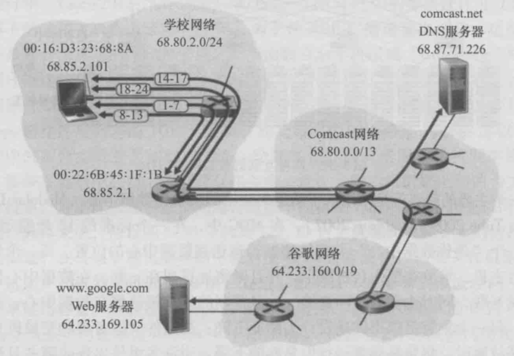

## 7.10 Web页面请求历程
本节我们通过研究如何下载一个Web页面来计算机网络做一个总结。比如，Bob想要访问google主页，我们假定Bob的计算机是连接到学校的以太网交换机，交换机又与学校的路由器相连，学校的这台路由器与一个ISP连接。如下图所示：



这里我们假设：本例中ISP为comcast.net，其为学校提供了DNS服务，所以DNS服务器驻留在Comcast网络中而不是学校的网络中；而DHCP服务器运行在学校路由器中。其具体步骤如下：

### 7.10.1 将本机连入因特网：DHCP
当Bob将其计算机与网络连接时，是没有IP地址的，所以这里首先需要运行DHCP协议获取一个IP地址及其他信息，具体步骤如下所示：
1. Bob计算机上的操作系统生成一个DHCP请求报文，并将其封装为以太网帧，如下所示：
```
payload:...
sourcePort:68 destPort:67
sourceIP:0.0.0.0 destIP:255.255.255.255
sourceMAC:00:16:D3:23:68:8A destMAC:FF:FF:FF:FF:FF:FF
```
然后Bob计算机将该以太网帧广播出去。
2. 该以太网帧通过交换机传递到路由器，路由器在MAC地址00:22:6B:45:1F:1B的接口接收到该帧，并从中一层层地取出payload：DHCP请求报文，交给运行在该路由器上的DHCP服务器。
3. 我们假设运行在路由器中的DHCP服务器能够以CIDR块68.85.2.0/24分配IP地址，所以本例中，在学校内使用的所有IP地址都在Comcast的地址块中。我们假设DHCP服务器分配地址68.85.2.101给Bob的计算机。DHCP服务器生成包含这个IP地址以及DNS服务器的IP地址（68.87.71.226）、默认网关路由器的IP地址（68.85.2.1）和子网掩码（68.85.2.0/24）的一个DHCP响应报文。并将该报文封装成帧。如下所示：
```
payload: IP:68.85.2.101， DNS:68.87.71.226， 默认网关:68.85.2.1， 子网掩码:68.85.2.0/24
sourcePort:67 destPort:68
sourceIP:68.85.2.1 destIP:255.255.255.255
sourceMAC:00:22:6B:45:1F:1B destMAC:00:16:D3:23:68:8A
```
4. 该以太网帧由路由器发送给交换机，因为交换机是自学习的，并且先前从Bob计算机收到（DHCP请求）以太网帧，所以该交换机知道如何寻址到00:16:D3:23:68:8A的主机：仅仅从通向Bob计算机的输出端口转发即可。
5. Bob计算机接收到包含DHCP响应的以太网帧，从中逐层取出payload：DHCP响应报文。Bob的DHCP客户端则记录下它的IP地址和它的DNS服务器的IP地址，然后在其IP转发表中安装默认网关的地址，Bob计算机将向该默认网关发送目的地址为其子网68.85.2.0/24以外的所有数据报。此时，Bob计算机已经初始化好它的网络组件，并准备开始处理Web网页获取。

### 7.10.2 获取网关的MAC地址：ARP
当Bob将www.google.com键入其浏览器时，其开启了一长串事件，这将导致google主页最终显示在其浏览器上：首先是浏览器建立一个到google的TCP连接，该连接用于向google发送HTTP请求。为了建立该连接，Bob计算机需要运行DNS协议获取google的IP地址。具体步骤如下所示：
1. Bob计算机上的操作系统生成一个DNS查询报文，将“www.google.com”放入DNS报文的问题段中。其具体结构如下所示：
```
payload: www.google.com的IP地址？
sourcePort:xxx destPort:53
sourceIP:68.85.2.101 destIP:68.87.71.226
sourceMAC:00:16:D3:23:68:8A destMAC:?
```
2. 然后Bob计算机将该IP数据报封装到一个以太网帧中，并将该帧发送（在链路层寻址）到Bob学校网络中的网关路由器。此时Bob计算机只知道该路由器的IP地址（68.85.2.1），而不知道该路由器的MAC地址。为了获得该网关路由器的MAC地址，Bob计算机将需要使用ARP协议。
3. Bob计算机生成一个具有目的IP地址68.85.2.1（默认网关）的ARP查询报文。将该ARP报文放置在一个具有广播目的地址（FF:FF:FF:FF:FF:FF）的以太网帧中，并向交换机发送该以太网帧，交换机将该帧交付给所有连接的设备，包括网关路由器。
```
payload: 68.85.2.1对应的MAC地址？
sourceIP:68.85.2.101 destIP:68.85.2.1
sourceMAC:00:16:D3:23:68:8A destMAC:FF:FF:FF:FF:FF:FF
```
需要注意的是ARP协议是IP层协议，在传输层下面，所以没有端口一说。
4. 网关路由器在通往学校网络的接口上接收到包含该ARP查询报文的以太网帧，发现其匹配自己的IP地址，因此其准备一个ARP回答：68.85.2.1对应的MAC地址是00.22.6B.45.1F.1B。它将ARP应答封装为以太网帧，具体结构如下所示：
```
payload: 68.85.2.1对应的MAC地址是00.22.6B.45.1F.1B
sourceIP:68.85.2.1 destIP:68.85.2.101
sourceMAC:00.22.6B.45.1F.1B destMAC:00.16.D3.23.68.8A
```
并向交换机发送该帧，再由交换机将该帧交付给Bob计算机。
5. Bob计算机接收包含ARP应答报文的以太网帧，并从ARP应答报文中抽取网关路由器的MAC地址（00.22.6B.45.1F.1B）。
6. 然后Bob计算机发出包含DNS查询报文的以太网帧。需要注意的是：该帧中的IP数据报的IP目的地址68.87.71.226（DNS服务器），而该帧的MAC目的地址00.22.6B.45.1F.1B（网关路由器）。Bob计算机向交换机发送该帧，交换机将该帧交付给网关路由器。

总结：IP数据报是通过链路层交付的，即匹配MAC地址。所以IP数据报每过一跳路由器，源和目的MAC地址就要改变一次，而IP地址是不能变的。

### 7.10.3 获取目标网站的IP地址：域内路由选择到DNS服务器
接下来，网关路由器需要将该DNS查询报文路由到DNS服务器，由DNS服务器给出响应。
1. 网关路由器接收该帧并抽取包含DNS查询的IP数据报。路由器查询该数据报的目的IP地址（68.87.71.226），并根据其转发表决定该数据报应该发送到Comcast网络中最左边的路由器。然后将该IP数据报重新封装到链路层帧中，并通过该链路发送该帧。
2. 在Comcast网络中，最左边的路由器接收到该帧，抽取IP数据报，检查该数据报的IP目的地址（68.87.71.226），并根据其转发表确定出接口，经过该接口朝着DNS服务器转发数据报，而转发表已经根据Comcast的域内协议（如RIP、OSPF或IS-IS）以及因特网的域间协议BGP所填写。
3. 最终包含DNS查询的IP数据报到达了DNS服务器。DNS服务器抽取出DNS查询报文，在它的DNS数据库中查找名字www.google.com，找到包含对应www.google.com的IP地址（64.233.169.105）的DNS记录（假设它当前缓存在DNS服务器中）。该DNS服务器生成了一个www.google.com到IP地址映射的DNS应答报文，并将该报文封装成帧，然后该数据报将通过Comcast网络反向转发到学校的路由器，并从这里经过以太网交换到Bob计算机。
4. Bob计算机从DNS报文抽取出服务器www.google.com的IP地址。

### 7.10.4 Web客户-服务器交互：TCP和HTTP
接下来，Bob的计算机就可以向谷歌服务器发出页面请求报文了。
1. 此时Bob计算机有了www.google.com的IP地址，它将生成一个TCP连接，该连接将用于向www.google.com发送HTTP GET报文。当Bob生成TCP连接时，在Bob计算机中的TCP必须首先与www.google.com中的TCP执行三次握手：Bob计算机因此首先生成一个具有目的端口80（针对HTTP的）的TCP SYN报文段，将该TCP报文段放置在具有目的IP地址64.233.169.105（www.google.com）的IP数据报中，将该数据报放置在MAC地址为00:22:6B:45:1F:1B（网关路由器）的帧中，并向交换机发送该帧。
2. 在学校网络、Comcast网络和谷歌网络中的路由器朝着www.google.com转发包含TCP SYN的数据报。
3. 最终，包含TCP SYN的数据报到达www.google.com。从数据报抽取出TCP SYN报文并分解到与端口80相关的监听socket。谷歌HTTP服务器生成一个和Bob计算机之间的TCP连接socket，并产生一个TCP SYNACK报文段，作为响应回送到Bob计算机。
4. Bob的计算机收到该TCP SYNACK报文后，其TCP socket也进入连接状态，并产生一个ACK报文回送到谷歌HTTP服务器。
5. 然后Bob计算机使用该TCP连接向谷歌服务器发送一个HTTP GET报文，谷歌HTTP服务器从该TCP连接读取HTTP GET报文，生成一个HTTP响应报文，将请求的Web页内容作为HTTP响应body，并将报文发送进该TCP连接中。然后Bob的Web浏览器程序从该连接中读取HTTP响应报文，并从body中抽取Web网页的html，然后显示其Web网页。
