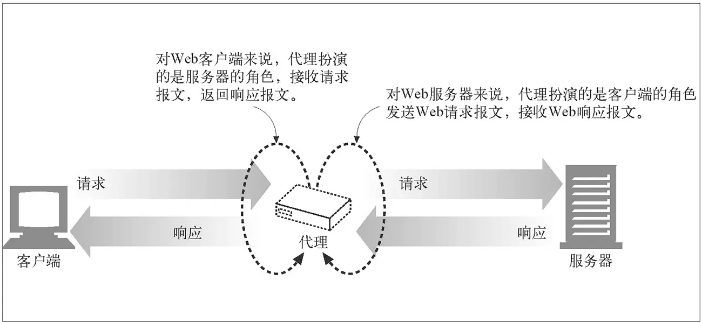
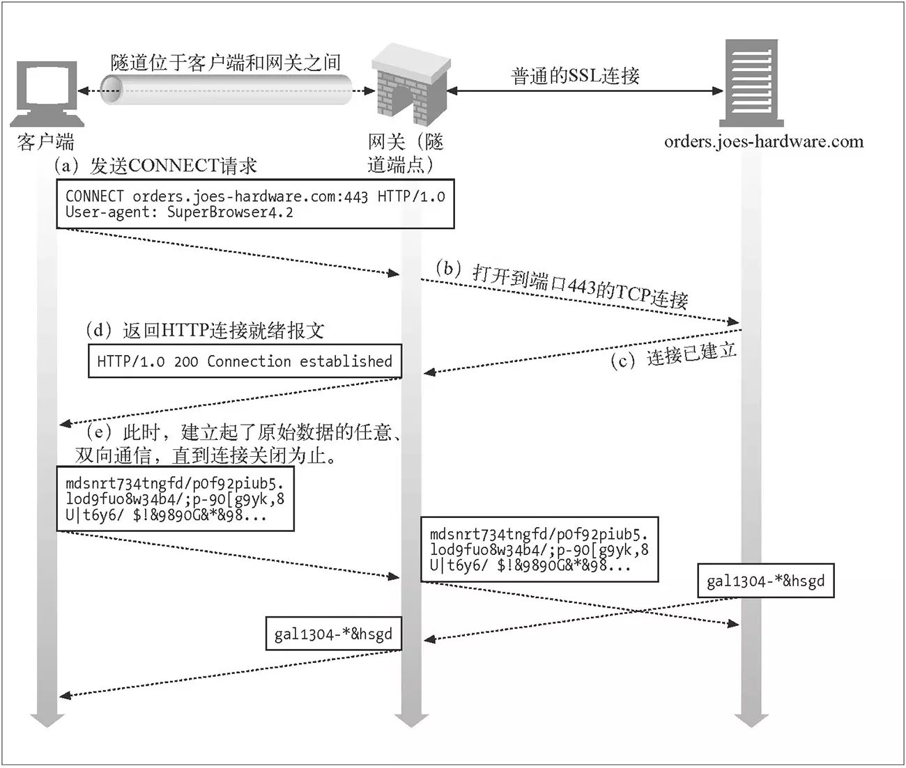
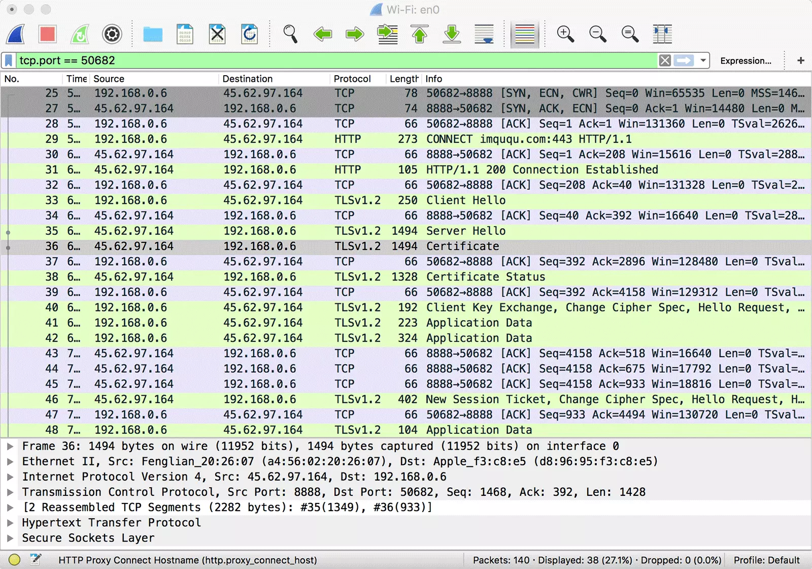
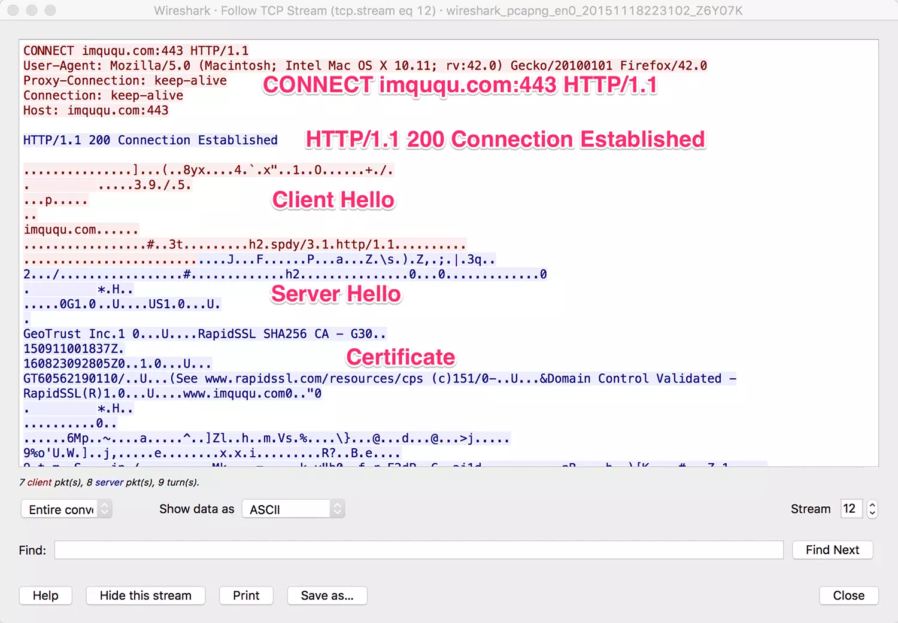

## 7.2 Http详解二

### 7.2.1 Web服务器

### 7.2.2 代理
HTTP代理存在两种形式，分别简单介绍如下：
第一种是普通代理（参见RFC7230），这种代理扮演的是“中间人”角色，对于连接到它的客户端来说，它是服务端；对于要连接的服务端来说，它是客户端。它就负责在两端之间来回传送HTTP报文。
第二种是隧道代理（参见RFC7231)，这种代理是通过Web代理服务器用隧道方式传输基于TCP的协议。它通过HTTP协议正文部分（Body）完成通讯，以HTTP的方式实现任意基于TCP的应用层协议代理。这种代理使用HTTP的CONNECT方法建立连接。

#### 普通代理
HTTP客户端向代理发送请求报文，代理服务器需要正确地处理请求和连接（例如正确处理Connection: keep-alive），同时向服务器发送请求，并将收到的响应转发给客户端。如下图所示：



给浏览器显式的指定代理，需要手动修改浏览器或操作系统相关设置，这里不再详述，可以参见《HTTP权威指南第六章》。显式指定浏览器代理这种方式一般称之为正向代理，浏览器启用正向代理后，会对HTTP请求报文做一些修改，来规避老旧代理服务器的一些问题，接下来我们会详述这些问题。还有一种情况是当访问服务器时，实际上访问的是代理，代理收到请求报文后，再向真正的服务器发起请求，并将响应转发给浏览器。这种情况一般被称之为反向代理，一般使用反向代理后，需要通过修改DNS让域名解析到代理服务器IP。反向代理是Web系统（比如Nginx）最为常见的一种部署方式，可以用来隐藏真实服务器。
了解代理的基本原理后，我们用Node.js简单实现一下它：
```JavaScript
var http = require('http');
var net = require('net');
var url = require('url');

function request(cReq, cRes) {
  var u = url.parse(cReq.url);

  var options = {
    hostname: u.hostname,
    port: u.port || 80,
    path: u.path,
    method: cReq.method,
    headers: cReq.headers
  };

  var pReq = http.request(options, function(pRes) {
    cRes.writeHead(pRes.statusCode, pRes.headers);
    pRes.pipe(cRes);
  }).on('error', function(e) {
    cRes.end();
  });

  cReq.pipe(pReq);
}

http.createServer().on('request', request).listen(8888, '0.0.0.0');
```
以上代码运行后，会在本地8888端口开启HTTP代理服务，这个代理服务从请求报文中解析出请求URL和其他必要参数（没有处理body，post请求会有一些问题），新建一个Http请求到真实服务端，最后再把服务端响应返回给浏览器。修改浏览器的HTTP代理为127.0.0.1:8888后再访问HTTP网站，代理可以正常工作。需要注意的是，这个代理提供的是HTTP服务，是无法承载HTTPS服务，因为HTTPS的证书认证机制就是抵抗中间人攻击的。

#### 隧道代理
HTTP客户端通过CONNECT方法请求隧道代理创建一条到达任意目的服务器和端口的TCP连接，并对客户端和服务器之间的后继数据进行盲转发。如下图所示：



浏览器首先通过CONNECT请求，让代理创建一条到服务端的TCP连接；一旦TCP连接建好，代理无脑转发后续流量即可。需要注意的是，此时客户端和代理之间有一条TCP连接，而代理和服务端有一条TCP连接，代理将两条TCP连接pipe起来，从而完成流量转发。这种代理，理论上适用于任意基于TCP的应用层协议，SSL层当然也是可以的。客户端透过代理直接跟服务端进行TLS握手协商密钥，所以仍然是安全的，下图中的抓包信息显示了这种场景：



可以看到，浏览器与代理进行TCP握手之后，发起了CONNECT请求，报文起始行如下：
```
CONNECT imququ.com:443 HTTP/1.1
```
由于Connect请求是让代理创建TCP连接，所以只需要提供服务器域名及端口即可，并不需要具体的资源路径。代理收到这样的请求后，需要与服务端建立TCP连接，并响应给浏览器这样一个HTTP报文：
```
HTTP/1.1 200 Connection Established
```
浏览器收到了这个响应报文，就可以认为到服务端的TCP连接已经打通，后续直接往这个TCP连接写协议数据即可。通过Wireshark的Follow TCP Steam功能，可以清楚地看到浏览器和代理之间的数据传递：



可以看到，浏览器建立到服务端TCP连接产生的HTTP往返，是明文进行的，这也是为什么CONNECT请求只提供域名和端口。
了解完原理后，再用Node.js实现一个支持CONNECT的代理也很简单。核心代码如下：
```JavaScript
var http = require('http');
var net = require('net');
var url = require('url');

function connect(cReq, cSock) {
  var u = url.parse('http://' + cReq.url);

  var pSock = net.connect(u.port, u.hostname, function() {
    cSock.write('HTTP/1.1 200 Connection Established\r\n\r\n');
    pSock.pipe(cSock);
  }).on('error', function(e) {
    cSock.end();
  });

  cSock.pipe(pSock);
}

http.createServer().on('connect', connect).listen(8888, '0.0.0.0');
```
以上代码运行后，会在本地8888端口开启HTTP代理服务，这个服务从CONNECT请求报文中解析出域名和端口，创建到服务端的TCP连接，并和CONNECT请求中的TCP连接串起来，最后再响应一个Connection Established响应。修改浏览器的HTTP代理为127.0.0.1:8888后再访问HTTPS网站，代理可以正常工作。

#### HTTPS代理
除了使用隧道外，代理是可以承载HTTPS流量的，因为一般的HTTPS服务中，服务端是不会验证客户端，这种代理可以作为客户端与服务端成功完成TLS握手，只要让客户端能够信任代理中间人即可。从而在客户端和代理，代理和服务端之间都能成功建立TLS连接，而对于代理这个中间节点来说，两端的TLS流量都是可以解密的。具体实现这里不再详述。

#### HTTP抓包工具
事实上，Charles（Fiddler）的工作原理也是在本地开启HTTP代理服务，通过让HTTP流量走这个代理，从而实现显示和修改HTTP包的功能。之前我们谈到过，如果想抓包分析HTTPS流量，必须安装Charles的CA证书。从而在浏览器和Charles，Charles和服务端之间都能成功建立TLS连接。而对于Charles这个中间节点来说，两端的TLS流量都是可以解密的。如果不安装Charles的CA证书，就需要走隧道协议了，此时就无法分析具体的流量数据了。

#### 代理引起的问题
1. 相对路径和完整路径
早期的Web服务中，浏览器为了避免冗余，一般都只发送相对路径，因为服务端知道自己的主机和端口。但是代理出现之后，相对路径就出现了问题，代理服务器并不知道服务端的主机和端口。为了解决这个问题，采用以下方法：当显示配置浏览器代理后，浏览器会使用完整路径。但是很多代理是浏览器不可见，于是浏览器会为请求加上Host首部，从而彻底解决这个问题。

2. 持久连接
我们上文说过，代理是转发客户端的请求到服务端，以及服务端的响应到客户端。通常，首部都会原封不动的转发给服务端或者客户端。但是逐跳首部是不可以转发的，因为逐跳首部只与一条特定的连接有关，当服务端误将转发来的首部理解为代理自身的请求，用它来控制和代理之间的连接，就会出现问题。这类首部有如下几个：Connection、Proxy-Authenticate、Proxy-Connection、Transfer-Encoding以及Upgrade。这里简要谈及一下Connection首部的问题。
转发Connection首部对于短连接是没有问题的，但是对于长连接是有问题的，因为每个节点只能和相邻节点建立长连接，客户端是不可能透过代理直接与服务端建立长连接的。当代理将Connection:keep-alive的首部转发给服务端后，服务端并不知道这是代理转发过来的，会误认为是代理希望建立持久连接，服务端同意之后会回送keep-alive，同样代理将其原样转发给客户端，客户端会误认为是代理同意建立持久连接。所以，此时客户端和服务端都认为它们在进行keep-alive对话，而处于中间的代理却不知道。由于代理并不知道keep-alive，所以会将所有的数据回送给客户端后，等待服务端关闭连接。但是服务端却按照keep-alive首部保持了连接，此时代理就挂在这里等待连接的关闭。另一方面客户端收到响应后，会复用这条连接发送请求，但代理却认为这条连接上不会再有请求，浏览器的请求将会被其忽略。

为了解决这个问题，当显示指定浏览器代理后，浏览器会将请求首部的Connection替换为Proxy-Connection，傻代理将其盲目转发给服务端后，服务端会忽略Proxy-Connection，于是客户端、代理和服务端就不会建立长连接。而聪明的代理理解Proxy-Connection，会用Connection代替无意义的Proxy-Connection，转发给服务端，从而实现客户端和代理、代理和服务端都建立长连接。显然，如果客户端并不知道有傻代理，或者在傻代理任意一侧有聪明代理的情况下，这种方案仍然无济于事。

#### 总结
从连接上而言，代理是客户端和服务器端的中间人，客户端和代理之间建立连接，代理和服务端之间建立连接，然后将一条连接上的流量转发到另一条连接上。无论是普通代理，还是隧道代理，前者是HTTP流量的转发，而后者是TCP流量的转发，但是HTTP本身是基于TCP的。

### 7.2.3 缓存

### 7.2.4 集成点：网关、隧道及中继

### 7.2.5 Web机器人
