## 7.4 Charles使用指南

### 7.4.1 Charles简介
Charles是一个HTTP代理服务器，它允许开发者查看所有连接互联网的HTTP通信信息，包括request, response现HTTP headers（包含cookies与cache信息）。其主要功能如下：
1. 截取Http和Https网络抓包。
2. 支持重发网络请求，方便后端调试。
3. 支持修改网络请求参数。
4. 支持网络请求的截获并动态修改。
5. 支持模拟慢速网络。

### 7.4.2 Charles使用
#### Charles主界面
Charles提供两种查看网络数据包的视图：Structure视图和Sequence视图，前者将网络请求按访问的域名分类，后者将网络请求按访问的时间排序。Charles提供了一个简单的Filter功能，可以输入关键字来快速筛选出URL中带指定关键字的网络请求。

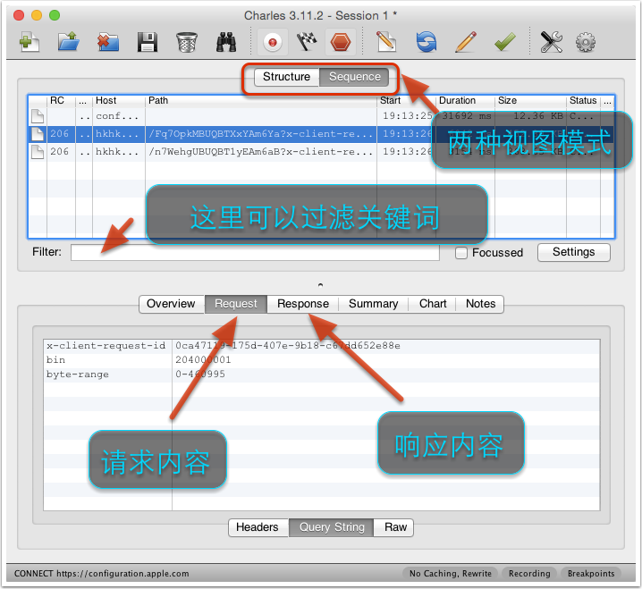

#### 将Charles设置为系统代理
Charles是通过将自己设置成代理来完成数据包抓取的。具体做法，菜单栏“Proxy”->“Mac OS X Proxy”。需要注意的是，Chrome默认不使用系统的代理服务器设置，所以默认情况下无法抓取Chrome的网络数据包。如果你需要截取的话，在Chrome中设置成使用系统的代理服务器设置即可，或者直接将代理服务器设置成127.0.0.1:8888也可达到相同效果。

#### 过滤网络请求
设置完代理服务器后，就会看到源源不断的网络请求。而通常情况下，我们需要对网络请求进行过滤，只抓取向指定服务器发送的请求。有以下几种办法：
* 在主界面的中部的Filter栏中填入需要过滤出来的关键字。例如我们的服务器的地址是：http://yuantiku.com, 那么只需要在Filter栏中填入yuantiku即可。
* 在目标网络请求右键选择“Focus”，之后在Filter一栏勾选上Focussed一项，如下图所示：

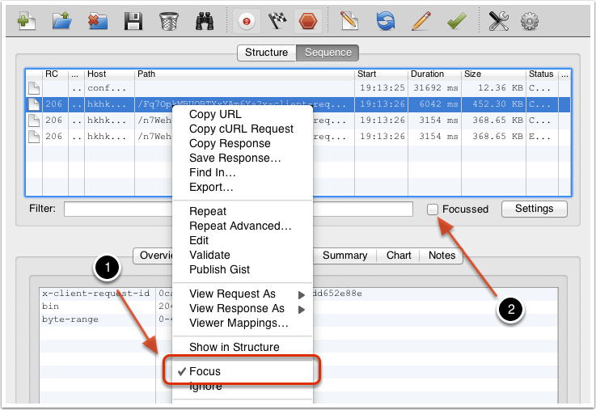
* 菜单栏选择“Proxy -> Recording Settings”，然后选择Include栏，添加一个项目，然后填入需要监控的协议，主机地址，端口号。这样就可以只截取目标网站的封包了。如下图所示：

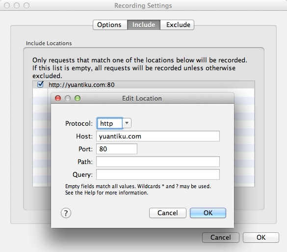

#### 抓取手机上的数据包
Charles一般用于抓取本地上的网络数据包，但更多的是用来抓取手机上的网络数据包，同样的思路，也是让手机数据流量走Charles代理即可。具体分为以下两个步骤：
1. Charles端，首先需要将Charles的代理功能打开，仍然是菜单栏“Proxy -> Proxy Settings”，填入代理端口8888，并且勾上“Enable transparent HTTP proxying”就完成了在Charles上的设置。
2. 手机端，将手机端Wifi代理设置到Charles主机IP和对应端口号（和1中代理端口号相同）。

### 7.4.3 Charles使用进阶
#### 抓取HTTPS数据包
* PC端，抓取并分析Https数据包，那么需要安装Charles的CA证书。具体步骤如下：首先我们需要在主机上安装证书，菜单栏“Help -> SSL Proxying -> Install Charles Root Certificate”。然后在目标网络请求上设置SSL proxy，如下图所示：

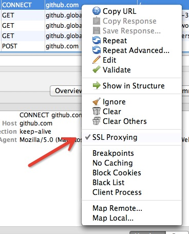

* 手机端，抓取手机上Https数据包，需要在手机上安装相应的证书。仍然是菜单栏“Help -> SSL Proxying -> Install Charles Root Certificate on a Mobile Device or Remote Browser”，可以看到Charles弹出的简单的安装教程。具体步骤：首先按照我们之前说的教程，在手机上设置Charles为代理，然后在手机浏览器中访问地址：http://charlesproxy.com/getssl，即可打开证书安装的界面，然后同PC端一样，在目标网络请求上右键设置SSL proxy即可。

#### 模拟慢速网络
在做移动开发的时候，一般需要测试慢速网络或者高延迟的网络下的应用表现是否正常。具体设置如下：仍然是菜单栏“Proxy -> Throttle Setting”，勾选上“Enable Throttling”，并且可以设置Throttle Preset的类型，如果我们只想模拟指定网站的慢速网络，可以再勾选上图中的“Only for selected hosts”项，然后在对话框的下半部分设置中增加指定的hosts项即可。具体如下图所示：

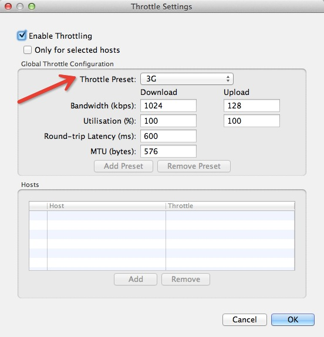

#### 修改网络请求内容
有些时候为了调试服务器的接口，我们需要反复尝试不同参数的网络请求。Charles提供网络请求的修改和重发功能，具体步骤：目标网络请求右键选择“Edit”，即可创建一个可编辑的网络请求。
我们可以修改该请求的任何信息，包括URL地址、端口、方法、参数等，之后点击“Execute”即可发送该修改后的网络请求。

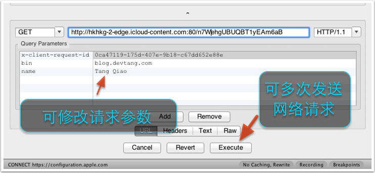

#### 压力测试
我们可以使用Charles的Repeat功能来简单地测试服务器的并发处理能力，具体步骤：目标网络请求右键选择“Repeat Advanced”菜单项，接着我们就可以在弹出的对话框中，选择打压的并发线程数以及打压次数，确定之后，即可开始打压。

#### 修改服务器返回内容
有些时候我们想让服务器返回一些指定的内容，方便我们调试一些特殊情况。Charles提供了Map、Rewrite以及Breakpoints等，都可以达到修改服务器返回内容的目的。这三者在功能上的差异是：Map适合长期地将某一些请求重定向到另一个网络地址或本地文件，Rewrite适合对网络请求进行一些正则替换，而Breakpoints功能适合做一些临时性的修改。
##### Map
Charles的Map功能分Map Remote和Map Local两种，顾名思义，Map Remote是将指定的网络请求重定向到另一个网址请求地址，Map Local是将指定的网络请求重定向到本地文件。具体步骤：菜单栏“Tools -> Map Remote”或“Map Local”即可进入到Map功能的设置页面。对于Map Remote功能，我们需要填写重定向的源地址和目的地址，对于不需要限制的条件，可以留空。如下图所示，将ytk1.yuanku.ws的请求重定向到了www.yuantiku.com。

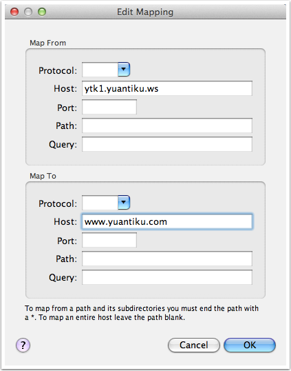

对于Map Local功能，我们需要填写重定向的源地址和本地的目标文件。对于有一些复杂的网络请求结果，我们可以先使用Charles提供的“Save Response…”功能，将请求结果保存到本地（依旧是目标网络请求右键选择“Save Response…”），然后稍加修改，成为我们的目标映射文件。下图是一个示例，将一个指定的网络请求通过Map Local功能映射到了本地的一个经过修改的文件中。

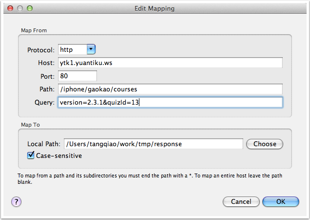

##### Rewrite
Rewrite功能功能适合对某一类网络请求进行一些正则替换，以达到修改结果的目的。例如，假如客户端有一个API请求是获得用户昵称，当前的昵称是“tangqiaoboy”，如下所示：

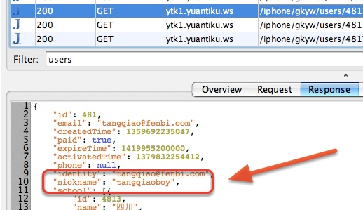

我们想直接修改网络返回值，将tangqiaoboy换成iosboy。启用Rewrite功能，然后设置如下的规则：

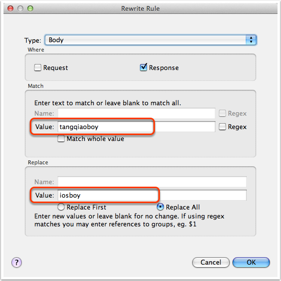

完成设置之后，我们就可以从Charles中看到，之后的API获得的昵称被自动Rewrite成了iosboy，如下图所示：

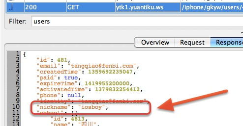

##### Breakpoints
Breakpoints功能类似我们在IDE中设置的断点一样，当指定的网络请求发生时，Charles会截获该请求，这个时候，我们可以在Charles中临时修改网络请求的返回内容。具体步骤：目标网络请求右键选择“Breakpoints”，之后该URL网络请求会在request和response时分别进行断点。还可以从菜单“proxy->Breakpoints”打开“Breakpoints Settings”窗口进行更细致的调整。下图是我们临时修改获取用户信息的API，将用户的昵称进行了更改，修改完成后点击“Execute”则可以让网络请求继续进行。

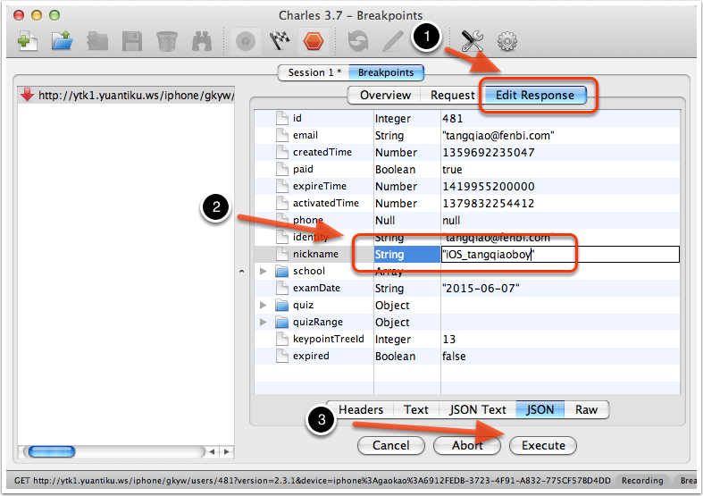

需要注意的是，使用Breakpoints功能将网络请求截获并修改过程中，整个网络请求的计时并不会暂停，长时间的暂停可能导致客户端的请求超时。
