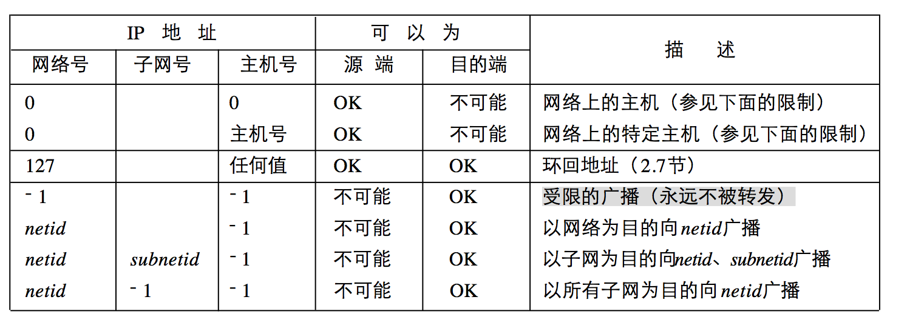

## 7.5 IP层协议简述

### 7.5.1 网络层简述
网络层提供主机到主机的通信服务，我们从以下几个方面来详细讨论该服务模型。

#### 转发和路由选择
网络层的主要作用是：将分组从一台主机（发送端）移动到另一台主机（接收端）。为此需要两种重要的网络层功能：
* 转发：当一个分组到达路由器的一条输入链路时，路由器必须将该分组移动到适当的输出链路。
* 路由选择：当分组从发送方流向接收方时，网路层必须决定这些分组所采用的路由或路径。

每个路由器都有一张转发表，当一个分组到达时，路由器首先检查该分组首部字段的值，通过该值作为索引在路由器中的转发表查询转发项，从而转发分组。而该路由表则由路由选择算法来进行维护。

#### 服务模型
当传输层向网络层传递一个分组，能由网路层提供的特定服务包括：确保交付，有序交付，确保最小带宽，确保最大时延抖动，安全性服务等。因特网的网络层提供的是尽力而为服务，不保证交付，也不保证有序。具体如下表所示：

网络体系结构  |服务模型    |带宽保证     |无丢包保证  |有序       |定时        |  拥塞指示
------------|----------|-----------|-----------|----------|-----------|-----------
因特网       |尽力而为    |无         |无         |无序       |不维护      |无
ATM         |CBR       |保证恒定速率 |是         |有序       |维护        |不会出现拥塞
ATM         |ABR       |保证最小速率 |无         |有序       |不维护      |提供拥塞指示

ATM网络体系结构提供了多重服务模型，比因特网中尽力而为的服务模型要好。

#### 虚电路和数据报网络
我们知道传输层可以为应用程序提供无连接服务（UDP）或面向连接服务（TCP）。而网络层也可以在两台主机之间提供无连接服务或者面向连接服务。同样：网络层连接服务也是以源和目的主机之间的握手开始，而无连接服务则没有任何握手准备动作。两者的区别是：传输层面向连接服务是在位于网络边缘的端系统中实现的；而网络层面向连接服务是在网络边缘的端系统和网络核心的路由器中一起实现的。

##### 虚电路网络
在虚电路网络中（ATM网络就是虚电路网络），路由器必须为活动连接维持连接状态信息。每跨越一个路由器创建一条新连接，就必须在该路由器的转发表中添加一个新的连接项；每当释放一条连接，就必须删除该项。这里我们不详细讨论其具体实现。

##### 数据报网络
因特网使用的数据报网络，端系统需要发送一个分组时，它就为该分组加上目的端系统的地址，然后将分组推进网络中。当分组从源到目的地传输时，它通过一系列路由器传递，这些路由器都有一个将目的地址映射到链路接口的转发表，当分组到达路由器时，路由器使用该分组的目的地址在转发表中查找适当的输出链路接口，然后路由器将该分组向该输出链路接口转发。

需要注意的是：虽然数据报网络中的路由器不维护连接状态信息，但是其在转发表中维护了转发信息，而且该转发表通过路由选择算法进行修改。

之后我们看一下因特网中网络层如何完成编址和转发。因特网的网络层主要有以下三个组件：IP协议、路由选择协议和ICMP协议。

### 7.5.2 IP协议
IP层向上提供不可靠、无连接的数据报传送服务：不可靠的意思是它不保证IP数据报能成功地到达目的地，如果发生某种错误，其处理策略是丢弃该数据报，然后发送ICMP消息给发送端；无连接的意思是IP不维护任何关于后续数据报的状态信息，每个数据报的处理都是相互独立的，这就意味着IP数据报可能是乱序的。

#### IP协议首部
IP数据报的格式如下图所示：

这里简要谈及两个首部：
1. 标识、标志和片偏移是用于IP数据报分片和重组的：对于发送端发送的每一份IP数据报，其标识字段都包含了一个唯一值，标识相同的IP片将会被重新组装；标志字段用来表示该分片之后是否还有新的分片；片偏移字段用来表示该片偏移原始数据报开始处的位置。一个路由器转发一个IP数据报时，如果出链路的MTU比该IP数据报的长度要小时，就需要分片；而为了网络内核保持简单（尽可能快地转发分组，减少网络拥塞），数据报的重组放在端系统中。需要注意的是：IPv6取消了分片，当路由器接收到的IPv6数据报太大而无法转发到出链路时，路由器只需要丢弃该报文，并向发送方回送一个“分组太大”的ICMP差错报文即可。这是因为分片和重组是一个耗时的操作，将该功能从路由器中删除并放到端系统中，可以大大加快网络中的IP数据报转发速度。
2. TTL：数据报可以经过的最多路由器数，用来确保数据报不会永远在网络中循环。

#### IP地址详解
单播地址和广播地址，参见下图，其中0表示所有的比特位全为0，－1表示所有的比特位全为1；netid、subnetid和hostid表示不为全0或者全1的对应字段，子网号为空表示该地址没有进行子网划分：

多播地址：224.0.0.0-->239.255.255.255，其中224.0.1.0-->238.255.255.255是全球范围都可使用的多播地址，而239.0.0.0-->239.255.255.255是限制在一个组织的范围。我们知道UPNP中设备发现使用的地址就是239.255.255.250:1900。

专用网络地址（一般用于内网地址）：
* A类地址：10.0.0.0-->10.255.255.255；
* B类地址：172.16.0.0-->172.31.255.255；
* C类地址：192.168.0.0-->192.168.255.255。

### 7.5.3 ICMP协议

#### ICMP协议
上文说过，IP协议并不是一个可靠的协议，它不保证数据被送达，而保证数据送达的工作应该由其他的协议来完成，其中一个重要的协议就是ICMP协议，其大致分为两类：
1. 查询报文：Ping查询、子网掩码查询以及时间戳查询等。
2. 差错报文：当传送IP数据包发生错误时，比如主机不可达、网络不可达等等，ICMP协议将会把错误信息封包，然后回送给主机，给主机一个处理错误的机会，这也就是为什么建立在不可靠IP层协议之上的TCP协议可以做到可靠的原因。

需要注意的是为了防止ICMP差错报文对广播分组响应带来的广播风暴，在以下情况下，是不产生ICMP错误报文的：
1. ICMP差错报文不会产生ICMP差错报文（但IMCP查询报文可以产生ICMP差错报文），以防止IMCP的无限产生和传送；
2. 目的地址是广播地址或多播地址的IP数据报；
3. 作为链路层广播的数据报；
4. 不是IP分片的第一片；
5. 源地址不是单个主机的数据报，即源地址不能为零地址、环回地址、广播地址或多播地址。

#### Ping
Ping利用ICMP协议来测试另一个主机是否可达，原理是发送类型码为0的ICMP请求，收到请求的主机则回送类型码为8的ICMP响应。Ping程序可以计算间隔时间，并计算有多少个包被送达。
Ping还提供了IP记录路由选项的机会，Ping请求数据报在每经过一个路由器的时候，路由器都会把自己的ip放到该数据报中。而目的主机则会把这个ip列表复制到响应数据报发回给主机。但是，IP首部只有有限空间来存放IP地址，最多存放9个IP地址。实际上观察IP路由选项，一般使用Traceroute。

#### Traceroute
Traceroute是用来侦测主机到目的主机之间所经路由情况的重要工具。

Traceroute的原理很奇特，它收到目的主机的IP后，首先给目的主机发送一个TTL=1的UDP数据包，而经过的第一个路由器收到这个数据包以后，就自动把TTL减1，而TTL变为0以后，路由器就把这个包丢弃了，并产生一个超时的ICMP差错报文给主机。主机收到这个数据报以后再发一个TTL=2的UDP数据报给目的主机，然后第二个路由器给主机发超时的ICMP差错报文。如此往复直到到达目的主机。这样，Traceroute就拿到了所有的路由器IP。

这里有另外一个问题，如何判断已经到达目的主机呢？Traceroute选择一个不可能的值作为UDP端口号（大于30000），使得目的主机的任何一个应用程序都不可能使用该端口。这样当数据报到达目的主机的时候，目的主机回送一个端口不可达的ICMP差错报文。这样Traceroute根据接收到的ICMP差错报文是超时还是端口不可达，以判断是否到达目的主机。

### 7.5.4 IP路由

#### 路由表
IP数据报的交付是通过匹配路由表进行的，路由表有三项重要数据：目的网络地址、子网掩码和下一跳地址。交付时是通过匹配目的网络地址来确定下一跳路由器，这样IP数据报最终一定可以找到目的主机所在网络上的路由器，然后此路由器时尝试向目的主机进行交付。

需要注意的是：主机本身也是路由器（和路由器不同的是不会转发报文），也有路由表，用于主机向外发送报文，一般主机是不会转发报文的。主机如果拥有多个网络接口，通过配置是可以成为路由器的，比如笔记本通过网线连接外网时，是可以配置为AP，供其他无线设备上网，此时笔记本就充当了一个路由器。

#### 子网掩码和子网寻址
上文我们说过，IP数据报的路由是通过匹配目的网络地址来进行的。一个IP地址可以分为三部分：网络号+子网号+主机号，其中网络地址是网络号＋子网号、而主机号为0的IP地址，但是从IP数据报中无法得知目的主机地址的网络地址（并不清楚其是否划分了子网），子网掩码就是为了确定一个目的地址的网络地址的，具体而言子网掩码就是网络号＋子网号＝1，而主机号为0的一个特殊IP。例如一个B类地址：210.30.109.134，如果子网掩码是255.255.255.0，则将两者逐位相“与”，即可得到子网号210.30.109.0，从而完成了子网寻址。

#### IP路由选择
路由器（主机本身也是路由器）转发分组的算法如下：
1. 从收到的数据报的首部获取目的IP地址D；
2. 先判断是否为直接交付：对路由器直接相连的网络（路由表）逐个进行检查，用各网络的子网掩码和D逐位相“与”，看结果是否与相应的目的网络地址匹配。若匹配，则将分组直接交付（转换为MAC地址，将数据报封装成帧发送出去）；否则则为间接交付，到下一步；
3. 对路由表中的每一行（目的网络地址、子网掩码、下一跳地址），用其中的子网掩码和D逐位相“与”，是否与该行的目的网络地址匹配。若匹配，则把数据报交付给该行指明的下一跳路由器；否则到下一步；
4. 若路由表有一个默认路由（默认网关），则把数据报交付给路由表中所指明的默认路由器。否则报告转发分组失败。

需要注意的是：第2步和第3步过程是相同的，都是匹配路由表中的每一行。这里只是区分了直接交付和转发。

这里简述以下链路层交付的原理：当路由器收到一份IP数据报后，通过路由表匹配出下一跳的地址后，通过ARP获取到其MAC地址，然后将该数据报封装成帧（填写其源MAC地址和目标MAC地址），通过数据链路层交付出去。即MAC地址是每过一次路由器都会变化的，而IP地址一般是不变的（NAT除外）。而数据链路层上，同一个网络下的所有主机和路由器都会收到该帧，这些主机和路由器会进行MAC匹配，如果不匹配，则会丢弃该帧（混杂模式下会接收所有帧）。
