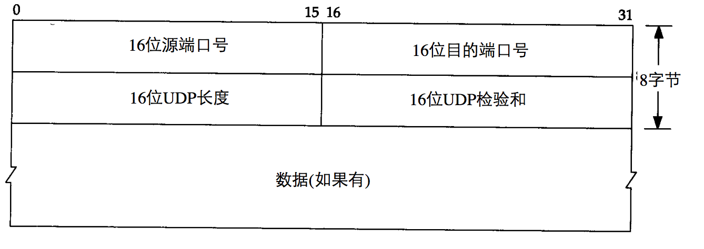
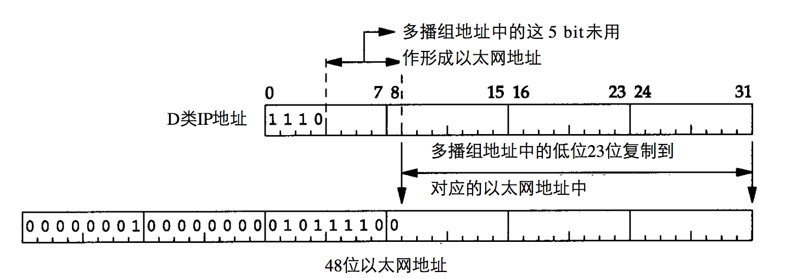

## 7.6 UDP协议详解

### 7.6.1 传输层简介
在发送端，传输层将从应用程序接收到的报文转换成传输层分组（主要是分块、加上传输层首部等），然后将这些报文段传递给网络层，网络层将其封装为网络层分组并向目的地发送。在接收端，网络层从数据报中提取该报文段，并将该报文段向上交付给传输层，传输层则处理该报文，并将该报文中的数据交付给接收端应用程序。

需要注意的是：传输层协议是在端系统中而不是在路由器中实现的，网络路由器仅作用于该数据报的网络层字段，不会检查其中的传输层字段。

### 7.6.2 UDP协议
UDP是一个面向数据报的传输层协议，进程的每个输出操作都会产生一个UDP数据报，并封装成一份IP数据报。这和面向字节流的协议（如TCP）不同，TCP中应用程序产生的数据和真正发送的IP数据报之间可能没有什么联系。

#### UDP首部

这里我们简单看一下其相关字段：
1. 端口号：IP地址只能标识一个主机，而端口号用来标识具体的应用程序。
2. UDP长度：UDP长度是指UDP首部和数据的字节长度，理论上可以达到65535字节。由于MTU的问题，一般要进行IP分片，这个过程是对UDP协议透明的，UDP不需要关心IP层如何对数据分片和重组。
3. UDP检验和：UDP检验和覆盖UDP首部和数据，这和IP检验和是不同的，IP检验和只覆盖IP首部。UDP检验和是可选的，而TCP检验和是必需的。

UDP和TCP都包含一个伪首部，这是为了计算检验和而设置的。伪首部包含IP首部一些字段，其目的是让UDP两次检查数据是否已经正确到达目的地。如果发送端没有打开检验和选项，而接收端计算检验和有差错，那么UDP数据将会被悄悄的丢掉（不保证送达），而不产生任何差错报文。

### 7.6.2 多播与广播
为了弄清广播和多播，需要了解主机对信道传送过来的数据帧的处理过程：
1. 网卡查看有信道传过来的数据帧，确定是否接收该帧，若接收就将它上交给设备驱动程序。
2. 一般网卡仅接收目的地址是本网卡MAC地址或者广播地址的数据帧，但是如果网卡设置为混杂模式，则会接收每个数据帧，wireshark的工作原理就是将网卡配置为混杂模式。
3. 网卡经过配置后可以接收目的地址为多播地址或者某子网多播地址的数据帧。对于以太网而言，当地址中最高字节的最低位设备为1时，代表该地址是一个多播地址，16进制表示为01:00:00:00:00:00（以太网广播地址FF:FF:FF:FF:FF:FF可以看作是以太网多播地址的特例）。

设备驱动程序随后将数据帧传送给下一层，比如当帧类型是IP数据报时，就传送给IP层。IP层根据IP地址中的源地址和目的地址进行更多的过滤检查。

#### 广播
广播是主机针对某一个网络上的所有主机发送数据包，这个网络可以是网络，子网以及所有的子网，其目的地址具体可以参见IP地址分类。广播所用的MAC地址FF:FF:FF:FF:FF:FF，网络内所有的主机都会收到这个广播包，网卡只要把MAC地址为FF:FF:FF:FF:FF:FF的数据交给设备驱动程序就可以了。

#### 多播
可以说广播是多播的特例，多播就是给一组特定的主机（多播组）发送数据，多播的MAC地址是最高字节的最低位为1，多播组的IP地址是224.0.0.0-239.255.255.255。

本节只讨论单个物理网络的多播模型，对于单个物理网络以外需要通过路由器转发多播数据这种情况，我们会在IGMP协议中详细讨论这个问题。

这里简单说明多播的过程，对于发送端而言，没有任何区别，就是指定一个多播IP作为目标地址，然后发出该数据包，这个数据包会被传送到这个多播组中的每一个主机。对于接收端（多播组主机），它需要加入一个多播组，也就是指定一个多播IP，这是应用层需要做的。但是之前我们说了，在数据链路层是通过网卡MAC地址匹配决定是否接收该数据包，匹配通过，才会向上交付。显然只指定一个多播IP是不够的，还需要给网卡额外指定一个多播MAC地址（这一过程是对上层应用透明的），这就涉及到多播IP到多播MAC地址的转换，与多播IP想对应的多播MAC地址范围是01:00:5E:00:00:00-->01:00:5E:7F:FF:FF。具体的转换过程是：将多播IP的低23位映射到MAC地址的低23位，具体可以参见下图。

很明显，由于多播IP中的高5位被忽略，因此每个多播MAC地址对应的多播IP地址不是唯一的，事实上是32个。这就意味着，网卡可能会接收到主机不想接收的多播数据帧，那么设备驱动程序或者IP层就必须对数据报进行过滤。

总结：单播、广播和多播的性质是一样的，路由器会把数据帧放到局域网里面，然后网卡会通过MAC地址对这些数据帧进行过滤，然后交付给上层。一般情况下，仅通过目的地址是本网卡MAC地址或者广播地址的数据帧，加入多播组相当于指定网卡额外匹配相对应的多播MAC地址。而且网卡可以设置为混杂模式，此时不会进行过滤数据帧，会接收每一个数据帧交付给上层。

#### IGMP协议
上文中，我们指出多播就是给网卡额外指定一个多播IP和多播MAC，但是和网卡本身MAC和单播IP不同的是：多播是主机上的一个应用程序启动的，它是动态的。这里就有一个问题：该网络路由器如何知道该网络下还有没有处于某个多播组的主机，以决定是否将该多播组数据报传送过去。IGMP协议就是为了解决这个问题，多播路由器使用IGMP报文获取到其网络下多播组成员的变化情况。具体使用规则如下所示：
1. 当一个进程加入一个多播组时，主机需要发送一个IGMP报告，需要注意的是即使多个进程加入同一个多播组，只发送一个IGMP报告（多播路由器只需要知道其网络下是否有某个多播组的主机以决定是否转发该数据报，不需要知道细节，比如多少个主机，主机上的多少个进程）；
2. 需要注意的是，当进程离开一个多播组时，主机不发送IGMP报告，即使是该组中的最后一个进程。而是在随后收到的IGMP查询报文中不再发送IGMP报告报文；
3. 多播路由器定时发送IGMP查询来了解是否还有主机加入了某个多播组；
4. 如果主机处于某个多播组中，则发送一个IGMP报告来响应一个IGMP查询。

IGMP报文格式可以参考TCP/IP详解中第13章，其中查询报文中多播地址是0，而响应报文中则是具体的多播地址。
