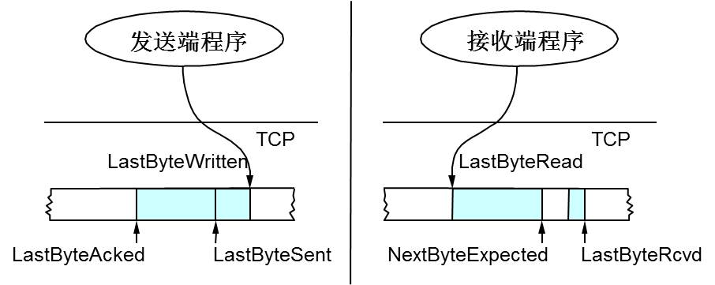

## 7.7 TCP协议详解

### 7.7.1 TCP协议简介
与UDP不同的是，TCP提供一种面向连接、可靠的字节流服务。TCP通过下列方式提供可靠性：
1. 应用数据被分割成TCP认为最适合发送的数据块，UDP中应用程序产生的数据报长度将保持不变。
2. 当TCP发出一个段后，它启动一个定时器，等待目的端确认收到这个报文段，如果不能及时收到一个确认，将重发这个报文段。
3. 当接受端TCP收到发送端的数据时，它将回送一个确认。
4. TCP将保持它首部和数据的检验和，这是一个端到端的检验和，目的是检测数据在传输过程中的任何变化。如果收到段的检验和有差错，TCP将丢弃这个报文段，并且不进行确认（期望发送端会超时重发）。
5. TCP将对收到的数据进行重新排序，以正确的顺序交给应用层。
6. TCP提供了流量控制，TCP的接收端只允许发送端发送接收端缓冲区所能接纳的数据，以防止较快主机致使较慢主机的缓冲区溢出。

总结，TCP可靠性主要有两层意思：可靠交付和顺序到达，而提供可靠性的主要方式就是超时重发机制，虽然TCP可以用ICMP报文来处理各种差错，但是这同样也是不可靠的，最可靠的方式就是只要不得到确认，就重新发送数据报，直到得到对方的确认为止。

需要注意的是，TCP提供的字节流服务，TCP不在字节流中插入纪录标识符，不提供消息保护边界服务，消息边界一般要由上层应用协议自己提供（具体可以参考《Netty权威指南》第四章）。

#### TCP首部
TCP首部的数据格式如下图所示，这里简单讲解一下，具体可以参考《TCP/IP详解》卷一P172：

这里我们留意以下几个首部：
1. Sequence Number标识从发送方发送的数据字节流，它表示在这个报文段中的第一个数据字节。TCP利用这个序号进行重新排序，将接收到的数据以正确的顺序交付给上层应用。
2. ACK Number就是ACK，用于确认收到，其值是接收端所期望收到的下一个序号，即上次成功收到的数据字节序号加1，其主要用来解决丢包和重传的问题。
3. Flags：包类型，用于操控TCP状态机。
4. Window：滑动窗口大小，用于进行流量控制。

### 7.7.2 TCP状态机
网络数据的传输都是通过路由器中转，局域网送达的方式，实际上是没有物理连接的。那么TCP中的连接，其实是通信双方维护的一个状态（最主要是SequenceNumber)。

#### 建立连接和结束连接

建立连接，主要是用来初始化首部中SequenceNumber的初始值，通信双方需要互相通告对方自己的Initial Sequence Number，所以叫做SYN（Synchronize Sequence Numbers)，也就是上图中的x和y。这个数字要作为之后的数据通信的序号，TCP利用这个序号进行重新排序，将接收到的数据以正确的顺序交付给上层应用。

总结：TCP的每一个数据报都要进行ACK的（ACK本身不进行ACK），无论是建立连接，数据传输和结束连接。而由于TCP是全双工的，建立连接和断开连接都是要进行两个方向上的握手，总共要四个回合。而建立连接只需要三次握手，是因为服务器将对客户端的ACK报文和自己的SYN报文放在了一起，减少了一个回合。而结束连接时由于半关闭的特性，每个方向都必须单独的进行关闭，不能认为一个方向的结束是整个连接的结束。

#### TCP的状态迁移图
TCP的状态迁移图如下所示：

这张图包含了服务器的状态迁移和客户端的状态迁移，所以看起来比较复杂。在这个图中，从TIME_WAIT状态到CLOSED状态，有一个超时设置，即为2MSL。关闭时要进入TIME_WAIT状态，而不直接到CLOSED状态。之后我们会详细叙述为什么需要TIME_WAIT状态。

### 7.7.3 TCP可靠机制
TCP保证可靠性的主要原理就是超时重传机制，其原理是在发送一个数据报以后就开启一个定时器，在一定时间内如果没有收到这个数据报的ACK报文，那么就重新发送数据，直到收到ACK确认报文为止。这里的关键在于超时和重传的策略，即超时间隔和重传频率。

#### 超时重传
TCP在发送一个数据报以后就开启一个定时器，在一定时间内如果没有收到这个数据报的ACK，那么就重发该数据报，直到收到ACK为止。需要注意的是由于SequenceNumber和ACK都是代表字节数，所以ACK只能确认最后一个连续的包，不可以跳着确认，否则发送端就会以为之前的都收到了（由于这个确认机制效率很低，TCP实现已经支持SACK了，选择确认）。
1. 超时策略：该策略的关键是对一个连接的往返时间（RTT）的测量，由于网络状况是实时变化的，那么RTT也是实时在变的，TCP必须跟踪这些变化并相应地改变其超时时间。关于如何计算超时时间，比较复杂，这里就不再详述，具体可以参考《TCP/IP详解》卷一第21章。需要注意的是，RTT是反应连接的网络状况的，所以一个连接上，只有一个RTT测量定器。
2. 重传策略：关于重传策略方面的话题，会在下节中的流量控制里详细谈到。

#### 快速重传
TCP还有一种不以时间驱动，而以数据驱动方式的重传策略：如果数据包没有连续到达，接收端就会ACK最后那个可能走丢的数据包，如果发送方连续收到3次重复的ACK，就立即重传该数据包，无需等待超时定时器溢出。比如：如果发送方发出了1，2，3，4，5份数据，第一份先到送了，于是ACK回2，结果2因为某些原因没收到，3到达了，ACK继续回2，后面的4和5都到了，ACK仍然回2（因为2还是没有收到），于是发送端收到了三个ACK=2，知道了2丢失了，于是就马上重转2。然后接收端收到了2，此时因为3，4，5都收到了，于是ACK回6。

需要注意的是：当TCP重传报文时，它不一定要重传相同的报文段，相反，TCP允许进行重新分组而发送一个较大的报文段。TCP是使用字节序号而不是报文段序号来进行识别它所要发送的数据和进行确认。

### 7.7.4 流量控制
TCP是可靠的协议，这就要求TCP必须匹配发送方和接收方的速率差，不能因为发送方发送的速度太快导致接收方接收缓冲区溢出。TCP采用滑动窗口协议进行流量控制，TCP首部里有一个字段叫Window，又叫Advertised-Window，这个字段是接收端告诉发送端自己还有多少缓冲区可以接收数据，于是发送端就可以根据这个数字来决定发送多少数据，而不会导致接收端缓冲区溢出。为了详细说明滑动窗口，我们需要先看一下TCP缓冲区的一些数据结构：

上图中，我们可以看到：接收端LastByteRead指向了TCP缓冲区中读到的位置，NextByteExpected指向的地方是收到的连续包的最后一个位置，LastByteRcved指向的是收到的包的最后一个位置，我们可以看到中间有些数据还没有到达，所以有数据空白区。发送端的LastByteAcked指向了被接收端Ack过的位置（表示成功发送确认），LastByteSent表示发出去了，但还没有收到成功确认的Ack，LastByteWritten指向的是上层应用正在写的地方。于是，接收端在给发送端回送的ACK中会汇报自己的AdvertisedWindow = MaxRcvBuffer – LastByteRcvd – 1，而发送方会根据这个窗口来控制发送数据的大小，以保证接收方可以处理。

下面我们来看一下发送方的滑动窗口示意图：

上图中分成了四个部分，分别是：（其中那个黑框就是滑动窗口）
1. Categgory#1代表已收到ACK确认的数据。
2. Categgory#2代表已经发送还没收到ACK的数据。
3. Categgory#3代表在窗口中还没有发出的数据（接收方还有空间）。
4. Categgory#4代表窗口以外的数据（接收方没空间）。

#### 0窗口和坚持定时器
滑动窗口协议中指出如果接收端的ACK确认报文中的窗口大小为0时，则发送方应停止发送数据报，需要注意的是就算接收端的窗口非0，也不会再发ACK通知窗口非0，此时则陷入死锁：接收端等待接收数据，而发送方则等待允许它继续发送数据的窗口更新。为防止这种死锁，发送使用一个坚持定时器来周期地向接收方查询，以便发现窗口是否已经增大。

#### 糊涂窗口综合症
基于窗口的流量控制方案，会引起糊涂窗口综合症的问题，具体表现为，接收方可以通告一个小的窗口（而不是一直等到有大的窗口才通告），而发送方也可以发送少量的数据（而不是等待其他的数据以便发送一个的报文段），这样就会让网络中充满小TCP数据报，从而影响网络利用率。TCP的解决方案是：
1. 接收方不通告小窗口：如果收到的数据导致窗口小于某个值时，则直接ACK（0）给发送方，这样就阻止了发送方继续发送数据。等到接收端自己处理了一些数据后窗口>=MSS时，或者接收缓存有一半为空时，就把窗口打开让发送方继续发送数据。
2. 发送方采用Nagle算法，这个算法的思路也是延时处理，它有两个主要的条件：窗口>=MSS或者满长度的数据；等待时间超过200ms。当这两个条件有一个满足时，就发送数据，否则就继续攒数据。

### 7.7.5 拥塞控制
TCP是可靠的协议，其主要依赖的是重传机制，也就导致TCP必须进行拥塞控制。因为丢包重传代表网络状况已经比较糟糕了，如果此时不加控制的盲目重传只会导致网络的负担更重，即更大的延迟和更多的丢包，于是进行恶性循环状态，最终结果是TCP的重传导致了网络的不可用。

由于网络状态很难进行精确的测量，所以拥塞控制方面也就比较复杂。具体而言，拥塞控制主要有四个算法：慢启动，拥塞避免，拥塞发生，快速恢复。这里有两个概念，拥塞窗口记做cwnd，慢启动门限记做ssthresh。

#### 慢启动
首先，我们来看一下TCP的慢启动，慢启动的意思是对于刚刚加入网络的连接，一点一点地提速。慢启动的具体算法如下：
1. 连接刚建好时先初始化cwnd = 1，表明可以传一个MSS大小的数据；
2. 每当收到一个ACK，cwnd++，其结果就是每过一个RTT，cwnd = cwnd * 2，呈指数上升关系；
3. 当cwnd >= ssthresh时，就会进入拥塞避免阶段。

#### 拥塞避免
上面提到慢启动门限，其具体含义是，当cwnd >= ssthresh时，就会进入拥塞避免阶段，而在门限以内就采用慢启动算法。下面我们来看看拥塞避免的工作过程：每当收到一个ACK时，cwnd = cwnd + 1/cwnd，其结果就是每过一个RTT，cwnd++。这样以避免到达门限之后继续过快的增长导致网络拥塞，慢慢地调整到网络的最佳值。

#### 拥塞发生
当发生丢包的时候，也就是相关的ACK没有收到，需要进入重传阶段，这时会有两种情况：
1. RTO超时，重传数据包。TCP认为此时网络状况已经很非常糟糕，反应也很强烈：ssthresh=cwnd/2，cwnd重置为1，重新进入慢启动过程；
2. 快速重传，也就是在收到3个重复的ACK时就开启重传，而不用等到RTO超时。此时的处理方式：cwnd=cwnd/2，ssthresh=cwnd，进入快速恢复阶段。

上面我们可以看到RTO超时后，ssthresh会变成cwnd的一半，这意味着，如果cwnd<=ssthresh时出现的丢包，那么TCP的ssthresh就会减了一半，然后等cwnd又很快地以指数级增涨爬到这个地方时，就会成慢慢的线性增涨。我们可以看到，TCP是怎么通过这种强烈地震荡快速而小心得找到网站流量的平衡点的。

需要注意的是：根据拥塞发生时的处理方法可知：RTO超时重传对性能影响很大，很多时候网络读写性能较差时主要原因就是发生了大量的RTO超时重传。当网络性能不好时，可以尽量降低发包速度，一定不要触发RTO超时重传。

#### 快速恢复
快速重传和快速恢复算法一般同时使用。快速恢复算法认为，当收到3个或更多的重复ACK时，说明网络状况并不是非常糟糕，不需要RTO超时那样反应那么强烈。进入快速恢复之前，肯定是先进入了快速重传阶段则cwnd和ssthresh已被更新：cwnd=cwnd/2，ssthresh=cwnd。而快速恢复算法则是：
1. cwnd=ssthresh+3*MSS（3的意思是确认有3个数据包被收到了）；
2. 重传重复的ACK指定的数据包；
3. 如果再收到重复ACK，那么cwnd=cwnd+1；
4. 当下一个确认新数据的ACK到达时，那么cwnd=ssthresh，然后就进入了拥塞避免阶段了。

### 7.7.6 延迟确认和Nagle算法
针对小流量交互型数据流（数据报较多，而数据量很小），TCP尽可能地将小的数据报合并成大的数据报，具体而言延迟确认，合并确认数据报；Nagle算法，合并正常流量数据报。

#### 延迟确认
该算法是指当主机收到对端主机的TCP数据报之后，并不马上发送ACK确认数据报，而是等待一个短暂的时间（一般是200ms），如果这段时间里面主机有回送到对端主机的TCP数据报，那么就把这个ACK数据报“捎带”着发送出去，把两个TCP数据报合并成一个发送。

#### Nagle算法
该算法要求一个TCP连接上最多只能有一个未被确认的未完成的小分组，在该分组的ACK到达之前不能其他的小分组，而是收集这些少量的小分组，并在该分组的ACK到来之后作为一个分组发送出去。该算法的好处是它是自适应的：确认到达得越快，数据也就发送的越快。而在希望减少小分组的低速广域网中，则会发送更少的分组（因为确认来得慢了，可以收集更多的小分组了）。
需要注意的是，是否使用这个算法是要看具体场景的，比如基于TCP的X窗口协议，如果处理鼠标事件时还使用这个算法，那么用户就会明显感觉到卡顿。
