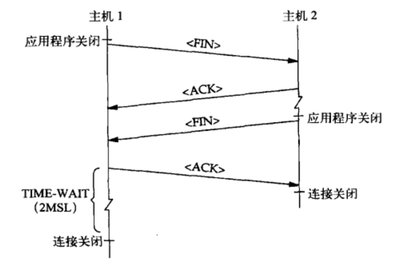

## 7.8 Tcp&Udp编程注意事项
本节我们讨论TCP和UDP编程中的注意事项，主要是TCP和UDP语义方面的问题。

### 7.8.1 FIN和RST详解
本节我们讨论一下FIN和RST的含义：
#### FIN
FIN表示完成发送任务，不代表连接关闭。
* 发送端：发送FIN后，将可以继续接收数据，但不能发送数据。
* 接受端：接收到FIN后，将可以继续发送数据，但不能再接收数据。调用接收操作（read()）时，本端TCP协议栈会返回EOF。

#### RST
RST表示复位、用来异常的关闭连接。
* 发送RST包关闭连接时，不会等发送缓冲区的包都发出去，而是直接丢弃发送缓冲区中的包，发送RST。
* 而接收端收到RST包后，也不必发送ACK包来确认。

一般会在下面三个时候会发送RST包：
1. 建立连接的SYN到达某端口，但是该端口上没有正在监听的服务。
2. TCP协议栈收到了一个不存在的连接上的分组（一般是该连接已关闭）。
3. 请求超时，使用setsockopt的SO_RCVTIMEO选项设置recv的超时时间。接收数据超时时，会发送RST包。

### 7.8.2 TCP的可靠性
前面讨论过很多次，TCP是一个可靠的协议。本节我们讨论一下其可靠的含义。

#### 可靠性
我们知道TCP的可靠性是通过确认重传机制实现的：当接受端收到一个数据包后，接收端TCP协议栈要向发送端TCP协议栈确认，表示数据已经正确收到，发送端TCP协议栈可以删除这些数据的副本了。

TCP是一个端对端的可靠协议，这里的“端点”位于对等的TCP层，而不是对等的应用程序。它的可靠性也就是说TCP层提供可靠的传输机制，而不是应用层。这里有两个意思：
1. 对端TCP协议栈ACK数据和对端应用程序处理该请求是两件事情：由于TCP是字节流协议，无消息边界，TCP协议栈也无法区分具体请求；如果接收端在对数据进行ACK后，但应用程序还没有将其读走之前，就崩溃了。
2. 发送端TCP协议栈不会告诉上层应用程序，这些数据已经发送到对端TCP协议栈。

对应用程序来说，明确地知道对等实体收到了某个特定的报文是非常重要的，其对等实体就必须处理该报文后，正确响应发送端。这种确认信息可能是隐式的，比如，如果客户端向服务器请求一些数据，服务器进行了响应，那么这个响应就隐式地确认收到了原始请求。

一般情况下只要两个对等实体仍然连着，TCP就能保证将数据按序、无损坏地传送。只有连接中断时才会出现故障。有以下三种情况可能引发这类问题：
1. 网络中断；
2. 运行对等应用程序的主机崩溃；
3. 对等的应用程序崩溃。

####　网络中断
当网络出现问题时，一般会出现以下两种情况：
1. 某个中间路由器无法转发该IP数据报，它会向源端主机发送一个ICMP报文，说明目的网络或主机不可达。在这种情况下，有些实现会返回ENETUNREACH或EHOSTUNREACH。
2. 如果没有路由器回送ICMP报文，则应用程序及其TCP/IP协议栈是无法立即获知中断的发生。在这种情况下，发送端最终会超时，并重新发送所有未被确认的段。在发送端TCP丢弃连接并报告错误之前会一直持续这种操作。在传统BSD栈中，发送端TCP会在重传12次（大约9分钟）之后放弃，此时如果有被阻塞的读操作，则会会返回ETIMEDOUT的错误；否则则是接下来的写操作会失败，写操作失败时会携带一个SIGPIPE信号，或EPIPE错误。

#### 对等实体的主机崩溃
这种故障模式与对等实体崩溃不同，因为对等实体的TCP无法通过FIN来通知我们的应用程序，其对等实体已经不在了。
1. 在对等实体主机重启之前，这个错误看起来和网络故障一样：对等实体的TCP不再应答了，本端的应用程序TCP会持续重传未经确认的段，最终，如果对等实体主机没有重启，它就会放弃并向应用程序返回一条ETIMEDOUT错误。
2. 如果在我们的TCP放弃并丢弃连接之前，对等实体主机就重启了，此时会有重传的段到达对等实体刚刚重启的主机，而这台主机并没有连接记录。在这种情况下，对端TCP协议栈会回送一个RST。这样发送端主机才会丢弃连接，应用程序才会收到一条ECONNRESET错误（如果它有挂起的读操作的话），或者会在下一条写操作时得到一个SIGPIPE信号或EPIPE错误。

####　对等实体崩溃
从应用程序的角度来看，对等实体崩溃与对等实体调用close及exit是没有区别的，在这两种情况下，对等实体的TCP协议栈都会向本端的TCP协议栈发送一个FIN，表示对端没有数据发送了。此时可以分为以下两种情况：
1. 本端在等待对端的响应，即阻塞在read()调用上，收到FIN后，则read()调用立即返回，一般返回一个EOF。
2. 否则本端将无法得知对端已经崩溃，直至本端尝试向对端发送数据时，则对端TCP协议栈会收到一个不存在的连接上的分组，会回复一个RST。

### 7.8.3 TCP的写操作
本节我们讨论一下TCP中写操作，首先我们要说明的是，TCP的写操作调用和TCP发送的段之间没有对应关系。

#### 应用程序层
应用程序对一条TCP连接调用写操作时，首先将数据从用户缓冲区copy到内核缓冲区中，一般除了该TCP连接发送缓冲区满，否则写操作是不会阻塞的；然后TCP可能发送全部、部分或者不发送数据。需要注意的问题是写操作出现错误时，该错误如何返回，一般分为以下两个情况：
1. 将数据从用户缓冲区copy到内核缓冲区出现了错误，这是同步错误，由写操作本身返回，该类错误一般都是套接字描述符不可写的问题；
2. 发送数据过程中出现的错误，这是异步错误，此时由于写操作已经返回，所以该错误只能通过下一个操作返回了，而下一个操作一般都是读操作。

#### TCP层
TCP协议栈发送操作比较复杂，主要表现在拥塞控制和流量控制两方面。

### 7.8.4 TIME_WAIT和SO_REUSEADDR
本节我们看一下TIME_WAIT和SO_REUSEADDR的功能。

#### TIME_WAIT
TIME_WAIT是TCP连接拆除阶段出现的，如下图所示：

主机1关闭自己这端的连接，向主机2发送一个FIN。主机2对这个FIN进行ACK，并将这个FIN作为一个EOF返回给应用程序（如果应用程序有一个阻塞的读操作）。之后主机2关闭它那端的连接，向主机1发送一个FIN，主机1回复一个ACK。此时主机2关闭连接并释放资源，但是主机1并没有关闭连接，而是进入TIME_WAIT状态，并在这个状态停留2MSL。

需要注意的是：只有主动关闭的那一端会进入TIME_WAIT状态，而且当连接处于TIME_WAIT状态时有分组达到时，就重启2MSL的定时器。

前面我们说过TCP是一个可靠的协议，一个关键点就是TIME-WAIT：
1. 其维护连接状态：防止主动关闭端发送的最后一条ACK丢失导致被动关闭端超时并重发FIN，此时如果连接关闭，TCP则会丢弃这条连接的记录，用RST来响应，对等实体会产生一个错误状态，不会有序地终止。若此时连接处于TIME-WAIT状态，则可以正确响应对端重传的FIN，即回送一个ACK。
2. 其为耗尽网络中所有此连接的“走失段”提供时间：如果延迟的数据包在连接关闭后到达，如果没有TIME_WAIT，此时可能这两台主机使用同一个端口号建立了一条新连接，这个走失段看起来属于这个新连接，如果其序号碰巧落入新连接的当前接收窗口，则这部分数据会被接收，从而对新连接造成了破坏。如果此时连接处于TIME_WAIT，则TCP只需要数据丢弃并响应RST，这个RST到达发送延迟分组的主机时，这台主机已经没有这条连接的记录了，则会丢弃该RST。

需要注意的是：大量的TIME_WAIT可能会导致服务端资源耗尽，所以一般最好由客户端主动关闭连接，则服务端连接不会进入TIME_WAIT，服务端可以回收这些资源。

#### SO_REUSEADDR
SO_REUSEADDR套接字选项有以下几个功能：
1. SO_REUSEADDR允许服务器启动，绑定并监听一个端口，即使以前建立的将该端口用作它们的本地端口的连接仍存在。此时一般是服务器连接进入TIME_WAIT状态时。
2. SO_REUSEADDR允许同一个端口启动同一个服务器的多个实例，只要每个实例绑定一个不同的本地IP地址即可。
3. SO_REUSEADDR允许完全重复的绑定：当一个IP地址和端口已绑定到某个套接字上时，同样的IP地址和端口还可以捆绑到另一个套接字上，本特性仅支持UDP。

服务端应该总是设置SO_REUSEADDR选项，以防止服务端应用崩溃后，进入TIME_WAIT状态，无法立即重启服务端。

### 7.8.5 UDP的connect操作
我们知道对于TCP而言，调用connect会使本端和对端通过三次握手交换初始状态信息，并将对端的地址和端口绑定到本地套接字上。而对于UDP而言，不需要和对等实体进行共享状态，其调用connect操作完全是本地行为，只是将远程主机的地址和端口绑定到本地套接字上。使用connect之后，发送数据不再使用sendto，而是send。使用connect主要以下几个作用：
1. 提高性能：我们在调用sendto发送UDP数据包时，内核一般会暂时让套接字和目的地址连接，然后发送数据报，最后解除套接字的连接。使用connect后，能显著提高性能。
2. 接收异步错误：当我们调用sendto操作时，该调用是立刻返回的，假如对等实体没有监听该端口，对等实体的UDP协议栈回送一条ICMP端口不可达报文，此时除非使用了connect操作连接了那个套接字，否则是无法收到错误的。前面我们谈论TCP的可靠性和写操作时，也说过网络过程中出现的错误是异步错误，当前操作是无法获取到该错误。
3. 只接收某个对等实体的数据，所以一般UDP服务器上不能使用connect。
