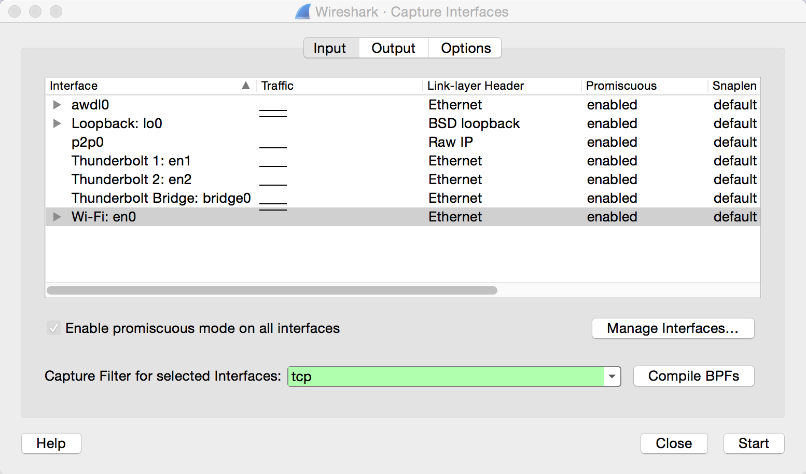

## 7.9 Wireshark详解

### 7.9.1 过滤器
#### 捕获过滤器
捕捉过滤器是数据经过的第一层过滤器，它用于控制捕捉数据的数量，以避免产生过大的日志文件。具体过程如下：Capture->option，然后在最下面的Capture filter...处输入过滤器表达式，然后点击开始即可。

#### 显示过滤器
显示过滤器是一种更为强大（复杂）的过滤器，它允许您在日志文件中迅速准确地找到所需要的记录。使用显示过滤器更加简单，只需要Packet List面板上方的Filter文本框中输入过滤器表达式即可，如下图所示。管理显示过滤器点击右边的“＋”即可。

#### BPF语法
过滤器使用的BPF语法，这个语法被广泛应用在抓包软件中，主要原因是大部分抓包软件都依赖于使用BPF的libpcap/WinPcap库，掌握BPF语法对于抓包非常重要。
使用BPF语法创建的过滤器被称为表达式，并且每个表达式包含一个或多个原语。每个原语包含一个或多个限定词，然后跟着一个ID名字或者数字。典型写法：[[dir] [type] value] [proto]

限定词  |说明  |例子
---------|-------|-----
type |ID名字或数字代表的含义，默认是host |host、net、port
dir |传输方向是前往还是来自ID名字或数字，默认是src or dst |src、dst
proto |限定所要匹配的协议，默认是使用所有与标识符匹配的协议 |ip、tcp、udp、http等

可以使用一下三种逻辑运算符，对原语进行组合。与（&&）、或（||）、非（!）。接下来，我们将会写一些常用的表达式：
1. 主机名和地址过滤器
host 172.16.16.149
src host 172.16.16.149
dst host 172.16.16.149
ether host 00-1A-A0-52-E2-A0
2. 端口和协议过滤器
port 8080
!port 8080
dst port 8080
3. 协议过滤器
tcp
!tcp
4. 协议域过滤器
可以通过检查协议首部中的每一字节来创建基于那些数据的特殊过滤器。这里列举一些常用的协议域过滤器

过滤器  |说明
---------|-----
tcp[13]&&16==16 |设置了ACK位的TCP数据包
tcp[13]&&4==4 |设置了RST位的TCP数据包
tcp[13]&&2==2 |设置了SYN位的TCP数据包
tcp[13]&&1==1 |设置了FIN位的TCP数据包
tcp[13]==18 |TCP SYN-ACK数据包

### 7.9.2 数据包分析
Wireshark提供了很多分析数据包的功能，一般都是在Statistics菜单下。

#### 端点和会话
端点和会话在网络问题定位中非常有用，特别是当你试图找到网络中大规模流量的源头，或者找到哪台服务器最活跃。

#### 名字解析
名字解析是在Capture->Options下，Wireshark有三种名字解析：MAC地址解析，网络名字解析（DNS），传输名字解析（端口解析）

#### 跟踪TCP流
跟踪TCP流（本质上是过滤器）可以将从客户端发往服务器的数据排好序使之很容易查看，这个功能在查看HTTP等文本应用层协议时非常有用。具体而言，就是在任何TCP或者HTTP数据包中右键选择Follow TCP Stream，这时TCP流就会在一个单独的窗口显示出来。

#### IO图
IO图主要显示捕获文件中数据流，可以利用该图，找到数据吞吐的峰值，找出不同协议中的性能时滞，以及用来比较实时数据流。

#### 数据流图
数据流图将连接可视化，以及将一段时间中的数据流显示出来，该功能非常有用。数据流图一般以列的方式将主机之间的连接显示出来，并将流量组织在一起。

#### TCP流图
TCP流图中有很多查看TCP数据包的功能：Time Sequence，Throughput，RTT，Window scaling。

总之，Statistics下很多功能用于分析数据包。

### 7.9.3 无线网络抓包

#### 信道：一次嗅探一个信道
当从WLAN捕获流量时，最特殊的莫过于无线频谱是共享传输介质，而空间上的分离是通过将频谱划分为不同信道实现的，一个信道只是802.11无线频谱的一部分（美国有11个信道，中国有13个信道）。因为WLAN同时只能操作一个信道，就意味着我们只能同时嗅探一个信道。

需要注意的是：某些无限扫描程序使用“跳频”技术，可以嗅探多个信道。比如Kismet。

#### 无线网卡模式
无线网卡有四种工作模式：
1. 被管理模式：无线客户端直接与AP连接时，此时AP管理整个通信过程。
2. Ad hoc模式：网络由互相直连的设备组成，此时双方共同承担AP的职责。
3. 主模式：无线网卡作为AP使用，供其他无线设备接入。
4. 监听模式：此时无线网卡停止收发数据（不接入任何网络），而只监听空口包。

#### 混杂模式和监听模式
在传统的有线网络中，我们知道网卡可以工作在两种模式，即普通和混杂模式。在混杂模式下，我们可以直接对以太网内部的流量进行监听。这个时候网卡不会区分流经其的数据包的目标地址是不是本机，而是向上交付给上层协议处理。

无线网络和有线网络相比，有不同也有相似之处。按照理论来说，当一个无线网卡连接到一个已知的无线网络之后，它可以和传统的以太网一样能设置为混杂模式接受到所有的数据包。但由于无线网卡只工作在一个信道上，所以只可以监听本信道的流量。无线网卡有着一个特殊的模式，即监听模式，这个模式下面无线网卡可以接收到所有它能够接收的无线电信号并试图进行解析。需要注意的是这个模式下，无线网卡接收到的都是空口包，受无线信道加密的影响，很难解析其具体数据。（不太清楚，wireshark是否可以设备密码以破解出数据包细节）
