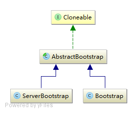

## 8.1 Bootstrap详解
Netty应用程序一般从Bootstrap配置开始，下面我们先看一下其类图



bootstrap的类图比较简单，我们首先分析顶层的AbstractBootstrap，然后分析其子类Bootstrap和ServerBootstrap。

### 8.1.1 AbstractBootstrap
我们首先看一下其中的各字段的意义：
```Java
public abstract class AbstractBootstrap {
    // reactor线程池
    volatile EventLoopGroup group;
    // 通道工厂，主要用来创建初始的Channel
    private volatile ChannelFactory<? extends C> channelFactory;
    private volatile SocketAddress localAddress;
    // channel相关的选项参数
    private final Map<ChannelOption<?>, Object> options = new LinkedHashMap<>();
    // 初始化channel的属性值
    private final Map<AttributeKey<?>, Object> attrs = new LinkedHashMap<>();
    // 业务逻辑Handler，主要是HandlerInitializer，也可能是普通Handler
    private volatile ChannelHandler handler;

    // 设置Channel的无参构造工厂
    public B channel(Class<? extends C> channelClass);
    // 设置Channel工厂
    public B channelFactory(ChannelFactory<? extends C> channelFactory);
    // 创建一个Channel并绑定到本地端口
    public ChannelFuture bind(SocketAddress localAddress);
    // 初始化Channel并且注册到线程池
    final ChannelFuture initAndRegister();
    // 初始化一个Channel
    abstract void init(Channel channel) throws Exception;
}
```

#### channel方法和channelFactory方法
注意到bootstrap包中有一个ChannelFactory接口，我们看一下代码:
```Java
public interface ChannelFactory<T extends Channel> {
    T newChannel();
}
```
其中声明了一个newChannel()方法用来创建一个Channel，那什么时候需要我们创建一个Channel呢？有两种情况：服务端需要一个Channel绑定本地端口然后接受客户端连接时；客户端需要一个Channel去连接服务端时。

接下我们看一下channel()方法：
```Java
public B channel(Class<? extends C> channelClass) {
    if (channelClass == null) {
        throw new NullPointerException("channelClass");
    }
    return channelFactory(new ReflectiveChannelFactory<C>(channelClass));
}
```
接下来我们看一下channelFactory()方法，是一个简单的setter方法：
```Java
public B channelFactory(ChannelFactory<? extends C> channelFactory) {
    if (channelFactory == null) {
        throw new NullPointerException("channelFactory");
    }
    if (this.channelFactory != null) {
        throw new IllegalStateException("channelFactory set already");
    }

    this.channelFactory = channelFactory;
    return (B) this;
}
```
回到刚才channel方法中默认的ReflectiveChannelFactory，我们看一下其实现的newChannel()方法：
```Java
//ReflectiveChannelFactory
public T newChannel() {
    try {
        return clazz.newInstance();
    } catch (Throwable t) {
        throw new ChannelException("Unable to create Channel from class " + clazz, t);
    }
}
```
直接使用clazz.newInstance()反射调用相应Channel的无参构造方法。

如果Channel提供的无参构造方法就能满足需求，只需使用channel()方法设置通道工厂；如果无参构造方法不能满足需求，那么新建一个ChannelFactory类提供特殊的Channel。

#### bind方法
bind()方法是AbstractBootstrap的核心方法，其中有很多重载方法，我们看关键的一个：
```Java
public ChannelFuture bind(SocketAddress localAddress) {
    validate();
    if (localAddress == null) {
        throw new NullPointerException("localAddress");
    }
    return doBind(localAddress);
}
```
其中，validate()方法对参数进行验证，确保关键参数设置正确，其实现比较简单，这里就不贴出代码。我们再来看doBind()方法：
```Java
private ChannelFuture doBind(final SocketAddress localAddress) {
    final ChannelFuture regFuture = initAndRegister();
    final Channel channel = regFuture.channel();
    if (regFuture.cause() != null) {
        return regFuture;
    }

    if (regFuture.isDone()) {
        // At this point we know that the registration was complete and successful.
        ChannelPromise promise = channel.newPromise();
        doBind0(regFuture, channel, localAddress, promise);
        return promise;
    } else {
        // Registration future is almost always fulfilled already, but just in case it's not.
        final PendingRegistrationPromise promise = new PendingRegistrationPromise(channel);
        regFuture.addListener(new ChannelFutureListener() {
            @Override
            public void operationComplete(ChannelFuture future) throws Exception {
                Throwable cause = future.cause();
                if (cause != null) {
                    promise.setFailure(cause);
                } else {
                    promise.registered();
                    doBind0(regFuture, channel, localAddress, promise);
                }
            }
        });
        return promise;
    }
}
```
从代码中可以看出bind分为两步：initAndRegister()以及doBind0()。initAndRegister()代码如下：
```Java
final ChannelFuture initAndRegister() {
    Channel channel = null;
    try {
        channel = channelFactory.newChannel();
        init(channel);
    } catch (Throwable t) {
        ...
    }

    ChannelFuture regFuture = config().group().register(channel);
    if (regFuture.cause() != null) {
        if (channel.isRegistered()) {
            channel.close();
        } else {
            channel.unsafe().closeForcibly();
        }
    }
    return regFuture;
}

abstract void init(Channel channel) throws Exception;
```
initAndRegister方法首先调用channelFactory创建一个channel，然后使用init()方法进行初始化，注意init是一个模板方法，由子类完成具体的初始化过程。初始化完成之后，将channel异步注册到线程池中的某个线程上。

看完了initAndRegister()，我们接着看doBind0方法：
```Java
private static void doBind0(
        final ChannelFuture regFuture, final Channel channel,
        final SocketAddress localAddress, final ChannelPromise promise) {
    channel.eventLoop().execute(() -> {
        if (regFuture.isSuccess()) {
            channel.bind(localAddress, promise).addListener(ChannelFutureListener.CLOSE_ON_FAILURE);
        } else {
            promise.setFailure(regFuture.cause());
        }
    });
}
```
doBind0()方法向channel注册的线程提供一个任务，该任务将channel绑定到本地端口。

#### 总结
我们总结一下bind过程：
1. 使用ChannelFactory创建一个Channel，然后调用init()方法初始化Channel，成功后将其注册到线程池中的一个线程上；
2. 注册事件成功后将Channel绑定到一个本地端口，否则关闭该Channel，异步结果设置为失败。

### 8.1.2 ServerBootstrap
我们看一下其关键字段如下：
```Java
public class AbstractBootstrap {
    // 为accept的客户端channel设置的选项参数
    private final Map<ChannelOption<?>, Object> childOptions = new LinkedHashMap<>();
    // 为accept的客户端channel设置的属性键值对
    private final Map<AttributeKey<?>, Object> childAttrs = new LinkedHashMap<>();
    // subReactor线程池，父类的group成为mainReactor线程池
    private volatile EventLoopGroup childGroup;
    // subReactor线程池的事件处理器，一般为ChannelInitializer初始化处理器链
    private volatile ChannelHandler childHandler;
    
    // 初始化channel
    void init(Channel channel);
}
```

#### init方法
我们看一下init方法，完成的工作有：
* 设置serverChannel的option参数
* 设置serverChannel的属性键值对
* 添加处理serverChannel事件的handler
```Java
void init(Channel channel) throws Exception {
    final Map<ChannelOption<?>, Object> options = options0();
    synchronized (options) {
        channel.config().setOptions(options);
    }

    final Map<AttributeKey<?>, Object> attrs = attrs0();
    synchronized (attrs) {
        for (Entry<AttributeKey<?>, Object> e: attrs.entrySet()) {
            @SuppressWarnings("unchecked")
            AttributeKey<Object> key = (AttributeKey<Object>) e.getKey();
            channel.attr(key).set(e.getValue());
        }
    }

    ChannelPipeline p = channel.pipeline();

    final EventLoopGroup currentChildGroup = childGroup;
    final ChannelHandler currentChildHandler = childHandler;
    final Entry<ChannelOption<?>, Object>[] currentChildOptions;
    final Entry<AttributeKey<?>, Object>[] currentChildAttrs;
    synchronized (childOptions) {
        currentChildOptions = childOptions.entrySet().toArray(newOptionArray(childOptions.size()));
    }
    synchronized (childAttrs) {
        currentChildAttrs = childAttrs.entrySet().toArray(newAttrArray(childAttrs.size()));
    }

    p.addLast(new ChannelInitializer<Channel>() {
        @Override
        public void initChannel(Channel ch) throws Exception {
            final ChannelPipeline pipeline = ch.pipeline();
            ChannelHandler handler = config.handler();
            if (handler != null) {
                pipeline.addLast(handler);
            }

            ch.eventLoop().execute(() -> {
                pipeline.addLast(new ServerBootstrapAcceptor(currentChildGroup, currentChildHandler, currentChildOptions, currentChildAttrs));
            });
        }
    });
}
```
我们看一下添加handler的过程，这是一个初始化处理器ChannelInitializer，主要工作是将用户设置的Handler以及一个serverBootstrapAcceptor添加到serverChannel的处理器链中。需要注意的是，当添加serverBootstrapAcceptor时，不直接使用pipeline.addLast()而是使用ch.eventLoop().execute()向serverChannel注册的线程提交任务是因为：ServerBootstrapAcceptor必须保证被添加到处理器链的最尾部，而当用户自定义的Handler是一个ChannelInitializer时，ServerBootstrapAcceptor的位置将不会是最尾部，所以使用ch.eventLoop().execute()向channel注册到的线程中提交一个任务从而保证ServerBootstrapAcceptor添加到最尾部。

#### ServerBootstrapAcceptor
Reactor模式中，ServerBootstrapAcceptor即为acceptor，主要功能是将服务器接受的客户端连接注册到线程池中的一个线程上。该类的字段如下：
```Java
private final EventLoopGroup childGroup;
private final ChannelHandler childHandler;
private final Entry<ChannelOption<?>, Object>[] childOptions;
private final Entry<AttributeKey<?>, Object>[] childAttrs;
```
该类继承自ChannelInboundHandlerAdapter，这个Handler处理器是一个inbound事件处理器，inbound事件有Channel的注册、激活、读取、读取完成等，需要注意的是：Netty将serverSocketChannel接受客户端连接的accept事件抽象为read事件（TCP的连接请求是发送SYN包，将其抽象为read事件也是很合理的）。看一下channelRead()方法，其代码如下：
```Java
public void channelRead(ChannelHandlerContext ctx, Object msg) {
    final Channel child = (Channel) msg;

    child.pipeline().addLast(childHandler);

    for (Entry<ChannelOption<?>, Object> e: childOptions) {
        try {
            if (!child.config().setOption((ChannelOption<Object>) e.getKey(), e.getValue())) {
                logger.warn("Unknown channel option: " + e);
            }
        } catch (Throwable t) {
            logger.warn("Failed to set a channel option: " + child, t);
        }
    }

    for (Entry<AttributeKey<?>, Object> e: childAttrs) {
        child.attr((AttributeKey<Object>) e.getKey()).set(e.getValue());
    }

    try {
        childGroup.register(child).addListener(new ChannelFutureListener() {
            @Override
            public void operationComplete(ChannelFuture future) throws Exception {
                if (!future.isSuccess()) {
                    forceClose(child, future.cause());
                }
            }
        });
    } catch (Throwable t) {
        forceClose(child, t);
    }
}
```
其完成的工作有：配置子Channel，包括Channel上的处理器链，Channel的选项参数及属性键值对；将服务端accept的客户端Channel注册到线程池的一个线程上。

ServerBootstrapAcceptor中的exceptionCaught()方法也值得关注，当serverSocketChannel事件触发异常时，我们不希望serverSocketChannel被关闭，因为还有其他的客户端连接需要处理。Netty的处理正是这样的：触发异常时暂停接受客户端连接1s的时间然后恢复接受连接。代码如下：
```Java
public void exceptionCaught(ChannelHandlerContext ctx, Throwable cause) throws Exception {
    final ChannelConfig config = ctx.channel().config();
    if (config.isAutoRead()) {
        // stop accept new connections for 1 second to allow the channel to recover
        config.setAutoRead(false);
        ctx.channel().eventLoop().schedule(()-> { config.setAutoRead(true); }, 1, TimeUnit.SECONDS);
    }
    ctx.fireExceptionCaught(cause);
}
```

### 8.1.3 Bootstrap
Bootstrap是客户端启动器，只增加了一个字段：
```Java
private volatile SocketAddress remoteAddress;   // 服务端地址
```

#### init方法
客户端的init()方法很简单，只完成配置Channel的工作，包括Channel上的handler链，Channel的参数。代码如下：
```Java
void init(Channel channel) throws Exception {
    ChannelPipeline p = channel.pipeline();
    p.addLast(config.handler());

    final Map<ChannelOption<?>, Object> options = options0();
    synchronized (options) {
        for (Entry<ChannelOption<?>, Object> e: options.entrySet()) {
            try {
                if (!channel.config().setOption((ChannelOption<Object>) e.getKey(), e.getValue())) {
                    logger.warn("Unknown channel option: " + e);
                }
            } catch (Throwable t) {
                logger.warn("Failed to set a channel option: " + channel, t);
            }
        }
    }

    final Map<AttributeKey<?>, Object> attrs = attrs0();
    synchronized (attrs) {
        for (Entry<AttributeKey<?>, Object> e: attrs.entrySet()) {
            channel.attr((AttributeKey<Object>) e.getKey()).set(e.getValue());
        }
    }
}
```

#### connect方法
客户端需要连接到远程服务端，才能进行网络通信，所以Bootstrap作为客户端启动器必然要有connect方法。Bootstrap中connect()方法有很多变种，我们看关键的一个：
```Java
public ChannelFuture connect(SocketAddress remoteAddress) {
    if (remoteAddress == null) {
        throw new NullPointerException("remoteAddress");
    }

    validate();
    return doResolveAndConnect(remoteAddress, config.localAddress());
}
```
我们继续看doResolveAndConnect()方法：
```Java
private ChannelFuture doResolveAndConnect(final SocketAddress remoteAddress, final SocketAddress localAddress) {
    final ChannelFuture regFuture = initAndRegister();
    final Channel channel = regFuture.channel();

    if (regFuture.isDone()) {
        if (!regFuture.isSuccess()) {
            return regFuture;
        }
        return doResolveAndConnect0(channel, remoteAddress, localAddress, channel.newPromise());
    } else {
        final PendingRegistrationPromise promise = new PendingRegistrationPromise(channel);
        regFuture.addListener(new ChannelFutureListener() {
            @Override
            public void operationComplete(ChannelFuture future) throws Exception {
                Throwable cause = future.cause();
                if (cause != null) {
                    promise.setFailure(cause);
                } else {
                    promise.registered();
                    doResolveAndConnect0(channel, remoteAddress, localAddress, promise);
                }
            }
        });
        return promise;
    }
}
private ChannelFuture doResolveAndConnect0(final Channel channel, SocketAddress remoteAddress,
                                           final SocketAddress localAddress, final ChannelPromise promise) {
    try {
        final EventLoop eventLoop = channel.eventLoop();
        final AddressResolver<SocketAddress> resolver = this.resolver.getResolver(eventLoop);

        if (!resolver.isSupported(remoteAddress) || resolver.isResolved(remoteAddress)) {
            // Resolver has no idea about what to do with the specified remote address or it's resolved already.
            doConnect(remoteAddress, localAddress, promise);
            return promise;
        }

        final Future<SocketAddress> resolveFuture = resolver.resolve(remoteAddress);

        if (resolveFuture.isDone()) {
            final Throwable resolveFailureCause = resolveFuture.cause();

            if (resolveFailureCause != null) {
                // Failed to resolve immediately
                channel.close();
                promise.setFailure(resolveFailureCause);
            } else {
                // Succeeded to resolve immediately; cached? (or did a blocking lookup)
                doConnect(resolveFuture.getNow(), localAddress, promise);
            }
            return promise;
        }

        // Wait until the name resolution is finished.
        resolveFuture.addListener(new FutureListener<SocketAddress>() {
            @Override
            public void operationComplete(Future<SocketAddress> future) throws Exception {
                if (future.cause() != null) {
                    channel.close();
                    promise.setFailure(future.cause());
                } else {
                    doConnect(future.getNow(), localAddress, promise);
                }
            }
        });
    } catch (Throwable cause) {
        promise.tryFailure(cause);
    }
    return promise;
}
```
回顾AbstractBootstrap中对initAndRegister()方法的讲解，其完成的工作有：通过ChannelFactory创建一个Channel，然后调用init()方法进行初始化，成功后将Channel注册到线程池中的一个线程上。这段逻辑和AbstractBootstrap的doBind()方法非常类似，可推知doConnect0()方法是在channel注册的线程池中提交一个异步连接任务，代码如下：
```Java
private static void doConnect(final SocketAddress remoteAddress, final SocketAddress localAddress, final ChannelPromise connectPromise) {
    final Channel channel = connectPromise.channel();
    channel.eventLoop().execute(() -> {
        if (localAddress == null) {
            channel.connect(remoteAddress, connectPromise);
        } else {
            channel.connect(remoteAddress, localAddress, connectPromise);
        }
        connectPromise.addListener(ChannelFutureListener.CLOSE_ON_FAILURE);
    });
}
```
