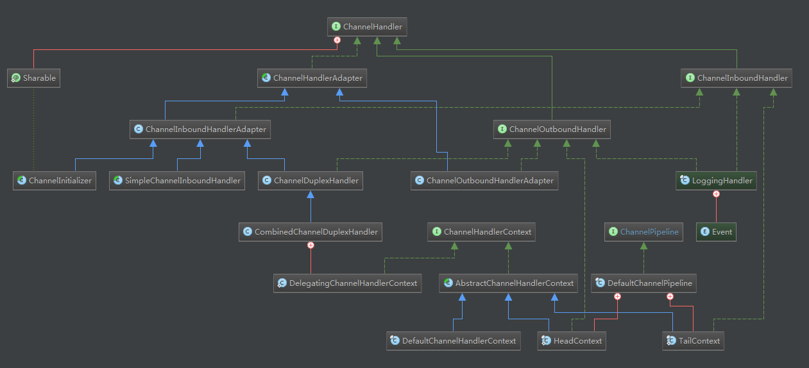
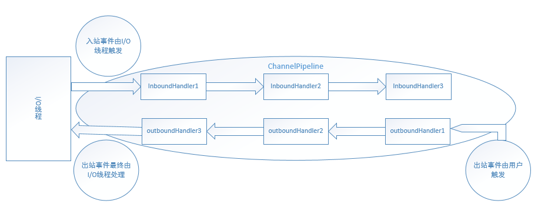
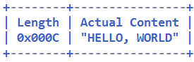
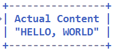
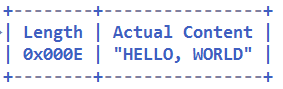
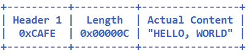
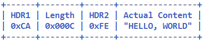
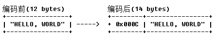
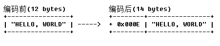

## 8.10 ChannelPipeline详解

上一节中我们说过Netty是基于事件驱动的，当Channel进行IO操作的时候会产生相应的IO事件，然后驱动事件在ChannelPipeline中传播，由对应的ChannelHandler对事件进行拦截和处理。其相关类图如下所示：



### 8.10.1 ChannelPipeline

#### ChannelPipeline简介
提到pipeline，我们首先想到的是Linux中的管道，可实现将一个程序的输出作为另一个程序的输入。ChannelPipeline也实现类似的功能，不同的是：ChannelPipeline将一个ChannelHandler的处理后的数据作为下一个ChannelHandler处理的数据源。Netty的ChannelPipeline示意图如下：



Linux的管道中流动的是数据，ChannelPipeline中流动的是事件（事件中可能附加数据）。Netty定义了两种事件类型：inbound事件和outbound事件。ChannelPipeline使用拦截过滤器模式使用户可以掌控ChannelHandler处理事件的流程。需要注意的是：事件在ChannelPipeline中不自动流动而需要调用ChannelHandlerContext中诸如fireXXX()或者read()类似的方法将事件从一个ChannelHandler传播到下一个ChannelHandler。一般我们更多的使用ChannelInboundHandler处理和拦截入站事件，ChannelOutboundHandler处理和拦截出站事件。那么事件是怎么在ChannelPipeline中流动的呢？我们使用代码注释中的例子：
```Java
ChannelPipeline p = ...;
p.addLast("1", new InboundHandlerA());
p.addLast("2", new InboundHandlerB());
p.addLast("3", new OutboundHandlerA());
p.addLast("4", new OutboundHandlerB());
p.addLast("5", new InboundOutboundHandlerX());
```
则现在的pipeline链表结构为：head<->1<->2<->3<->4<->5<->tail（netty4中head是InOutbound处理器，tail是Inbound处理器），则Inbound事件的执行顺序为head->1->2->5->tail，而Outbound事件的执行顺序为5->4->3->head。事件不会在ChannelPipeline中自动流动，而需要由用户应用程序手动触发，一般ChannelHandler处理的代码可能如下：
```Java
public class InboundHandlerA implements ChannelInboundHandler {
    @Override
    public void channelActive(ChannelHandlerContext ctx) {
        ... // 用户自定义处理逻辑
        ctx.fireChannelActive(); // 将channelActive事件传播到InboundHandlerB
    }
}

public class OutboundHandlerB extends ChannelOutboundHandler{
    @Override
    public void close(ChannelHandlerContext ctx, ChannelPromise promise) {
        ... // 用户自定义处理逻辑
        ctx.close(promise); // 将close事件传播到OutboundHandlerA
    }
}
```
Inbound事件一般由IO线程触发，以下事件为Inbound事件：
```Java
fireChannelRegistered() // Channel注册到EventLoop
fireChannelActive()     // Channel激活
fireChannelRead(Object) // Channel读取到数据
fireChannelReadComplete()   // Channel读取数据完毕
fireExceptionCaught(Throwable)  // 捕获到异常
fireUserEventTriggered(Object)  // 用户自定义事件
fireChannelWritabilityChanged() // Channnel可写性改变，由写高低水位控制
fireChannelInactive()   // Channel不再激活
fireChannelUnregistered()   // Channel从EventLoop中注销
```
Outbound事件一般由用户触发，以下事件为Outbound事件：
```Java
bind(SocketAddress, ChannelPromise) // 绑定到本地地址
connect(SocketAddress, SocketAddress, ChannelPromise)   // 连接一个远端机器
write(Object, ChannelPromise)   // 写数据，实际只加到Netty出站缓冲区
flush() // flush数据，实际执行底层写
read()  // 读数据，实际设置关心OP_READ事件，当数据到来时触发ChannelRead入站事件
disconnect(ChannelPromise)  // 断开连接，NIO Server和Client不支持，实际调用close
close(ChannelPromise)   // 关闭Channel
deregister(ChannelPromise)  // 从EventLoop注销Channel
```
需要注意的是：Inbound事件一般由IO线程触发，用户程序也可根据实际情况触发。考虑这样一种情况：一个协议由头部和数据部分组成，其中头部含有数据长度，由于数据量较大，客户端分多次发送该协议的数据，服务端接收到数据后需要收集足够的数据，组装为更有意义的数据传给下一个ChannelInboudHandler。一般这个收集数据的ChannelInboundHandler正是Netty中基本的Encoder，Encoder中会处理多次ChannelRead()事件，只触发一次对下一个ChannelInboundHandler更有意义的ChannelRead()事件。而Outbound事件一般由用户程序触发，而IO线程也可能会触发。比如，当用户已配置ChannelOption.AutoRead选项，则IO线程在执行完ChannelReadComplete()事件，会调用read()方法继续关心OP_READ事件，保证数据到达时自动触发ChannelRead()事件。

需要注意的是，Netty中事件触发方式之间的区别：
```Java
channelHandlerContext.close()   // close事件传播到下一个Handler
channel.close()                 // 等价于channelPipeline.close()
channelPipeline.close()         // 事件沿整个ChannelPipeline传播，注意in/outboud的传播起点
```

回忆AbstractChannel的构造方法：
```Java
protected AbstractChannel(Channel parent) {
    this.parent = parent;
    unsafe = newUnsafe();
    pipeline = newChannelPipeline();
}

protected DefaultChannelPipeline newChannelPipeline() {
    return new DefaultChannelPipeline(this);
}
```
可见，新建一个Channel时会自动新建一个ChannelPipeline，也就是说他们之间是一对一的关系。另外需要注意的是：ChannelPipeline是线程安全的，也就是说，我们可以动态的添加、删除其中的ChannelHandler。考虑这样的场景：服务器需要对用户登录信息进行加密，而其他信息不加密，则可以首先将加密Handler添加到ChannelPipeline，验证完用户信息后，主动从ChannelPipeline中删除，从而实现该需求。

#### ChannelPipeline源码解析
首先看ChannelPipeline接口的关键方法，相似方法只列出一个：
```Java
public ChannelPipeline addLast(String name, ChannelHandler handler);
public ChannelPipeline remove(ChannelHandler handler);
public ChannelHandler first();
public ChannelHandlerContext firstContext();
public ChannelHandler get(String name);
public ChannelHandlerContext context(ChannelHandler handler);
public Channel channel();
public ChannelPipeline fireChannelRegistered();
public ChannelFuture bind(SocketAddress localAddress);
```
DefaultChannelPipeline是ChannelPipeline的一个子类，看一下其中的字段：
```Java
final AbstractChannelHandlerContext head;   // 双向链表头
final AbstractChannelHandlerContext tail;   // 双向链表尾
private final Channel channel;  // 对应Channel
private Map<EventExecutorGroup, EventExecutor> childExecutors; // 线程池中的线程映射，记住这个映射是为了保证执行任务时使用同一个线程
private boolean firstRegistration = true;   // 对应Channel首次注册到EventLoop
private PendingHandlerCallback pendingHandlerCallbackHead; // ChannelHandler添加任务队列链表头部
private boolean registered; // 注册到EventLoop标记，该值一旦设置为true后不再改变
```
首先看我们常用的addLast()方法：
```Java
public final ChannelPipeline addLast(EventExecutorGroup group, String name, ChannelHandler handler) {
    final AbstractChannelHandlerContext newCtx;
    synchronized (this) {
        checkMultiplicity(handler); // 检查Handler是否重复添加

        newCtx = newContext(group, filterName(name, handler), handler);

        addLast0(newCtx);

        // 此时Channel还没注册的EventLoop中，而Netty的原则是事件在同一个EventLoop执行，所以新增一个任务用于注册后添加
        if (!registered) {
            newCtx.setAddPending();
            callHandlerCallbackLater(newCtx, true);
            return this;
        }

        EventExecutor executor = newCtx.executor();
        if (!executor.inEventLoop()) {
            newCtx.setAddPending();
            executor.execute( () -> { callHandlerAdded0(newCtx); } );
            return this;
        }
    }
    callHandlerAdded0(newCtx);
    return this;
}
```
再看newContext()方法，返回一个默认Context，其构造方法需要传入一个EventExecutor用于执行Handler中事件处理代码。childExecutor()正是用来从线程池中分配这个EventExecutor，代码如下：
```Java
private AbstractChannelHandlerContext newContext(EventExecutorGroup group, String name, ChannelHandler handler) {
    return new DefaultChannelHandlerContext(this, childExecutor(group), name, handler);
}

private EventExecutor childExecutor(EventExecutorGroup group) {
    if (group == null) {
        return null;
    }
    Boolean pinEventExecutor = channel.config().getOption(ChannelOption.SINGLE_EVENTEXECUTOR_PER_GROUP);
    if (pinEventExecutor != null && !pinEventExecutor) {
        return group.next();
    }
    Map<EventExecutorGroup, EventExecutor> childExecutors = this.childExecutors;
    if (childExecutors == null) {
        // Channel参数配置非同一个线程处理，不建议开启
        childExecutors = this.childExecutors = new IdentityHashMap<EventExecutorGroup, EventExecutor>(4);
    }
    // 保证pipeline中的事件为同一个EventExecutor处理，可视为将EventExecutor绑定到pipeline
    EventExecutor childExecutor = childExecutors.get(group);
    if (childExecutor == null) {
        childExecutor = group.next();
        childExecutors.put(group, childExecutor);
    }
    return childExecutor;
}
```
接着看实际的双向链表插入操作addLast0()操作：
```Java
private void addLast0(AbstractChannelHandlerContext newCtx) {
    AbstractChannelHandlerContext prev = tail.prev;
    newCtx.prev = prev;
    newCtx.next = tail;
    prev.next = newCtx;
    tail.prev = newCtx;
}
```
DefaultChannelPipeline的双向链表初始化持有头部和尾部节点，这两个节点对用户不可见，也就是说，用户addLast只是将节点插入尾部节点之前，addFirst将节点插入头部节点之后。明白了这些，代码便易于理解。
再看一下fireXXX方法和bind等事件触发方法的代码：
```Java
public final ChannelPipeline fireChannelRegistered() {
    // Inbound事件从双向链表头部处理
    AbstractChannelHandlerContext.invokeChannelRegistered(head);
    return this;
}

public final ChannelFuture bind(SocketAddress localAddress, ChannelPromise promise) {
    // Outbound事件从双向链表尾部处理
    return tail.bind(localAddress, promise);
}
```
由于头部和尾部节点都是ChannelHandlerContext，具体的事件触发处理都委托给head和tail处理。

### 8.10.3 ChannelHandlerContext
Context指上下文关系，ChannelHandler的Context指的是ChannelHandler之间的关系以及ChannelHandler与ChannelPipeline之间的关系。ChannelPipeline中的事件传播主要依赖于ChannelHandlerContext实现，由于ChannelHandlerContext中有ChannelHandler之间的关系，所以能得到ChannelHandler的后继节点，从而将事件传播到下一个ChannelHandler。
一个Channel对应一个ChannelPipeline，一个ChannelHandlerContext对应一个ChannelHandler，但一个ChannelHandler可以对应多个ChannelHandlerContext。当一个ChannelHandler使用Sharable注解修饰且添加同一个实例对象到不用的Channel时，只有一个ChannelHandler实例对象，但每个Channel中都有一个ChannelHandlerContext对象实例与之对应。

### 8.10.4 ChannelHandler详解
ChannelHandler可以对IO事件进行拦截和处理，它可以选择性的对感兴趣的事件进行拦截和处理，也可以选择对事件进行传递或者终止。一般情况下，我们不需要对所有的IO事件进行处理，只需要处理我们感兴趣的事件就可以了，Netty为我们提供了一个适配器ChannelHandlerAdapter，它实现ChannelHandler的所有方法，默认进行透传，如果我们有感兴趣的事件需要进行处理的话，只需要对对应的方法进行重写就可以了。我们看一下ChannelInboundHandlerAdapter的channelRegistered事件的处理：
```java
public void channelRegistered(ChannelHandlerContext ctx) throws Exception {
    ctx.fireChannelRegistered();
}
```

我们常常遇到这样的需求：在一个业务逻辑处理器中，需要写数据库、进行网络连接等耗时业务。Netty的原则是不阻塞IO线程，所以需指定Handler执行的线程池，可使用如下代码：
```Java
EventExecutorGroup group = new DefaultEventExecutorGroup(16);
...
ChannelPipeline pipeline = ch.pipeline();
// 简单非阻塞业务，可以使用I/O线程执行
pipeline.addLast("decoder", new MyProtocolDecoder());
pipeline.addLast("encoder", new MyProtocolEncoder());
// 复杂耗时业务，使用新的线程池
pipeline.addLast(group, "handler", new MyBusinessLogicHandler());
```

ChannelHandler中有一个Sharable注解，使用该注解后多个ChannelPipeline中的Handler对象实例只有一个，从而减少Handler对象实例的创建。代码示例如下：
```Java
public class DataServerInitializer extends ChannelInitializer<Channel> {
   private static final DataServerHandler SHARED = new DataServerHandler();

   @Override
   public void initChannel(Channel channel) {
       channel.pipeline().addLast("handler", SHARED);
   }
}
```
Sharable注解的使用是有限制的，多个ChannelPipeline只有一个实例，所以该Handler要求无状态。上述示例中，DataServerHandler的事件处理方法中，不能使用或改变本身的私有变量，因为ChannelHandler是非线程安全的，使用私有变量会造成线程竞争而产生错误结果。

### 8.10.5 解码器

#### ByteToMessageDecoder
在进行网络编程的时候，我们往往需要将读取到的字节数组或者缓冲区数组转化为对应业务逻辑的POJO对象。Netty为我们提供ByteToMessageDecoder抽象工具类将ByteBuf转为POJO对象，我们只需要继承ByteToMessageDecoder抽象类，实现decode方法就可以了。不过ByteToMessageDecoder没有提供半包的处理，需要我们自己去实现。看一下channelRead方法：
```Java
//ByteToMessageDecoder
public void channelRead(ChannelHandlerContext ctx, Object msg) throws Exception {
    if (msg instanceof ByteBuf) {
        CodecOutputList out = CodecOutputList.newInstance();
        try {
            ByteBuf data = (ByteBuf) msg;
            first = cumulation == null;
            if (first) {
                cumulation = data;
            } else {
                cumulation = cumulator.cumulate(ctx.alloc(), cumulation, data);
            }
            callDecode(ctx, cumulation, out);
        } catch (DecoderException e) {
            throw e;
        } catch (Throwable t) {
            throw new DecoderException(t);
        } finally {
            if (cumulation != null && !cumulation.isReadable()) {
                numReads = 0;
                cumulation.release();
                cumulation = null;
            } else if (++ numReads >= discardAfterReads) {
                numReads = 0;
                discardSomeReadBytes();
            }

            int size = out.size();
            decodeWasNull = !out.insertSinceRecycled();
            fireChannelRead(ctx, out, size);
            out.recycle();
        }
    } else {
        ctx.fireChannelRead(msg);
    }
}
```
该方法首先对要解码的消息msg进行类型判断，如果msg是ByteBuf对象的话，才需要转码，否则进行直接透传。然后判断是否是first解码（first=cumulation==null：如果为null，说明这是第一次解码或者上一次解码结束，没有缓存的半包消息需要进行处理）：如果first解码，则直接把data赋值给cumulation直接进行解码c；否则调用cumulator.cumulate方法将cumulation缓存半包消息和本次的消息聚合在一起再进行解码操作。然后我们看一下具体的解码方法callDecode：
```Java
protected void callDecode(ChannelHandlerContext ctx, ByteBuf in, List<Object> out) {
    try {
        while (in.isReadable()) {
            int outSize = out.size();
            if (outSize > 0) {
                fireChannelRead(ctx, out, outSize);
                out.clear();

                if (ctx.isRemoved()) {
                    break;
                }
                outSize = 0;
            }

            int oldInputLength = in.readableBytes();
            decode(ctx, in, out);

            if (ctx.isRemoved()) {
                break;
            }

            if (outSize == out.size()) {
                if (oldInputLength == in.readableBytes()) {
                    break;
                } else {
                    continue;
                }
            }

            if (oldInputLength == in.readableBytes()) {
                throw new DecoderException(StringUtil.simpleClassName(getClass()) +
                        ".decode() did not read anything but decoded a message.");
            }

            if (isSingleDecode()) {
                break;
            }
        }
    } catch (DecoderException e) {
        throw e;
    } catch (Throwable cause) {
        throw new DecoderException(cause);
    }
}
```
在callDecode中对ByteBuf进行循环解码，只要ByteBuf还有可读的字节，就调用decode方法进行解码（该方法是由具体解码子类进行实现）。在解码完成之后会对解码结果进行判断；如果输出的out列表长度没有变化说明解码失败，此时对ByteBuf的readableBytes进行解码前后的比较：如果不等则说明decode方法消费了消息，继续进行循环；否则的话说明decode没有消费该消息，则说明该消息是半包消息，需要继续接收消息，退出循环。如果解码消息成功，却没有消费消息，则抛出DecoderException异常；最后对isSingleDecode进行判断，如果是单条消息解码器，第一次解码成功之后退出循环。

#### 半包处理
上面我们说过ByteToMessageDecoder没有提供半包的处理方案，需要我们自己实现。要解决半包问题，我们首先需要确定一个策略，如何区分一个整包消息，一般有以下四种方法：
1. 通过回车换行符区分整包。
2. 通过分隔符区分整包。
3. 固定长度整包，通过每固定长度代表一个整包消息。
4. 通过指定长度来区分整包。

相对应的是Netty提供了以下四个解码器：LineBasedFrameDecoder，DelimiterBasedFrameDecoder，FixedLengthFrameDecoder和LengthFieldBasedFrameDecoder，它们均继承自ByteToMessageDecoder。

##### LineBasedFrameDecoder
LineBasedFrameDecoder是回车换行解码器，如果上层业务消息以回车换行符作为消息结束的标识，则可以直接使用Netty的LineBasedFrameDecoder对消息进行解码，不需要自己重新实现一套换行解码器。

LineBasedFrameDecoder的工作原理是它依次遍历ByteBuf中的可读字节，判断看是否有“\n”或者“\r\n”，如果有，就以此位置为结束位置，从可读索引到结束位置区间的字节就组成了一行。它是以换行符为结束标志的解码器，支持携带结束符或者不携带结束符两种解码方式，同时支持配置单行的最大长度。如果连续读取到最大长度后仍然没有发现换行符，就会抛出异常，同时忽略掉之前读到的异常码流。防止由于数据报没有携带换行符导致接收到ByteBuf无限制积压，引起系统内存溢出。

通常情况下，LineBasedFrameDecoder会和StringDecoder配合使用，组合成按行切换的文本解码器，对于文本类协议的解析，文本换行解码器非常实用，例如对HTTP消息头的解析、FTP协议消息的解析等。下面我们简单给出文本换行解码器的使用示例：
```Java
@Override
protected void initChannel(SocketChannel arg0) throws Exception {
   arg0.pipeline().addLast(new LineBasedFrameDecoder(1024));
   arg0.pipeline().addLast(new StringDecoder());
   arg0.pipeline().addLast(new UserServerHandler());
}
初始化Channel的时候，首先将LineBasedFrameDecoder添加到ChannelPipeline中，然后再依次添加字符串解码器StringDecoder，业务Handler
```

##### DelimiterBasedFrameDecoder
DelimiterBasedFrameDecoder是分隔符解码器，用户可以指定消息结束的分隔符，它可以自动完成以分隔符作为码流结束标识的消息的解码。LineBasedFrameDecoder解码器实际上是一种特殊的DelimiterBasedFrameDecoder解码器，即使用换行符作为消息的分隔符。其工作原理和LineBasedFrameDecoder基本一样，这里就不再详述。

##### FixedLengthFrameDecoder
FixedLengthFrameDecoder是固定长度解码器，它能够按照指定的长度对消息进行自动解码。对于定长消息，如果消息实际长度小于定长，则往往会进行补位操作，它在一定程度上导致了空间和资源的浪费。但是它的优点也是非常明显的，编解码比较简单。使用FixedLengthFrameDecoder解码器，无论一次接收到多少数据报，它都会按照设置的固定长度进行解码，如果是半包消息，FixedLengthFrameDecoder会缓存半包消息并等待下个包到达后进行拼包，直到读取到一个完整的包。

##### LengthFieldBasedFrameDecoder
大多数的协议（私有或者公有），协议头中会携带长度字段，用于标识消息体或者整包消息的长度，例如SMPP、HTTP协议等。由于基于长度解码需求的通用性，Netty提供了LengthFieldBasedFrameDecoder，屏蔽了TCP底层的拆包和粘包问题，只需要传入正确的参数，即可解决半包问题。LengthFieldBasedFrameDecoder可以通过配置参数来采用不同的半包解决策略。
```Java
private final int lengthFieldOffset; //长度字段相对于消息头的偏移
private final int lengthFieldLength; //长度字段的位数
private final int lengthAdjustment; //长度字段的修正值：对应于长度字段包含了自身长度的情况
private final int initialBytesToStrip; //跳过的初始字段位数
```
下面我们看看如何通过参数组合的不同来实现不同的“半包”读取策略。

* 对于很多协议，都是消息头+消息体这种结构。先来考虑一种最简单的情况：消息头只有一个长度字段，而且该长度标明的是消息体的长度，例如消息结构定义如图所示：



则可以使用以下参数组合进行解码：
```Java
lengthFieldOffset = 0;
lengthFieldLength = 2;
lengthAdjustment = 0;
initialBytesToStrip = 0;
```
由于长度字段为2个字节，因此lengthFieldLength为2，则解码后的字节缓冲区内容如图所示：


* 对于大多数协议而言，解码之后消息长度没有用处，一般是可以丢弃的，可以通过设置initialBytesToStrip来丢弃长度字段，针对上面的消息结构，其参数配置如下所示：
```Java
lengthFieldOffset = 0;
lengthFieldLength = 2;
lengthAdjustment = 0;
initialBytesToStrip = 2;
```
由于长度字段为2个字节，因此lengthFieldLength=2，并且长度字段位于消息最前端，因此initialBytesToStrip=2，则解码后的字节缓冲区内容如图所示：



* 对于某些协议，长度字段不仅包括了消息体的长度，还包含了消息头的长度，此时需要使用lengthAdjustment进行修正。例如消息结构定义如下所示：



由于整个消息（包含消息头）的长度一般大于消息体的长度，所以lengthAdjustment为负数：
```Java
lengthFieldOffset = 0;
lengthFieldLength = 2;
lengthAdjustment = -2;
initialBytesToStrip = 0;
```
由于长度字段为2个字节，因此lengthFieldLength=2，lengthAdjustment=-2。

* 现在来考虑一个更复杂的情况：消息头不止长度一个字段，而且长度字段处于消息头的中间或者尾部，此时需要使用lengthFieldOffset字段进行标识，例如消息结构定义如下所示：



则参数组合如下所示：其中lengthFieldOffset表示长度字段在消息头中偏移的字节数，lengthFieldLength表示长度字段自身的长度：
```Java
lengthFieldOffset = 2;
lengthFieldLength = 3;
lengthAdjustment = 0;
initialBytesToStrip = 0;
```
由于Header1的长度为2，所以lengthFieldOffset=2；而消息长度字段Length为3，lengthFieldLength=3。由于长度字段仅仅标识消息体的长度，所以lengthAdjustment和initialBytesToStrip都为0。

* 最后来考虑一个更复杂的情况：长度字段处于两个消息头之间或者消息头的中间，前后都有其它消息头字段，例如消息结构定义如下所示：



则参数组合如下所示：此时如果想忽略长度字段以及其前面的其它消息头字段，则可以通过initialBytesToStrip参数来跳过要忽略的字节长度，它的组合配置示意如下：
```Java
lengthFieldOffset = 1;
lengthFieldLength = 2;
lengthAdjustment = 1;
initialBytesToStrip = 3;
```
由于HDR1的长度为1，所以长度字段的偏移量lengthFieldOffset为1；长度字段为2个字节，所以lengthFieldLength为2。由于长度字段是消息体的长度，解码后如果携带消息头中的字段，则需要使用lengthAdjustment进行调整，此处它的值为1，代表的是HDR2的长度，最后由于解码后的缓冲区要忽略长度字段和HDR1部分，所以lengthAdjustment为3。解码后的结果为13个字节，HDR1和Length字段被忽略。

事实上，通过4个参数的不同组合，可以达到不同的解码效果，用户在使用过程中可以根据业务的实际情况进行灵活调整。

#### 总结
如果要实现自己的Decoder，需要注意以下事项：
1. ByteToMessageDecoder是非线程安全的，因为有cumulation等成员变量，记得为每个Channel创建一个Decoder，前面我们在谈到在channelPipeline中加入业务逻辑时说过这个问题，采用下面这种方式是安全的，因为会在initChannel方法被调用时new一个channelHandler实例出来，这样每个channel都有不同的实例：
```Java
ServerBootstrap b = new ServerBootstrap();
b.group(bossGroup, workerGroup)
        .option(ChannelOption.SO_REUSEADDR, true)
        .channel(NioServerSocketChannel.class)
        .childHandler(new ChannelInitializer<SocketChannel>() {
            @Override
            protected void initChannel(SocketChannel ch) throws Exception {
                ch.pipeline().addLast("http-decoder", new HttpRequestDecoder());
                ch.pipeline().addLast("http-aggregator", new HttpObjectAggregator(65536));
                ch.pipeline().addLast("json-decoder", new JsonRequestDecoder(Order.class));

                ch.pipeline().addLast("http-encoder", new HttpResponseEncoder());
                ch.pipeline().addLast("json-encoder", new JsonResponseEncoder());
                ch.pipeline().addLast("jsonServerHandler", new HttpJsonServerHandler());
            }
        });
```
2. 如果上层的Decoder觉得当前的ByteBuf无法进行Frame解码（当前的ByteBuf是个半包），必须保证readerIndex没有变化。这样ByteToMessageDecoder才会结束当前的 channelRead()函数，静静等待下一个TCP包输入。
3. 如果上层的Decoder成功解码，必须在out中插入了结果，同时将ByteBuf的readerIndex调整到正确位置，这样ByteToMessageDecoder才会认为解码完成了，否则ByteToMessageDecoder会认为你还没把事做完，继续调用你的decode()函数，等待你给out插入结果。

#### MessageToMessageDecoder
MessageToMessageDecoder是Netty的二次解码器，可以把一个POJO对象解码成另一个POJO对象。为什么称它为二次解码器呢？我们知道，从SocketChannel读取到的TCP数据报是ByteBuffer，实际就是字节数组。我们首先需要将ByteBuffer缓冲区中的数据报读取出来，并将其解码为Java对象；然后对Java对象根据某些规则做二次解码，将其解码为另一个POJO对象。因为MessageToMessageDecoder在ByteToMessageDecoder之后，所以称之为二次解码器。

二次解码器在实际应用中非常有用，以HTTP+Json协议栈为例，第一次解码往往是将字节数组解码成HttpRequest对象，然后对HttpRequest消息中的消息体字符串进行二次解码，将Json格式的字符串解码为POJO对象，这就用到了二次解码器。事实上，做一个超级复杂的解码器将多个解码器组合成一个大而全的MessageToMessageDecoder解码器似乎也能解决多次解码的问题，但是采用这种方式的代码可维护性会非常差。例如如果我们打算在HTTP+Json协议栈中增加一个打印码流的功能，即首次解码获取HttpRequest对象之后打印Json格式的码流。如果采用多个解码器组合，在中间插入一个打印消息体的Handler即可，不需要修改原有的代码；如果做一个大而全的解码器，就需要在解码的方法中增加打印码流的代码，可扩展性和可维护性都会变差。

### 8.9.6 编码器
Netty并没有提供与上文中解码器匹配的编码器，主要原因是上面介绍的4种常用的解码器本质都是解析一个完整的数据报给应用层，主要用于解决TCP的粘包和拆包问题；对于编码，就是将POJO对象序列化为ByteBuf，不需要与TCP层面打交道，也就不存在半包问题。由于TCP的粘包和拆包，编解码其实是非对等的。

#### MessageToByteEncoder
MessageToByteEncoder负责将POJO对象编码成ByteBuf，用户的编码器继承MessageToByteEncoder，实现encode方法，示例代码如下：
```Java
public class IntegerEncoder extends MessageToByteEncoder<Integer> {
    @Override
    public void encode(ChannelHandlerContext ctx, Integer msg,ByteBuf out) throws Exception {
        out.writeInt(msg);
    }
}
```
它的实现原理如下：调用write操作时，首先判断当前编码器是否支持需要发送的消息，如果不支持则直接透传；如果支持则判断缓冲区的类型，对于直接内存分配ioBuffer（堆外内存），对于堆内存通过heapBuffer方法分配，源码如下：
```Java
public void write(ChannelHandlerContext ctx, Object msg, ChannelPromise promise) throws Exception {
    ByteBuf buf = null;
    try {
        if (acceptOutboundMessage(msg)) {
            @SuppressWarnings("unchecked")
            I cast = (I) msg;
            buf = allocateBuffer(ctx, cast, preferDirect);
            try {
                encode(ctx, cast, buf);
            } finally {
                ReferenceCountUtil.release(cast);
            }

            if (buf.isReadable()) {
                ctx.write(buf, promise);
            } else {
                buf.release();
                ctx.write(Unpooled.EMPTY_BUFFER, promise);
            }
            buf = null;
        } else {
            ctx.write(msg, promise);
        }
    } catch (EncoderException e) {
        throw e;
    } catch (Throwable e) {
        throw new EncoderException(e);
    } finally {
        if (buf != null) {
            buf.release();
        }
    }
}
```
编码使用的缓冲区分配完成之后，调用encode抽象方法进行编码，方法定义如下：它由子类负责具体实现。编码完成之后，调用ReferenceCountUtil的release方法释放编码对象msg。然后对编码后的ByteBuf进行以下判断：如果缓冲区包含可发送的字节，则调用ChannelHandlerContext的write方法发送ByteBuf；否则释放编码后的ByteBuf，写入一个空的ByteBuf（Unpooled.EMPTY_BUFFER）到ChannelHandlerContext中。发送操作完成之后，在方法退出之前释放编码缓冲区ByteBuf对象。

#### MessageToMessageEncoder
将一个POJO对象编码成另一个对象，以HTTP+Json协议为例，它的一种实现方式是：先将POJO对象编码成Json字符串，再将字符串编码为HTTP请求或者应答消息。对于复杂协议，往往需要经历多次编码，为了便于功能扩展，可以通过多个编码器组合来实现相关功能。用户的编码器继承MessageToMessageEncoder，实现encode方法即可。注意，它与MessageToByteEncoder的区别是输出是对象列表而不是ByteBuf，示例代码如下：
```Java
public class IntegerToStringEncoder extends MessageToMessageEncoder<Integer> {
    @Override
    public void encode(ChannelHandlerContext ctx, Integer message, List<Object> out) throws Exception {
        out.add(message.toString());
    }
}
```
MessageToMessageEncoder编码器的实现原理与之前分析的MessageToByteEncoder相似，唯一的差别是它编码后的输出是中间对象，并非最终可传输的ByteBuf。

#### LengthFieldPrepender
如果协议中的第一个字段为长度字段，Netty提供了LengthFieldPrepender编码器，它可以计算当前待发送消息的二进制字节长度，将该长度添加到ByteBuf的缓冲区头中，如图所示：



通过LengthFieldPrepender可以将待发送消息的长度写入到ByteBuf的前2个字节，编码后的消息组成为长度字段+原消息的方式。通过设置LengthFieldPrepender为true，消息长度将包含长度本身占用的字节数，打开LengthFieldPrepender后编码结果如下图所示：



下面我们看一下LengthFieldPrepender的encode方法：
```Java
protected void encode(ChannelHandlerContext ctx, ByteBuf msg, List<Object> out) throws Exception {
    int length = msg.readableBytes() + lengthAdjustment;
    if (lengthIncludesLengthFieldLength) {
        length += lengthFieldLength;
    }

    if (length < 0) {
        throw new IllegalArgumentException("Adjusted frame length (" + length + ") is less than zero");
    }

    switch (lengthFieldLength) {
    case 1:
        if (length >= 256) {
            throw new IllegalArgumentException("length does not fit into a byte: " + length);
        }
        out.add(ctx.alloc().buffer(1).order(byteOrder).writeByte((byte) length));
        break;
    case 2:
        if (length >= 65536) {
            throw new IllegalArgumentException("length does not fit into a short integer: " + length);
        }
        out.add(ctx.alloc().buffer(2).order(byteOrder).writeShort((short) length));
        break;
    case 3:
        if (length >= 16777216) {
            throw new IllegalArgumentException("length does not fit into a medium integer: " + length);
        }
        out.add(ctx.alloc().buffer(3).order(byteOrder).writeMedium(length));
        break;
    case 4:
        out.add(ctx.alloc().buffer(4).order(byteOrder).writeInt(length));
        break;
    case 8:
        out.add(ctx.alloc().buffer(8).order(byteOrder).writeLong(length));
        break;
    default:
        throw new Error("should not reach here");
    }
    out.add(msg.retain());
}
```
首先对长度字段进行设置，如果需要包含消息长度自身，则在原来长度的基础之上再加上lengthFieldLength的长度。然后对消息长度自身所占的字节数进行判断，以便采用正确的方法将长度字段写入到ByteBuf中，共有以下6种可能：
1. 长度字段所占字节为1：如果使用1个Byte字节代表消息长度，则最大长度需要小于256个字节。对长度进行校验，如果校验失败，则抛出异常；若校验通过，则创建新的ByteBuf并通过writeByte将长度值写入到ByteBuf中；
2. 长度字段所占字节为2：如果使用2个Byte字节代表消息长度，则最大长度需要小于65536个字节，对长度进行校验，如果校验失败，则抛出异常；若校验通过，则创建新的ByteBuf并通过writeShort将长度值写入到ByteBuf中；
3. 长度字段所占字节为3：如果使用3个Byte字节代表消息长度，则最大长度需要小于16777216个字节，对长度进行校验，如果校验失败，则抛出异常；若校验通过，则创建新的ByteBuf并通过writeMedium将长度值写入到ByteBuf中；
4. 长度字段所占字节为4：创建新的ByteBuf，并通过writeInt将长度值写入到ByteBuf中；
5. 长度字段所占字节为8：创建新的ByteBuf，并通过writeLong将长度值写入到ByteBuf中；
6. 其它长度值：直接抛出Error。
