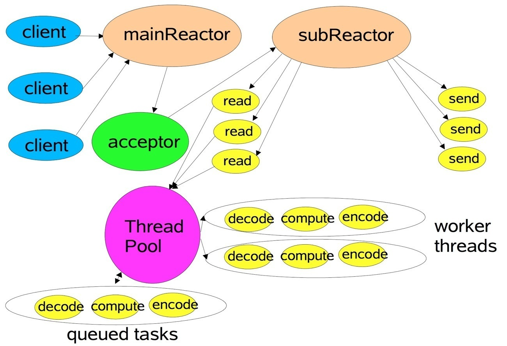
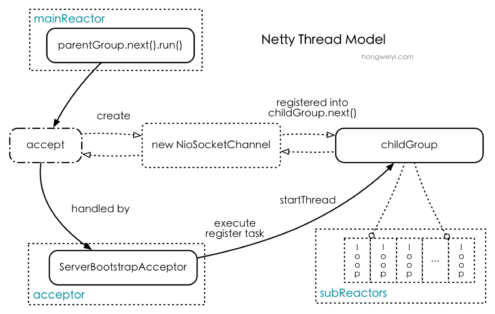
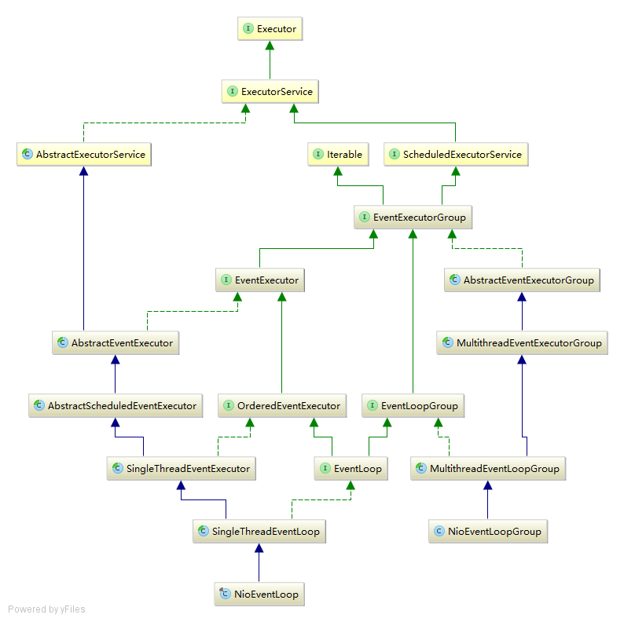

## 8.7 Netty线程模型分析

### 8.7.1 Netty线程模型
Netty采用了Reactor模式，Reactor模式有多个变种，Netty基于Multiple Reactors模式（如下图）做了一定的修改，Multiple Reactors模式有多个reactor：mainReactor和subReactor，其中mainReactor负责客户端的连接请求，并将请求转交给subReactor，由subReactor负责相应Channel的IO操作，以及非IO任务。



需要注意的是：Netty并没有Thread Pool这个东东。Netty的subReactor与worker thread是同一个线程，采用IO多路复用机制，可以使一个subReactor监听并处理多个channel的IO请求，即“Single Thread with many Channel”。其线程模型图如下所示：



上图中的parentGroup和childGroup是Bootstrap构造方法中传入的两个对象，这两个group均是线程池，childGroup线程池会被各个subReactor充分利用，parentGroup线程池则只是在bind某个端口后，获得其中一个线程作为mainReactor。上图将subReactor和worker thread合并成了一个个的loop，具体的请求操作均在loop中完成。

#### mainReactor:
NioEventLoopGroup在Bootstrap初始化时作为参数传入构造方法，我们从Bootstrap.initAndRegister()方法，我们先看init()方法，然后再看register()方法：
1. init方法主要是初始化Channel，配置Channel参数，以及Pipeline。其中初始化Pipeline时插入ServerBootstrapAcceptor对象用作acceptor接收客户端连接请求。
2. 在register方法中有一个关键操作：eventLoop.execute(runnable)，在没有启动线程时，它会启动线程并将待执行任务放入执行队列里面，线程启动后，执行NioEventLoop的run()方法。
3. 接收连接请求，由NioEventLoop.run()接收到请求，即selector轮询到OP_ACCEPT事件，然后创建SocketChannel对象，触发fireChannelRead事件，然后在ServerBootstrapAcceptor.channelRead()初始化这个channel，然后调用childGroup.register()方法注册这个channel，其会调度一个eventLoop，并启动其中的线程，然后这个channel注册到这个eventLoop中的selector，并关联这个channel（即启动了subReactor）。

#### subReactor:
subReactor的流程较为简单，用以执行read、write还有自定义的NioTask操作，不断地循环一个过程：select->processSelectedKeys(IO操作)->runAllTasks(非IO操作)，其主要逻辑在NioEventLoop.run()方法中。

### 8.7.2 EventLoopGroup详解
接下来我们将分析Netty中boss和worker的线程的创建过程，首先我们看一下EventLoop的类图关系，很复杂的一个类图：



首先我们看一下EventLoopGroup的几个重要成员和方法（这里以NioEventLoopGroup为例）：
```Java
public ChannelFuture register(Channel channel); // 将通道channel注册到EventLoopGroup中的一个线程上
private final EventExecutor[] children; //线程池，主要用于存放线程；
protected EventLoop newChild(Executor executor, Object... args); //用于创建eventLoop对象；
public EventLoop next(); //从线程池中获取一个线程
private final EventExecutorChooserFactory.EventExecutorChooser chooser; //负责线程调度
```
需要注意的是：EventLoopGroup中没有任务队列（这和Java的线程池实现方式不同），当来一个任务则是直接分配给一个线程，每个个线程中有一个任务队列。

#### EventLoopGroup的创建
一般我们是直接调用其默认构造函数创建一个线程池：EventLoopGroup bossGroup = new NioEventLoopGroup()，看一下其构造方法：
```Java
//MultithreadEventExecutorGroup
protected MultithreadEventExecutorGroup(int nThreads, Executor executor, EventExecutorChooserFactory chooserFactory, Object... args) {
    if (executor == null) {
        executor = new ThreadPerTaskExecutor(newDefaultThreadFactory());
    }

    children = new EventExecutor[nThreads];

    for (int i = 0; i < nThreads; i ++) {
        boolean success = false;
        try {
            children[i] = newChild(executor, args);
            success = true;
            ...
        }
    }
    ...
}
```
变量children是一个数组，用来存放创建的线程，里面每一个元素都通过newChild(threadFactory, args)创建，而newChild方法则由子类NioEventLoopGroup实现：

#### EventLoop的创建
然后回到newChild方法上：
```Java
//NioEventLoopGroup
protected EventLoop newChild(Executor executor, Object... args) throws Exception {
    return new NioEventLoop(this, executor, (SelectorProvider) args[0],
        ((SelectStrategyFactory) args[1]).newSelectStrategy(), (RejectedExecutionHandler) args[2]);
}
```

#### 线程的启动
上文说过，在register方法中有一个关键操作：eventLoop.execute(runnable)，在没有启动真正线程时，它会启动线程并将待执行任务放入执行队列里面，看一下相关代码：
```Java
//MultithreadEventLoopGroup
public ChannelFuture register(Channel channel) {
    return next().register(channel);
}
//AbstractChannel.AbstractUnsafe
public final void register(EventLoop eventLoop, final ChannelPromise promise) {
    ...
    AbstractChannel.this.eventLoop = eventLoop;

    if (eventLoop.inEventLoop()) {
        register0(promise);
    } else {
        try {
            eventLoop.execute(() -> { register0(promise); });
        } catch (Throwable t) {
            ...
        }
    }
}
```
这里的next()方法选择一个线程（EventExecutor）来执行这个任务，netty有自己的任务调度机制（netty线程池本身没有任务队列，而是其中的每个线程有一个任务队列，当线程池接收到一个任务之后，会通过chooser调度一个线程来执行该任务，关于其调度算法这里不再详述）。

注意到AbstractChannel.this.eventLoop=eventLoop，此处将channel与eventLoop关联到一起，之后这个channel的所有事件都由这个eventLoop负责执行。由于AbstractChannel是ServerSocketChannel和SocketChannel的共同基类，所以注册逻辑是相同的，即其关联channel和eventLoop也是一样的。区别在于ServerSocketChannel中是使用MainReactor线程关联，而SocketChannel（这里服务端和客户端一样）是使用SubReactor线程关联。

接下來我們看一下eventLoop.execute()方法：
```Java
//SingleThreadEventExecutor
public void execute(Runnable task) {
    boolean inEventLoop = inEventLoop();
    if (inEventLoop) {
        addTask(task);
    } else {
        startThread();
        addTask(task);
        if (isShutdown() && removeTask(task)) {
            reject();
        }
    }

    if (!addTaskWakesUp && wakesUpForTask(task)) {
        wakeup(inEventLoop);
    }
}
private void startThread() {
    if (STATE_UPDATER.get(this) == ST_NOT_STARTED) {
        if (STATE_UPDATER.compareAndSet(this, ST_NOT_STARTED, ST_STARTED)) {
            doStartThread();
        }
    }
}
private void doStartThread() {
    assert thread == null;
    executor.execute(() -> {
        thread = Thread.currentThread();
        if (interrupted) {
            thread.interrupt();
        }

        boolean success = false;
        updateLastExecutionTime();
        try {
            SingleThreadEventExecutor.this.run();
            success = true;
        } catch (Throwable t) {
            ...
        }
    });
}
```
这里首先判断是否在eventLoop线程中，如果是则直接提交任务addTask；如果不是则启动一个新线程，然后进入任务循环SingleThreadEventExecutor.this.run()（之后我们详细分析其run方法的实现，这里不再详述），然后再提交任务addTask。我们看一下executor.execute方法，看其如何开启新线程，此处的executor是之前newChild方法传过来的参数：ThreadPerTaskExecutor，其代码如下所示：
```Java
//ThreadPerTaskExecutor
public final class ThreadPerTaskExecutor implements Executor {
    private final ThreadFactory threadFactory;

    public ThreadPerTaskExecutor(ThreadFactory threadFactory) {
        if (threadFactory == null) {
            throw new NullPointerException("threadFactory");
        }
        this.threadFactory = threadFactory;
    }

    @Override
    public void execute(Runnable command) {
        threadFactory.newThread(command).start();
    }
}
```
我们发现，它会在自己的execute方法里创建一个线程并将其start。

### 8.7.3 EventLoop详解

#### EventLoop类简介
我们首先回顾一下NioEventLoop的继承体系：
1. JDK中的AbstractExecutorService类定义了任务的提交和执行，留下了newTaskFor()方法用于子类定义执行的任务；
2. Netty中的AbstractEventExecutor类覆盖了newTaskFor()方法，使用PromiseTask表示待执行的任务；
3. AbstractScheduledEventExecutor类将待执行的调度任务封装为ScheduledFutureTask提交给调度任务队列；
4. SingleThreadEventExecutor类实现了任务执行器即线程，其覆盖了execute()方法，当使用execute()执行一个任务时，实质是向任务队列提交一个任务；该类中还有一个重要的模板方法run()，在这个方法中执行任务队列中的任务（调度任务队列中的待执行任务移入普通任务队列），留给子类实现；
5. SingleThreadEventLoop类实现对Channel对象的注册。

接下我们看一下EventLoop的主要方法和成员（这里以NioEventLoop为例）：
```Java
//AbstractEventExecutor
private final EventExecutorGroup parent; //该Executor所属的线程池
public EventLoopGroup parent(); //获取该Executor所属的线程池
public EventLoop next(); //前面说过该方法选择线程池中的一个线程，此处返回自身
public boolean inEventLoop(); //判断当前线程是否是EventExecutor原生线程

//AbstractScheduledEventExecutor
Queue<ScheduledFutureTask<?>> scheduledTaskQueue; //调度任务队列
public  ScheduledFuture<?> schedule(...); //调度任务算法

//SingleThreadEventExecutor
private Thread thread; //该Executor所属的线程；
private final Queue<Runnable> taskQueue; //任务队列，用于存放提交到该线程的非IO任务；

//SingleThreadEventLoop
public ChannelFuture register(Channel channel...); //将一个channel注册到eventLoop上

//NioEventLoop
Selector selector; //分发器：轮询该selector，执行IO操作，channel就是注册到这个selector上；
protected void run(); //模板方法，eventLoop的主要执行逻辑，接下来会详细分析。
```

#### EventLoop的执行逻辑
NioEventLoop启动后，会进入run()方法：
```Java
//NioEventLoop
protected void run() {
    for (;;) {
        try {
            switch (selectStrategy.calculateStrategy(selectNowSupplier, hasTasks())) {
                case SelectStrategy.CONTINUE:
                    continue;
                case SelectStrategy.SELECT:
                    select(wakenUp.getAndSet(false));
                    if (wakenUp.get()) {
                        selector.wakeup();
                    }
                default:
                    // fallthrough
            }

            cancelledKeys = 0;
            needsToSelectAgain = false;
            final int ioRatio = this.ioRatio;
            if (ioRatio == 100) {
                processSelectedKeys();
                runAllTasks();
            } else {
                final long ioStartTime = System.nanoTime();

                processSelectedKeys();

                final long ioTime = System.nanoTime() - ioStartTime;
                runAllTasks(ioTime * (100 - ioRatio) / ioRatio);
            }

            if (isShuttingDown()) {
                closeAll();
                if (confirmShutdown()) {
                    break;
                }
            }
        } catch (Throwable t) {
            ...
        }
    }
}
```
从代码中可以看出NioEventLoop主要完成以下三项任务：
1. 轮询channel选择就绪的IO事件；
2. 处理就绪的IO事件：即selectionKey中ready的事件，如accept、connect、read、write等；
3. 处理任务队列中的普通任务（包含调度任务），比如前文中提到的register、bind等。
其中，后两者的执行先后顺序为：IO任务->非IO任务。IO任务由processSelectedKeys触发；非IO任务由runAllTasks()触发。这两类任务的执行时间比由变量ioRatio控制，关于其具体的调度逻辑这里不再详述。

#### 轮询IO事件
轮询IO事件，对应run()方法中如下代码：
```Java
    switch (selectStrategy.calculateStrategy(selectNowSupplier, hasTasks())) {
        case SelectStrategy.CONTINUE:
            continue;
        case SelectStrategy.SELECT:
            select(wakenUp.getAndSet(false));
            if (wakenUp.get()) {
                selector.wakeup();
            }
        default:
            // fallthrough
    }
```
轮询channel选择就绪的IO事件，这里使用接口SelectStrategy来决定具体的选择策略，我们看一下其默认实现：
```Java
final class DefaultSelectStrategy implements SelectStrategy {
    static final SelectStrategy INSTANCE = new DefaultSelectStrategy();

    private DefaultSelectStrategy() { }

    @Override
    public int calculateStrategy(IntSupplier selectSupplier, boolean hasTasks) throws Exception {
        return hasTasks ? selectSupplier.get() : SelectStrategy.SELECT;
    }
}
private final IntSupplier selectNowSupplier = new IntSupplier() {
    @Override
    public int get() throws Exception {
        return selectNow();
    }
};
```
默认策略是：如果有普通任务待执行，使用selectNow()；否则使用select(boolean oldWakenUp)。NIO的Selector有三个select()方法，它们的区别如下：
```Java
select() 阻塞直到有一个感兴趣的IO事件就绪
select(long timeout) 与select()类似，但阻塞的最长时间为给定的timeout
selectNow() 不会阻塞，直接返回而不管是否有IO事件就绪
```
此外，还有一个重要的wakeUp()方法，其功能是唤醒一个阻塞在select()上的线程，使其继续运行。如果先调用了wakeUp()方法，那么下一个select()操作也会立即返回。此外，wakeUp()是一个昂贵的方法，应尽量减少其调用次数。
有了这些基础知识，我们看本类中与select()操作有关的方法：
```Java
private void select(boolean oldWakenUp) throws IOException {
    Selector selector = this.selector;
    try {
        int selectCnt = 0;
        long currentTimeNanos = System.nanoTime();
        long selectDeadLineNanos = currentTimeNanos + delayNanos(currentTimeNanos);
        for (;;) {
            long timeoutMillis = (selectDeadLineNanos - currentTimeNanos + 500000L) / 1000000L;
            if (timeoutMillis <= 0) {
                if (selectCnt == 0) {
                    selector.selectNow();
                    selectCnt = 1;
                }
                break;
            }

            if (hasTasks() && wakenUp.compareAndSet(false, true)) {
                selector.selectNow();
                selectCnt = 1;
                break;
            }

            int selectedKeys = selector.select(timeoutMillis);
            selectCnt ++;

            if (selectedKeys != 0 || oldWakenUp || wakenUp.get() || hasTasks() || hasScheduledTasks()) {
                break;
            }
            if (Thread.interrupted()) {
                ...
                selectCnt = 1;
                break;
            }

            long time = System.nanoTime();
            if (time - TimeUnit.MILLISECONDS.toNanos(timeoutMillis) >= currentTimeNanos) {
                selectCnt = 1;
            } else if (SELECTOR_AUTO_REBUILD_THRESHOLD > 0 && selectCnt >= SELECTOR_AUTO_REBUILD_THRESHOLD) {
                rebuildSelector();
                selector = this.selector;

                // Select again to populate selectedKeys.
                selector.selectNow();
                selectCnt = 1;
                break;
            }
            currentTimeNanos = time;
        }
        ...
    } catch (CancelledKeyException e) {
        ...
    }
}
```
本来select操作的代码不会这么复杂，主要是由于JDK BUG导致select()方法并不阻塞而直接返回且返回值为0，从而出现空轮询。Netty解决的办法是：对select返回0的操作计数，如果次数大于阈值SELECTOR_AUTO_REBUILD_THRESHOLD（默认是512）就新建一个selector，然后将注册到老的selector中的channel重新注册到新的selector中，并将老的selectionKey全部cancel掉，最后将老的selector关闭。对selector进行rebuild之后，还需要重新调用selectNow方法，检查是否有已ready的selectionKey。

为了完全理解这段代码，我们还将讲解一下wakeUp()方法，注意其中的21行和32行代码。回忆一下SingleThreadEventExecutor的execute()方法，其最后也调用了wakeUp()方法，作用是添加一个任务后指示是否需要唤醒线程：
```Java
// 外部线程且唤醒标记为假时唤醒
protected void wakeup(boolean inEventLoop) {
    if (!inEventLoop && wakenUp.compareAndSet(false, true)) {
        selector.wakeup(); // 注意此时唤醒标记为真
    }
}
```
当run方法调用select()方法时（select(wakenUp.getAndSet(false))），每次都将唤醒标记设置为假，这样线程将阻塞在selector.select(timeoutMillis)方法上。阻塞期间如果用户使用外部线程提交一个任务，会调用上述的wakeup()方法，由于wakenUp唤醒标记为假，selector.wakeup()方法调用，线程唤醒从下一个break跳出，从而执行提交任务。阻塞期间如果外部线程提交多个任务，使用wakenUp唤醒标记使selector.wakeup()操作只执行一次，因为它是一个昂贵的操作，从而提高性能。

上述select方法中进入if执行的前提是有任务且wakenUp唤醒标记为假（if (hasTasks() && wakenUp.compareAndSet(false, true))），如果唤醒标记为真是什么情况呢？那说明由外部线程调用了selector.wakeup()方法，此时下一个select()操作会直接返回，继而从下一个break返回，所以也不会影响已有任务的执行。在run()方法select之后的操作还有这样两行代码：
```Java
    if (wakenUp.get()) {
        selector.wakeup();
    }
```
根据注释的解释是：在select(wakenUp.getAndSet(false))操作set(false)和selector.select(timeout)之间如果有外部线程将唤醒标记wakenUp设置为真且执行selector.wakeup()方法，则selector.select(timeout)的第一个操作立即返回，然后会阻塞在第二次循环的select.select(timeout)方法上，此时唤醒标记wakenUp为真从而阻止外部线程添加任务时唤醒线程，从而造成不必要的阻塞操作。（但是代码在select(timeout)之后的一行使用了hasTasks()判断，如果外部线程提交了任务也能跳出循环。所以这部分代码和注释是不是已失效？）

#### IO操作
执行完select后，如果有已经ready的selectionKey，则执行IO操作，我们直接看processSelectedKey方法：
```Java
//NioEventLoop
private void processSelectedKey(SelectionKey k, AbstractNioChannel ch) {
    final AbstractNioChannel.NioUnsafe unsafe = ch.unsafe();
    ...
    try {
        int readyOps = k.readyOps();
        if ((readyOps & (SelectionKey.OP_READ | SelectionKey.OP_ACCEPT)) != 0 || readyOps == 0) {
            unsafe.read();
            if (!ch.isOpen()) {
                return;
            }
        }
        if ((readyOps & SelectionKey.OP_WRITE) != 0) {
            ch.unsafe().forceFlush();
        }
        if ((readyOps & SelectionKey.OP_CONNECT) != 0) {
            int ops = k.interestOps();
            ops &= ~SelectionKey.OP_CONNECT;
            k.interestOps(ops);

            unsafe.finishConnect();
        }
    } catch (CancelledKeyException ignored) {
        unsafe.close(unsafe.voidPromise());
    }
}
```
这里就是Nio的处理代码了，它根据selectionKey的readyOps的值进行分发，之前我们分析过当readyOps为accept时的处理逻辑（即服务端接受客户端的连接）。
关于final NioUnsafe unsafe = ch.unsafe()，在ServerSocketChannel中其由AbstractChannel的子类AbstractNioMessageChannel实例化，其类型为NioMessageUnsafe，它里面定义了read方法，即readyOps为OP_ACCEPT的处理逻辑；而在SocketChannel中其由AbstractNioByteChannel实例化，其类型是NioByteUnsafe，它里面也定义了read方法，即readyOps为OP_READ的处理逻辑。

#### 非IO任务
执行完IO任务后，接着执行非IO任务：runAllTasks()，我们看一下代码
```Java
protected boolean runAllTasks(long timeoutNanos) {
    fetchFromScheduledTaskQueue();
    Runnable task = pollTask();
    if (task == null) {
        return false;
    }

    final long deadline = ScheduledFutureTask.nanoTime() + timeoutNanos;
    long runTasks = 0;
    long lastExecutionTime;
    for (;;) {
        try {
            task.run();
        } catch (Throwable t) {
        }

        runTasks ++;
        if ((runTasks & 0x3F) == 0) {
            lastExecutionTime = ScheduledFutureTask.nanoTime();
            if (lastExecutionTime >= deadline) {
                break;
            }
        }

        task = pollTask();
        if (task == null) {
            lastExecutionTime = ScheduledFutureTask.nanoTime();
            break;
        }
    }

    this.lastExecutionTime = lastExecutionTime;
    return true;
}
```
这里就是简单取出一个任务并执行，然后进行耗时检查，如果耗时超过deadline，则停止执行非IO任务，防止耗时太长，影响IO任务的执行。

### 8.7.5 总结
简单总结一下：
* 创建线程池和线程，为NioEventLoopGroup创建数量为2倍处理器数目的NioEventLoop的实例，每个NioEventLoop实例都有一个线程，以及一个selector，用以进行IO操作，以及一个类型为LinkedBlockingQueue的任务队列，用以进行非IO任务。
* 线程执行逻辑，NioEventLoop先后执行IO任务和非IO任务，两类任务的执行时间比由变量ioRatio控制，如果taskQueue存在非IO任务，则执行非阻塞的selectNow()方法，否则执行阻塞的select(time)方法。如果阻塞的select(time)方法立即返回0的次数超过某个值（默认为512次），说明触发了epoll的bug，通过对selector进行rebuild解决：即重新创建一个selector，然后将原来的selector中已注册的所有channel重新注册到新的selector中，并将老的selectionKey全部cancel掉，最后将老的selector关闭。如果select的结果不为0，则依次处理每个ready的selectionKey，根据readyOps的值，进行不同的分发处理，譬如accept、read、write、connect等。执行完IO任务后，再执行非IO任务，执行非IO任务时要进行耗时检查，如果耗时超过deadline，则停止执行非IO任务，防止耗时太长，影响IO任务的执行。
