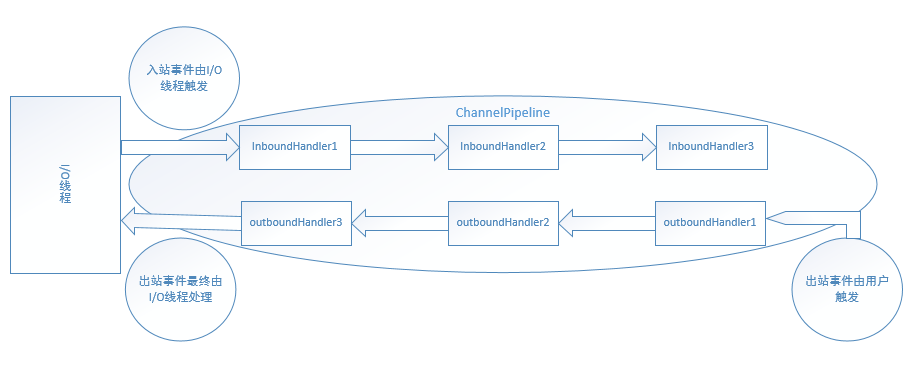

## 8.8 Netty事件模型分析

Netty是基于事件驱动的，当Channel进行IO操作的时候会产生相应的IO事件，然后驱动事件在ChannelPipeline中传播，由对应的ChannelHandler对事件进行拦截和处理。



Netty定义了两种事件类型：inbound事件和outbound事件。ChannelPipeline使用拦截过滤器模式使用户可以掌控ChannelHandler处理事件的流程。需要注意的是：事件在ChannelPipeline中不自动流动而需要调用ChannelHandlerContext中诸如fireXXX()或者read()类似的方法将事件从一个ChannelHandler传播到下一个ChannelHandler。事实上，ChannelHandler不处理具体的事件，处理具体的事件由相应的子类完成：ChannelInboundHandler处理和拦截入站事件，ChannelOutboundHandler处理和拦截出站事件。那么事件是怎么在ChannelPipeline中流动的呢？我们使用代码注释中的例子：
```Java
ChannelPipeline p = ...;
p.addLast("1", new InboundHandlerA());
p.addLast("2", new InboundHandlerB());
p.addLast("3", new OutboundHandlerA());
p.addLast("4", new OutboundHandlerB());
p.addLast("5", new InboundOutboundHandlerX());
```
则现在的pipeline链表结构为：head<->1<->2<->3<->4<->5<->tail（netty4中head是InOutbound处理器，tail是Inbound处理器），则Inbound事件的执行顺序为head->1->2->5->tail，而Outbound事件的执行顺序为5->4->3->head。事件不会在ChannelPipeline中自动流动，而需要由用户应用程序手动触发，一般ChannelHandler处理的代码可能如下：
```Java
public class InboundHandlerA implements ChannelInboundHandler {
    @Override
    public void channelActive(ChannelHandlerContext ctx) {
        ... // 用户自定义处理逻辑
        ctx.fireChannelActive(); // 将channelActive事件传播到InboundHandlerB
    }
}

public class OutboundHandlerB extends ChannelOutboundHandler{
    @Override
    public void close(ChannelHandlerContext ctx, ChannelPromise promise) {
        ... // 用户自定义处理逻辑
        ctx.close(promise); // 将close事件传播到OutboundHandlerA
    }
}
```
Inbound事件一般由IO线程触发，以下事件为Inbound事件：
```Java
fireChannelRegistered() // Channel注册到EventLoop
fireChannelActive()     // Channel激活
fireChannelRead(Object) // Channel读取到数据
fireChannelReadComplete()   // Channel读取数据完毕
fireExceptionCaught(Throwable)  // 捕获到异常
fireUserEventTriggered(Object)  // 用户自定义事件
fireChannelWritabilityChanged() // Channnel可写性改变，由写高低水位控制
fireChannelInactive()   // Channel不再激活
fireChannelUnregistered()   // Channel从EventLoop中注销
```
Outbound事件一般由用户触发，以下事件为Outbound事件：
```Java
bind(SocketAddress, ChannelPromise) // 绑定到本地地址
connect(SocketAddress, SocketAddress, ChannelPromise)   // 连接一个远端机器
write(Object, ChannelPromise)   // 写数据，实际只加到Netty出站缓冲区
flush() // flush数据，实际执行底层写
read()  // 读数据，实际设置关心OP_READ事件，当数据到来时触发ChannelRead入站事件
disconnect(ChannelPromise)  // 断开连接，NIO Server和Client不支持，实际调用close
close(ChannelPromise)   // 关闭Channel
deregister(ChannelPromise)  // 从EventLoop注销Channel
```
需要注意的是：Inbound事件一般由IO线程触发，用户程序也可根据实际情况触发。考虑这样一种情况：一个协议由头部和数据部分组成，其中头部含有数据长度，由于数据量较大，客户端分多次发送该协议的数据，服务端接收到数据后需要收集足够的数据，组装为更有意义的数据传给下一个ChannelInboundHandler。一般这个收集数据的ChannelInboundHandler正是Netty中基本的Encoder，Encoder中会处理多次ChannelRead()事件，只触发一次对下一个ChannelInboundHandler更有意义的ChannelRead()事件。而Outbound事件一般由用户程序触发，而IO线程也可能会触发。比如，当用户已配置ChannelOption.AutoRead选项，则IO线程在执行完ChannelReadComplete()事件，会调用read()方法继续关心OP_READ事件，保证数据到达时自动触发ChannelRead()事件。

需要注意的是，Netty中事件触发方式之间的区别：
```Java
channelHandlerContext.close()   // close事件传播到下一个Handler
channel.close()                 // 等价于channelPipeline.close()
channelPipeline.close()         // 事件沿整个ChannelPipeline传播，注意in/outboud的传播起点
```

### 8.8.2 Outbound事件
我们首先看一下典型的Outbound事件：bind事件，之前我们分析过这个过程，这里直接看事件传递过程，需要注意的是当触发bind事件时，其pipeline中有三个处理器：head->ServerBootstrapAcceptor->tail，但只有head是inOutbound处理器。

```Java
//DefaultChannelPipeline
public final ChannelFuture bind(SocketAddress localAddress, ChannelPromise promise) {
    return tail.bind(localAddress, promise);
}
```
可见bind事件是从tail开始触发的，而tail节点是AbstractChannelHandlerContext的一个实例，其bind方法实现在该类中，仍然是直接看代码：
```Java
//AbstractChannelHandlerContext
public ChannelFuture bind(final SocketAddress localAddress, final ChannelPromise promise) {
    if (localAddress == null) {
        throw new NullPointerException("localAddress");
    }
    if (!validatePromise(promise, false)) {
        return promise;
    }

    final AbstractChannelHandlerContext next = findContextOutbound();
    EventExecutor executor = next.executor();
    if (executor.inEventLoop()) {
        next.invokeBind(localAddress, promise);
    } else {
        safeExecute(executor, () -> { next.invokeBind(localAddress, promise); }, promise, null);
    }
    return promise;
}
private AbstractChannelHandlerContext findContextOutbound() {
    AbstractChannelHandlerContext ctx = this;
    do {
        ctx = ctx.prev;
    } while (!ctx.outbound);
    return ctx;
}
```
findContextOutbound()回从pipline的channelHandlerContext链表里获取下一个outboundHandler（head节点）来调用invokeBind()：
```Java
private void invokeBind(SocketAddress localAddress, ChannelPromise promise) {
    if (isAdded()) {
        try {
            ((ChannelOutboundHandler) handler()).bind(this, localAddress, promise);
        } catch (Throwable t) {
            notifyOutboundHandlerException(t, promise);
        }
    } else {
        bind(localAddress, promise);
    }
}
```
AbstractChannelHandlerContext的invokeBind方法实际上是调用这个context里的handler的bind()方法。我们简单看一下HeadContext的bind方法如下：
```Java
//DefaultChannelPipeline.HeadContext
public void bind(ChannelHandlerContext ctx, SocketAddress localAddress, ChannelPromise promise)
                throws Exception {
    unsafe.bind(localAddress, promise);
}

//AbstractChannel.AbstractUnsafe
public final void bind(final SocketAddress localAddress, final ChannelPromise promise) {
    assertEventLoop();

    if (!promise.setUncancellable() || !ensureOpen(promise)) {
        return;
    }
    ...

    boolean wasActive = isActive();
    try {
        doBind(localAddress);
    } catch (Throwable t) {
        safeSetFailure(promise, t);
        closeIfClosed();
        return;
    }

    if (!wasActive && isActive()) {
        invokeLater(() -> { pipeline.fireChannelActive(); });
    }

    safeSetSuccess(promise);
}
```
这里就完成了bind操作。

### 8.8.3 Inbound事件
我们首先看一下典型的Inbound事件：fireChannelRegistered事件，之前我们分析过这个过程，这里直接看事件传递过程，需要注意的是当触发fireChannelRegistered事件时，其pipeline中有三个处理器：head->ChannelInitializer->tail，其中这三个都是Inbound处理器。
```Java
//DefaultChannelPipeline
public final ChannelPipeline fireChannelRegistered() {
    AbstractChannelHandlerContext.invokeChannelRegistered(head);
    return this;
}

//AbstractChannelHandlerContext
static void invokeChannelRegistered(final AbstractChannelHandlerContext next) {
    EventExecutor executor = next.executor();
    if (executor.inEventLoop()) {
        next.invokeChannelRegistered();
    } else {
        executor.execute(() -> { next.invokeChannelRegistered(); });
    }
}
```
invokeChannelRegistered方法的参数是head，可见fireChannelRegistered事件是从head开始触发的，而head节点是AbstractChannelHandlerContext的一个实例，其invokeChannelRegistered方法实现在该类中，仍然是直接看代码：
```Java
//AbstractChannelHandlerContext
private void invokeChannelRegistered() {
    if (isAdded()) {
        try {
            ((ChannelInboundHandler) handler()).channelRegistered(this);
        } catch (Throwable t) {
            notifyHandlerException(t);
        }
    } else {
        fireChannelRegistered();
    }
}
```
AbstractChannelHandlerContext的invokeChannelRegistered方法实际上是调用这个context里的handler的channelRegistered()方法。我们简单看一下HeadContext的channelRegistered方法如下：
```Java
//DefaultChannelPipeline.HeadContext
public void channelRegistered(ChannelHandlerContext ctx) throws Exception {
    if (firstRegistration) {
        firstRegistration = false;
        callHandlerAddedForAllHandlers();
    }
    ctx.fireChannelRegistered();
}
```
这里我们只看其事件的传递过程，head的channelRegistered方法最后调用ctx.fireChannelRegistered方法
```Java
//AbstractChannelHandlerContext
public ChannelHandlerContext fireChannelRegistered() {
    invokeChannelRegistered(findContextInbound());
    return this;
}
private AbstractChannelHandlerContext findContextInbound() {
    AbstractChannelHandlerContext ctx = this;
    do {
        ctx = ctx.next;
    } while (!ctx.inbound);
    return ctx;
}
static void invokeChannelRegistered(final AbstractChannelHandlerContext next) {
    EventExecutor executor = next.executor();
    if (executor.inEventLoop()) {
        next.invokeChannelRegistered();
    } else {
        executor.execute(() -> { next.invokeChannelRegistered(); });
    }
}
```
findContextInbound()回从pipeline的channelHandlerContext链表里获取下一个inboundHandler（ChannelInitializer）来调用invokeChannelRegistered()，即完成了fireChannelRegistered事件的传递，之后就是ChannelInitializer的业务逻辑了。

### 8.8.4 fireChannelRead和read
需要注意的是：Inbound事件中有fireChannelRead，而Outbound事件中有read，这两者之前的区别在于什么呢？

#### read
我们首先看read，read是Outbound事件，按照tail->head的顺序传播，这里我们直接看其关键代码：
```Java
//DefaultChannelPipeline.HeadContext
public void read(ChannelHandlerContext ctx) {
    unsafe.beginRead();
}
//AbstractChannel.AbstractUnsafe
public final void beginRead() {
    assertEventLoop();

    if (!isActive()) {
        return;
    }

    try {
        doBeginRead();
    } catch (final Exception e) {
        invokeLater(() -> { pipeline.fireExceptionCaught(e); });
        close(voidPromise());
    }
}
//AbstractNioChannel
protected void doBeginRead() throws Exception {
    // Channel.read() or ChannelHandlerContext.read() was called
    final SelectionKey selectionKey = this.selectionKey;
    if (!selectionKey.isValid()) {
        return;
    }

    readPending = true;

    final int interestOps = selectionKey.interestOps();
    if ((interestOps & readInterestOp) == 0) {
        selectionKey.interestOps(interestOps | readInterestOp);
    }
}
```
我们看到当用户代码主动触发read事件的结果是channel注册相关事件，对于ServerSocketChannel则是selectionKey.OP_ACCEPT，对于SocketChannel则是selectionKey.OP_READ。注册完相应事件后，当channel可读时，则会触发fireChannelRead事件。

前面我们说过channel有一个选项是autoRead（默认是true），如果是true的情况下，当fireChannelActive事件触发时会触发read事件，然后为channel注册相关事件（之后我们会详解autoRead选项的意义，read事件存在的原因）。
```Java
//DefaultChannelPipeline.HeadContext
public void channelActive(ChannelHandlerContext ctx) throws Exception {
    ctx.fireChannelActive();

    readIfIsAutoRead();
}
private void readIfIsAutoRead() {
    if (channel.config().isAutoRead()) {
        channel.read();
    }
}
```

#### fireChannelRead
在netty的read过程分析一文，我们已经详细分析了这个过程，这里就不再详述了。

### 8.8.5 总结
一个IO事件会被ChannelInboundHandler或ChannelOutboundHandler处理，这些channelHandler再通过调用事件传播方法如ctx.fireChannelRegistered或ctx.bind等传递给相邻的handler，这和Android等UI事件传递的方式不太相同，Android的事件处理是由外层框架自动循环遍历的，具体的每个UI可以决定是否拦截消费这个事件。而Netty中是每个channelHandler处理完自己的逻辑后，主动调用事件传播方法如ctx.fireChannelRegistered或ctx.bind等传递给相邻的handler。
