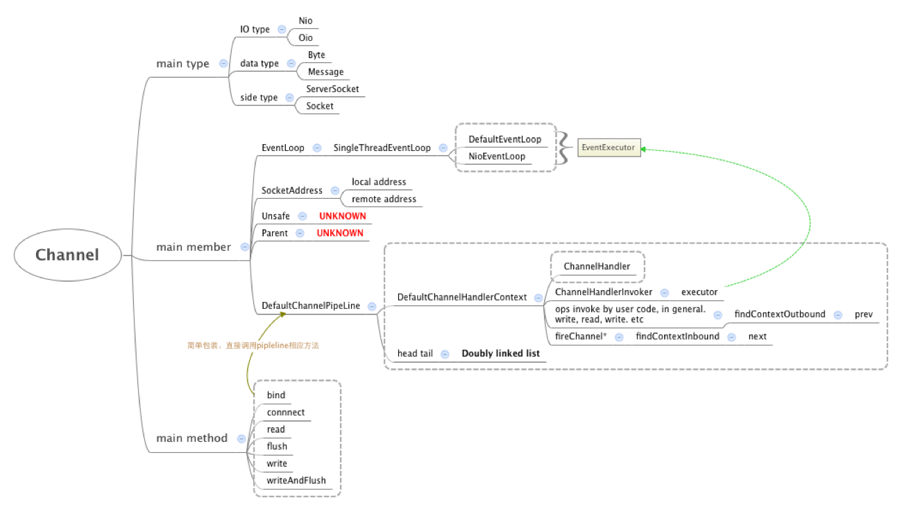
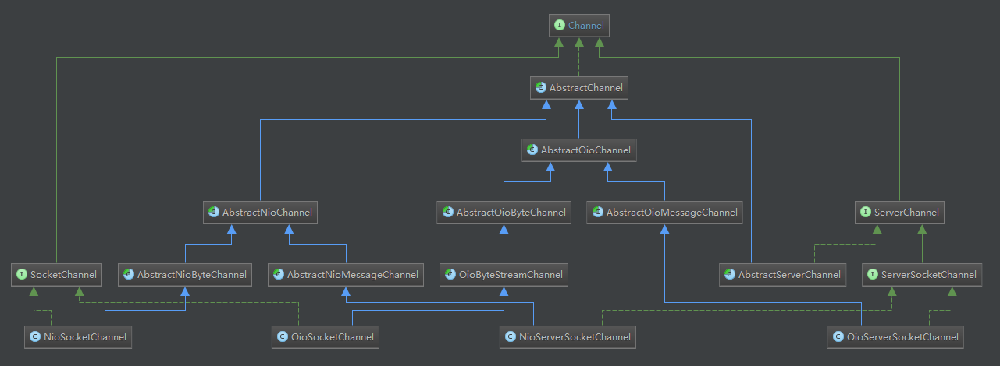

## 8.9 Channel详解

上一节中我们说过Netty是基于事件驱动的，当Channel进行IO操作的时候会产生相应的IO事件，然后驱动事件在ChannelPipeline中传播，由对应的ChannelHandler对事件进行拦截和处理。本节我来详细分析相关类：

### 8.9.1 Channel简介
Channel的IO类型主要有两种：非阻塞IO（NIO）以及阻塞IO（OIO）；
数据传输类型有两种：按事件消息传递（Message）以及按字节传递（Byte）；
适用方类型也有两种：服务器（ServerSocket）以及客户端（Socket）。还有一些根据传输协议而制定的的Channel，如：UDT、SCTP等。具体如下图所示：



Channel接口中含有大量的方法，主要有以下四类：
#### 状态查询
```Java
public boolean isOpen(); // 是否开放
public boolean isRegistered(); // 是否注册到一个EventLoop
public boolean isActive(); // 是否激活
public boolean isWritable();   // 是否可写
```
open表示Channel的开放状态：true表示Channel可用，false表示Channel已关闭不再可用。
registered表示Channel的注册状态：true表示已注册到一个EventLoop，false表示没有注册到EventLoop。
active表示Channel的激活状态：对于ServerSocketChannel，true表示Channel已绑定到端口；对于SocketChannel，表示Channel可用且已连接到对端。
writable表示Channel的可写状态，当Channel的写缓冲区outboundBuffer非null且可写时返回true。

一个正常结束的Channel状态转移有以下两种情况：
1. 服务端用于绑定的Channel或者客户端用于发起连接的Channel：REGISTERED->CONNECT/BIND->ACTIVE->CLOSE->INACTIVE->UNREGISTERED
2. 服务端接受的SocketChannel：REGISTERED->ACTIVE->CLOSE->INACTIVE->UNREGISTERED

#### getter方法
```Java
public EventLoop eventLoop();  // 注册到的EventLoop
public Channel parent();   // 父类Channel
public Unsafe unsafe();    // Unsafe对象
public ChannelPipeline pipeline(); // 事件管道，用于处理IO事件
public ByteBufAllocator alloc();   // 字节缓存分配器
public ChannelFuture closeFuture();    // Channel关闭时的异步结果
public ChannelPromise voidPromise();
...
```

#### IO事件处理
```Java
public ChannelFuture bind(SocketAddress localAddress);
public ChannelFuture connect(SocketAddress remoteAddress);
public ChannelFuture disconnect();
public ChannelFuture close();
public ChannelFuture deregister();
public Channel read();
public ChannelFuture write(Object msg);
public Channel flush();
public ChannelFuture writeAndFlush(Object msg);
```
这里的IO事件都是outbound事件，表示由用户应用程序发起的的事件。而inbound事件，将在ChannelPipeline一节中详述。

需要主要的是，这里不包括register事件，是因为register事件是由EventLoopGroup发起的，其中直接调用了channel().unsafe().register()方法，直接委托给了Unsafe，跳过了Channel。

Channel类图如下所示，接下来我们看一下Channel的相关实现：


### 8.9.3 AbstractChannel
首先看其中的字段：
```Java
private final Channel parent;   // 父Channel
private final Unsafe unsafe;    
private final DefaultChannelPipeline pipeline;  // 处理器链表
private volatile SocketAddress localAddress;    // 本地地址
private volatile SocketAddress remoteAddress;   // 远端地址
private volatile EventLoop eventLoop;   // EventLoop线程
private volatile boolean registered;    // 是否注册到EventLoop
...
```
然后，我们看其构造方法：
```Java
protected AbstractChannel(Channel parent) {
    this.parent = parent;
    unsafe = newUnsafe();
    pipeline = newChannelPipeline();
}
```
newUnsafe()和newChannelPipeline()可由子类覆盖实现。在Netty的实现中每一个Channel都有一个对应的Unsafe内部类：AbstractChannel-AbstractUnsafe，AbstractNioChannel-AbstractNioUnsafe等等，newUnsafe()方法正好用来生成这样的对应关系。ChannelPipeline作为用户处理器Handler的容器为用户提供自定义处理I/O事件的能力即为用户提供业务逻辑处理。AbstractChannel中对IO事件的处理，都委托给ChannelPipeline处理，例如bind事件：
```Java
public ChannelFuture bind(SocketAddress localAddress) {
    return pipeline.bind(localAddress);
}
```
对于Channel的实现来说，其中的内部类Unsafe才是关键，其中含有IO事件处理的细节。AbstractUnsafe作为AbstractChannel的内部类，定义了IO事件处理的基本框架，其中的细节留给子类实现。这里以register事件为例对事件框架进行分析：

#### register事件处理
```Java
public final void register(EventLoop eventLoop, final ChannelPromise promise) {
    if (isRegistered()) {
        promise.setFailure(...);    // 已经注册则失败
        return;
    }
    if (!isCompatible(eventLoop)) { // EventLoop不兼容当前Channel
        promise.setFailure(...);
        return;
    }
    AbstractChannel.this.eventLoop = eventLoop;
    if (eventLoop.inEventLoop()) { // 当前线程为EventLoop线程直接执行；否则提交任务给EventLoop线程
        register0(promise);
    } else {
        try {
            eventLoop.execute(() -> { register0(promise); });
        } catch (Throwable t) {
            ...
        }
    }
}
```
register方法中eventLoop.execute(() -> { register0(promise); })这样的代码结构，Netty使用了很多次，这是为了保证IO事件以及用户定义的IO事件处理逻辑（业务逻辑）在一个线程中处理。我们看提交的任务register0()：
```Java
private void register0(ChannelPromise promise) {
    try {
        // 确保Channel没有关闭
        if (!promise.setUncancellable() || !ensureOpen(promise)) {
            return;
        }
        boolean firstRegistration = neverRegistered;
        doRegister();   // 模板方法，细节由子类完成
        neverRegistered = false;
        registered = true;
        pipeline.invokeHandlerAddedIfNeeded();  // 将用户Handler添加到ChannelPipeline
        safeSetSuccess(promise);
        pipeline.fireChannelRegistered();   // 触发Channel注册事件
        if (isActive()) {
            // ServerSocketChannel接受的Channel此时已被激活
            if (firstRegistration) {
                // 首次注册且激活触发Channel激活事件
                pipeline.fireChannelActive();   
            } else if (config().isAutoRead()) {
                beginRead();   // 可视为模板方法
            }
        }
    } catch (Throwable t) {
        ...
    }
}
```
register0()方法定义了注册到EventLoop的整体框架，整个流程如下：
1. 注册的具体细节由doRegister()方法完成，子类中实现；
2. 注册后将处理业务逻辑的用户Handler添加到ChannelPipeline；
3. 异步结果设置为成功，触发Channel的Registered事件；
4. 对于服务端接受的客户端连接，如果首次注册，触发Channel的Active事件，如果已设置autoRead，则调用beginRead()开始读取数据。

而beginRead()方法其实也是一个框架，细节由doBeginRead()方法在子类中实现，其代码如下所示：
```Java
public final void beginRead() {
    assertEventLoop();
    if (!isActive()) {
        return;
    }
    try {
        doBeginRead();
    } catch (final Exception e) {
        invokeLater(() -> { pipeline.fireExceptionCaught(e); });
        close(voidPromise());
    }
}
```
至此，register事件框架分析完毕。其他IO事件的处理流程与register事件的相似，这里就不再详述，接下来我们看一下这些留给子类实现的doXXX()方法，接下来我们分析一下AbstractChannel的相关子类。

### 8.9.3 AbstractNioChannel
AbstractNioChannel从名字可以看出是对NIO的抽象，仍然是先看其Unsafe接口的实现AbstractNioUnsafe：

#### AbstractNioUnsafe
```Java
public interface NioUnsafe extends Unsafe {
    SelectableChannel ch(); // 对应NIO中的JDK实现的Channel
    void finishConnect();   // 连接完成
    void read();    // 从JDK的Channel中读取数据
    void forceFlush();
}
```
NioUnsafe接口中定义了finishConnect()方法是因为：SelectableChannel设置为非阻塞模式时，connect()方法会立即返回，此时连接操作可能还没有完成，如果没有完成，则需要调用JDK的finishConnect()方法完成连接操作。

需要注意的是：AbstractUnsafe中并没有connect事件框架，这是因为并不是所有连接都有标准的connect过程，比如Netty的LocalChannel和EmbeddedChannel。而在NioChannel中对于connect则有较为标准的流程，我们接下来将分析一下connect事件流程：
```Java
public final void connect(final SocketAddress remoteAddress, final SocketAddress localAddress, final ChannelPromise promise) {
    if (!promise.setUncancellable() || !ensureOpen(promise)) {
        return; // Channel已被关闭
    }
    try {
        if (connectPromise != null) {
            throw new ConnectionPendingException(); // 已有连接操作正在进行
        }
        boolean wasActive = isActive();
        // 模板方法，细节子类完成
        if (doConnect(remoteAddress, localAddress)) {
            fulfillConnectPromise(promise, wasActive);  // 连接操作已完成
        } else {
            // 连接操作尚未完成
            connectPromise = promise;
            requestedRemoteAddress = remoteAddress;
            // 这部分代码为Netty的连接超时机制
            int connectTimeoutMillis = config().getConnectTimeoutMillis();
            if (connectTimeoutMillis > 0) {
                connectTimeoutFuture = eventLoop().schedule(() -> {
                    ChannelPromise connectPromise = AbstractNioChannel.this.connectPromise;
                    ConnectTimeoutException cause = new ConnectTimeoutException("...");
                    if (connectPromise != null && connectPromise.tryFailure(cause)) {
                        close(voidPromise());
                    }
                }, connectTimeoutMillis, TimeUnit.MILLISECONDS);
            }

            promise.addListener((ChannelFutureListener) (future) -> {
                if (future.isCancelled()) {
                    // 连接操作取消则连接超时检测任务取消
                    if (connectTimeoutFuture != null) {
                        connectTimeoutFuture.cancel(false);
                    }
                    connectPromise = null;
                    close(voidPromise());
                }
            });
        }
    } catch (Throwable t) {
        promise.tryFailure(annotateConnectException(t, remoteAddress));
        closeIfClosed();
    }
}
```
connect事件框架中包含了Netty的连接超时检测机制：向EventLoop提交一个调度任务，设定的超时时间已到则向连接操作的异步结果设置失败然后关闭连接。fulfillConnectPromise()设置异步结果为成功并触发Channel的Active事件：
```Java
private void fulfillConnectPromise(ChannelPromise promise, boolean wasActive) {
    if (promise == null) {
        return; // 操作已取消或Promise已被通知？
    }
    boolean active = isActive();
    boolean promiseSet = promise.trySuccess();  // False表示用户取消操作
    if (!wasActive && active) { // 此时用户没有取消Connect操作
        pipeline().fireChannelActive(); // 触发Active事件
    }
    if (!promiseSet) {
        close(voidPromise()); // 操作已被用户取消，关闭Channel
    }
}
```

#### AbstractNioChannel
分析完AbstractNioUnsafe，我们再分析AbstractNioChannel，首先看其中的关键成员：
```Java
private final SelectableChannel ch; // 包装的JDK Channel
protected final int readInterestOp; // Read事件，服务端OP_ACCEPT，其他OP_READ
volatile SelectionKey selectionKey; // JDK Channel对应的选择键
private volatile boolean inputShutdown; // Channel的输入关闭标记
private volatile boolean readPending;   // 底层读事件进行标记
```
看一下其构造方法：
```Java
protected AbstractNioChannel(Channel parent, SelectableChannel ch, int readInterestOp) {
    super(parent);
    this.ch = ch;
    this.readInterestOp = readInterestOp;
    try {
        ch.configureBlocking(false);    // 设置非阻塞模式
    } catch (IOException e) {
        ...
    }
}
```
其中的ch.configureBlocking(false)方法设置Channel为非阻塞模式，从而为Netty提供非阻塞处理IO事件的能力。对于AbstractNioChannel的方法，我们主要分析它实现IO事件框架细节部分的doXXX()方法，这里仍然以doRegister()方法为例：
```Java
protected void doRegister() throws Exception {
    boolean selected = false;
    for (;;) {
        try {
            selectionKey = javaChannel().register(eventLoop().selector, 0, this);
            return;
        } catch (CancelledKeyException e) {
            if (!selected) {
                // 选择键取消重新selectNow()，清除因取消操作而缓存的选择键
                eventLoop().selectNow();
                selected = true;
            } else {
                throw e;
            }
        }
    }
}
```
对于Nio而言：register即为将channel注册到给定NioEventLoop的selector上即可。需要注意的是，其中第二个参数0表示注册时不关心任何事件。前面说过在register事件中会触发read事件，而selector关心的具体事件是在doBeginRead()方法中设置的，代码如下所示：
```Java
protected void doBeginRead() throws Exception {
    if (inputShutdown) {
        return; // Channel的输入关闭？什么情况下发生？
    }
    final SelectionKey selectionKey = this.selectionKey;
    if (!selectionKey.isValid()) {
        return; // 选择键被取消而不再有效
    }
    readPending = true; // 设置底层读事件正在进行
    final int interestOps = selectionKey.interestOps();
    if ((interestOps & readInterestOp) == 0) {
        // 选择键关心Read事件
        selectionKey.interestOps(interestOps | readInterestOp);
    }
}
```
AbstractNioChannel的子类实现分为服务端AbstractNioMessageChannel和客户端AbstractNioByteChannel，我们将首先分析服务端AbstractNioMessageChannel。

### 8.9.4 服务端
#### AbstractNioMessageChannel
AbstractNioMessageChannel是底层数据为消息的NioChannel。在Netty中，服务端Accept的一个Channel被认为是一条消息，UDP数据报也是一条消息。该类实现read事件框架以及完善flush事件框架的doWrite细节（在内部类NioMessageUnsafe完成）。首先看read事件框架：
```Java
public void read() {
    assert eventLoop().inEventLoop();
    final ChannelConfig config = config();
    if (!config.isAutoRead() && !isReadPending()) {
        // 此时读操作不被允许，既没有配置autoRead也没有底层读事件进行
        removeReadOp(); // 清除read事件，不再关心
        return;
    }

    final int maxMessagesPerRead = config.getMaxMessagesPerRead();
    final ChannelPipeline pipeline = pipeline();
    boolean closed = false;
    Throwable exception = null;
    try {
        try {
            for (;;) {
                int localRead = doReadMessages(readBuf); // 模板方法，读取消息
                if (localRead == 0) { // 没有数据可读
                    break;  
                }
                if (localRead < 0) { // 读取出错
                    closed = true;  
                    break;
                }
                if (!config.isAutoRead()) { //没有设置AutoRead
                    break;
                }
                if (readBuf.size() >= maxMessagesPerRead) { // 达到最大可读数
                    break;
                }
            }
        } catch (Throwable t) {
            exception = t;
        }

        setReadPending(false);  // 已没有底层读事件
        int size = readBuf.size();
        for (int i = 0; i < size; i ++) {
            pipeline.fireChannelRead(readBuf.get(i));   //触发ChannelRead事件，用户处理
        }
        readBuf.clear();
        // ChannelReadComplete事件中如果配置autoRead则会调用beginRead，从而不断进行读操作
        pipeline.fireChannelReadComplete(); // 触发ChannelReadComplete事件，用户处理

        if (exception != null) {
            if (exception instanceof IOException && !(exception instanceof PortUnreachableException)) {
                // ServerChannel异常也不能关闭，应该恢复读取下一个客户端
                closed = !(AbstractNioMessageChannel.this instanceof ServerChannel);
            }
            pipeline.fireExceptionCaught(exception);
        }

        if (closed) {
            if (isOpen()) {
                close(voidPromise());   // 非serverChannel且打开则关闭
            }
        }
    } finally {
        if (!config.isAutoRead() && !isReadPending()) {
            // 既没有配置autoRead也没有底层读事件进行
            removeReadOp();
        }
    }
}
```
read事件框架的流程已在代码中注明，需要注意的是读取消息的细节doReadMessages(readBuf)方法由子类实现。由于NioServerSocketChannel不支持write操作，所以我们不再分析其实现的flush事件框架的doWrite细节方法，直接转向下一个目标：NioServerSocketChannel。

#### NioServerSocketChannel
作为处于Channel最底层的子类，NioServerSocketChannel会实现IO事件框架的底层细节。首先看一下其构造方法：
```Java
public NioServerSocketChannel(ServerSocketChannel channel) {
    super(null, channel, SelectionKey.OP_ACCEPT);
    config = new NioServerSocketChannelConfig(this, javaChannel().socket());
}
```
其中的SelectionKey.OP_ACCEPT最为关键，Netty正是在此处将NioServerSocketChannel的read事件定义为NIO底层的OP_ACCEPT，统一完成read事件的抽象。

需要注意的是：NioServerSocketChannel只支持bind、read和close操作（将客户端的连接请求抽象为read事件），不支持connect、finishConnect、disConnect和write操作。
```Java
protected void doBind(SocketAddress localAddress) throws Exception {
    if (PlatformDependent.javaVersion() >= 7) { // JDK版本1.7以上
        javaChannel().bind(localAddress, config.getBacklog());
    } else {
        javaChannel().socket().bind(localAddress, config.getBacklog());
    }
}

protected int doReadMessages(List<Object> buf) throws Exception {
    SocketChannel ch = javaChannel().accept();
    try {
        if (ch != null) {
            // 一个NioSocketChannel为一条消息
            buf.add(new NioSocketChannel(this, ch));
            return 1;
        }
    } catch (Throwable t) {
        ...
    }
    return 0;
}

protected void doClose() throws Exception {
    javaChannel().close();
}
```
其中的实现，都是调用JDK的Channel的方法，从而实现了最底层的细节。至此，我们已分析完服务端部分，下面分析客户端部分。

#### 8.9.5 客户端Channel
我们首先看一下AbstractNioChannel的另一个子类AbstractNioByteChannel。

#### AbstractNioByteChannel
从字面可推知，AbstractNioByteChannel的底层数据为Byte字节。首先看构造方法：
```Java
protected AbstractNioByteChannel(Channel parent, SelectableChannel ch) {
    super(parent, ch, SelectionKey.OP_READ);
}
```
其中的SelectionKey.OP_READ，说明AbstractNioByteChannel的read事件为NIO底层的OP_READ事件。接下来我们看read事件框架：
```Java
public final void read() {
    final ChannelConfig config = config();
    if (!config.isAutoRead() && !isReadPending()) {
        // 此时读操作不被允许，既没有配置autoRead也没有底层读事件进行
        removeReadOp();
        return;
    }

    final ChannelPipeline pipeline = pipeline();
    final ByteBufAllocator allocator = config.getAllocator();
    final int maxMessagesPerRead = config.getMaxMessagesPerRead();
    RecvByteBufAllocator.Handle allocHandle = this.allocHandle;
    if (allocHandle == null) {
        this.allocHandle = allocHandle = config.getRecvByteBufAllocator().newHandle();
    }

    ByteBuf byteBuf = null;
    int messages = 0;
    boolean close = false;
    try {
        int totalReadAmount = 0;
        boolean readPendingReset = false;
        do {
            byteBuf = allocHandle.allocate(allocator);  // 创建一个ByteBuf
            int writable = byteBuf.writableBytes();
            int localReadAmount = doReadBytes(byteBuf); // 模板方法，子类实现细节
            if (localReadAmount <= 0) { // 没有数据可读
                byteBuf.release();
                byteBuf = null;
                close = localReadAmount < 0; // 读取数据量为负数表示对端已经关闭
                break;
            }
            if (!readPendingReset) {
                readPendingReset = true;
                setReadPending(false);  // 没有底层读事件进行
                // 此时，若autoRead关闭则必须调用beginRead，read操作才会读取数据
            }
            pipeline.fireChannelRead(byteBuf);  // 触发ChannelRead事件，用户处理
            byteBuf = null;

            if (totalReadAmount >= Integer.MAX_VALUE - localReadAmount) {   // 防止溢出
                totalReadAmount = Integer.MAX_VALUE;
                break;
            }
            totalReadAmount += localReadAmount;

            if (!config.isAutoRead()) { // 没有配置AutoRead
                break;
            }
            if (localReadAmount < writable) {   // 读取数小于可写数，可能接受缓冲区已完全耗尽
                break;
            }
        } while (++ messages < maxMessagesPerRead);

        // ReadComplete结束时，如果开启autoRead则会调用beginRead，从而可以继续read
        pipeline.fireChannelReadComplete();
        allocHandle.record(totalReadAmount);

        if (close) {
            closeOnRead(pipeline);
            close = false;
        }
    } catch (Throwable t) {
        handleReadException(pipeline, byteBuf, t, close);
    } finally {
        if (!config.isAutoRead() && !isReadPending()) {
            // 既没有配置autoRead也没有底层读事件进行
            removeReadOp();
        }
    }
}
```
AbstractNioByteChannel的read事件框架处理流程与AbstractNioMessageChannel的稍有不同：AbstractNioMessageChannel依次读取Message，最后统一触发ChannelRead事件；而AbstractNioByteChannel每读取到一定字节就触发ChannelRead事件。这是因为AbstractNioMessageChannel需求高吞吐量，特别是ServerSocketChannel需要尽可能多地接受连接；而AbstractNioByteChannel需求快响应，要尽可能快地响应远端请求。
read事件的具体流程请参考代码和代码注释进行理解，不再分析。当读取到的数据小于零时，表示TCP连接已半关闭，这时会调用closeOnRead(pipeline)方法：
```Java
private void closeOnRead(ChannelPipeline pipeline) {
    SelectionKey key = selectionKey();
    setInputShutdown(); // 远端关闭此时设置Channel的输入源关闭
    if (isOpen()) {
        if (Boolean.TRUE.equals(config().getOption(ChannelOption.ALLOW_HALF_CLOSURE))) {
            // 取消关心Read事件并触发UserEvent事件ChannelInputShutdownEvent
            key.interestOps(key.interestOps() & ~readInterestOp);   
            pipeline.fireUserEventTriggered(ChannelInputShutdownEvent.INSTANCE);
        } else {
            close(voidPromise());   // 直接关闭
        }
    }
}
```
这段代码正是Channel参数ALLOW_HALF_CLOSURE的意义描述，该参数为True时，会触发用户事件ChannelInputShutdownEvent，否则，直接关闭该Channel。

接下来我们分析一下write事件的细节实现方法doWrite()。在此之前，先看filterOutboundMessage()方法对需要写的数据进行过滤。
```Java
protected final Object filterOutboundMessage(Object msg) {
    if (msg instanceof ByteBuf) {
        ByteBuf buf = (ByteBuf) msg;
        if (buf.isDirect()) {
            return msg;
        }
        return newDirectBuffer(buf); // 非DirectBuf转为DirectBuf
    }
    if (msg instanceof FileRegion) {
        return msg;
    }
    throw new UnsupportedOperationException("...");
}
```
可知，Netty支持的写数据类型只有两种：DirectBuffer和FileRegion。我们再看这些数据怎么写到Channel上，也就是doWrite()方法：
```Java
protected void doWrite(ChannelOutboundBuffer in) throws Exception {
    int writeSpinCount = -1;
    boolean setOpWrite = false;
    for (;;) {
        Object msg = in.current();
        if (msg == null) {  // 数据已全部写完
            clearOpWrite();     // 清除OP_WRITE事件
            return;
        }

        if (msg instanceof ByteBuf) {
            ByteBuf buf = (ByteBuf) msg;
            int readableBytes = buf.readableBytes();
            if (readableBytes == 0) {
                in.remove();
                continue;
            }

            boolean done = false;
            long flushedAmount = 0;
            if (writeSpinCount == -1) {
                writeSpinCount = config().getWriteSpinCount();
            }
            for (int i = writeSpinCount - 1; i >= 0; i --) {
                int localFlushedAmount = doWriteBytes(buf); // 模板方法，子类实现细节
                if (localFlushedAmount == 0) {
                    // NIO在非阻塞模式下写操作可能返回0表示未写入数据
                    setOpWrite = true;
                    break;
                }

                flushedAmount += localFlushedAmount;
                if (!buf.isReadable()) {
                    // ByteBuf不可读，此时数据已写完
                    done = true;
                    break;
                }
            }

            in.progress(flushedAmount); // 记录进度
            if (done) {
                in.remove();    // 完成时，清理缓冲区
            } else {
                break;  // 跳出循环执行incompleteWrite()
            }
        } else if (msg instanceof FileRegion) {
            // ....
        } else {
            throw new Error();  // 其他类型不支持
        }
    }
    incompleteWrite(setOpWrite);
}
```
代码中省略了对FileRegion的处理，FileRegion是Netty对NIO底层的FileChannel的封装，负责将File中的数据写入到WritableChannel中。FileRegion的默认实现是DefaultFileRegion，如果你很感兴趣它的实现，可以自行查阅。
我们主要分析对ByteBuf的处理。doWrite的流程简洁明了，核心操作是模板方法doWriteBytes(buf)，将ByteBuf中的数据写入到Channel，由于NIO底层的写操作返回已写入的数据量，在非阻塞模式下该值可能为0，此时会调用incompleteWrite()方法：
```Java
protected final void incompleteWrite(boolean setOpWrite) {
    if (setOpWrite) {
        setOpWrite();   // 设置继续关心OP_WRITE事件
    } else {
        // 此时已进行写操作次数writeSpinCount，但并没有写完
        Runnable flushTask = this.flushTask;
        if (flushTask == null) {
            flushTask = this.flushTask = (Runnable) () -> { flush(); };
        }
        // 再次提交一个flush()任务
        eventLoop().execute(flushTask);
    }
}
```
该方法分两种情况处理，在上文提到的第一种情况（实际写0数据）下，设置SelectionKey继续关心OP_WRITE事件从而继续进行写操作；第二种情况下，也就是写操作进行次数达到配置中的writeSpinCount值但尚未写完，此时向EventLoop提交一个新的flush任务，此时可以响应其他请求，从而提交响应速度。这样的处理，不会使大数据的写操作占用全部资源而使其他请求得不到响应，可见这是一个较为公平的处理。这里引出一个问题：使用Netty如何搭建高性能文件服务器？
至此，已分析完对于Byte数据的read事件和doWrite细节的处理，接下里，继续分析NioSocketChannel，从而完善各事件框架的细节部分。

#### NioSocketChannel
NioSocketChannel作为Channel的最末端子类，实现了NioSocket相关的最底层细节实现，与NioServerSocketChannel不同的是，NioSocketChannel支持Netty定义的所有的IO操作，这里我们选择connect和write操作进行一下分析：

关于connect操作，我们看一下doConnect()和doFinishConnect()方法：
```Java
protected boolean doConnect(SocketAddress remoteAddress, SocketAddress localAddress) throws Exception {
    if (localAddress != null) {
        doBind0(localAddress);
    }

    boolean success = false;
    try {
        boolean connected = javaChannel().connect(remoteAddress);
        if (!connected) {
            // 设置关心OP_CONNECT事件，事件就绪时调用finishConnect()
            selectionKey().interestOps(SelectionKey.OP_CONNECT);
        }
        success = true;
        return connected;
    } finally {
        if (!success) {
            doClose();
        }
    }
}

protected void doFinishConnect() throws Exception {
    if (!javaChannel().finishConnect()) {
        throw new Error();
    }
}
```
JDK中的Channel在非阻塞模式下调用connect()方法时，会立即返回结果：成功建立连接返回true，操作还在进行时返回false。返回false时，需要在底层OP_CONNECT事件就绪时，调用finishConnect()方法完成连接操作。

NioSocketChannel最重要的部分是覆盖了父类的doWrite()方法，使用更高效的方式进行写操作，其代码如下：
```Java
protected void doWrite(ChannelOutboundBuffer in) throws Exception {
    for (;;) {
        int size = in.size();
        if (size == 0) {
            clearOpWrite(); // 所有数据已写完，不再关心OP_WRITE事件
            break;
        }
        long writtenBytes = 0;
        boolean done = false;
        boolean setOpWrite = false;

        ByteBuffer[] nioBuffers = in.nioBuffers();
        int nioBufferCnt = in.nioBufferCount();
        long expectedWrittenBytes = in.nioBufferSize();
        SocketChannel ch = javaChannel();

        switch (nioBufferCnt) {
            case 0: // 没有ByteBuffer，也就是只有FileRegion
                super.doWrite(in);  // 使用父类方法进行普通处理
                return;
            case 1: // 只有一个ByteBuffer，此时的处理等效于父类方法的处理
                ByteBuffer nioBuffer = nioBuffers[0];
                for (int i = config().getWriteSpinCount() - 1; i >= 0; i --) {
                    final int localWrittenBytes = ch.write(nioBuffer);
                    if (localWrittenBytes == 0) {
                        setOpWrite = true;
                        break;
                    }
                    expectedWrittenBytes -= localWrittenBytes;
                    writtenBytes += localWrittenBytes;
                    if (expectedWrittenBytes == 0) {
                        done = true;
                        break;
                    }
                }
                break;
            default: // 多个ByteBuffer，采用gathering方法处理
                for (int i = config().getWriteSpinCount() - 1; i >= 0; i --) {
                    // gathering方法，此时一次写多个ByteBuffer
                    final long localWrittenBytes = ch.write(nioBuffers, 0, nioBufferCnt);
                    if (localWrittenBytes == 0) {
                        setOpWrite = true;
                        break;
                    }
                    expectedWrittenBytes -= localWrittenBytes;
                    writtenBytes += localWrittenBytes;
                    if (expectedWrittenBytes == 0) {
                        done = true;
                        break;
                    }
                }
                break;
        }
        in.removeBytes(writtenBytes);   // 清理缓冲区
        if (!done) {
            incompleteWrite(setOpWrite);    // 写操作并没有完成
            break;
        }
    }
}
```
在明白了父类的doWrite方法后，这段代码便容易理解，本段代码做的优化是：当输出缓冲区中有多个buffer时，采用Gathering Writes将数据从这些buffer写入到同一个channel。
