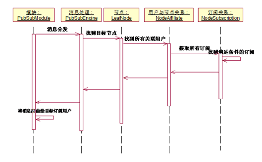

## 9.2 Openfire简介
Openfire是Xmpp协议的服务端的一个实现，其核心功能可以概括为：连接管理、消息处理（解析、路由和发送）以及订阅管理。

Openfire核心功能由Module组成，上图中的各个模块绝大多数也是基于Module实现的。为了动态的管理这些Module，Openfire使用了自己的类加载器JiveClassLoader。

### 9.2.1 Module
Openfire在启动时就加载了所有的Module，这些Module提供了Openfire的核心功能，其类图关系如下图所示：

所有Module都需要实现Module接口，该接口中定义了模块生命周期中需要调用的方法，如下图所示：

### 9.2.2 消息流程
Openfire的消息处理流程如下图所示：

Openfire的ConnectionHandler类继承了MINA的IoHandlerAdapter，他主要负责连接的创建、销毁，以及接收到XML数据包的路由。

### 9.2.3 PubSub
发布订阅消息是绑定在子域pubsub上的，对应的模块是PubSubModule，其中有以下几个地方需要考虑：
1. Node
发布订阅系统中的虚拟节点，该节点可以接收或者发布信息或通知，在其他发布订阅系统中常被称为Topic。节点有两种类型：CollectionNode可以包含子节点，子节点的类型可以是CollectionNode或者LeafNode，但是不能作为发布订阅的目标节点；LeafNode不能包含子节点，它可以作为发布订阅的目标节点。

2. NodeAffiliate
定义了用户与节点之间的关系，包括：owner、publisher、none、outcast。
3. NodeSubscription
一个用户可以订阅某个节点多次，每次订阅都使用不同的配置（比如过滤关键字不同），NodeSubscription就是描述这些订阅和配置的。如果一个消息满足用户的多个订阅，则只有一份消息被分发给该用户，而不是多个。
4. PubSubModule
PubSubModule负责节点的管理、发布订阅关系的维护、消息的分发。

5. PubSubEngine
负责处理发布订阅数据包。

pubsub的时序图如下所示：
