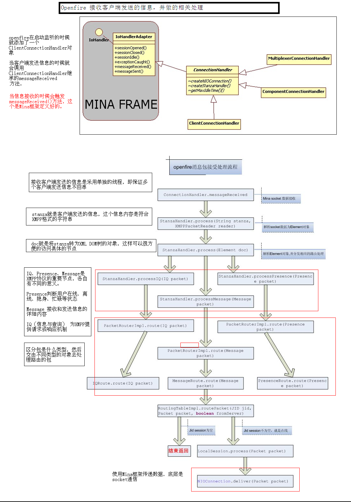

## 9.3 Openfire消息处理

### 9.3.1 消息处理
上一节我们说过ConnectionHandler是连接的处理者，这里会有连接的创建、关闭、数据收发的处理，所以我们仍然回到ConnectionHandler中：
1. 当有数据发送过来时，Mina框架会调用messageReceived方法
```Java
//ConnectionHandler
public void messageReceived(IoSession session, Object message) throws Exception {
    StanzaHandler handler = (StanzaHandler) session.getAttribute(HANDLER);
    final XMPPPacketReader parser = PARSER_CACHE.get();
    updateReadBytesCounter(session);
    try {
        handler.process((String) message, parser);
    } catch (Exception e) {
        ...
    }
}
```
messageReceived首先从IoSession中获取在sessionOpened方法中创建的StanzaHandler实例，然后从PARSER_CACHE中得到一个parser（注意这里PARSER_CACHE是ThreadLocal变量，这个parser和之前在sessionOpened方法中创建的parser不同，这个parser是用来处理Stanza的，而在sessionOpened方法中创建的parser是在filter中用来解码的，是更低一层的parser）。最后将xml数据包交给StanzaHandler处理。
2. StanzaHandler处理xml数据包的过程
```Java
//StanzaHandler
public void process(String stanza, XMPPPacketReader reader) throws Exception {
    boolean initialStream = stanza.startsWith("<stream:stream") || stanza.startsWith("<flash:stream");
    if (!sessionCreated || initialStream) {
        if (!initialStream) {
            if (stanza.startsWith("<policy-file-request/>")) {
                String crossDomainText = FlashCrossDomainServlet.CROSS_DOMAIN_TEXT +
                        XMPPServer.getInstance().getConnectionManager().getClientListenerPort() +
                        FlashCrossDomainServlet.CROSS_DOMAIN_END_TEXT + '\0';
                connection.deliverRawText(crossDomainText);
                return;
            } else {
                return;
            }
        }
        if (!sessionCreated) {
            sessionCreated = true;
            MXParser parser = reader.getXPPParser();
            parser.setInput(new StringReader(stanza));
            createSession(parser);
        } else if (startedTLS) {
            startedTLS = false;
            tlsNegotiated();
        } else if (startedSASL && saslStatus == SASLAuthentication.Status.authenticated) {
            startedSASL = false;
            saslSuccessful();
        } else if (waitingCompressionACK) {
            waitingCompressionACK = false;
            compressionSuccessful();
        }
        return;
    }

    if (stanza.equals("</stream:stream>")) {
        if (session != null) {
            session.close();
        }
        return;
    }
    if (stanza.startsWith("<?xml")) {
        return;
    }
    Element doc = reader.read(new StringReader(stanza)).getRootElement();
    if (doc == null) {
        return;
    }
    String tag = doc.getName();
    if ("starttls".equals(tag)) {
        if (negotiateTLS()) {
            startedTLS = true;
        } else {
            connection.close();
            session = null;
        }
    } else if ("auth".equals(tag)) {
        startedSASL = true;
        saslStatus = SASLAuthentication.handle(session, doc);
    } else if (startedSASL && "response".equals(tag) || "abort".equals(tag)) {
        saslStatus = SASLAuthentication.handle(session, doc);
    } else if ("compress".equals(tag)) {
        if (compressClient(doc)) {
            waitingCompressionACK = true;
        }
    } else if (isStreamManagementStanza(doc)) {
        session.getStreamManager().process( doc, session.getAddress() );
    } else {
        process(doc);
    }
}
```
StanzaHander首先判断xml数据包的类型，如果数据包以“<stream:stream”或者“<flash:stream”开始，则说明客户端刚刚连接，需要初始化通信。Openfire首先为此客户端建立一个与其JID相关的ClientSession，而后与客户端交互协商例如是否使用SSL，是否使用压缩等问题。当协商完成之后进入正常通信阶段，则可以将xml数据包交给PacketRouteImpl模块进行处理。
3. 数据包将进一步被细化处理
process方法的逻辑比较简单，直接将数据包交由PacketRouteImpl处理，PacketRouteImpl将packet分成Message、Iq和Presence，分别交由MessageRouter、IqRouter和PresenceRouter进行下一步路由。

### 9.3.2 Message的处理
这里我们首先看一下message的处理流程：
```Java
//MessageRouter
public void route(Message packet) {
    ...
    ClientSession session = sessionManager.getSession(packet.getFrom());

    try {
        InterceptorManager.getInstance().invokeInterceptors(packet, session, true, false);
        if (session == null || session.getStatus() == Session.STATUS_AUTHENTICATED) {
            JID recipientJID = packet.getTo();

            if (recipientJID == null) {
                recipientJID = packet.getFrom().asBareJID();
            }

            if (recipientJID.getNode() == null && recipientJID.getResource() == null && serverName.equals(recipientJID.getDomain())) {
                if (packet.getElement().element("addresses") != null) {
                    multicastRouter.route(packet);
                } else {
                    sendMessageToAdmins(packet);
                }
                return;
            }

            boolean isAcceptable = true;
            if (session instanceof LocalClientSession) {
                Message dummyMessage = packet.createCopy();
                dummyMessage.setFrom(packet.getTo());
                dummyMessage.setTo(packet.getFrom());
                if (!((LocalClientSession) session).canProcess(dummyMessage)) {
                    packet.setTo(session.getAddress());
                    packet.setFrom((JID)null);
                    packet.setError(PacketError.Condition.not_acceptable);
                    session.process(packet);
                    isAcceptable = false;
                }
            }
            if (isAcceptable) {
                boolean isPrivate = packet.getElement().element(QName.get("private", "urn:xmpp:carbons:2")) != null;
                try {
                    routingTable.routePacket(recipientJID, packet, false);
                } catch (Exception e) {
                    routingFailed(recipientJID, packet);
                }

                if (packet.getType() == Message.Type.chat && !isPrivate && session != null) {
                    List<JID> routes = routingTable.getRoutes(packet.getFrom().asBareJID(), null);
                    for (JID route : routes) {
                        if (!route.equals(session.getAddress())) {
                            ClientSession clientSession = sessionManager.getSession(route);
                            if (clientSession != null && clientSession.isMessageCarbonsEnabled()) {
                                Message message = new Message();
                                message.setType(packet.getType());
                                message.setFrom(packet.getFrom().asBareJID());
                                message.setTo(route);
                                message.addExtension(new Sent(new Forwarded(packet)));
                                clientSession.process(message);
                            }
                        }
                    }
                }
            }
        } else {
            packet.setTo(session.getAddress());
            packet.setFrom((JID)null);
            packet.setError(PacketError.Condition.not_authorized);
            session.process(packet);
        }
        InterceptorManager.getInstance().invokeInterceptors(packet, session, true, true);
    } catch (PacketRejectedException e) {
        if (session != null && e.getRejectionMessage() != null && e.getRejectionMessage().trim().length() > 0) {
            Message reply = new Message();
            reply.setID(packet.getID());
            reply.setTo(session.getAddress());
            reply.setFrom(packet.getTo());
            reply.setType(packet.getType());
            reply.setThread(packet.getThread());
            reply.setBody(e.getRejectionMessage());
            session.process(reply);
        }
    }
}
```
简单分析一下route方法：
1. 首先获取clientSession，clientSession主要动作是设置用户聊天是设置和使用的策略，获取用户名，获取和设置用户当前状态Presence，当前用户是否为匿名用户；
2. 然后通过反射，调用plugin（开始和结束调用两次）：InterceptorManager.getInstance().invokeInterceptors(packet, session, true, false)；
3. 通过from和to的地址判断，处理广播消息以及admin消息
4. 最后通过调用RoutingTableImpl.routePacket方法将message路由出去
5. 不能处理的消息返回错误

接下来我们看一下RoutingTableImpl的routePacket方法：
```Java
//RoutingTableImpl
public void routePacket(JID jid, Packet packet, boolean fromServer) throws PacketException {
    boolean routed = false;
    try {
        if (serverName.equals(jid.getDomain())) {
            routed = routeToLocalDomain(jid, packet, fromServer);
        } else if (jid.getDomain().endsWith(serverName) && hasComponentRoute(jid)) {
            routed = routeToComponent(jid, packet, routed);
        } else {
            routed = routeToRemoteDomain(jid, packet, routed);
        }
    } catch (Exception ex) {
      Log.error("Primary packet routing failed", ex);
    }
    ...
}
```
简单分析一下该方法：
1. 如果to的domain和服务器的domain一致，就调用routeToLocalDomain；
2. 如果to的domain包含服务器的domain，就调用routeToComponent。这里要说明一下，大多数情况下，我们会利用external component来实现我们自己的服务器应用，此时就需要给我们的external component定义一个sub-domain。例如：服务器的domain是ilxlf.com，我们要用external component实现一个游戏的应用，那么我们定义component的sub-domain是：game.ilxlf.com服务器内部就这一步来判断是否要路由到我们的component。
3. 否则调用routeToRemoteDomain。
我们简单一下routeToLocalDomain方法：
```Java
//RoutingTableImpl
private boolean routeToLocalDomain(JID jid, Packet packet, boolean fromServer) {
    boolean routed = false;
    Element privateElement = packet.getElement().element(QName.get("private", "urn:xmpp:carbons:2"));
    boolean isPrivate = privateElement != null;
    packet.getElement().remove(privateElement);

    if (jid.getResource() == null) {
        if (packet instanceof Message) {
            routed = routeToBareJID(jid, (Message) packet, isPrivate);
        } else {
          throw new PacketException("Cannot route packet of type IQ or Presence to bare JID: " + packet.toXML());
        }
    } else {
        ClientRoute clientRoute = usersCache.get(jid.toString());
        if (clientRoute == null) {
            clientRoute = anonymousUsersCache.get(jid.toString());
        }
        if (clientRoute != null) {
            if (!clientRoute.isAvailable() && routeOnlyAvailable(packet, fromServer) &&
                  !presenceUpdateHandler.hasDirectPresence(packet.getTo(), packet.getFrom())) {
              routed = false;
        } else {
            if (localRoutingTable.isLocalRoute(jid)) {
                if (packet instanceof Message) {
                    Message message = (Message) packet;
                    if (message.getType() == Message.Type.chat && !isPrivate) {
                        List<JID> routes = getRoutes(jid.asBareJID(), null);
                        for (JID route : routes) {
                            if (!route.equals(jid)) {
                                ClientSession clientSession = getClientRoute(route);
                                if (clientSession.isMessageCarbonsEnabled()) {
                                    Message carbon = new Message();
                                    carbon.setType(message.getType());
                                    carbon.setFrom(route.asBareJID());
                                    carbon.setTo(route);
                                    carbon.addExtension(new Received(new Forwarded(message)));
                                    try {
                                        localRoutingTable.getRoute(route.toString()).process(carbon);
                                    } catch (UnauthorizedException e) {
                                        Log.error("Unable to route packet " + packet.toXML(), e);
                                    }
                                }
                            }
                        }
                    }
                }
                try {
                    localRoutingTable.getRoute(jid.toString()).process(packet);
                    routed = true;
                } catch (UnauthorizedException e) {
                    Log.error("Unable to route packet " + packet.toXML(), e);
                }
            } else {
                if (remotePacketRouter != null) {
                    routed = remotePacketRouter.routePacket(clientRoute.getNodeID().toByteArray(), jid, packet);
                    if (!routed) {
                        removeClientRoute(jid); // drop invalid client route
                    }
                }
            }
        }
    }
  return routed;
}
```
这里有一个前提知识：full JID和bare JID，这里我们简单分析一下bare JID的情况：
1. 找到这个subscriber所对应的所有活的session。
2. 从这些session里面选择优先级最高的一个session，最后调用LocalClientSession的deliver方法把消息发出去。
3. 如果优先级最高的是一组session，那么再根据session的presence信息排序，很显然：多个session中，最后一个连接到服务器的session优先级最高。就用这个session把消息发出去。

### 9.3.3 IQ的处理
这里我们简单分析一下IQ的处理逻辑：
```Java
//IQRouter
public void route(IQ packet) {
    ...
    JID sender = packet.getFrom();
    ClientSession session = sessionManager.getSession(sender);
    Element childElement = packet.getChildElement();
    try {
        InterceptorManager.getInstance().invokeInterceptors(packet, session, true, false);
        JID to = packet.getTo();
        if (session != null && to != null && session.getStatus() == Session.STATUS_CONNECTED && !serverName.equals(to.toString())) {
            IQ reply = IQ.createResultIQ(packet);
            if (childElement != null) {
                reply.setChildElement(childElement.createCopy());
            }
            reply.setError(PacketError.Condition.bad_request);
            session.process(reply);
        } else if (session == null || session.getStatus() == Session.STATUS_AUTHENTICATED || (
                childElement != null && isLocalServer(to) && (
                    "jabber:iq:auth".equals(childElement.getNamespaceURI()) ||
                    "jabber:iq:register".equals(childElement.getNamespaceURI()) ||
                    "urn:ietf:params:xml:ns:xmpp-bind".equals(childElement.getNamespaceURI())))) {
            handle(packet);
        } else if (packet.getType() == IQ.Type.get || packet.getType() == IQ.Type.set) {
            IQ reply = IQ.createResultIQ(packet);
            if (childElement != null) {
                reply.setChildElement(childElement.createCopy());
            }
            reply.setError(PacketError.Condition.not_authorized);
            session.process(reply);
        }
        InterceptorManager.getInstance().invokeInterceptors(packet, session, true, true);
    } catch (PacketRejectedException e) {
        if (session != null) {
            IQ reply = new IQ();
            if (childElement != null) {
                reply.setChildElement(childElement.createCopy());
            }
            reply.setID(packet.getID());
            reply.setTo(session.getAddress());
            reply.setFrom(packet.getTo());
            reply.setError(PacketError.Condition.not_allowed);
            session.process(reply);
            if (e.getRejectionMessage() != null && e.getRejectionMessage().trim().length() > 0) {
                Message notification = new Message();
                notification.setTo(session.getAddress());
                notification.setFrom(packet.getTo());
                notification.setBody(e.getRejectionMessage());
                session.process(notification);
            }
        }
    }
}
```
和MessageRouter的处理逻辑相同，开始和结束两次调用InterceptorManager.getInstance().invokeInterceptors(packet, session, true, true)，其具体处理逻辑在handle方法，其余皆是错误处理，我们简单看一下handle方法：
```Java
private void handle(IQ packet) {
    JID recipientJID = packet.getTo();
    // Check if the packet was sent to the server hostname
    if (recipientJID != null && recipientJID.getNode() == null &&
            recipientJID.getResource() == null && serverName.equals(recipientJID.getDomain())) {
        Element childElement = packet.getChildElement();
        if (childElement != null && childElement.element("addresses") != null) {
            multicastRouter.route(packet);
            return;
        }
    }
    if (packet.getID() != null && (IQ.Type.result == packet.getType() || IQ.Type.error == packet.getType())) {
        // The server got an answer to an IQ packet that was sent from the server
        IQResultListener iqResultListener = resultListeners.remove(packet.getID());
        if (iqResultListener != null) {
            resultTimeout.remove(packet.getID());
            if (iqResultListener != null) {
                try {
                    iqResultListener.receivedAnswer(packet);
                } catch (Exception e) {
                    ...
                }
                return;
            }
        }
    }
    try {
        if (recipientJID != null && (routingTable.hasComponentRoute(recipientJID) || routingTable.hasServerRoute(recipientJID))) {
            // A component/service/remote server was found that can handle the Packet
            routingTable.routePacket(recipientJID, packet, false);
            return;
        }

        if (isLocalServer(recipientJID)) {
            // Let the server handle the Packet
            Element childElement = packet.getChildElement();
            String namespace = null;
            if (childElement != null) {
                namespace = childElement.getNamespaceURI();
            }
            if (namespace == null) {
                ...
            } else {
                // Check if communication to local users is allowed
                if (recipientJID != null && userManager.isRegisteredUser(recipientJID.getNode())) {
                    PrivacyList list = PrivacyListManager.getInstance().getDefaultPrivacyList(recipientJID.getNode());
                    if (list != null && list.shouldBlockPacket(packet)) {
                        if (IQ.Type.set == packet.getType() || IQ.Type.get == packet.getType()) {
                            sendErrorPacket(packet, PacketError.Condition.service_unavailable);
                        }
                        return;
                    }
                }
                IQHandler handler = getHandler(namespace);
                if (handler == null) {
                    ...
                } else {
                    handler.process(packet);
                }
            }
        } else {
            ...
        }
    } catch (Exception e) {
        Session session = sessionManager.getSession(packet.getFrom());
        if (session != null) {
            IQ reply = IQ.createResultIQ(packet);
            reply.setError(PacketError.Condition.internal_server_error);
            session.process(reply);
        }
    }
}
```
首先通过from和to的地址判断，处理广播消息；然后根据IQ的namespace找到相应的IQHandler（getHandler方法）处理该IQ。

### 9.3.4 Presence的处理
调用PresenceUpdateHandler的process方法（处理数据库的更新和缓存的更新），然后调用Roster的broadcastPresence方法（检查privacyList，即隐身及黑名单用户，然后路由给  所有在线好友）。

### 9.3.5 总结
Openfire消息处理的流程可参考下图所示：


